# POU100 2026, le petit trip gravel en ligne de mire

Le vélo avec les copains est mon seul truc pour [lutter contre le chagrin](https://tcrouzet.com/2026/02/28/discours-isa/). Le POU100 se déroulera les 4 et 5 avril prochains. Nous avons terminé aujourd’hui et la semaine dernière les recos des parcours 100 km et 100 miles. Nous reste un gros point noir sur le 250 km. [La tempête du 12 février a massacré la forêt de l’Espinouse](https://www.franceinfo.fr/environnement/evenements-meteorologiques-extremes/tempetes/tempete-nils-80-000-m-de-coniferes-souffles-dans-la-foret-heraultaise-de-l-espinouse_7829246.html). Nous ne savons pas encore si la piste des crêtes sera praticable et ouverte. Les forestiers font le maximum pour remettre en état les chemins. Si le massif reste fermé, nous proposerons une variante à l’arrache.

Pour le départ du samedi, il reste 10 places sur le 250 km, 10 places pour le 100 km/100 Miles. Nous avons en revanche qu’une vingtaine d’inscrits le dimanche (nous avons zappé que c’était le dimanche de Pâques).

[Plus d’info…](https://727bikepacking.fr/pou100/)

La trace sera publiée le 1er au soir.

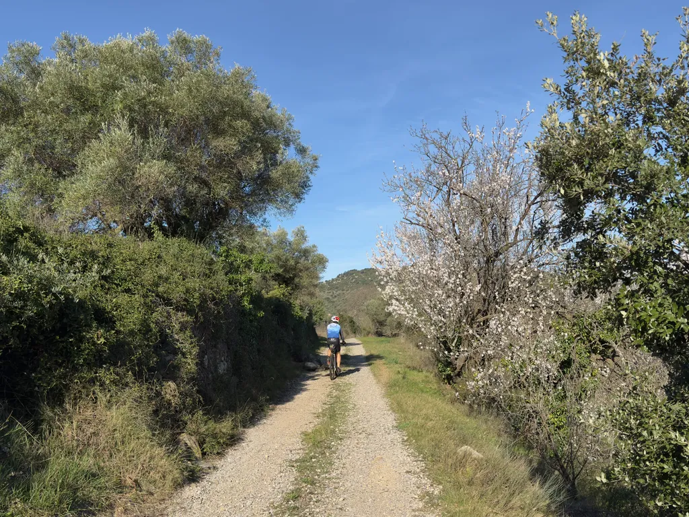

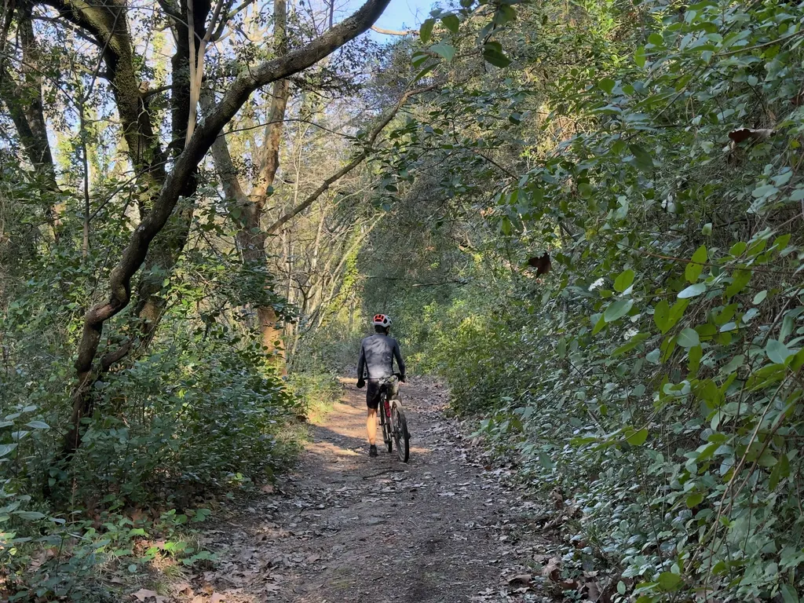

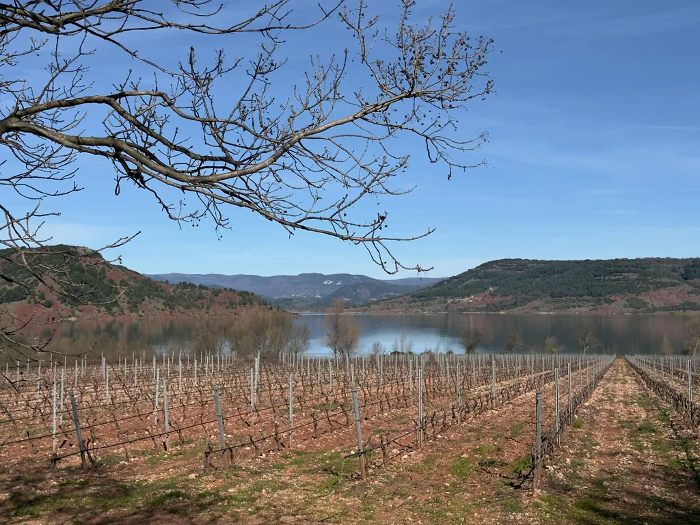

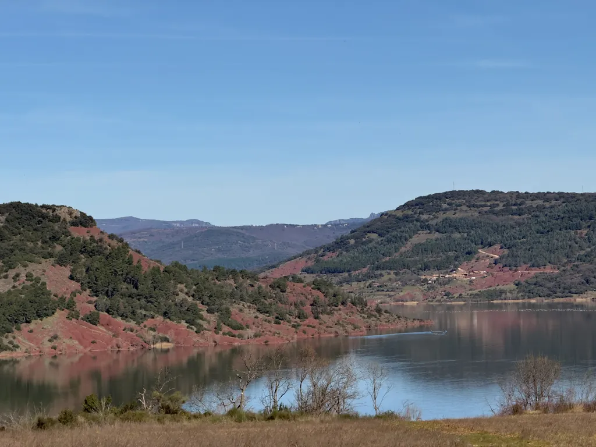

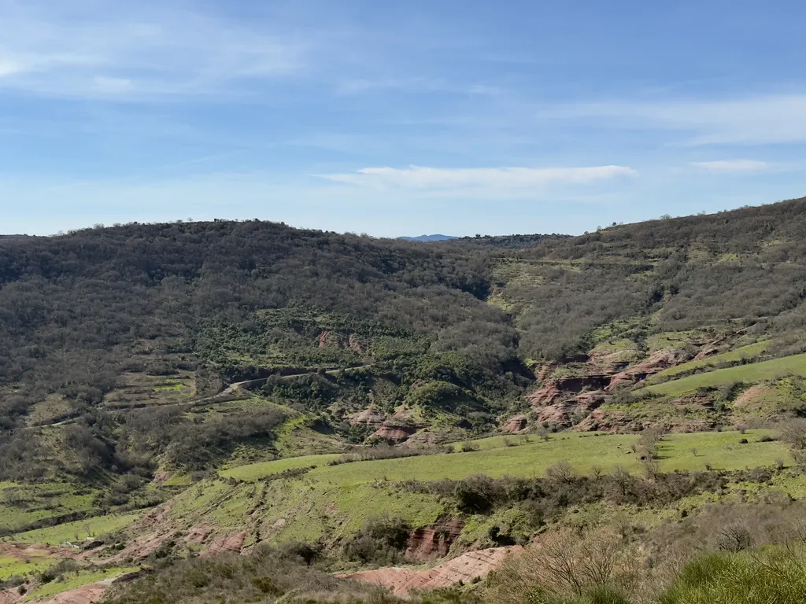

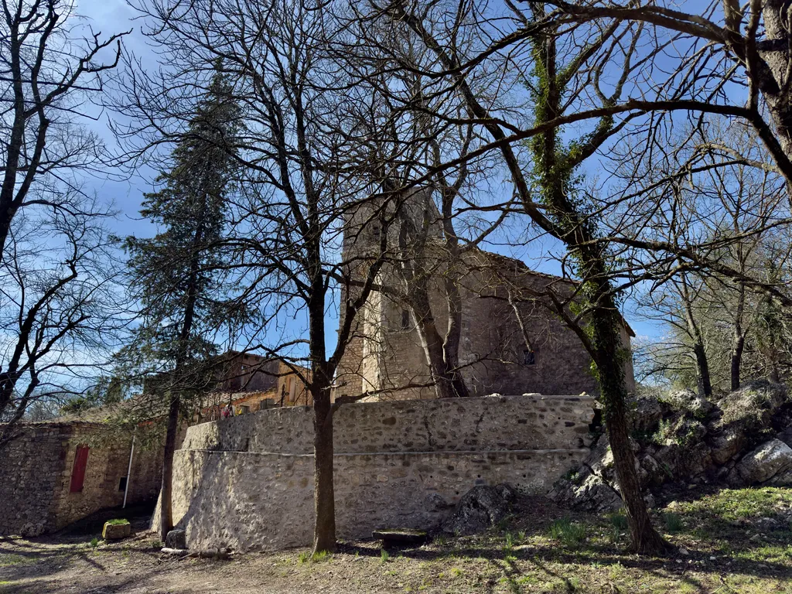

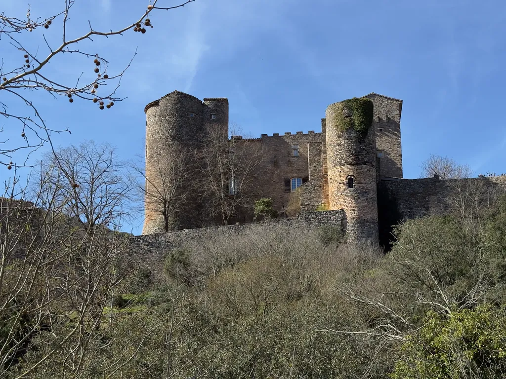

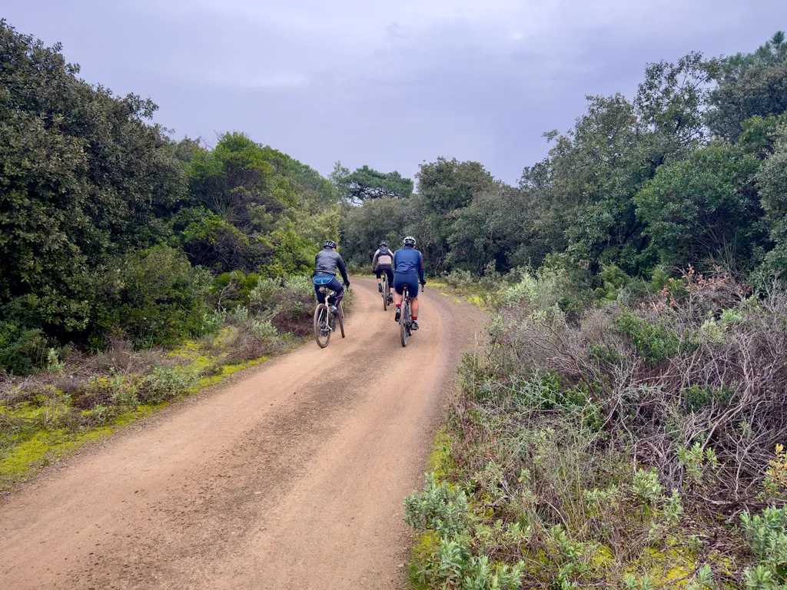

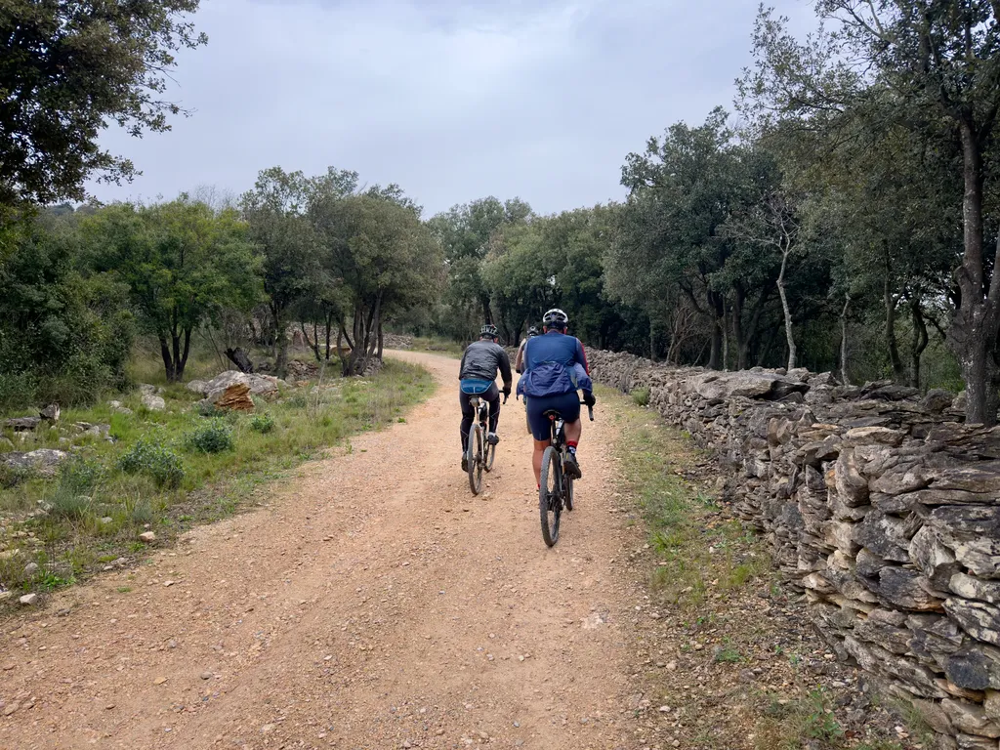

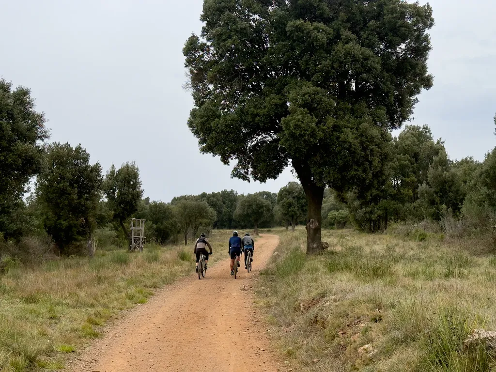

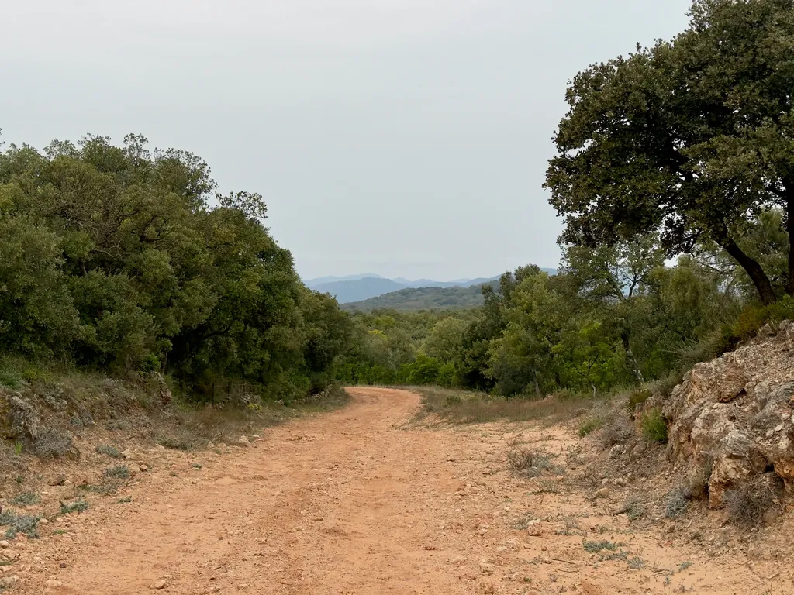

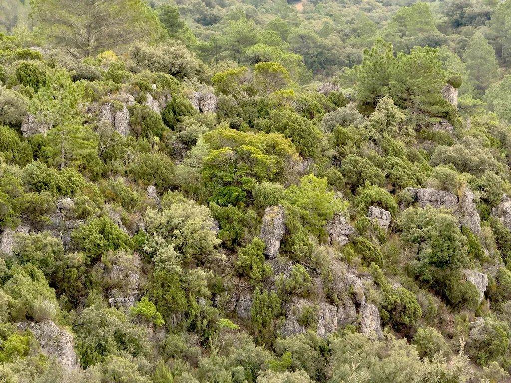

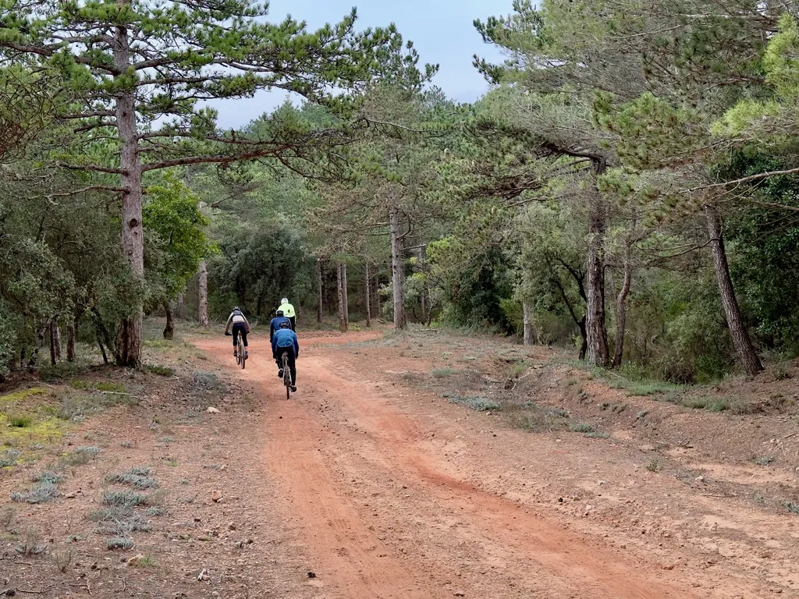

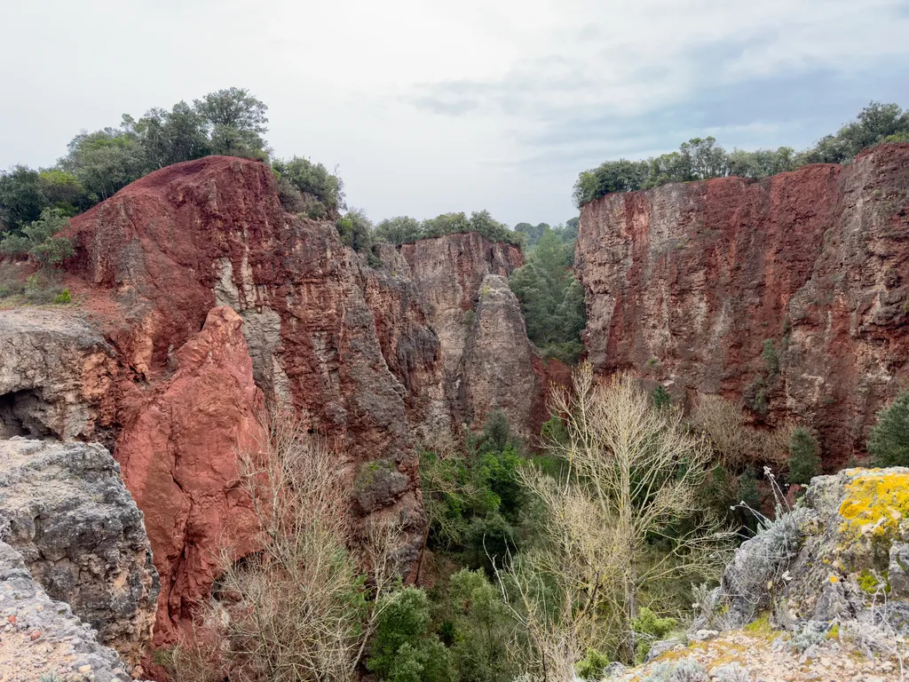

#velo #727bikepacking #y2026 #2026-03-05-21h00
