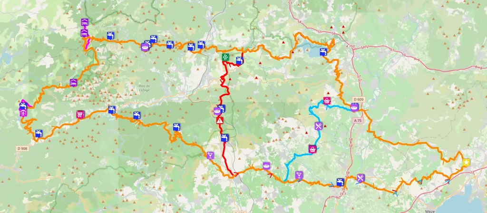
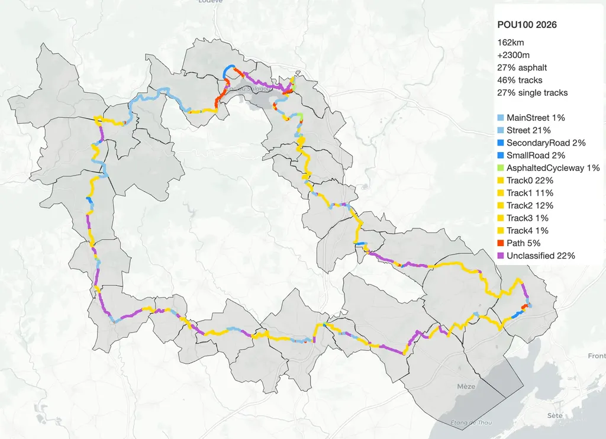

# Enfin : les traces de la POU100

Les traces vous attendent que vous veniez les rouler avec nous les 4 et 5 avril prochain ou plus tard en ITT. [Retrouvez les itinéraires 100 km, 160 km et 270 km sur la page de la POU100.](https://727bikepacking.fr/pou100/)

Il reste des places pour le départ du dimanche 5 avril, mais nous sommes complets le samedi (je libérerai des places en cas de forfait, [n’hésitez pas à tenter votre chance sur Helloasso](https://www.helloasso.com/associations/ec-poussan/evenements/pou100-100-miles-100-km-ou-250km-gravel-de-poussan-2026)).

Nous avons pris beaucoup de plaisir à concocter ces itinéraires, même si les prises de tête ont été nombreuses. Pas toujours simple de trouver du hors asphalte compatible avec les gravels, même les gravels modernes avec des pneus de 45 mm et plus.

Comme nous sommes aussi vététistes, il est important pour nous de ne pas confondre les deux pratiques. La théorie selon laquelle on passe partout à gravel vaut dans certaines régions, pas chez nous. Surtout, nous cherchons des traces gravel plaisir. Se taper des descentes où on claque les dents de haut en bas, non merci (et lors des recos nous avons pas mal claqué des dents). Je ne vous dis pas que ce sera toujours un billard, mais vous ne regagnerez pas Poussan désarticulés. Les traces ne présentent aucune difficulté technique.

En attendant de vous retrouver sur les chemins, nous partons en Espagne reconnaître [la g727 de septembre](https://727bikepacking.fr/g727-Grand-Depart/) (déjà plus qu’une quarantaine de places disponibles).

#velo #727bikepacking #y2026 #2026-03-25-21h00
