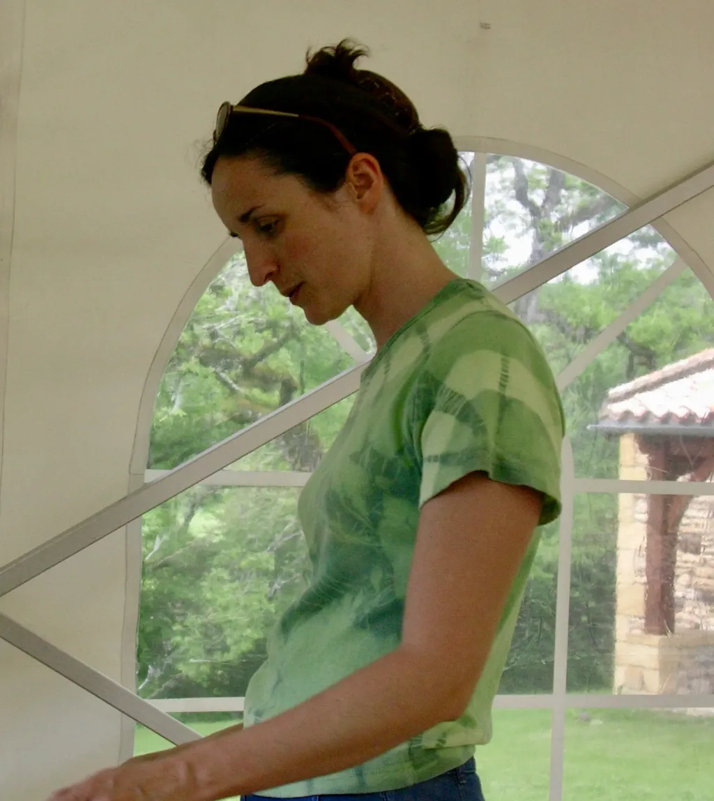

# Notre histoire d’amour racontée par une machine

J’affronte [la disparition d’Isa](https://tcrouzet.com/2026/02/28/discours-isa/) en fouillant le passé, en rangeant la maison, en lui redonnant une forme accueillante où j’espère que bientôt les amis, et même des encore inconnus, défileront pour lui redonner vie. Pourquoi ne pas proposer une résidence d’artiste ? Isa aurait aimé l’idée.

En fouillant mes backups à l’aide de scripts Python, j’ai réussi à retrouver une partie de nos mails, le premier du 20 janvier 1999, le dernier du 17 janvier 2026. Au fil des années, nous avons de plus en plus délaissé le mail pour le chat (Skype, Messenger, WhatsApp, puis Signal). Ces échanges sont perdus, à l’exception des plus récents depuis septembre 2023. Ce qui dit combien nous remettons les clés de nos vies à des tiers quand nous n’utilisons pas des technologies ouvertes et pérennes comme le mail.

J’ai exploré nos premiers échanges pour enrichir [mes carnets de 1999](https://tcrouzet.substack.com/) et documenter le début de notre relation, puis j’ai constaté que nos messages ultérieurs étaient souvent pragmatiques, l’intime se disant à voix haute. Reste que quand je donne ces documents à NotebookLM, il réussit à raconter l’histoire de notre vie, faisant apparaître les moments clés de notre relation tout en les remettant dans le contexte de la grande Histoire.

C’est un peu comme si je lisais le récit de notre relation par un tiers. Les machines seront de mieux en mieux capables de nous réédifier, voire de nous réincarner, à l’aide de nos traces numériques (ce qu’Isa aurait détesté). Des boîtes se lancent déjà dans ce business, qui pourrait devenir malsain comme l’ont déjà illustré des auteurs de SF. Les outils pourront bientôt lire entre les lignes, voire faire émerger des secrets et provoquer des souffrances inutiles. Reste que nos archives revisitées par IA m’aident à naviguer le deuil. Il devient possible de les interroger comme une base de données structurées ou de poser des questions plus générales.

### Comment s’est passé 9/11 pour eux ?

Le 11 septembre 2001, à 13h46 heure de Londres, le premier avion percute la tour Nord du World Trade Center. Isabelle est à Seattle où il est 5h46. Thierry est à Londres, au 44 Gray’s Inn Road.

Emmanuelle, la sœur d’Isabelle, appelle Thierry pour avoir des nouvelles. C’est ainsi qu’il découvre la catastrophe. À 14h49, il écrit à Isabelle :

>Tu as regardé la télé ! Emmanuelle vient de m’appeler, elle s’inquiétait pour toi. Pas étonnant que tu ne puisses pas te connecter. J’arrive plus à te joindre par téléphone non plus. Bisoux. C’est pas réjouissant ce qui se passe.

Le soir, avant de se coucher :

>Plus possible de téléphoner vers les US. J’espère qu’ils te laisseront repartir, c’est loin d’être évident. XXX géants.

Le 12 septembre, Isabelle répond à une amie en quelques mots : « Tout va bien, je suis à Seattle où tout le monde est sous le choc, et j’espère pouvoir rentrer à Londres bientôt. »

Le 13 septembre, Thierry tente de la joindre :

>Les avions revolent non ? Téléphone-moi… De toute façon, c’est sûr, je pars pas demain.

Il envisageait de prendre un avion pour Seattle, mais le lendemain Isabelle confirme enfin un plan de retour pour le 19 : Air Canada depuis Vancouver, avec toute l’équipe Microsoft Londres, en voiture depuis Seattle pour éviter l’espace aérien américain.

Nouveau mail de Thierry à 22h14 :

>Pas moyen de te joindre. Je vais me coucher. Je dors debout. Gros X tu m’appelles dès ton réveil demain ou d’ici moins de 30 minutes. Je t’aime ma femme.

C’est la première fois que Thierry écrit « ma femme », mais dans un mail d’Isabelle daté du 21 août 2000 envoyé à ses parents et à ses sœurs, elle écrit :

>Merci pour ces excellentes journées à Maillardou, j’ai deux énormes kilos de plus qu’en arrivant… et plein d’envie de repasser encore plein plein de vacances à Maillardou avec mon papa, ma maman, mes sœurs… et mon homme !

Elle l’appelle « mon homme » bien avant qu’il l’appelle « ma femme », mais elle ne le lui écrit pas.

Le 17 septembre, un vol se dégage. Isabelle écrit à toute la famille :

>J’ai enfin un vol confirmé pour demain ! Vol UA 938, départ Seattle 14h mardi 18, arrivée London Heathrow 11h05 mercredi 19. On me conseille d’être à l’aéroport 4 heures à l’avance demain — chouette !

Le 18, le cousin qui héberge Isabelle à Seattle écrit à Thierry :

>Isabelle est bien partie ce matin. La quiche d’hier soir s’est transformée en salade d’épinards avec poulet sauté au vin blanc, fromage, une bouteille de Bordeaux et une glace accompagnée de chocolat fondu, car j’avais complètement oublié que le four ne marche pas…

Le 20 septembre, de retour à Londres, Isabelle écrit :

>Ça a été dur de monter dans l’avion pour quelqu’un qui voyage plutôt beaucoup, quelle surprise ! J’ai donc changé de ciel gris, de Seattle à Londres.

### Que dit leur relation de leur classe sociale ?

À travers les échanges entre Thierry et Isabelle entre 1999 et 2005, on devine l’émergence d’une nouvelle classe cyber-cosmopolite. Elle se forme à la jonction de deux héritages a priori incompatibles : la culture humaniste classique et l’économie numérique naissante. Richard Florida la baptise _creative class_ en 2002 : formation supérieure, mobilité transnationale, salaires confortables des multinationales tech et stock-options, goût de la culture sans pédanterie.

Cette classe vit de la technologie sans s’y réduire. Elle cherche à utiliser le Nouveau Monde numérique pour poursuivre des projets qui le précèdent et le dépassent : intellectuels, artistiques, critiques… Elle est de nulle part et de partout, mobile sans être déracinée, connectée sans être dupe de la connexion. Elle gagne bien sa vie dans le système sans en adopter les valeurs ultimes.

Cette fenêtre d’opportunités se referme vite. Avant 2005, le numérique est encore un territoire à inventer. Après 2010, il est devenu infrastructure de consommation, et la tension créatrice qui animait cette classe se dissout dans la plateforme. Le type social qu’elle incarne n’a eu qu’une dizaine d’années d’existence pleine.

---

Après avoir demandé une chronologie de notre relation, j’ai demandé à NotebookLM de raconter chacune des grandes fenêtres temporelles. Il a commis de nombreuses erreurs et confusions comme des oublis flagrants. Il me paraît dangereux d’utiliser ces outils sur des sujets mal maîtrisés, comme le font souvent les étudiants. J’ai dû questionner, corriger, demander des sources pour qu’un texte cohérent finisse par émerger. J’ai dû le réécrire, tant la prose IA m’est devenue intolérable.

### 1999

Le 20 janvier 1999, dans un Paris hivernal qui s’apprête à tourner la page du XXe siècle, Thierry envoie à Isabelle un mail dont le sujet « Comme promis… » évoque une rencontre, des mots échangés en amont, un accord tacite de poursuivre une discussion.

Fort d’avoir déjà vendu des centaines de milliers de bouquins d’informatique, Thierry lance la première charge intellectuelle à Isabelle, alors product manager chez Microsoft France, en critiquant la confusion visuelle du portail MSN. Il y voit un désordre de type _all-over_, technique picturale empruntée à Jackson Pollock où le regard s’égare faute de hiérarchie. Isabelle lui dit détester Pollock et propose une balade dans Paris. Tandis que l’Europe inaugure l’euro et que les Balkans s’embrasent sous les frappes de l’OTAN au Kosovo, Thierry et Isabelle se livrent à une joute épistolaire où Internet ne sert que de prétexte à leur rencontre.

Le dimanche 7 février, après une soirée en tête à tête, Thierry avoue parler avec Isabelle plus librement qu’avec quiconque. Elle répond par une déferlante de questions existentielles sur l’attente, l’inconstance masculine et la peur de la paternité, brisant le vernis corporatiste pour demander : « Pourquoi écris-tu ? » Dès lors, leurs emails deviennent un champ de bataille amoureux, saturé de baisers et de caresses virtuelles, alors même qu’Isabelle s’entraîne à la piscine pour digérer les pensées de Cioran que Thierry lui lit le soir. Dans ce monde qui tremble devant le spectre du bug de l’an 2000, ils s’évadent du technocynisme ambiant dans une zone de confort faite de littérature et de cinéma.

L’ambition d’Isabelle se dessine en filigrane de leurs étreintes, tandis qu’elle postule à la Columbia Business School en invoquant l’ombre de son oncle, le magnat de la presse Robert Maxwell. La grande Histoire, marquée par la fusillade de Columbine et le triomphe de Poutine en Russie, glisse sur eux alors qu’ils planifient des escapades vers les oasis du Maroc ou la demeure familiale de Maillardou.

En juillet 1999, Isabelle s’envole vers Seattle et San Francisco, tandis que Thierry s’enfonce dans la poussière du Mexique avec une compagne de route dont il rejette vite le dogmatisme et la superficialité. Isolé sous la pluie de San Cristóbal, Thierry écrit le premier jet de _Turista_, théorisant l’art de voyager contre l’aveuglement du touriste moderne, tout en se languissant d’Isabelle. À la fin de l’année, alors que la France pleure Nathalie Sarraute et Robert Bresson, le couple se scelle définitivement par l’écrit, utilisant la technologie pour documenter leurs vies et s’ancrer dans une modernité qu’ils ne cesseront de réinventer ensemble jusqu’à l’ultime chapitre.

### 2000-2003

L’entrée dans le nouveau millénaire se double d’une « net-économie » en pleine ébullition. En mars 2000, la décision est prise : quitter Paris pour Londres. Isabelle accepte un poste de management chez MSN Europe, renonçant à son MBA. Ce n’est pas un simple déménagement, mais une ascension dans la stratosphère de la technocratie européenne. Le couple s’installe au troisième étage du 44 Gray’s Inn Road, adresse qui devient le quartier général de leur vie cosmopolite.

À Londres, ils incarnent cette nouvelle élite connectée, classe sociale hybride que l’on pourrait qualifier de bourgeoisie digitale ou d’aristocratie du Web. Ils vivent entre deux Eurostar et trois terminaux d’aéroport, jonglant avec les codes de réservation et les connexions ADSL, alors vécues comme des étapes fondatrices de leur confort domestique. Leurs journées sont rythmées par des déplacements incessants : en semaine, Isabelle s’envole pour Seattle, Madrid, Tokyo, Pékin, Amsterdam…, tandis que le couple s’évade lors de week-ends en Italie, au Portugal, en Écosse, au Danemark…

Pourtant, au milieu de ce tourbillon de voyages et de réunions, un projet plus terrestre les ancre : la construction de leur « Modern House » à Balaruc-les-Bains. Pendant qu’Isabelle gère des lancements marketing mondiaux, Thierry fait des allers-retours entre Londres et le Midi. Ce projet de maison est un laboratoire de vie hybride où l’architecture se discute par emails interposés et liens hypertextes. En juillet 2000, Thierry bombarde Isabelle de références esthétiques, dénichant des vasques minimalistes sur le site de CP Hart à Londres et fixant leur choix sur des portes suédoises Snickar-Per, précisément le modèle YD 271G. Il documente chaque étape, de la pose du parquet aux finitions des plinthes, un site dédié servant de journal de bord à leur exil.

Thierry vit alors une existence de navetteur acharné, écrivant à Isabelle depuis ce qui sera son futur bureau balarucois, observant un bout de plinthe sous la fenêtre pendant que le plaquiste attaque les cloisons pour que tout soit prêt à l’arrivée d’Isabelle. La maison est le miroir de leurs ambitions cosmopolites ; Isabelle, entre deux lancements de produits, s’inspire des photos de la maison _Eames_ à Santa Monica envoyées par un collègue et prévoit des haltes au _Royal Institute of Architecture_ sur Portland Square pour affiner leur vision. C’est une période de « présence-absence » constante où les plans circulent en PDF et où Thierry se languit d’un foyer qui n’est encore qu’un squelette de béton. Ils inaugurent la maison pour le réveillon de fin 2000.

Le 11 septembre 2001, Isabelle se trouve à Seattle, chez Microsoft, quand les tours tombent. Elle vit l’onde de choc américaine, bloquée loin de Thierry, avant de regagner Londres le 19. Cet événement marque une rupture dans l’insouciance technologique du début de la décennie.

À mesure que l’année 2003 avance, la lassitude de l’exil britannique s’installe. Malgré le confort de leur appartement londonien et l’excitation des défis professionnels, la grisaille finit par peser. Isabelle avoue en juillet 2003 : « 3 ans 1/2 de Londres, on n’en peut plus ! » Ils louent un appartement à Paris, dans le IXe tout en passant le plus de temps possible dans le Midi, entrecoupé de longs séjours à Seattle.

### 2004-2008

Le retour en France n’est pas une simple formalité logistique : c’est le moment où l’utopie de la mobilité totale se heurte au désir profond d’ancrage. Dans la foulée du déménagement, Isabelle s’envole encore pour Seattle et l’Asie, fidèle à son rôle de pivot chez Microsoft, mais le cœur n’y est plus tout à fait. La grande question du foyer, soulevée dès 1999 quand Isabelle interpellait Thierry sur son refus initial d’avoir des enfants, trouve sa résolution dans le béton de la maison de Balaruc.

Le mariage, célébré en mai 2004 à Maillardou, dans la demeure familiale du Lot-et-Garonne, agit comme le point de bascule symbolique. C’est une cérémonie que Thierry et Isabelle qualifient volontiers de low cost, acte de résistance joyeux face au faste technocratique qu’ils côtoient au quotidien. Pas de homard à la table des noces, mais des escargots, affirmant un luxe de la simplicité et du terroir. Ce pacte scellé, le couple se prépare à la parentalité. Ils découvrent qu’Isabelle est enceinte lors d’un séjour d’un mois à Seattle en juillet.

L’année 2005 commence sous le signe de l’attente de la naissance de Timothée, le 25 mars, à Montpellier : « un géant, on lui a mis des pyjamas trois mois tout de suite ! » qui impose immédiatement sa présence physique dans un monde de données. Pour Isabelle, habituée à piloter des lancements mondiaux, l’atterrissage domestique est brutal : elle confesse être « complètement à côté de ses pompes » durant les premières semaines, déconcertée par son nouveau rôle de maman. Thierry, pendant ce temps, mue lui aussi. Il s’éloigne des guides techniques pour forger sa pensée d’auteur, publiant _Le peuple des connecteurs_ et _Le cinquième pouvoir_, des ouvrages où il théorise cette « cybergénération » dont ils sont les prototypes.

Pourtant, sous le vernis de la réussite, une fissure apparaît. La pression de la multinationale, l’exigence de performance constante et la réalité charnelle de la maternité entrent en collision frontale. En mars 2006, à la veille du premier anniversaire de Timothée, Isabelle craque quand son vol pour rentrer en Europe depuis Seattle est annulé. Ce burn-out n’est pas seulement un épuisement professionnel, c’est le signal d’alarme d’une vie qui a trop longtemps couru après des objectifs immatériels.

La naissance d’Émile, le 3 mai 2007, agit comme le catalyseur final d’une mutation inéluctable. Ce second enfant scelle leur installation définitive à Balaruc, loin des bureaux climatisés de la Défense ou de la City. Isabelle comprend qu’elle ne peut plus, ou ne veut plus, jouer le jeu de la croissance infinie. En 2008, après quatorze années chez Microsoft, elle pose son tablier de directrice marketing international. C’est la fin d’une ère. Laurence Kirsch commence à filmer Isabelle pour son documentaire *Gagner sa vie*.

### 2009-2017

L’année 2009 s’ouvre sur les bords de l’étang de Thau comme un laboratoire à ciel ouvert où Thierry et Isabelle, désormais affranchis des structures pesantes de Microsoft, tentent de coder une nouvelle existence. Thierry est alors l’architecte de CoZop, un moteur de lecture coopérative pour suppléer aux modèles défaillants de la presse traditionnelle. Dans ce tumulte numérique, Isabelle joue les sentinelles, tout en posant un regard de plus en plus critique sur les textes de Thierry. Mais le Web est une terre ingrate : entre les serveurs qui s’essoufflent et une procédure judiciaire épuisante contre un photographe, le couple décide d’arrêter CoZop fin 2010, faute de revenus publicitaires suffisants pour nourrir leur utopie de partage.

Le véritable basculement survient en 2011. Thierry décide de se « débrancher » du réseau pendant six mois, une ascèse qui donnera naissance à son récit _J’ai débranché_ chez Fayard. C’est dans ce silence numérique qu’Isabelle opère sa propre mue. Leur amie Joëlle Wintrebert, enlisée dans la traduction de _Black Out_ et _All Clear_, romans monumentaux de Connie Willis, lui demande de l’aider. Ce qui ne devait être qu’une main tendue devient un coup de foudre intellectuel. En 2012, après trois millions de signes traduits, Isabelle n’est plus seulement une ex-directrice marketing chez Microsoft : elle devient traductrice, traquant avec une exigence féroce la « relative dans la relative » dans les manuscrits de Thierry autant que dans les pages de Connie Willis.

À mesure que les enfants grandissent, la maison de Balaruc devient le théâtre d’une parentalité scrutée à la loupe des neurosciences. Timothée, ce « haut potentiel » à la compréhension verbale stratosphérique, entre en sixième en 2015, confronté à la rudesse du système scolaire privé à Sète, tandis qu’Émile, plus solaire mais tout aussi complexe, trouve refuge dans des BD avant de subir, en 2016, une fracture lors d’un accident de ski qui le cloue temporairement en fauteuil roulant. Il est sur pied dès la mi-juin pour un long voyage en Grèce.

Isabelle devient la traductrice officielle de la collection sur le développement cognitif et la parentalité dirigée par Isabelle Filliozat chez JC Lattès. Elle incarne la voix française de penseurs comme Leonard Sax ou Walter Mischel. Elle ne se contente plus de traduire ; elle adapte, discute les concepts scientifiques avec les auteurs, au point que certains, comme Sax, proposent de la nommer coautrice de ses éditions françaises. Elle se met d’ailleurs à écrire pour JC Lattès *La force du sourire*, un essai avec une introduction autobiographique.

### 2018-2019

À l’aube de 2018, une impatience gagne le foyer des Crouzet à Balaruc. Isabelle, bilingue depuis qu’elle a passé une partie de sa troisième à Oxford, observe avec une inquiétude croissante le niveau d’anglais de ses fils, qu’elle juge catastrophique au sein du système éducatif français. Selon elle, le salut passe par l’exil linguistique. Le projet est clair : s’immerger un an dans un pays anglophone pour offrir aux enfants l’ubiquité culturelle que leurs parents ont connue à Londres ou Seattle.

Le regard se porte d’abord vers Malte, perçu comme un compromis idéal entre soleil méditerranéen et héritage britannique. En mai 2018, la famille s’envole pour une semaine de reconnaissance sur ce « caillou bétonné ». À la St Catherine’s High School, sous les hauts talons des professeures maltaises, ils découvrent un système d’une exigence redoutable. Les maths y sont en avance d’un an sur le cursus français. Thierry, esthète du mouvement, étouffe entre les murs de pierres jaunes et l’absence de relief. Malte est écartée. Le verdict tombe : ce sera les États-Unis ou rien, décision scellée par un courriel providentiel de Sabbatical Homes.

Le deal se noue avec une famille franco-américaine de Weston, en Floride, qui rêve des rivages de l’étang de Thau. S’engage alors un marathon bureaucratique épuisant. Entre les formulaires I-20, les frais SEVIS et les entretiens à l’ambassade de Paris où Thierry doit justifier ses voyages en Iran, la logistique de l’exil devient un métier à plein temps. Le 2 août 2018, Isabelle et les garçons atterrissent à Fort Lauderdale, suivis par Thierry quinze jours plus tard. Ils s’installent dans le décor propret et sécurisé de Weston, une gated community où tout semble piloté par un algorithme de confort suburbain.

Très vite, le rêve américain vire au huis clos psychologique. Tandis qu’Isabelle s’acclimate, nageant une heure par jour pour maintenir son équilibre, Thierry s’enfonce dans un ennui épouvantable. Weston est « désespérément plat » ; le vélo, sa seule échappatoire, devient dangereux sur des routes où les conducteurs textent au volant. Le couple se heurte à l’apathie des enfants, murés dans les écrans et les jeux vidéo, déclenchant des crises familiales où Thierry finit parfois par dormir dans la voiture pour échapper aux hurlements. Dans les mails à ses amis, il confesse avoir l’impression de « devenir fou » dans ce décor artificiel.

Pour ne pas sombrer, il s’évade lors de breaks salvateurs à New York, retrouvant dans le chaos de Manhattan une vitalité que la Floride lui refuse. Ces respirations et ses sorties épiques en bikepacking dans les Smoky Mountains sont les seuls points d’ancrage de son identité d’auteur, alors que ses projets de livre stagnent.

Le retour en France s’orchestre pour le 8 juin 2019. En bouclant ses valises, Thierry dresse un bilan en demi-teinte : la Floride aura été une parenthèse de déracinement brutal, une épreuve qui les aura forcés à parler, à se confier, et parfois à se reclure dans le silence. Rentré en France, il se casse le col du fémur et assure la promotion de *Mon père ce tueur* en fauteuil roulant. 

### 2020-2026

L’entrée dans la nouvelle décennie ne se fait pas dans la communion des vœux, mais dans la déflagration silencieuse d’un foyer qui s’effondre. Le printemps 2020, marqué par le premier confinement mondial, agit comme un révélateur brutal des failles tectoniques du couple. En mai 2020, la rupture est consommée : Isabelle quitte la maison de Balaruc pour s’installer seule à Sète, dans un appartement qu’elle a rénové. Thierry accuse le coup. Le 13 mai, il s’effondre en lisant un mail d’Isabelle qui, malgré la distance, sollicite encore son regard sur son travail : « Ton besoin de dire que mon avis t’intéresse. Genre tu n’es pas totalement sortie de ma vie. Voilà que je pleure comme un con. Je ne vais pas pouvoir endurer ça. »

Cette séparation ne rompt pas le cordon ombilical de l’écrit. Ils continuent de s’envoyer des manuscrits, des corrections et des doutes. La réconciliation s’amorce dans l’ombre de la menace virale. En décembre 2020, alors qu’une nouvelle souche du Covid-19 terrifie l’Europe, c’est ensemble qu’ils décident d’annuler le Noël familial à Nancy. Thierry écrit une lettre de justification à sa belle-mère. Isabelle propose d’en modifier la fin pour y ajouter : « la joie de faire partie de votre famille », puis se reprend aussitôt : « Heu, je te force la main, parce que ce n’est pas du tout ce que tu écrirais, n’est-ce pas ? Mais je pense que ça touche au cœur de… tout. Si tu n’es pas capable de l’écrire spontanément, es-tu capable d’y croire si je l’écris pour toi ? » Thierry y croit puisque dans son mail à sa belle-mère il écrit: « J’aimerais célébrer la joie de faire partie de votre famille plus tard en 2021. » Thierry n’a jamais été du genre à mentir. Il avait donc entendu Isabelle.

Les années 2021 et 2022 sont celles d’une reconstruction lente et besogneuse, rythmée par les succès académiques des enfants. Timothée, après des mois de stress documentés dans les échanges sur Parcoursup, intègre la classe préparatoire Jean-Baptiste Say à Paris en 2022. Émile suit les traces de son frère. Thierry et Isabelle redeviennent une équipe, s’interrogeant sur la pertinence des donations anticipées pour protéger l’avenir de leurs fils face à un futur jugé de plus en plus précaire.

Le basculement définitif vers la tragédie survient le dimanche 3 septembre 2023. Ce jour-là, une « céphalée épouvantable » accompagnée de vomissements foudroie Isabelle. C’est le début d’un labyrinthe médical où l’on écarte d’abord l’AVC avant de découvrir, lors d’une échographie fin novembre, un rein droit dilaté et inerte. Le 15 décembre 2023, la pose d’une sonde double J apporte un répit illusoire. Isabelle croit renaître, malgré la perte de dix kilos et la nouvelle que son rein ne fonctionne plus qu’à 10 %. La réalité clinique est bien plus sombre Après une biopsie en mai 2024, le verdict tombe le 28 mai, brutal et définitif : adénocarcinome.

Dès lors, Thierry change de nature. L’homme qui s’était autrefois enfermé dans l’écriture devient le roc inébranlable sur lequel Isabelle s’appuie. Gardien de son quotidien, il gère les listes infinies de besoins. Isabelle le lui écrit avec une tendresse renouvelée : « C’est toi mon meilleur antidouleur. »

L’année 2025 est une succession de phases turbulentes. L’échec de l’immunothérapie à l’automne déclenche des complications en série : rétentions d’urine aiguës, diarrhées explosives et douleurs neuropathiques que même des doses massives de morphine ne parviennent plus à contenir. Thierry est partout : il coordonne les visites des soignants, installe des rampes dans les toilettes, veille sur le moral d’Émile et Timothée qui, entre deux examens, voient leur mère s’étioler. En janvier 2026, l’IRM confirme la progression inexorable de la maladie. Isabelle traverse ses dernières épreuves entre l’ICM et l’hôpital de Sète, luttant contre une embolie pulmonaire et une occlusion intestinale.

Le 29 janvier 2026, elle effectue son ultime retour vers Balaruc grâce à l’hospitalisation à domicile. Dans le silence de la maison qu’ils ont bâtie ensemble, Thierry assure la veille permanente, transformant leur foyer en sanctuaire. Isabelle s’éteint le 13 février 2026, mettant un point final à une correspondance de vingt-sept ans, laissant derrière elle le récit d’un couple qui, après avoir frôlé la rupture sous le soleil de Floride, s’est retrouvé et scellé dans l’épreuve absolue de la finitude.

#netculture #ia #autobiographie #y2026 #2026-03-21-13h00
