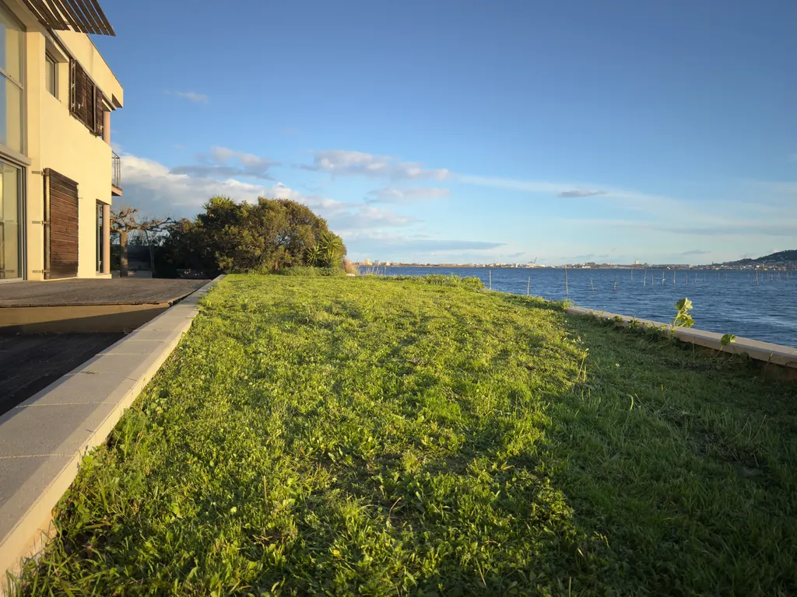

# De ma terrasse #46 | Complexité, conscience et IA

_Ma sélection du dimanche : **16** liens et une photo prise depuis ma terrasse._

Encore beaucoup de mal à récolter assez de liens pour publier cette newsletter tous les dimanches (beaucoup d’articles m’apparaissent insipides).

## Grandes théories

[Cette nouvelle théorie renverse 150 ans de science établie](https://nextbigideaclub.com/magazine/new-theory-upends-150-years-established-science-bookbite/59101/) • EN • 7 min  
La loi de l’information fonctionnelle croissante décrit comment tout système évolutif gagne en complexité et en ordre. Une deuxième flèche du temps, opposée à l’entropie, en ferait une propriété fondamentale de l’univers, des minéraux aux villes.

[La conscience serait plus qu’un simple produit du cerveau — elle pourrait aussi en être une entrée](https://bigthink.com/mind-behavior/consciousness-may-be-more-than-the-brains-output-it-may-be-an-input-too/) • EN • 9 min  
La théorie de l’irruption postule que l’effort mental laisse des empreintes mesurables dans l’entropie neuronale, ce qui en ferait une force causale plutôt qu’un simple épiphénomène de l’activité neuronale.

[Les nombres premiers se cachent-ils dans les trous noirs ?](https://www.scientificamerican.com/article/are-prime-numbers-hiding-inside-black-holes/) • EN • 7 min  
Le chaos qui règne près des singularités partagerait la même structure que les zéros de la fonction zêta de Riemann, ouvrant une voie inattendue vers une théorie quantique de la gravité.

## Cosmos

[Des microbes capables de voyager dans l’espace ? Une expérience a stupéfié les sceptiques](https://sea.mashable.com/space/42777/space-traveling-microbes-an-unusual-experiment-shocked-skeptics) • EN • 8 min  
Un canon à gaz géant a soumis des bactéries à des pressions de 2,4 gigapascals simulant une éjection par astéroïde : entre 60 et 97 % ont survécu, ravivant le débat sur la lithopanspermie.

[Les astronomes produisent la plus grande image jamais prise du cœur de la Voie lactée](https://www.universetoday.com/articles/astronomers-produce-the-largest-image-ever-taken-of-the-heart-of-the-milky-way) • EN • 5 min  
Le réseau ALMA révèle une mosaïque de 650 années-lumière de filaments de gaz dense, offrant la première exploration exhaustive de la chimie et de la formation stellaire au centre de notre galaxie.

## Biologie et évolution

[Des scientifiques ont creusé sous l’un des plus vieux arbres de la Terre. Ce qu’ils ont trouvé est stupéfiant](https://www.discoverwildlife.com/plant-facts/trees/alerce-fungi-chile) • EN • 4 min  
Sous un alerce chilien âgé de 2400 ans, plus de 300 espèces fongiques uniques ont été identifiées. Ce réseau souterrain a mis des millénaires à se constituer.

[Vos expériences vous transforment et les scientifiques pensent qu’elles pourraient aussi modifier votre ADN](https://www.popularmechanics.com/science/environment/a70518471/rewrite-dna-lamarckian/) • EN • 5 min  
Des mécanismes épigénétiques pourraient ancrer dans le génome les adaptations acquises, à une vitesse que la sélection naturelle darwinienne ne peut égaler.

[Le nombre d’enfants que vous avez pourrait influer sur votre espérance de vie, selon une étude](https://www.sciencealert.com/the-number-of-kids-you-have-may-affect-your-lifespan-study-finds) • EN • 4 min  
Une analyse portant sur 14 836 femmes jumelles révèle que les extrêmes de la parentalité, sans progéniture ou avec beaucoup, accélèrent le vieillissement biologique, confirmant la théorie du soma jetable.

[Un vaccin universel bloque virus, bactéries et allergies sous forme de spray nasal](https://www.sciencealert.com/universal-vaccine-blocks-viruses-bacteria-and-allergies-with-a-nasal-spray) • EN • 4 min  
En mobilisant l’immunité innée grâce aux signaux des lymphocytes T, la formule GLA-3M-052 a protégé des souris contre des agents pathogènes d’origines distinctes pendant trois mois, sans cibler un pathogène particulier.

## Cerveau et santé

[Ce qui se passe dans votre cerveau quand vous passez du temps dans la nature](https://www.thebrighterside.news/post/what-happens-in-your-brain-when-you-spend-time-in-nature/) • EN • 6 min  
Une méta-analyse de 108 études en neuroimagerie montre que trois minutes en plein air suffisent à modifier l’activité neuronale, avec des effets structurels durables chez les personnes vivant à proximité d’espaces verts.

[Une application smartphone peut aider les hommes à durer plus longtemps au lit](https://www.newscientist.com/article/2519306-a-smartphone-app-can-help-men-last-longer-in-bed/) • EN • 4 min  
Un essai randomisé sur 80 participants montre que des exercices de plancher pelvien associés à la pleine conscience ont doublé le délai d’éjaculation en quatre semaines, sans recours aux médicaments.

[Des scientifiques peuvent rendre votre mémoire « jeune » à nouveau, en reprogrammant votre cerveau](https://www.popularmechanics.com/science/health/a70463896/gene-therapy-reverses-memory-loss/) • EN • 4 min  
En activant trois gènes dans les neurones qui stockent des souvenirs précis, une thérapie génique de l’EPFL a restauré les capacités mnésiques de souris âgées à un niveau comparable à celui de jeunes individus.

## Intelligence artificielle

[Morgan Stanley avertit qu’une percée de l’IA est imminente en 2026](https://fortune.com/2026/03/13/elon-musk-morgan-stanley-ai-leap-2026/) • EN • 5 min  
La banque prévoit un déficit électrique américain de 9 à 18 gigawatts d’ici 2028 et anticipe des suppressions d’emplois massives à mesure que les modèles atteignent le niveau des experts humains sur des tâches économiques.

[L’outil open source « autoresearch » d’Andrej Karpathy permet de lancer des centaines d’expériences par nuit](https://venturebeat.com/technology/andrej-karpathys-new-open-source-autoresearch-lets-you-run-hundreds-of-ai) • EN • 7 min  
Un script de 630 lignes transforme l’entraînement des modèles IA en boucle évolutive autonome : en deux jours, un agent a réalisé 700 modifications et réduit de 11 % le temps d’entraînement sans intervention humaine.

[Les 12 articles de recherche qui ont influencé le développement de l’IA au cours des six dernières années](https://www.geeky-gadgets.com/main-artificial-intelligence-research-papers/) • EN • 7 min  
Du Transformer de 2017 aux lois de mise à l’échelle Chinchilla, une synthèse retrace les jalons qui ont fait passer l’intelligence artificielle du tâtonnement expérimental à une ingénierie systématique.

[L’avenir des formats de narration par les données : au-delà des tableaux de bord](https://www.kdnuggets.com/the-future-of-data-storytelling-formats-beyond-dashboards) • EN • 8 min  
Narratives interactives, réalité augmentée et sonification : des approches émergentes pour transformer des métriques en récits guidés que les audiences peuvent s’approprier.

#digest #y2026 #2026-3-15-17h00
