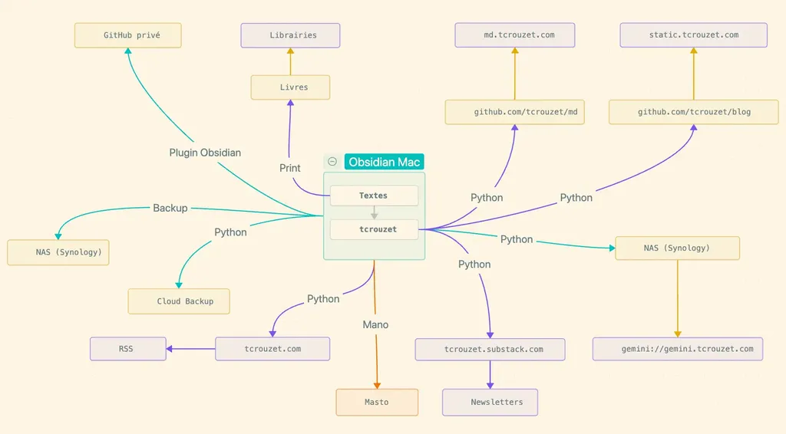

# Ni POSSE, ni Facebook : un blog, simplement

Il y a quelques jours, un lecteur photographe m’a écrit pour me demander de l’aide. Au prétexte qu’il a publié des images érotiques mais pas plus choquantes que celles d’Helmut Newton, Bettina Rheims ou Jeanloup Sieff, Facebook a fermé son compte : il a perdu ses publications depuis 2009, sans même parler de son réseau.

Que lui dire sinon « C’est dommage » et « Débrouille-toi avec le bon vouloir de Facebook » ? Cette mésaventure est fort banale. Depuis longtemps, nous sommes nombreux à dénoncer la toute-puissance des plateformes centralisées. Nous devrions nous détourner de ces services quand ils ne nous donnent pas la main sur nos données et se permettent de filtrer nos messages.

Communiquer sur les réseaux sociaux privatifs, c’est comme publier des livres dont les libraires déchireraient la plupart des pages. La règle du jeu est connue : les plateformes sont des zones de non-droit qui tiennent de la dictature plus que de la démocratie. On peut s’y exprimer librement tant que ça ne nuit pas au gouvernement, exactement comme en Chine.

Si nous ne prenons pas en main notre vie numérique, si nous n’utilisons pas des services dont nous disposons des clés, la mésaventure qui frappe mon lecteur risque de nous arriver tôt ou tard, ne serait-ce que parce que nous tiendrons des propos politiques en désaccord avec le boss de la plateforme.

### D’où l’intérêt du blog

Fort de ce constat, un autre lecteur a décidé de publier chez lui, c’est\-à\-dire de créer [un blog](https://brouillonsetbuvards.sitelf.fr/). Presque que des avantages :

* Ne plus offrir gratuitement des contenus aux plateformes.
* S’opposer à leur force de centralisation du web (ce qui revient à une prise de pouvoir).
* Parler sans censure.
* [Minimiser l’impact écologique.](https://tcrouzet.com/2025/11/16/smolweb-smolnet/)
* Accessibilité dans le temps (les articles ne disparaissent pas dans une timeline).
* Mobilité des données (avec l’exigence d’effectuer des backups — [ça reste le cas avec Substack, voilà pourquoi je l’utilise pour ma newsletter](https://tcrouzet.com/2025/11/25/substack-moral-choice/)).
* Possibilité d’offrir de multiples formats (web, markdown, Gemini, mail, RSS…).
* Personnalisation infinie.

OK, c’est un peu plus compliqué que sur Facebook ou Instagram, mais la liberté a un prix. On nous dit toujours « les réseaux sociaux, c’est simple ». On nous dit moins souvent « les réseaux sociaux sont des dictatures ».

### L’indieWeb ou le web prétendument indépendant

Lors de la création de son nouveau blog, mon lecteur s’est inspiré [d’un article](https://themimitoof.fr/pourquoi-vous-devriez-lancer-un-blog/) qui fait l’éloge de l’[indieWeb](https://indieweb.org/) (le web indépendant), lui\-même construit autour du concept [POSSE](https://indieweb.org/POSSE-fr), acronyme de Publish (on your) Own Site, Syndicate Elsewhere. L’idée est simple : on publie chez soi, puis on diffuse partout ailleurs où c’est possible. J’ai longtemps joué ce jeu avant de faire marche arrière.

Voilà les trois principes défendus par les membres de la communauté indieWeb :

1. **Vos contenus vous appartiennent** (ce qui n’est pas le cas avec Facebook et autres : vous cédez vos droits).
2. **Vous êtes mieux connecté** (puisque vous diffusez partout depuis votre base de lancement personnelle — j’appelais ça la propulsion il y a presque 20 ans).
3. **Vous gardez le contrôle** (puisque vous publiez ce que vous voulez).

Selon POSSE, il serait bon de diffuser tant et plus, par tous les moyens, mais c’est très coûteux en énergie, donc irresponsable, et politiquement très douteux.

Je ne publie plus sur Facebook et consorts à cause de leur politique de filtrage, de leur technofascisme affiché, de leur promotion des fakenews, de leur capacité à me faire taire du jour au lendemain, de leur appropriation de mes données, de leur propension à m’abrutir… Je refuse de collaborer à ce système. Donc, non, il n’est plus question de syndiquer mes contenus aveuglément dans l’idée de maximiser ma visibilité.

Je préfère être invisible et rester en accord avec mes valeurs. Je ne poursuis pas la connexion à tout prix. Je cherche seulement des connexions de qualité. [Voilà ce qui importe quand il nous arrive des coups durs dans la vie.](https://tcrouzet.com/tag/isa/) Je préfère dix messages écrits avec amour que des milliers de likes et de partages.

Par ailleurs, même quand nous publions chez nous, nous perdons le contrôle du référencement comme de ce que lecteurs et algorithmes font de nos contenus. Si par malheur nous syndiquons, nous contrôlons encore moins. À vrai dire, le contrôle ne m’intéresse pas. Voilà pourquoi je publie sous licence libre.

Je tente de rester autonome, mais indépendant, surtout pas. J’ai besoin de vous, dépends de vous, et aujourd’hui que je suis veuf, plus que jamais. Je ne publie que parce que vous êtes là. L’indépendance est une chimère libéraliste. En un temps de dérèglements climatiques, l’indépendance est une idée à combattre. Je préfère prendre conscience de mes dépendances et cultiver celles qui me grandissent tout en m’opposant à celles qui réduisent nos libertés.

*PS : Je ne sais où j’ai trouvé la force de cet article, peut-être parce que j’y rabâche des idées éculées, qui ne semblent pourtant pas encore évidentes pour tout le monde.*

#netculture #y2026 #2026-03-26-20h30
