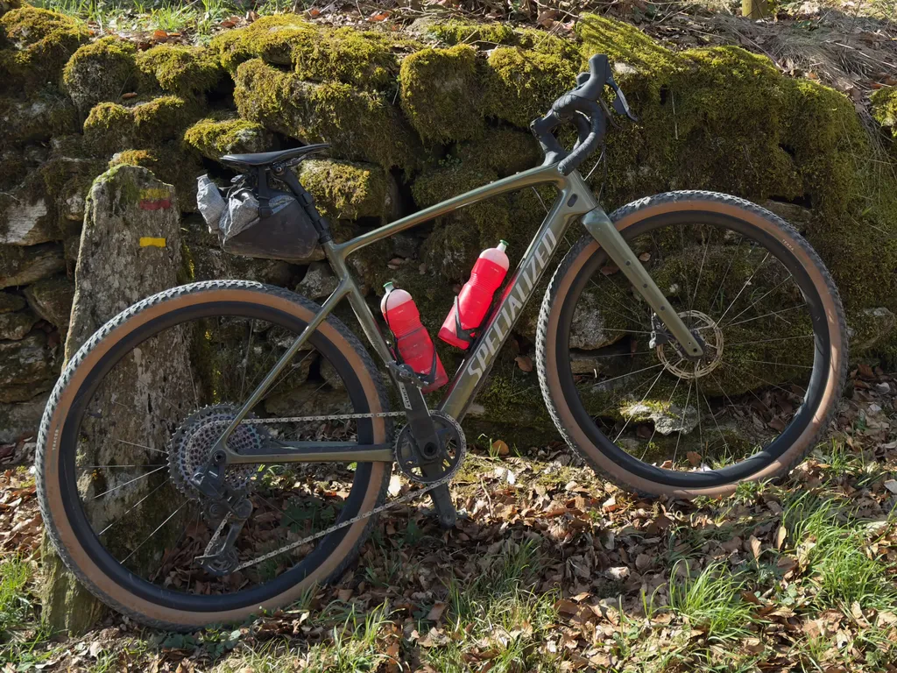
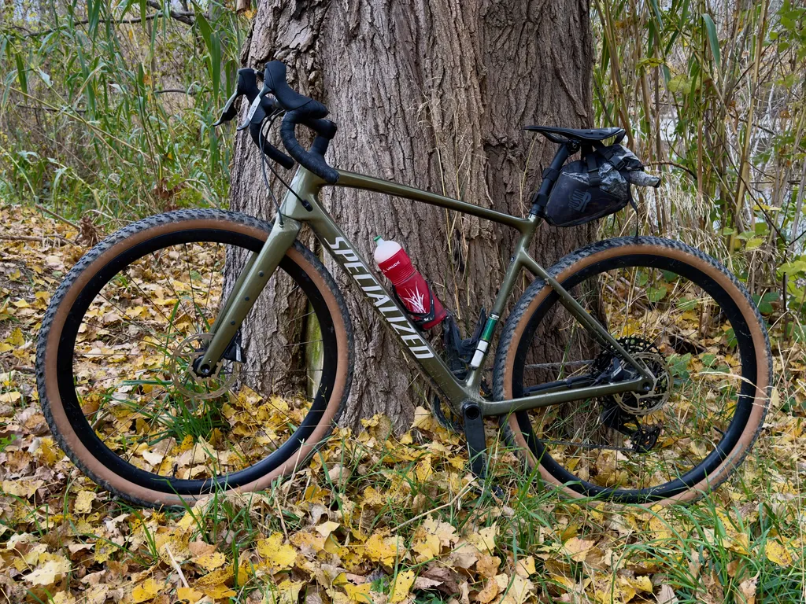
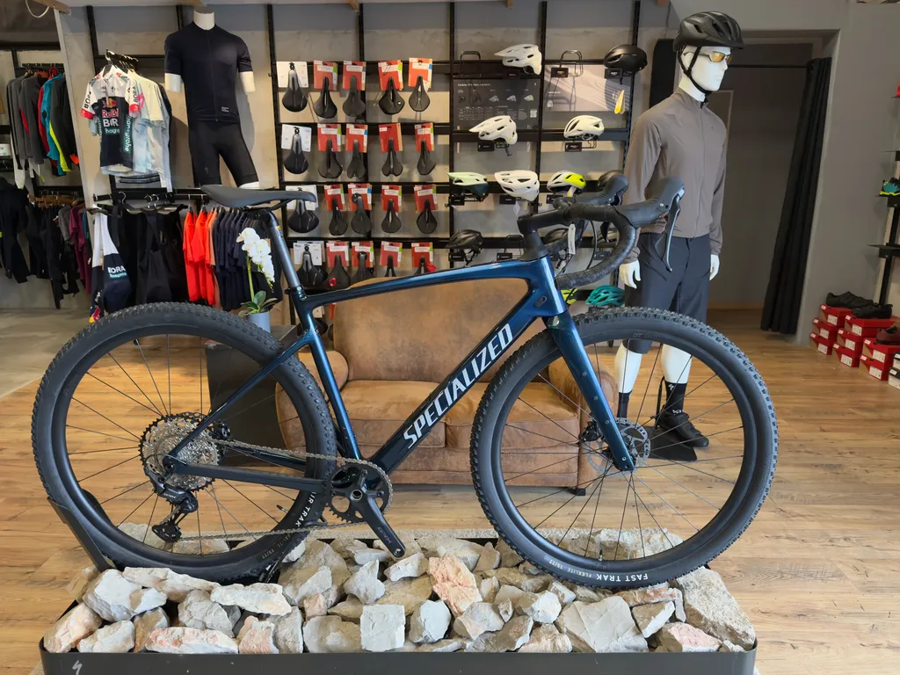
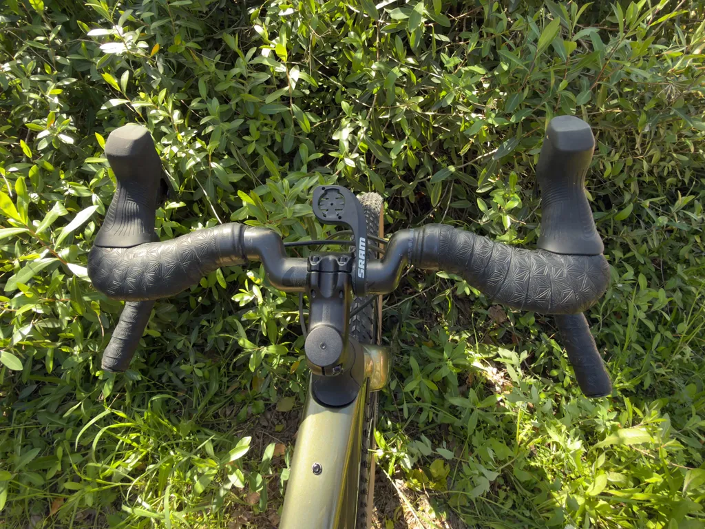
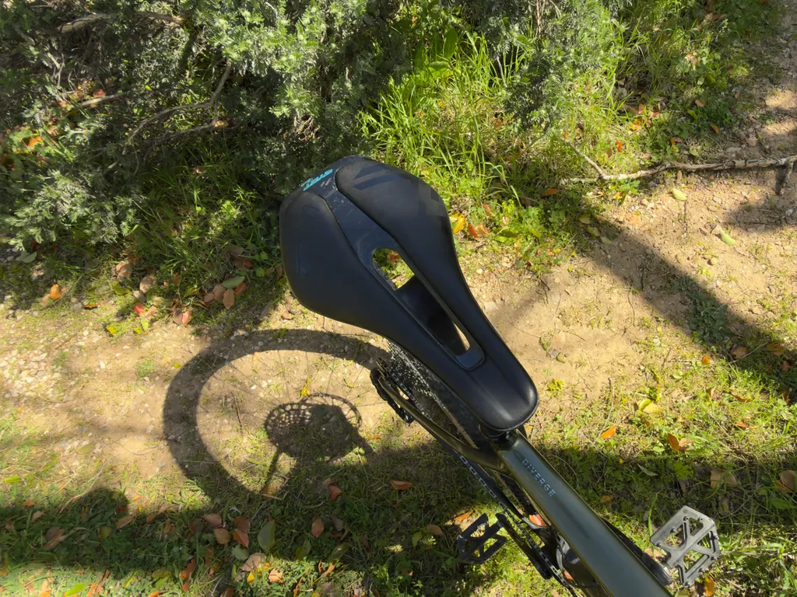
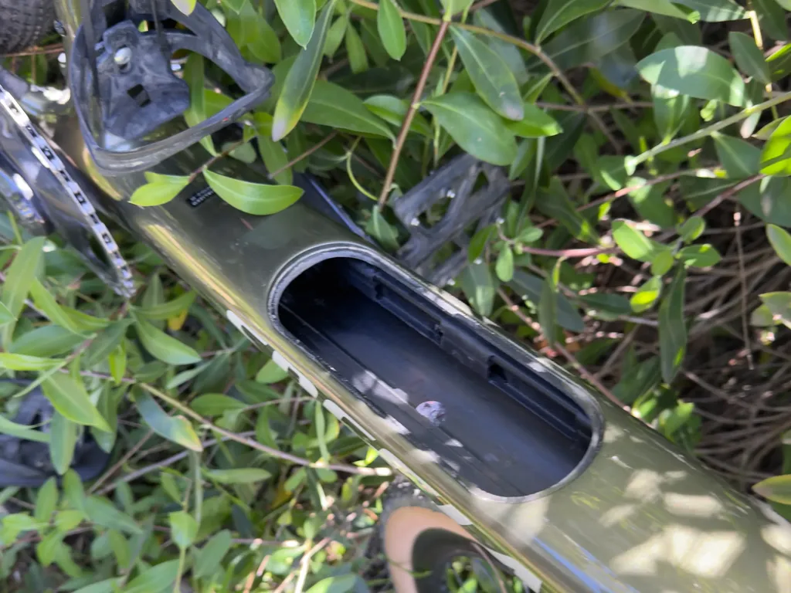

# Specialized Diverge 4 : le meilleur gravel ?

Ma relation avec le gravel a été compliquée, entre amour et rejet. Contrairement à beaucoup de graveleux, je viens du VTT. J’ai connu les modèles tout rigides des années 1980, puis j’ai pris goût aux suspensions. Quand j’ai débarqué en Floride en août 2018, alors que la vague du gravel prenait de l’importance, j’ai choisi un [Diverge 2](https://www.specialized.com/us/en/mens-diverge-expert-x1/p/154313?color=227313-154313) parce qu’il possédait un semblant de suspension avec le [Future Shock](https://www.specialized.com/ca/fr/future-shock) dans le top tube. Je ne voulais pas être trop dépaysé.

Pour rouler sur les levées de Floride, d’infinies lignes droites archiplates dans les Everglades, le Diverge était le vélo parfait, dynamique et filtrant les légères imperfections des pistes. Assez joueur pour les rares singles que je dénichais dans les parcs.

Mais quand il s’est agi de bikepacking, j’ai acheté un [Salsa Timberjack](https://www.salsacycles.com/collections/timberjack), convaincu que sur les longues distances les vibrations du gravel finiraient par me fatiguer plus que le moindre rendement d’un VTT. J’ai fini par découvrir ma frontière physiologique autour de 200 km. En dessous, le gravel me convient, au-dessus je lui préfère le VTT. Je parle bien sûr de hors asphalte.

De retour en France, sur les terrains plus torturés des garrigues du Midi, le Diverge était soumis à rudes épreuves. J’ai vite compris que ses pneus de 42 mm max n’offraient pas assez de confort. Je l’ai vendu au printemps 2021 et, durant un an, [j’ai roulé gravel avec un Epic semi-rigide](https://tcrouzet.com/2021/12/10/le-meilleur-gravel-cest/). Le vélo était presque aussi dynamique, à peine plus lourd et offrait un confort incomparable.

Je suis revenu au gravel en octobre 2022, au prétexte de pouvoir rouler sur Paris quand je monterais voir mon fils qui y commençait sa prépa (un gravel est plus transportable qu’un VTT). J’ai acheté un [Canyon Grizl](https://tcrouzet.com/2022/10/07/prise-en-main-du-gravel-canyon-grizl/) de poids équivalent au Diverge 2, mais avec la possibilité de monter des pneus jusqu’à 60 mm. J’ai vite découvert que le combo idéal était à 50 mm, sinon autant rouler avec le semi-rigide. Le Grizl m’est apparu plus pataud que le Diverge, à cause de ses roues aluminium sans doute, mais il s’est avéré confortable avec un cintre [Deda Gera Carbon]([https://dedaelementi.com/gera-alloy-handlebar](https://dedaelementi.com/gera-carbon-handlebar)).

J’ai alors partagé ma pratique entre gravel et VTT, gardant toujours une préférence pour le VTT, parce qu’il me permet d’accéder à des sites naturels interdits au gravel. Reste que rouler à gravel, c’est autre chose : la position change, nous ne choisissons pas les mêmes itinéraires, le plaisir diffère comme les partenaires.

J’ai encore des copains « sectaires » qui refusent le gravel sans jamais l’avoir essayé. Attitude assez con, parce nous ne sommes pas de simples victimes du marketing. À gravel, nous prenons un plaisir différent qu’à VTT et que sur la route. Ce n’est ni l’un ni l’autre, c’est une autre pratique. Par exemple, quand je roule seul, je pars toujours avec mon gravel. Plus envie de me risquer en solo dans les chemins compliqués avec le VTT (souvenir de ma fracture du col du fémur dans une forêt du Lot-et-Garonne).

Donc, j’aime le gravel, même si j’en connais les limites. J’ai tenté en 2024 d’effectuer un g727 [en transformant mon semi-rigide en monster gravel](https://tcrouzet.com/2024/09/04/monster-gravel/) et j’ai terminé brisé. Le vélo était hyperconfortable, mon compagnon de bikepacking depuis des années, [mais affublé d’un cintre moustache, il m’a défoncé les épaules et les mains](https://tcrouzet.com/2024/10/04/cintre-droit-moustache/) (et j’avais la bonne position). J’ai compris que la vraie différence avec le VTT n’était ni dans le poids ni dans le dynamisme, mais essentiellement dans le cintre qui influence tout le corps. Contrairement à de nombreux cyclistes, je me sens mieux sur le long avec un cintre plat, même sur des chemins peu techniques.

Et donc, après trois ans de compagnonnage avec le Grizl, j’ai décidé de revenir au [Diverge 4](https://www.specialized.com/fr/fr/diverge-4-comp-carbon-sram-apex-axss1000/p/4223513?color=5464898-4223513) qui offre enfin la possibilité de monter des pneus jusqu’à 2,2 pouces tout en disposant d’un Future Shock de nouvelle génération (Specialized a mis du temps avant de moderniser ses gravels).

J’ai choisi le modèle Comp Carbon parce qu’il dispose d’un développement arrière SRAM identique à ceux des VTT, une cassette T-type 10-52, indispensable à gravel dès qu’on s’engage dans les forts pourcentages avec un vélo chargé. J’ai effectué quelques modifications :

* Cassette XX1 150 g plus légère.
* Couronne de 38 contre le 40 à l’origine.
* Manivelles Force 170 mm contre 172,5 à l’origine.
* Roues alu troquées pour des Terra carbone.
* Cintre Gera, de 460 mm, plus large et plus ergonomique que le 440 mm d’origine.
* Selle Power qui m’a toujours défoncé le cul virée pour une [Ryet](https://fr.aliexpress.com/item/1005007572627178.html) de 105 g achetée en Chine (et qui convient à mon séant).
* Potence de 60 mm contre 80 mm à l’origine.
* Pneus de 50 mm, Terra à l’avant, Tracer à l’arrière (combo génial tout en étant léger).

Le vélo, annoncé sans pédale à 9,7 kg, descend à 9 kg (un bon kilo de plus que les Crux des copains).

Mes premiers coups de pédale ont été magiques. Le confort se doublait d’un dynamisme jamais ressenti à gravel. Sur les chemins ondulés, j’étais aussi bien que sur un VTT. Je pouvais rentrer à fond dans les zones caillouteuses sans me faire éjecter, avec un rendement supérieur à ce que je connaissais sur le Canyon. Je me suis vu m’accrocher à des copains qui d’habitude me lâchaient.

Le Diverge 4 est de loin le meilleur gravel sur lequel j’ai posé mes fesses : léger, dynamique, confortable et fort pratique avec sa boîte à outils dans le cadre, où je peux glisser un imperméable en plus des outils. J’adore ce vélo. Il me procure beaucoup de plaisir. Pour rien au monde je ne le troquerais contre un cadre fer ou titane. Quand j’attrape ces vélos, ils me paraissent en plomb.

Il m’est difficile d’être objectif quand je le compare au Grizl, trop de choses ont changé entre les deux, pas seulement le cadre et le Future Shock : le pédalier plus court et les roues carbone font une grande différence (Cyril, qui roule avec un Grizl équipé du même pédalier et des mêmes roues, le confirme).

Je suis tellement séduit par les manivelles en 170 mm que je viens d’en commander pour mon VTT. Extraordinaire la différence de sensation avec quelques millimètres de moins. Impression de tourner plus rond, plus fluide. Je vous conseille.

Quid de tester le Diverge 4 en bikepacking ? Je vais m’y risquer en douceur. Je pars avec rouler quatre jours en Espagne sur une reco [g727](https://727bikepacking.fr/g727-Grand-Depart/), sans bagages, puis je le testerai sur [les 270 km de la POU100](https://727bikepacking.fr/pou100/). Je vous raconterai au retour.

OK, le Diverge 4 dans ma configuration avoisine les 5 000 €, c’est pas cadeau, [mais la vie est courte.](https://tcrouzet.com/tag/isa/)

#velo #gravel #y2026 #2026-03-27-13h00
