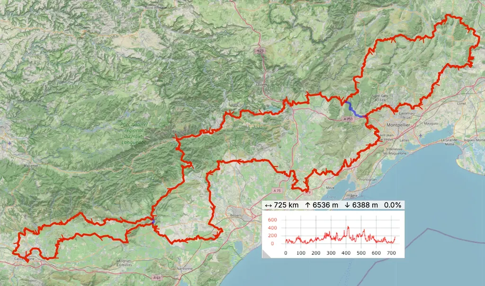

# Le 727 de mai : ce que le gravel ne peut pas faire

Après le gravel de la [POU100 d’avril](https://tcrouzet.com/2026/04/06/gravel-ou-pas/) et [les reco du g727 de septembre](https://tcrouzet.com/2026/03/31/g727-espagna/), nous rangeons nos gravels pour enfourcher nos VTT à l’approche du [727 du 8 mai](https://727bikepacking.fr/727-Grand-Depart/).

D’année en année, alors que vous êtes de plus en plus nombreux sur nos évènements gravel, vous l’êtes de moins en moins sur le 727 original qui exige des VTT. C’est une tendance générale : le gravel séduit les amoureux des longues distances et du voyage hors asphalte, tandis que d’un côté on a des VTT électriques encore justes en autonomie pour le bikepacking, de l’autre le VTT UCI qui revient à tourner en rond et bomber le torse pendant deux heures.

Malgré mon [gravel Diverge 4 ultra confortable](https://tcrouzet.com/2026/03/27/le-meilleur-gravel/), avec lequel j’ai avalé les 270 km de la POU100 avec le sourire et sans la moindre douleur, je fais du VTT mon vélo de choix pour les longues distances hors asphalte. Mon tout suspendu m’offre un confort et une polyvalence incomparables pour seulement 1,5 kg de malus. C’est aussi mon vélo de choix en tant que traceur et que rêveur d’itinéraires.

* Créer des traces gravel demande un immense investissement. Il faut reconnaître chaque centimètre, et si on ne le fait pas parce qu’on croit connaître, les mauvaises surprises arrivent quand les intempéries dégradent les chemins. Pour une trace de 727 km, il faut souvent explorer plus du double de distance, même dans une région familière.
* Quand je trace gravel, je suis souvent frustré de devoir éviter des secteurs sublimes parce qu’avant ou après c’est trop rugueux. Tracer gravel implique des compromis et des renonciations. C’est un jeu intéressant, parfois frustrant. À VTT, mon imagination n’a pour seule limite que le territoire (et mes jambes).
* Pour les traces VTT, les reconnaissances me deviennent accessoires. Mon expertise cartographique me permet de créer de longs itinéraires théoriques avec un risque d’erreur quasi nul. Je me suis découvert cette compétence lors de notre [Paris Sète de 2022](https://727bikepacking.fr/p27/). J’adore partir sans savoir ce que je vais découvrir, et entraîner avec moi les copains et ceux qui osent se joindre à nous.
* Si une heatmap nous dit que ça passe, c’est que ça passe à VTT (reste à ne pas prendre les descentes en montée). [C’est pour moi un outil génial.](https://tcrouzet.com/2022/09/29/heatmap-le-tracage-social-pour-gravel-et-vtt/) Pour créer mes traces, j’ai cessé de télécharger les itinéraires en partage. Je brode sur la carte et rêve grâce aux images satellites. Attention : j’y passe un nombre d’heures incalculable.
* Mes premières traces étaient des mashups, des recompositions, des bout-à-bout. C’était comme écrire des livres par coupé-collé d’autres livres. Désormais, je pars de la carte et d’elle seule. Elle est devenue mon dictionnaire. Je ne veux pas être influencé par ce que proposent les autres. Je trace avec ma sensibilité cartographique. Quand je découvre un secteur chaud non cartographié, je sais avoir déniché une zone de singles.
* En 2025, une partie du 727 VTT était en mode exploration. Nous avons roulé en groupe un secteur de 150 km jamais roulé par nous, sans aucun problème. Ça devient excitant pour moi comme pour les participants. Ça met du sel au voyage.
* En 2026, je reprends la formule. J’ose envoyer la trace dans des secteurs que je ne connais pas ou mal. Je veux découvrir et que les participants découvrent avec moi. Je transforme la trace en terrain de jeu. Je peux me permettre cette approche parce que nous ne sommes plus qu’un petit groupe de bikepackeurs à privilégier le VTT. Nous aimons l’incertitude comme les singles qui grattent les jambes.
* C’est possible parce que le VTT offre la polyvalence maximale quand on ne se bat pas contre la montre. Il est adapté aux itinéraires gravel, sans que la réciproque soit vraie. La plupart de ceux qui ont roulé mes traces VTT à gravel ont terminé avec des tendinites ou des douleurs persistantes quand ils n’ont pas cassé du matériel. Le gravel fait mal quand les chemins se dégradent. [C’est un vélo pour voyage organisé](https://tcrouzet.com/2023/05/28/le-gravel-un-velo-pour-voyages-organises/) qui goûte peu l’improvisation.

* Partir à l’aventure à VTT est possible parce que les vététistes se moquent le plus souvent de pousser, voire de porter leur vélo. Par expérience, les graveleux sont plus attachés à leur confort. Le VTT est plus roots.

* Le VTT nous permet de nous enfoncer plus loin dans la nature, de découvrir des coins interdits au gravel et de dénicher de merveilleux spots de bivouac. C’est le seul vélo pour explorer un territoire dans ses recoins secrets.
* Le VTT offre un plaisir de pilotage irremplaçable. Je ne dis pas que le gravel n’est pas sympa, mais parfois je m’emmerde quand nous enchaînons les pistes sans jamais nous engager dans des singles. Pour moi, le VTT reste plus ludique.
* Pour autant, un itinéraire VTT n’a pas à être plus difficile physiquement. On roule simplement moins vite, on prend davantage le temps. C’est une autre philosophie.
* Reste que sur les 727 bornes de l’itinéraire de mai, les secteurs purement VTT seront minoritaires. Nous irons des uns aux autres en mode gravel. C’est aussi le propre des traces VTT, sauf en montagne ou quand elles s’entortillent sur elles-mêmes, ce que je déteste. Voyager implique de progresser chaque jour, de voir les paysages se transformer. C’est aussi ça le bikepacking.

Alors si j’aime le gravel et la belle communauté qui se construit autour, je reste passionné par le VTT, avant tout parce que nous retrouvons entre copains fidèles.

[Pour vous inscrire sur le 727 VTT de mai (encore des tonnes de places nous sommes 25 partants).](https://727bikepacking.fr/727-Grand-Depart/)

[Pour vous inscrire sur le g727 de fin septembre (qui se remplit à vitesse grand V).](https://727bikepacking.fr/g727-Grand-Depart/)

#velo #y2026 #2026-04-13-13h00
