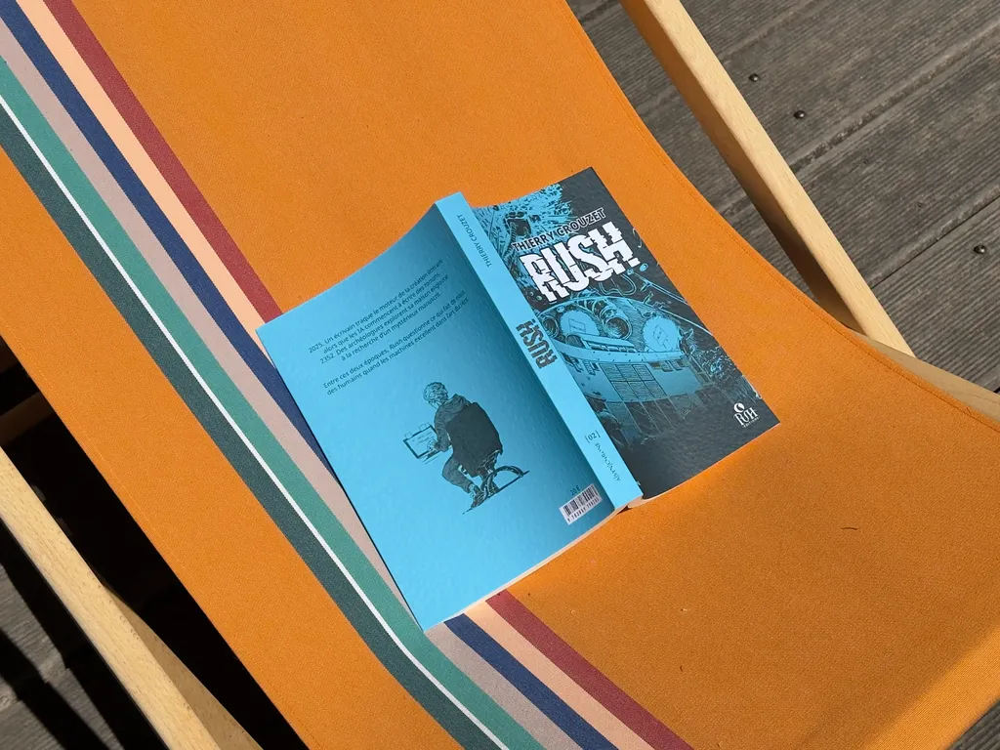

# Contre l’industrialisation de la littérature

Je voudrais vous raconter mon rapport à l’IA comme outil d’écriture, de mes premières expériences en 2022/2023 à l’impossibilité aujourd’hui d’utiliser l’IA pour dire [le deuil](https://tcrouzet.com/tag/isa/).

Pour commencer, je suis des plus réservés vis-à-vis des gourous qui prétendent nous aider à mieux écrire avec l’IA. S’ils étaient si forts, ils ne perdraient pas de temps à nous vendre leurs salades et produiraient des best-sellers en série. Ils se positionnent en vendeurs d’un art qu’ils n’appliquent pas eux-mêmes. C’est suspect.

D’ailleurs, avec IA ou sans, c’est du pareil au même. Bien écrire, mieux écrire ? On ne le demande à personne, surtout pas à un écrivain. On lui demande d’écrire à sa façon, de tordre la langue, de se l’approprier. Ses tics, ses maladresses, ses névroses linguistiques deviennent sa signature.

S’il existait un bien écrire ou un mieux écrire universel, nous écririons tous pareil. Nous lire serait casse-pieds comme sont casse-pieds les romans formatés pour le succès.

En tant qu’auteurs, nous ne cherchons pas à mieux écrire, mais à trouver notre écriture : un travail d’essais et d’erreurs. Nous analysons les œuvres de nos prédécesseurs ou de nos contemporains, apprenons à les imiter, puis trouvons notre tonalité.

Ce processus n’a rien de scolaire, rien d’universel, il est même tout le contraire. Notre chemin vers la littérature ne peut qu’être singulier. Souvent quand nous découvrons une règle ou une structure récurrente, nous la contournons, voire nous en débarrassons.

Les IA sont des machines à identifier les *patterns*. Nous inventons les nôtres, puis les déjouons sans cesse. L’IA veut normer, nous sommes des casseurs de normes. Pour apprendre à une IA à casser les normes, on lui en impose de nouvelles.

### Le Code Houellebecq

Dès la disponibilité des premiers LLM, j’ai rêvé d’utiliser les IA pour écrire à la manière de comme Proust dans ses *Pastiches et Mélanges*. Très vite j’ai essayé de faire écrire à la manière de Houellebecq, au prétexte que les IA amusaient peut-être Houellebecq, voire qu’il expérimentait peut-être avec elles.

C’était encore les balbutiements. Je donnais des extraits de Houellebecq et demandais à ChatGPT et Claude de produire des textes dans le même style, tout en brainstormant avec un Houellebecq virtuel. Au roman à la manière de, première partie de mon texte, j’ai ajouté une seconde partie sur l’histoire de cette écriture et les répercussions qu’elle pourrait avoir si un éditeur inventait un auteur en quête du prix Goncourt.

Cette expérience m’a amusé alors que j’apprenais l’art du prompt. [*Le Code Houellebecq*](https://tcrouzet.com/books/le-code-houellebecq/) était selon moi ce que je pouvais générer de mieux en 2023, tout en mettant beaucoup d’huile dans les rouages, mais sans jamais couper les figures de style qui me paraissaient typiques des IA de l’époque. Quand des critiques utilisent mes expériences d’alors pour parler des IA en littérature aujourd’hui, ils font fausse route. C’est de l’histoire ancienne : mon texte témoigne d’un moment où voir jaillir des textes pouvait encore provoquer des frissons.

Dès la fin 2023, le projet d’écrire à la manière de ne m’intéresse plus. Il devient possible d’entraîner des modèles sur de vastes corpus, tout Houellebecq par exemple, et donc de les rendre plus performants dans l’art d’imiter.

J’ai souvent entendu dire que le style d’un auteur était inimitable, et les IA, après Proust, démontrent le contraire. Elles détectent les *patterns* d’un style, établissent un jeu de règles qui peut servir à réécrire des textes à la manière de. Reprendre *Le Code Houellebecq* pour le rendre plus Houellebecq n’avait plus d’intérêt, voilà pourquoi je l’ai autopublié début 2024. Je ne le renie pas : il dit un moment du développement des IA, de ce qui était amusant expérimentalement avec des technologies imparfaites. En revanche, quand l’expérience se transforme en routine industrielle, c’est barbant. Aujourd’hui, les textes IA puent l’IA malgré les efforts des gourous.

### L’automatisation

Début 2024, je ne cesse d’expérimenter, [créant notamment des clones de moi-même avec lesquels discuter](https://tcrouzet.com/2024/03/06/conversations-2/). En parallèle, je commence à utiliser les agents, ce qui implique alors beaucoup de Python. Je m’amuse à générer des romans complets sans aucune intervention. Les résultats sont médiocres, tout en laissant deviner qu’il sera bientôt possible de produire des textes standardisés efficaces.

Aujourd’hui, c’est un business dans lequel s’engouffrent des entreprises comme [Inkitt](https://www.inkitt.com/fr) ou [Wrtn](https://fortune.com/2026/03/05/korea-startup-wrtn-arr-antler-loneliness-epidemic-ai-entertainment/), annonçant des chiffres d’affaires de dizaines de millions de dollars, ou des auteurs comme [Coral Hart](https://cybernews.com/ai-news/generative-ai-claude-writing-novels-travesty/) qui inondent les plateformes de romans générés en 45 minutes et en tirent des revenus plus qu’alléchants.

J’ai toujours la tentation de remettre les doigts dans ces mécaniques, pour le fun plus que la littérature. C’est du business, mais guère différent de celui pratiqué par la plupart des éditeurs qui évaluent le potentiel commercial d’un texte avant sa qualité littéraire. Franchement, qu’une merde soit produite par une IA ou un humain, c’est du pareil au même. Il existe de la bouffe bio dégueulasse. J’espère qu’il subsistera dans quelques recoins des romans du terroir avec du goût, des idées neuves, des prises de risque.

Donc, dans les premiers mois de 2024, j’ai découvert que demander aux IA d’écrire à ma place, même en leur tenant les brides, ne me procurait plus la moindre satisfaction. J’aime écrire. Quand une IA écrit, elle me prive de mon plaisir, au-delà du plaisir, d’une activité qui me rend plus humain, plus sensible, plus à l’écoute, plus lucide. Nous n’allons pas demander aux IA de faire l’amour ou du sport à notre place, ça n’a aucun sens. L’écriture est une aventure. J’entendais continuer à la vivre.

Reste que les IA nous entourent désormais. Comme la photographie a poussé les peintres à se remettre en question, elles nous poussent à sortir des genres codifiés, les plus faciles à industrialiser. Je me risque à prédire la mort de la littérature de genre bio. Il ne nous reste, à nous humains, qu’à devenir chacun notre propre genre. Dès que nous sommes tentés de chevaucher une catégorie, nous courons le risque d’être écrasés par les machines. Nous ne pouvons plus labourer toujours les mêmes champs ; les tracteurs automatiques le font mieux que nous.

Le succès des startups IA « littéraires » prouve qu’il existe des lecteurs pour des textes « mécaniques », des lecteurs qui cherchent le confort et non la surprise, la détente et non la stimulation. Vu les chiffres d’affaires annoncés, ces lecteurs sont bien plus nombreux que ceux de textes investis d’humanité (et les réseaux sociaux le démontrent aussi puisqu’ils sont inondés de contenus artificiels). La littérature bio n’attire plus les foules (par littérature bio, j’entends celle produite par un humain et qui ne pourrait l’être par une machine, car, oui, des humains écrivent souvent comme des machines).

Ai-je basculé dans le 100 % bio ? Pas pour autant. Comme je serais incapable d’écrire sans éditeur de texte, connexion internet, dictionnaire électronique, et bien d’autres outils, je suis désormais incapable de me passer des IA. J’en ai fait de super assistantes, toujours disponibles, infatigables. Je reste l’écrivain, mais leur donne à relire, critiquer, corriger, trouver les mots qui me manquent… Et je les sollicite pour les métatextes, les présentations, les argumentaires, les courriers en tout genre. Tout ce qui m’ennuie, je le délègue aux IA.

### Ce qui reste d’humain

De juin 2024 à février 2025, j’ai écrit [*Rush*](https://tcrouzet.com/books/rush/), un roman qu’une IA de l’époque n’aurait pu générer (de l’époque, parce que ce texte peut désormais servir de template). À cheval entre des genres distants : la littérature blanche, le carnet, la SF. Très intime et en même temps rempli d’imaginaire. J’y confrontais la créativité humaine et la machine, le cancer d’Isa et les utopies solarpunk. Je ne me préoccupais d’aucune règle du marché. L’IA y était partout, cause du texte, en ce qu’elle exerçait une pression sélective sur moi, me poussant à me questionner sur le propre de l’humain. En même temps, je ne la laissais pas écrire à ma place, même si quelques dialogues entre elle et moi m’ont parfois donné le vertige.

J’ai donné le texte à deux éditeurs. Le premier m’a suggéré de n’en conserver que la partie blanche, c’est-à-dire de me ramener dans les champs que commencent à labourer les machines ; le second, PVH, a compris les enjeux et accepté le texte sans me demander de le tronçonner pour le ramener à un format mécanisable.

Le marché du livre change de visage. D’un côté des machines produisent du texte en série, diffusé via app ou librairie en ligne ; de l’autre des auteurs, des éditeurs et des libraires tentent de satisfaire des lecteurs de plus en plus rares et de plus en plus vieux.

J’ai presque envie de dire : les lecteurs sont le problème. S’ils préfèrent les productions automatiques ou standardisées, c’est la fin des auteurs, des éditeurs et des libraires. À moins de réenchanter la littérature, d’oser, de prendre à nouveau des risques, de cesser de jouer sur la quantité, en demandant à des humains d’imiter les machines qui les imitent eux-mêmes. Quelle satisfaction que d’écrire un livre qui pourrait l’être par une machine ? Quelle satisfaction de faire un boulot automatisable ? Obtenir un salaire ne me semble pas suffisant, du moins pour un artiste.

J’étais hier dans une nouvelle librairie près de chez moi à Frontignan, animée par des libraires adorables, et j’ai pensé que le fonds était trop fourni. Nous pourrions réinventer la vente des livres sur le terrain. Nous éloigner du quantitatif. Ne garder que les coups de cœur comme [cette librairie japonaise qui ne propose qu’un livre chaque semaine](https://usbeketrica.com/fr/article/morioka-shoten-la-librairie-qui-ne-vend-qu-un-seul-livre-par-semaine). Pas collectionner les nouveautés. Pas transformer le métier de libraire en celui de magasinier, en succursale d’une machine à produire des textes en séries, sans aucune chance de rivaliser avec les IA. La chaîne du livre, à force de s’industrialiser, se heurte de plein fouet à une technologie qui rend son objectif productiviste impossible. La messe est dite si nous ne remettons pas de l’humain dans les rouages.

J’en arrive à mon deuil. Les IA s’arrêtent aux porte de la douleur, au vide, à la tristesse. Tout ce qu’elles peuvent dire sonne faux. Je n’ai pas besoin d’elles pour raconter mon ressenti, pour chercher à le comprendre, à l’assimiler. Mon expérience les dépasse. La littérature se joue là, dans des textes qui ne peuvent qu’être nôtres, non automatisables.

J’en viens à prendre en grippe les gourous de littérature IA. Vous n’avez rien à nous apprendre. Les IA ne peuvent rien pour ce qui nous importe. Leur ouvrir la porte, c’est renoncer à nous-mêmes, nous transformer à notre tour en machines. Gardons-les comme outils, mais conservons le contrôle jusqu’à la moindre virgule.

Quand j’écris, il se passe des choses en moi, les idées jaillissent, les sentiments se cristallisent, je jouis. Quand je lis la réponse d’une IA à un de mes prompts, je suis en dehors du texte, en observateur, en démiurge. Je passe d’un processus interne à un survol superficiel. Ce n’est plus écrire, mais mécaniser. J’ai envie de rester artisan. Je ne cherche pas à faire fortune avec mes textes. Oui à l’expérimentation, non à l’industrialisation (industrialisation qui est le plus court chemin désormais pour la fortune littéraire).

La métaphore agricole me parle : d’un côté l’agriculture industrielle à fort recours aux intrants, de l’autre l’agriculture bio, locale, respectueuse. Je ne suis pas contre la technologie, au contraire, simplement lui déléguer ce qui nous fait humains me pose problème. Je suis pour l’art avec les IA, mais contre l’art fait par les IA. L’art, c’est inventer des *patterns*, pas en reproduire. C’est nous ouvrir les yeux, intensifier notre existence. Ce processus d’amplification commence dès le travail de l’artiste, dès que j’écris, sinon il n’a aucune chance d’arriver jusqu’à vous. On peut se faire assister avec l’IA, pas lui demander de faire à notre place. Et si nous faisons une chose qu’une IA aurait pu faire à notre place, alors oui, déléguons. J’espère que mes textes ne peuvent encore que venir de moi. Qu’ils soient plus difficiles à lire que ceux des IA, je m’en fiche. Je ne cherche pas à vous séduire, à simplifier, je n’ai rien à vous vendre. [J’écris pour vous prendre dans mes bras.](https://tcrouzet.com/2026/04/03/connection-directe/)

#netlitterature #ia #y2026 #2026-04-18-16h00
