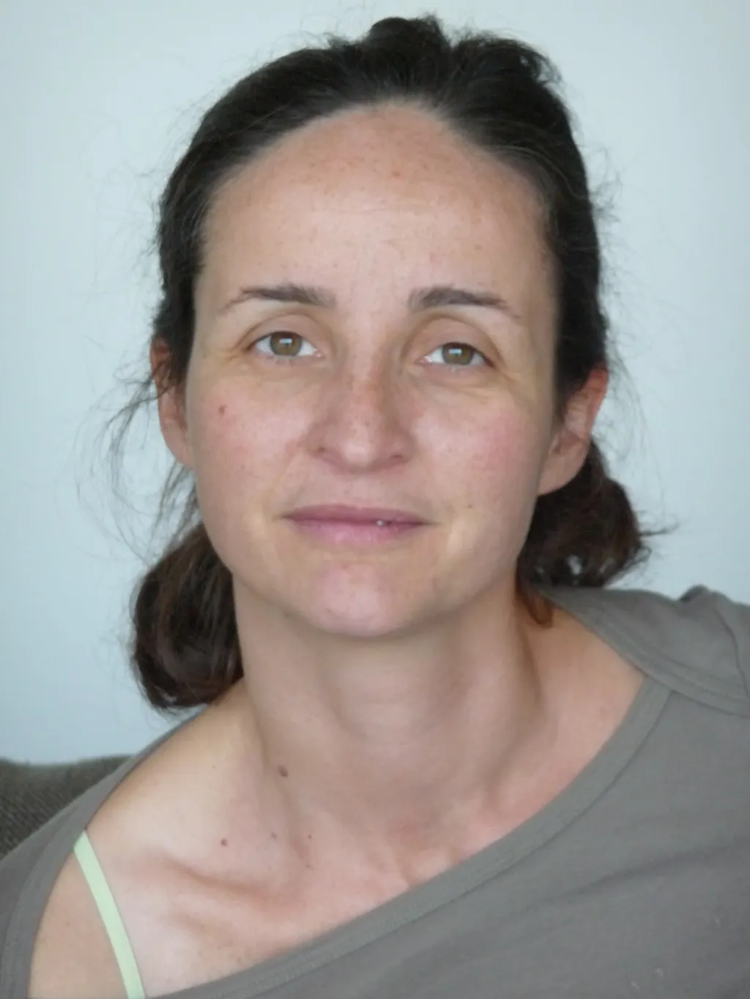

# Ce que le deuil m’apprend sur les réseaux sociaux et la chaleur humaine

Extrait de mon [journal de mars](https://tcrouzet.com/2026/04/01/mars-2026/) : « Nous sommes devenus fous. Plutôt que de rendre visite à nos amis, nous nous précipitons dans des stades où nous crions pour nous faire entendre, où plus personne n’écoute, où plus personne ne discute. Comment en sommes-nous arrivés là ? » Dès que je milite pour [un retrait des réseaux sociaux](https://tcrouzet.com/2025/08/11/mort-des-r%C3%A9seaux-sociaux/), pour [un repli chez soi et dans une forme d’intimité](https://tcrouzet.com/2026/03/26/digital-freedom/), on me réplique que je défends cette position parce que j’ai une notoriété suffisante pour ne pas avoir besoin d’aller à la pêche aux lecteurs.

Avant de répondre, une remarque. [Depuis la mort d’Isa](https://tcrouzet.com/tag/isa/), je ne sens plus sa chaleur contre moi, ses bras autour de moi et les miens autour d’elle. Mes mains ne prennent plus les siennes, ne se posent plus sur ses cuisses, ne s’attardent plus sur son ventre. Je n’ai presque plus de contact physique avec mes semblables. Je me sens déconnecté de l’humanité.

Les amis me tendent leurs joues pour m’embrasser, en un geste d’effleurement pudique, voire ils me serrent la main. Ils me refusent leur chaleur. Depuis longtemps, notre amie [Isabelle Filliozat](https://fr.wikipedia.org/wiki/Isabelle_Filliozat) vante les bienfaits des câlins. Se prendre dans les bras durant une trentaine de secondes, c’est une transfusion d’humanité, de bonheur, d’énergie, de réconfort. Libération d’ocytocine — l’hormone du lien social —, baisse du cortisol — l’hormone du stress —, réduction de la pression artérielle, renforcement du système immunitaire (à condition de répéter souvent les hugs), diminution de l’anxiété, sentiment d’appartenance à l’humanité, régulation émotionnelle, renforcement de l’estime de soi… Les bénéfices sont innombrables, et j’en sens le manque cruel.

Quand mes amis me téléphonent, m’écrivent ou tchattent avec moi, je suis heureux, mais moins que quand ils me serrent dans leurs bras et que je les serre dans les miens. J’en arrive à formuler une loi et un corollaire.

>Moins il y a d’intermédiaires entre nous, plus nous sommes heureux.

>Les réseaux sociaux numériques, inventés au prétexte de nous rapprocher, nous éloignent le plus souvent.

On me répond qu’il y a réseau social et réseau social. Nous savons que les grosses machines privatives se moquent de notre bien\-être ou de notre liberté d’expression. Mais même sur les marges, développées en logiciels libres, tout n’est pas rose. Une lectrice s’est fait virer d’une instance Mastodon au prétexte d’être trop féministe — donner du pouvoir à une personne et elle finit par en user (cf [affaire Wikipedia](https://tcrouzet.com/2014/10/15/wikipedia-est-devenu-un-astre-mort-sur-lequel-regnent-des-fantomes/)). Ma lectrice m’a alors vanté le réseau social [Nostr](https://fr.wikipedia.org/wiki/Nostr) où la liberté absolue serait garantie par une totale décentralisation. Je n’y crois pas. Dès qu’il y a des intermédiaires, techniques ou non, nous courons les risques de brouillages, d’interférences, de manipulations. En prime, la transfusion d’humanité que procure le hug se dilue, se délite, s’assèche.

J’ai envie de réduire les intermédiaires. Je ne rêve pas d’un énième réseau numérique meilleur que les autres, j’ai envie de vous toucher, de vous approcher, de vous regarder dans les yeux. Je n’ai pas besoin que vous soyez des millions, mais que votre chaleur me provoque la chair de poule.

Si je devais commencer ma vie d’auteur aujourd’hui, je ferais exactement comme il y a quarante ans, en donnant à lire des textes à mes amis, en espérant qu’ils les donneront à leurs amis. Je m’appuierai sur les liens forts, je construirai un réseau humain.

Les réseaux sociaux numériques, en nous décorporant, sont une violence faite à l’humanité, une violence que depuis trop longtemps nous acceptons et à laquelle nous nous soumettons, comme s’il n’existait pas d’alternatives.

Dans [un bel article, Tycho Huussen](https://tychohuussen.substack.com/p/the-tragedy-of-peace) explique qu’il est facile d’accuser les potentats à la Trump de nos maux quand nous sommes tous coupables. Il évoque les motards qui la nuit troublent la paix de son quartier, exerçant une forme de violence sonore. Sur les réseaux sociaux, nous sommes tous des motards bruyants. Il n’y a qu’un pas entre des gestes de violence anodins et l’envoi de bombardiers en territoires ennemis. Partout je vois la violence, jusque dans le monde du vélo amateur, où des abrutis immatures jouent aux cadors.

Et si la première violence que nous nous imposions était de nous tenir à distance les uns des autres ? Plus nous nous enfermons dans notre bulle, plus nous fabulons le monde extérieur, plus il nous effraie et plus nous nous en éloignons, adoptant les points de vue simplistes des populistes.

J’en viens à défendre une hygiène numérique minimaliste :

* Publier chez moi.
* Inviter chez moi.
* Éviter les intermédiaires.
* Aller à votre rencontre dès que possible (j’ai trop longtemps négligé cette nécessité).

Quid du livre papier ? C’est un peu un morceau de chez moi que vous emportez chez vous. Une façon pour moi de me démultiplier sur le territoire et pourquoi pas de venir à votre rencontre, comme le 23 mai à [La Comédie du livre](https://www.10joursenmai.fr/).

Un livre est un vecteur social physique. Une caravane. Le même livre se trouve chez tous les lecteurs. C’est un signe de reconnaissance, un prétexte à discussion, à interaction. Je crois à l’importance de rematérialiser nos vies ([ce qui donne sens à ma décision d’offrir à la fin de l’année un inédit papier à mes abonnés payants](https://tcrouzet.com/2025/11/27/abonnements-payants/)).

Serrons-nous dans les bras. Faisons-nous du bien. Passons moins de temps à capter l’attention.

#netculture #y2026 #2026-04-03-12h00
