# Ce que l’UCI ne comprend pas au gravel

L’après [POU100 2026](https://727bikepacking.fr/pou100/) est l’occasion de me demander encore une fois ce qu’est un itinéraire gravel. Pour l’UCI, les pistes de la [Strade Bianche](https://fr.wikipedia.org/wiki/Strade_Bianche) semblent le summum.

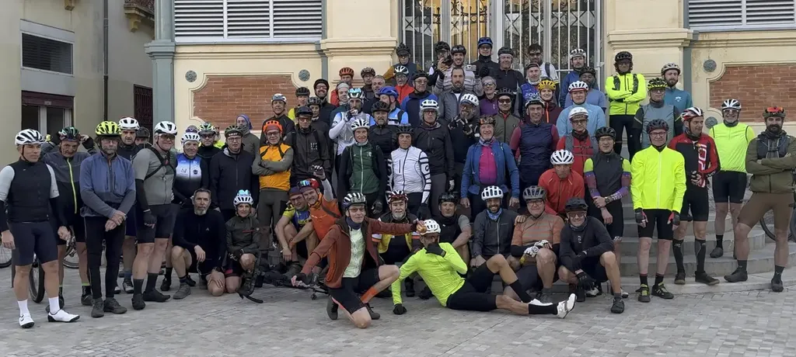

Est-ce que je cherche des chemins sales pour le plaisir de la difficulté ? Surtout pas. Simplement, une Strade Bianche, c’est 30 % de non-asphalte. Par ailleurs, c’est une course, pas une randonnée dont le but est de faire découvrir des paysages et des points de vue. Pour moi, une trace doit être sportive, esthétique, philosophique, souriante, humaine, en ce qu’elle favorise les rencontres, les échanges, les franches rigolades.

>Au participant du POU100 qui a enchaîné non-stop les 270 km pour finir à une heure du matin, je ne te porte pas dans mon cœur. Je n’ai même pas envie que tu reviennes rouler mes traces. Tu ne comprends rien à ce que je propose (c’est comme si tu utilisais mes livres pour te torcher). Si tu t’étais contenté de rouler et de rentrer chez toi, je n’aurais pas relevé. Je t’avais dit que tu pouvais rouler comme tu voulais, mais ton besoin d’étaler ton exploit de pacotille sur le groupe m’a déprimé. On n’est pas là pour frimer mais pour fraterniser. Crois-moi, il n’y a rien d’autre d’important dans la vie.

Fin de mise en exergue d’un des dérèglements du monde. Accroître le pourcentage de non-asphalte, 72 % sur la POU100 2026, et accéder à certains points de vue implique parfois d’emprunter des secteurs un peu moins propres, voire un peu crades, mais toujours sur de courtes distances, qui peuvent être parcourues à pied, dans le pire des cas.

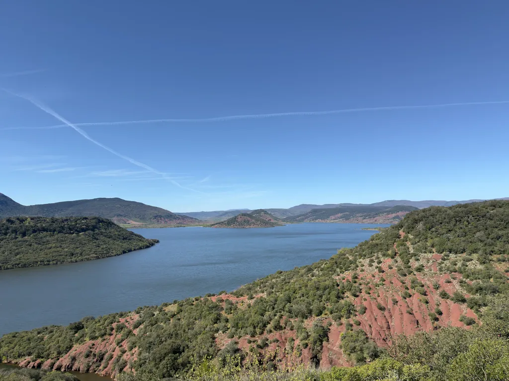

Je ne suis pas parfait. Je n’étais pas retourné dans la descente vers le Salagou depuis deux ans. Entre-temps, elle s’est beaucoup dégradée. Je n’aurais pas dû vous faire descendre là, surtout ceux qui viennent du vélo de route.

Pour le reste, l’itinéraire était gravel selon moi. J’ai roulé le premier jour à [15,4 km/h pour 2450 m de D+](https://www.strava.com/activities/17977323798), le second à [17,7 km/h pour 2100 m de D+](https://www.strava.com/activities/17990290787), des allures bien supérieures à celles que je tiens sur des parcours typés VTT. C’est pour moi la démonstration que la POU100 est un itinéraire gravel et non VTT.

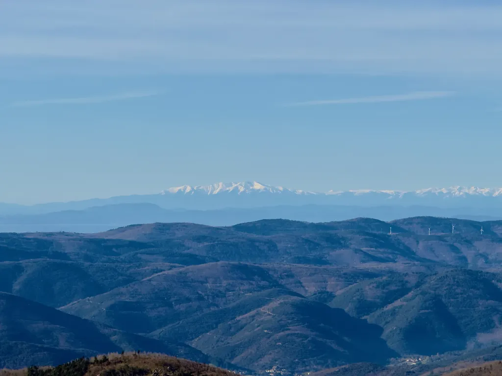

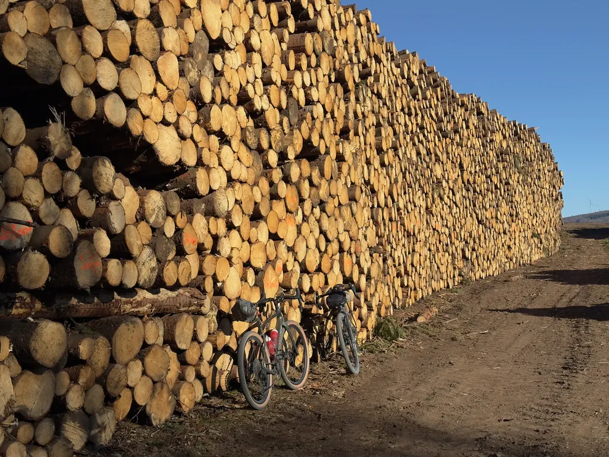

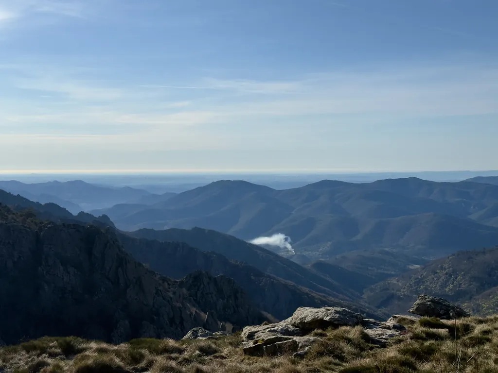

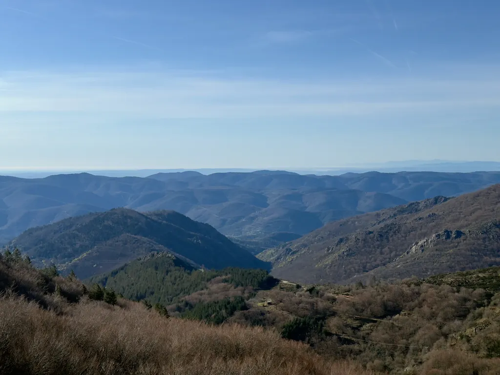

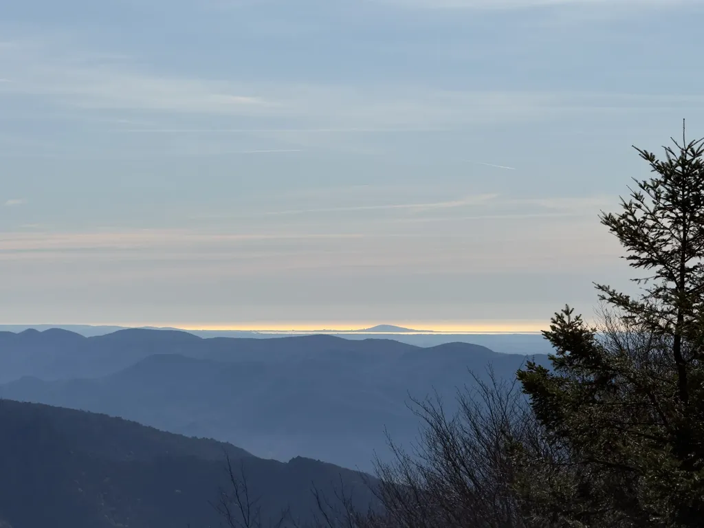

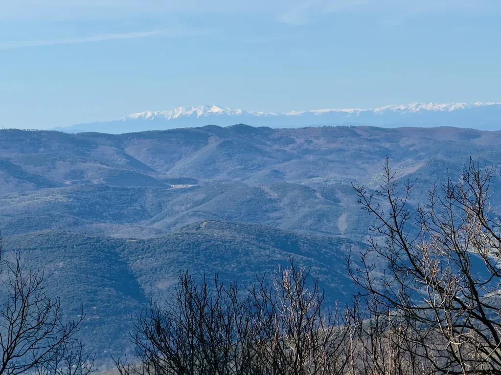

Parfois il n’existe aucune route pour éviter des secteurs rugueux. Je conçois mes traces comme des histoires, avec introduction, climax, accalmie, climax… J’accepte les difficultés pour accéder à de nouvelles scènes que je juge nécessaires. Par exemple, la descente depuis le lac de Vézoles jusqu’à Prémian n’est pas des plus lisses, mais je pense que la plupart d’entre vous auront été heureux de rouler la piste des crêtes de bon matin, tant la lumière était sublime.

D’autre fois, il existe deux possibilités, dont l’une hors asphalte. Par exemple, lors de la remontée de la vallée de La Mare, on franchit la rivière par un vieux pont de chemin de fer, puis suit l’ancienne voie, avec pas mal de ballast. La route, peu fréquentée, est sur l’autre rive en contrebas, mais j’aime l’ambiance de l’ancienne voie, même si le revêtement y est rugueux. Je l’ai donc conservée.

Des participants m’ont maudit. Là se pose la question de ce qu’est un vélo gravel. Avec [mon Diverge et ses pneus de 50 mm](https://tcrouzet.com/2026/03/27/le-meilleur-gravel/), ce n’était pas un billard, mais presque. Je n’ai éprouvé aucune difficulté à cet endroit. Beaucoup trop de constructeurs proposent des gravels UCI, mal adaptés dès qu’on les pousse hors des sentiers battus. Peu après le départ, nous avons doublé dans la première grimpette un participant qui roulait avec des pneus de 35 mm. Franchement, ce n’est pas sérieux. Sur les vraies épreuves gravels, je ne parle pas de celles UCI mais de l’[Unbound](https://www.unboundgravel.com/) par exemple, la plupart des participants roulent avec des pneus de 60 mm.

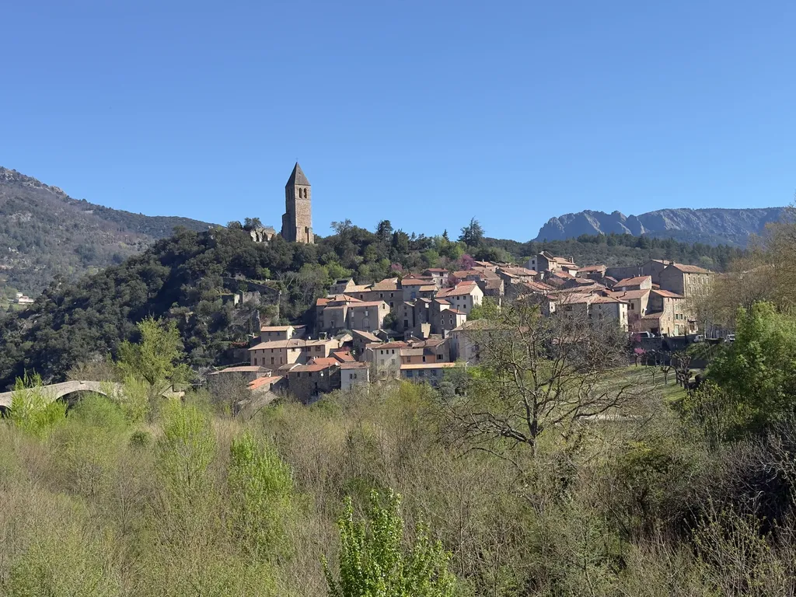

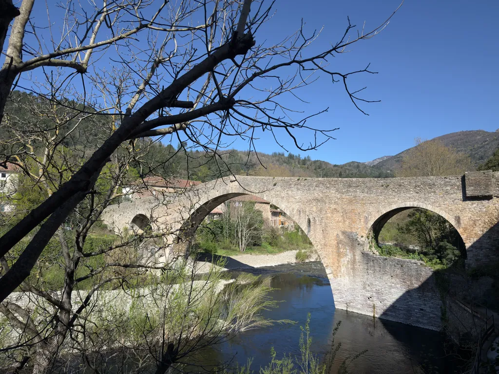

Il me paraîtrait logique que les courses exigent des vélos adaptés à nos territoires, c’est-à-dire dans toutes leurs imperfections et beautés. Au contraire, l’UCI pousse le gravel vers une pratique aseptisée, idéalisée, simplement facile à filmer. Selon moi, quand l’asphalte ou la terre battue assimilée est majoritaire, ce n’est plus du gravel. Je fais du vélo pour fuir les voitures et ne tolère que les petites routes désertes.

Reste que tout au long du POU100 je n’ai cessé de vous voir sourire. Le soleil était au rendez-vous, et vous avec votre bonne humeur. Les copains du club et moi avons essayé de vous faire découvrir des passages et des coins que nous aimons. Nous sommes égoïstes, vous savez. Nous organisons nos évènements parce qu’ils nous donnent des objectifs de sorties tout au long de l’année, puis nous permettent de vous rencontrer.

Nous espérons vous retrouver [en mai sur le 727](https://727bikepacking.fr/727/), ce sera du VTT aventureux, et [fin septembre sur le g727 vers l’Espagne](https://727bikepacking.fr/g727/), qui sera gravel dans le même esprit que la POU100 (ne venez pas avec des pneus de moins de 42 mm, 50 mm sera un must).

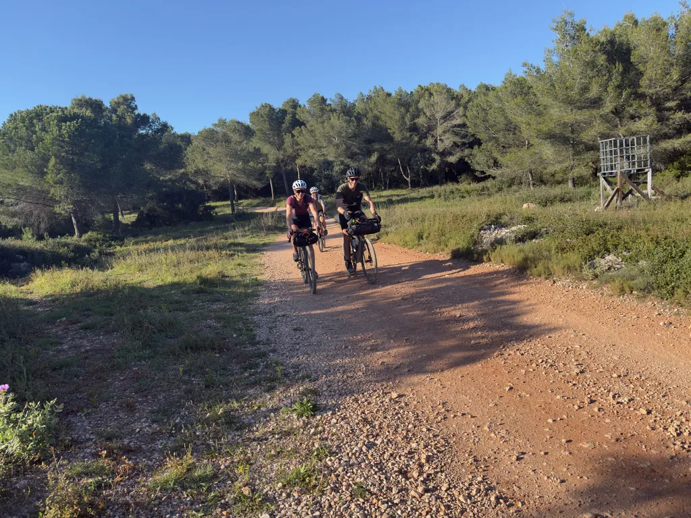

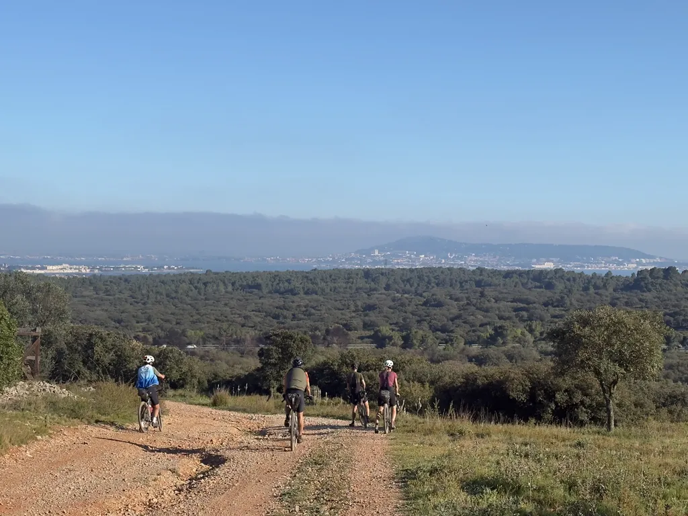

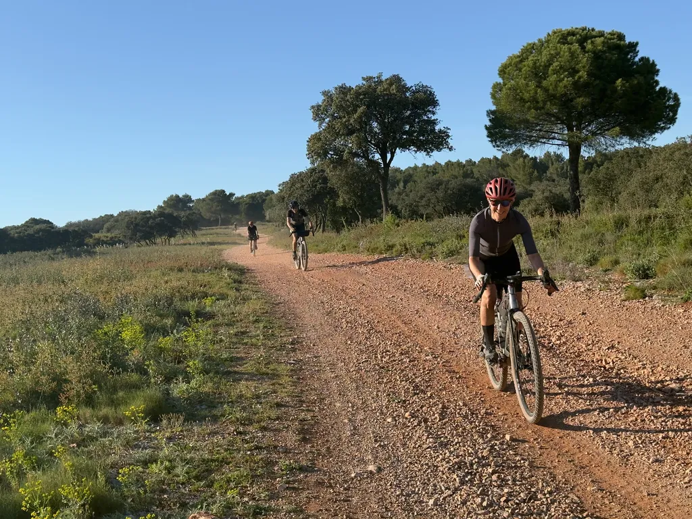

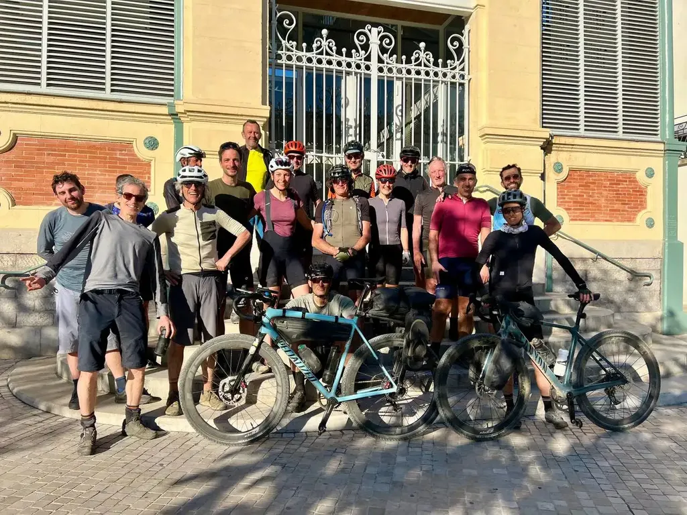

*PS : Nous modifions les conditions générales de nos évènements. Nous n’échangerons plus les billets ni ne permettrons plus les transferts entre participants. C’est moi qui me charge des manips et je n’ai plus cette patience. Je préfère passer du temps sur les chemins que derrière un tableau Excel.*

#velo #gravel #y2026 #2026-04-06-13h00
