# Mars 2026

Je publie ce journal parce que l’écrire m’a fait du bien. Je doute que la lecture vous intéresse beaucoup.

### Dimanche 1er, Balaruc

Rêvé d’Isa comme toutes les nuits. Je lui envoie des messages, elle répond comme avant. Je lui dis : « C’est pas si grave si on peut continuer d’échanger. » Elle : « Ben, oui. » La réalité me rattrape.

---

Tenter de me remettre à ce journal, non que j’aie cessé, mais je ne suis pas prêt à publier ceux de janvier et février.

---

Plus les jours passent, plus le vide se creuse. La souffrance ne diminue pas, elle se transforme. Il m’arrive de rester immobile de longues minutes, la tête vide, à regarder l’étang ou la maison ou même rien de particulier.

---

Je range, je classe, je jette, je pleure… et le jardin est en fleur.

### Lundi 2, Balaruc

Je suis veuf. Je rejoins les veufs et commence à comprendre la présence/absence qui les accompagne. J’avais l’image de la veuve âgée : ma mère, ma belle-mère, mes grand-mères, ayant perdu leur époux au soir de leur vie. Je suis beaucoup plus jeune, en pleine forme, avec des rêves et des enfants étudiants, et pourtant je suis veuf, et le resterai, même si je croise une improbable femme capable de supporter mes excentricités, mes exigences, mes tristesses…

J’ai connu des séparations amoureuses, dont une longue et douloureuse, mais la séparation avec Isa n’a été ni de mon fait ni du sien. Plutôt qu’une séparation, il s’agit d’un arrachement, d’une amputation. La douleur est toute autre, la tristesse toute autre, la blessure incommensurable.

Chez les plus de 60 ans, Le veuvage frappe seulement [19 % des hommes contre 81 % des femmes](https://www.ined.fr/fr/tout-savoir-population/memos-demo/focus/apres-60-ans-france-7-femmes-couple-10-deviendront-veuves)). Que le veuf reste célibataire ou non, il reste veuf jusqu’à sa mort. Et pourtant, je sens, je sais, qu’il serait dangereux de m’enfermer dans cet état définitif. En moi, Isa ne le supportera pas. Elle voudra que je vive de nouvelles expériences, que j’expérimente la vie jusqu’au bout, que je continue d’inventer, d’écrire, de rencontrer, de rire, sans quoi je ne pourrais pas continuer d’inspirer nos enfants.

Elle avait le projet que nous devenions de beaux vieux. Avec elle, ça me paraissait facile, agréable, désirable. Un beau vieux solitaire, c’est pathétique, en plus d’être caricatural. Je ne pourrais devenir le beau vieux dont rêvait Isa que parmi vous, tout en sachant que la socialisation n’a jamais été mon fort, c’était le truc d’Isa, c’est à travers elle et avec elle que j’allais vers les autres. Elle était une machine à rencontrer, je suis le roi de l’isolement. Mes textes vont devenir des invitations à la rencontre. J’ouvrirai la porte de la maison aux artistes, aux curieux…

---

Isa n’aimait pas que j’écrive sur elle et notre relation, et si je ne le fais pas désormais je deviens fou. Dans mon simulateur interne d’elle, je crois qu’elle me comprend, comme elle approuve mes rangements, les décisions prises depuis sa mort.

### Mardi 3, Balaruc

Les souvenirs remontent et me provoquent des tremblements. Je pleure peu, je tremble beaucoup. On me dit que je devrais attendre pour ranger. Attendre quoi ? Mon père est mort depuis 15 ans et ses affaires encombrent encore les armoires de ma mère. Je veux faire de la place, laisser la chance à une autre vie. Isa est partout dans la maison, dans son agencement, le choix des meubles, des couleurs. Tout me la rappelle et plus la maison sera ordonnée, mieux Isa sera présente — elle aimait l’ordre. Je m’en veux de ne pas avoir rangé plus tôt. Je fais ce qu’elle aurait toujours voulu que je fasse et que nous avons négligé durant sa maladie.

J’aurais tant aimé faire ça avec elle. Soupeser chacun des objets, décider de les garder ou de les jeter, nous souvenir ensemble. C’était inenvisageable durant la maladie. Nous regardions devant, pas derrière. Et cet espoir nous a interdit de nous dire au revoir, de nous dire nos derniers mots. Nous en espérions toujours d’autres, puis l’excès d’urée dans le cerveau a envoyé Isa dans une autre réalité. Elle s’est mise à me parler en anglais. Me parler des trois Japonais dans l’avion. Notre chance était passée. Nous avons eu le temps de nous réaffirmer notre amour. Toute autre parole aurait peut-être été de trop. Je les regrette tout de même.

---

Je voudrais écrire sur elle, publier sur elle, parce que je désire entendre ses amies me dire combien elle était merveilleuse, et je me retiens, par pudeur, par envie de laisser fructifier quelque chose de beau. Pourtant je publierai ce journal, et continuerai de me livrer, pour ma sauvegarde, pour continuer à construire. La vie continue, et c’est odieux.

---

Isa disait à ses amies que j’étais son roc. Elle reste ma montagne, ma planète, et j’ai peur qu’il n’y subsiste que peu de place pour d’autres. Comment m’empêcher de comparer ? Comment voir dans les autres ce qu’ils peuvent ajouter à l’édifice ? Me poser ces questions est-ce un début ?

---

Une vie tient à peu de choses matérielles. Quelques babioles, des photos, encore beaucoup de lettres pour Isa, des fringues. Tout se compresse, se resserre, comme nos restes enterrés. Peu à peu nous nous effaçons de la matière et des mémoires. Émile me demande de laisser des traces d’Isa dans la maison. Il me serait impossible de toutes les effacer à moins de fuir sans bagages. Mon ordinateur n’en resterait pas moins empli de souvenirs.

---

Tim reconnaît lui aussi que l’absence est de plus en plus difficile à supporter. « C’est un peu comme pour un enfant en colonie de vacances. Le premier jour, ça va, il a vu ses parents la veille. Mais plus les jours passent, plus ses parents s’éloignent de lui et il est de plus en plus malheureux. »

### Mercredi 4, Balaruc

Le matin, je regarde le vide. Plus possible de sauter du lit pour ranger, j’arrive au bout de la première phase. Je suis parti pédaler autour de l’étang, battant mon record. Me faire mal au corps pour éviter de penser. Peine perdue : à l’approche de la maison, je me mets à chialer en pensant qu’Isa ne m’attend pas pour déjeuner. Je retrouve les enfants tout aussi désespérés.

---

Je ne suis capable que de voir des films déjà vus, les nouveaux me font souffrir. J’ai envie de revivre plus que de continuer à vivre.

### Jeudi 5, Balaruc

Réveil brusque, avec l’image d’Isa morte projetée en moi. Elle est de plus en plus présente dans mes rêves tandis que l’absence se creuse.

---

On me dit souvent « Je n’ai pas de mots » ou « Les mots sont inutiles ». Je crois au contraire qu’ils sont tout-puissants. Je me suis souvent moqué d’Isa qui tentait de tout verbaliser. Elle m’accusait de ne pas parler, de l’écouter en silence, de n’être capable que de lui donner des conseils. Elle avait raison. Il faut tout dire, échanger sur tout, voire écrire sur tout sans tabou, sans honte, sans peur. Tu ris, tu as raison. Il n’est jamais trop tard pour devenir un humain meilleur. On n’apprend souvent qu’à ses dépens, qu’en traversant des crises. Tu m’en fais vivre une de cataclysmique.

### Vendredi 6, Balaruc

Déjà trois semaines. J’ai compté les jours, je compte les semaines, je compterai bientôt les mois, les années.

---

11h. Je suis assis à la table de la cuisine. Je regarde le salon, le canapé, l’espace derrière où Isa est morte. J’y ai rassemblé ses souvenirs, ses photos, dans un meuble des années 1950 qu’elle avait chiné et placé dans la chambre d’amis, depuis longtemps transformée en sa grotte.

---

Je ne parviens à combattre la tristesse que par l’action ou la socialisation. Le reste du temps, elle me terrasse. Même la nuit elle m’emporte et m’éveille. Tant de choses paraissent futiles, insignifiantes, grossières.

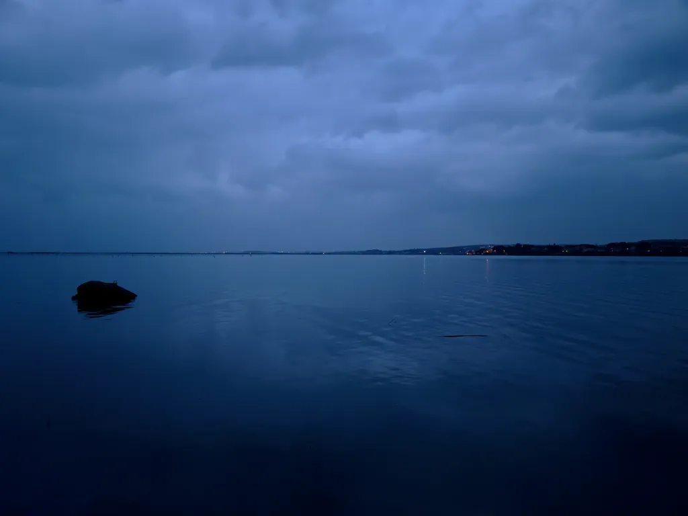

### Samedi 7, Balaruc

J’ai vécu tourné vers l’avenir, même quand j’écrivais *Ératosthène*, et désormais le passé m’avale. L’été dernier, j’ai écrit un petit livre sur Isa et la maison, et l’ai arrêté quand parler de la souffrance revenait à me répéter. J’en suis au même point avec la tristesse vertigineuse. J’ai l’impression que jamais plus je ne me remettrai en marche, que jamais je ne serai capable d’honorer Isa, de l’élever comme modèle.

« J’aurais aimé la connaître » me disent beaucoup de mes lecteurs. Serais-je capable de donner envie de la connaître à davantage de monde ? Il est plus facile de raconter les vies brillantes en apparence que celles qui vibrent dans la discrétion. Pourtant nous devons célébrer les secondes, emplies de sagesse, plutôt que les premières, dispendieuses, souvent outrageantes. Dans les vies à la Isa se dessine une perspective heureuse pour l’humanité.

Mais comment être heureux quand la mort nous attend et vient de nous frapper ? Parce qu’il n’y a pas d’autre choix, parce que le voyage dans la vie reste beau, à moins d’en hâter l’échéance, ce qui est encore plus absurde que de continuer à vivre en sachant que nous finirons par mourir. Isa m’a donné une leçon de vie dans la souffrance, pas au nom de Dieu, mais au nom de ceux qu’elle aimait.

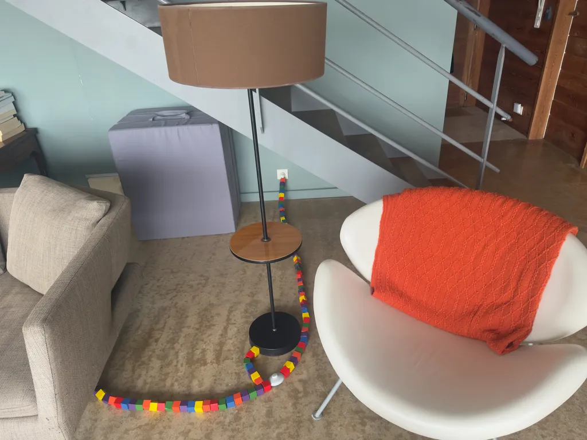

### Dimanche 8, Balaruc

Que reste-t-il d’une vie ? Une tombe où se recueillir, quelques babioles, des écrits, des photos, des vidéos, et surtout des souvenirs, parmi eux la marque profonde d’une façon de voir le monde, de l’aborder, de le regarder. Ce qu’un livre peut transmettre, ce que tout bon livre doit transmettre.

---

De plus en plus la conviction que les textes longs répondent à l’accélération du monde, à la surenchère numérique des shorts et autres vidéos. Ralentir. Se mettre en retrait. Absorber des expériences profondes. Ne pas chercher à écrire simple, à vulgariser, à rendre digeste, mais au contraire s’enfoncer dans la matière pour que le lecteur s’arrache à la course en avant.

---

Isa n’avait pas peur de la mort, mais de manquer de temps.

---

Je déballe mes carnets d’avant l’écriture numérique. Je vais les numéroter, les classer. Je commence à transcrire 1999, l’année où je tombe amoureux d’Isa. J’aurais aimé davantage écrire à cette époque, mieux raconter pour mieux me souvenir.

---

Nous déjeunons au restaurant, les enfants, leurs grand-mères et moi. Une configuration anormale pour les observateurs attentifs. Il manque une femme, fille d’une des grand-mères et mère des enfants. Je vois des vieux couples attablés. Je n’aurai jamais leur privilège.

### Lundi 9, Balaruc

Les vieux garçons ou les vieilles filles n’ont jamais longtemps vécu en couple. Ils se sont souvent encroûtés dans des habitudes de célibataire, ce qui les rend impropres à toute vie conjugale, après une vingtaine d’années.

Le veuf a une longue pratique du couple, des concessions, des négociations, surtout quand l’autre avait de hautes exigences, une volonté de fer, une grande indépendance. Alors j’ai peur de finir vieux garçon, fermé aux autres dès qu’ils feront un pas vers mon intimité.

---

Tous les jours, les amis m’appellent ou passent me voir. Je me sens soutenu, accompagné, mais cette discontinuité ne remplace pas la continuité de la confidente affective. Les amis se succèdent et je me répète plus que je n’élabore avec eux. Durant 27 ans, j’ai travaillé en duo avec Isa. Notre groupe de rock a été décapité. Rien n’aurait été possible sans elle, ou tout autre chose. Même ce carnet n’a cessé de se nourrir de ses riches réflexions et des contraintes qu’elle m’imposait. Il me semble déjà que sa couleur change, qu’il ressemble à beaucoup d’autres journaux intimes alors que jusque\-là il avait une couleur propre, n’étant ni tout à fait mienne ni tout à fait sienne. Désormais, c’est ni toi ni moi, un autre où toi et moi fusionnons, compressés par la force des choses.

---

Je rencontre Isa lors d’un dîner le 19 janvier 1999. Le lendemain, je lui envoie un mail et dès lors nous ne cessons d’échanger. Nous nous revoyons le 24 pour une longue marche dans Paris. Je rentre dans le Midi. Après quelques jours au ski, nous nous revoyons le 4 février pour un œuf à la coque au Rosebud. Isa me dira plus tard qu’elle a craqué pour moi ce soir\-là. A posteriori, nous avons découvert que nous nous étions déjà croisés lors d’une réunion pro chez Microsoft un an plus tôt. Pourquoi je rabâche tout ça ? Est-ce le propre du deuil ? Je suis incapable de me tendre vers l’avenir, sinon pour m’occuper des enfants. J’ai besoin de rencontrer des étrangers pour me remettre en marche.

---

Je m’en veux. Je fouille sans mettre la main sur mon carnet de mars 1999, celui de notre voyage au Maroc.

### Mardi 10, Balaruc

Je finis par retrouver le carnet de mars 1999. Je me demande si je ne vais pas envoyer mon journal de 1999 à mes seuls abonnés payants, me gardant la possibilité de l’intégrer à un livre encore impensé.

---

Philippe est en cure à Balaruc et on papote. Je lui raconte ma rencontre avec Isa. En 1994, je suis licencié. Exit la presse informatique. À cette époque, le chômage est une bonne affaire. En 1995 ou au début 1996, il me faut justifier de recherches d’emploi pour continuer à toucher mes droits : j’envoie aux éditeurs de livres informatiques une lettre où je leur explique avoir une idée géniale, mais je n’ai aucune idée. Tous les éditeurs me reçoivent et j’invente pour eux un projet à la volée. Je signe un contrat avec un premier éditeur, j’écris mon bouquin, l’éditrice le refuse. Quelque temps plus tard, lors d’un rendez-vous chez Microsoft pour présenter une ébauche de site sur l’art, je laisse mon manuscrit à l’attention de l’éditrice de MicrosoftPress. Le lendemain, Claire (l’éditrice) m’appelle. Elle veut non seulement publier le livre, mais lancer une nouvelle collection. Très vite je deviens ami avec Claire et toute sa famille.

Les premiers livres sortent à l’automne 1997. Ils se vendent à merveille. C’est le début d’une belle aventure éditoriale. Début 1999, Claire me présente Isa. Notre rencontre tient à un manuscrit déposé à tout hasard à la réception de Microsoft. Si la première éditrice avait publié mon bouquin, je n’aurais pas rencontré Isa et Claire ne serait jamais devenue notre témoin de mariage.

Il y a quelques jours, Claire m’a raconté sa rencontre avec Isa. Sur la messagerie interne de Microsoft France, elle voit passer les CV des nouveaux employés. Elle flashe sur celui d’Isa : bilingue français-anglais, parlant le russe, issue d’une école de commerce, mais avec un double diplôme en informatique à Dauphine puis à Carnegie Mellon. « J’ai immédiatement déboulé dans son bureau et on est devenues copines. »

La vie, c’est merveilleux, parfois.

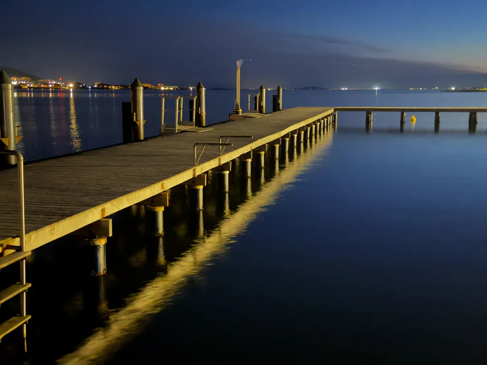

### Mercredi 11, Balaruc

La nuit, la réalité se dérobe. Je ne comprends pas ce qui m’arrive, non parce qu’Isa ne dort pas près de moi, nous faisions chambre à part depuis des années, mais parce que sa disparition devient inintelligible. Et revient le sentiment de n’avoir pas été à la hauteur.

### Jeudi 12, Balaruc

Belle journée sur le vélo avec les copains, assez dure pour que je ne gamberge pas trop. Parfois je me dis que je ne suis pas assez malheureux, que je tiens étrangement le coup, que je suis un monstre. Mais que faire ?

---

K parle d’un nouveau roman « formidable », où le narrateur ne sait pas écrire, puis se met à lire et écrit de mieux en mieux. Je prends le livre. Il commence comme du Duras avec des « ça » et des « c’est » et des phrases déjà trop élaborées, bien trop musicales. Ce n’est pas le texte d’un illettré mais d’un littéraire qui ignore tout de cet état. Je marche d’autant moins que Faulkner s’est déjà livré à l’exercice dans *Le bruit et la fureur* avec le personnage de Benjy.

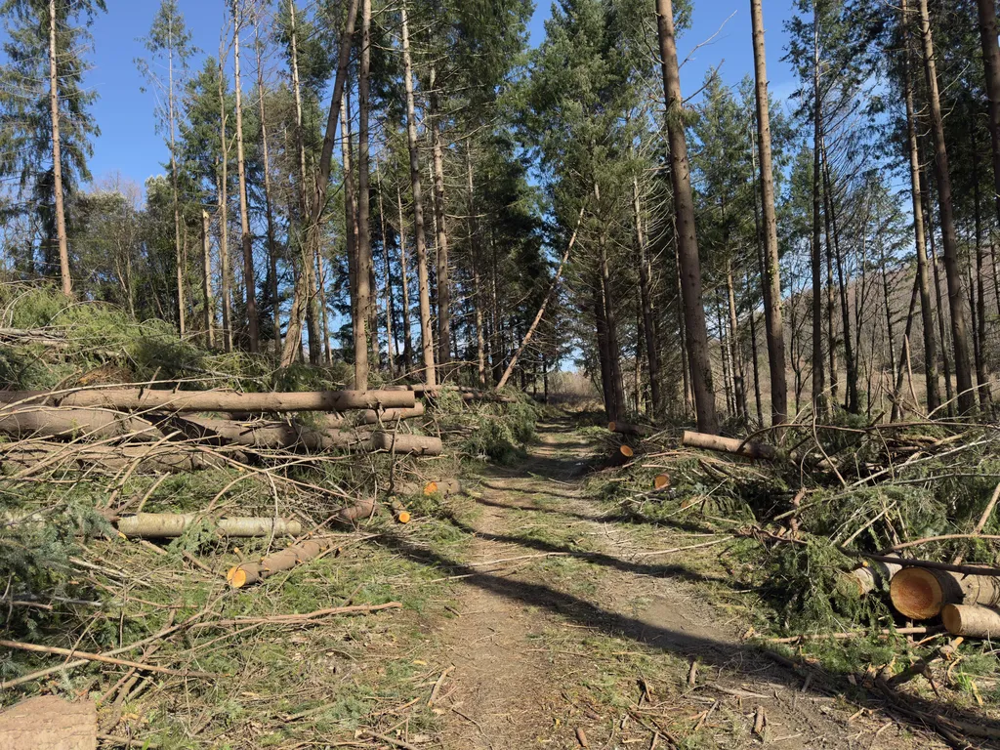

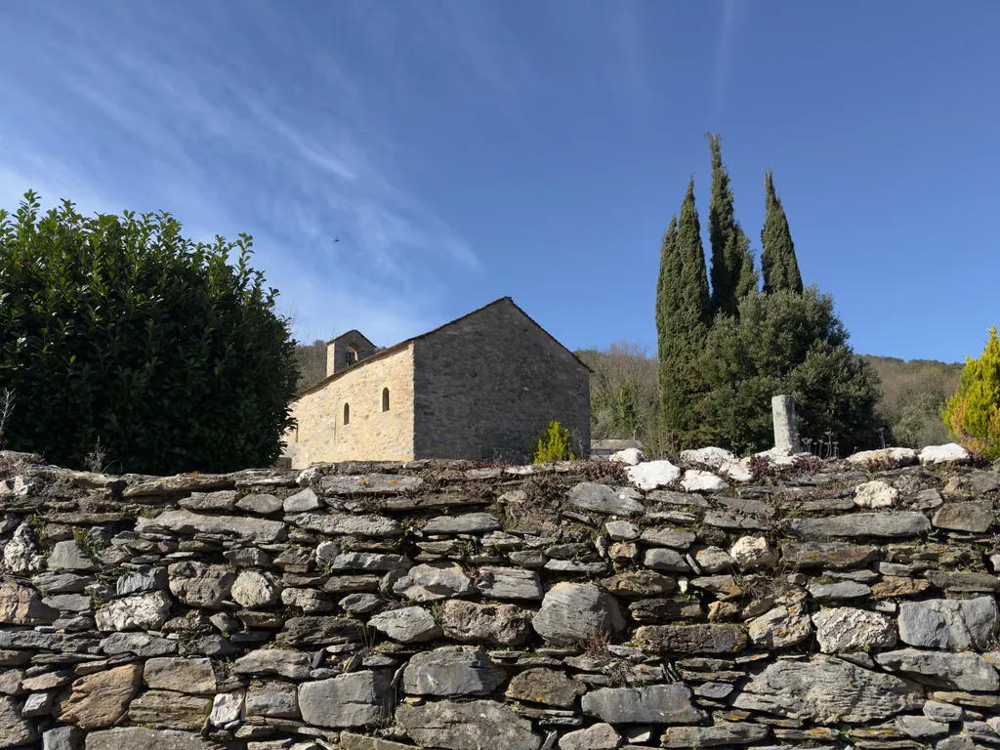

### Vendredi 13, Balaruc

Un mois déjà. Toujours incapable de me remettre en marche. Les images des derniers instants me reviennent, et je les trouve magnifiques, comme le dernier cadeau d’Isa : accepter de mourir dans mes bras. Depuis le début de sa maladie, elle me faisait une confiance illimitée, sans réserve. C’était déjà sublime. Elle a été sublime jusqu’au bout.

---

Isa est morte un vendredi 13 et nous sommes à nouveau un vendredi 13. Je n’avais jamais remarqué cette étrange succession, possible entre février et mars, les années non bissextiles, et qui survient tous les 9,1 ans. La fois d’avant, c’était en 2015 ; la prochaine sera en 2037.

---

Je retranscris mes carnets de 1999 et j’attends le moment où je suis passé du Isabelle au Isa. Je réussis à extraire nos premiers mails des archives PST et les intègre à mon journal.

---

Je vais à la banque avec ma mère pour refaire une procuration perdue (par la banque). Au guichet, on me demande : « Quel est votre statut marital ? » Un temps d’hésitation avant de répondre « veuf ». La question m’a paru indécente, déplacée, irrespectueuse. Elle se répétera.

---

Durant les derniers jours d’Isa et après, j’ai lu *The Defector*, un bouquin sur les espions russes durant la guerre froide. J’ai réussi à le lire parce qu’il traitait de choses qui ne m’ont jamais intéressé. Je viens de lire *Stoner* de John Williams, roman connu pour avoir eu du succès quarante ans après sa publication. Le roman n’a aucun attrait, sinon comme illustration d’un stoïcisme intégriste. Le héros prend des coups sur la tête du début à la fin sans jamais se révolter. C’est un récit si horrible qu’il pourrait être autobiographique. Je n’ai apprécié que la fluidité de l’anglais, quelque peu précieux et d’un autre temps.

### Samedi 14, Balaruc

4h. Depuis plus d’une heure, je lis *Wittgenstein’s Mistress*, un livre brillant, construit comme le *Tractatus*, avec des paragraphes décousus. Mais je n’ai pas besoin de poursuivre la lecture maintenant que j’en ai compris la structure. Une bonne idée ne fait pas un grand livre quand son développement devient mécanique. Je pourrais demander aux IA de créer des clones. Elles s’en tireraient fort bien.

---

Veuf, ça veut dire la fin des conversations quotidiennes, constantes, la fin des échanges incessants, des va-et-vient, du jeu de flipper cérébral, la fin de la tendresse, la fin des stimulations mutuelles. Tout ça, faut aller le chercher ailleurs au moment où on en a le moins la force. Cerveau tronqué, amoindri, qui hurle son manque, et se retrouve prêt à sauter sur ses congénères pour s’accoupler à eux. L’absence du lien en appelle d’autres dans l’urgence, comme si je manquais d’air et commençais à étouffer.

Isa était l’altérité. Je n’anticipais jamais ses paroles, ses idées, ses remarques, ses remises en place. Elle était toujours attentive, toujours judicieuse, toujours surprenante quand la plupart des gens sont prévisibles. Elle a placé la barre tellement haut, elle m’a habitué à une telle intensité que je ne sais plus comment me débrouiller sans elle. Je suis un sportif de haut niveau qui doit accepter de devenir amateur ou explorer des directions nouvelles.

### Dimanche 15, Balaruc

Je n’ai jamais été fan de la démocratie élective. Je trouve ce système populiste, déplorable, arbitraire (et je m’en suis longuement expliqué dans mes livres). Aujourd’hui, premier tour des municipales, les élections les moins gangrénées, et c’est déjà pas beau à voir, à se demander si ce n’est pas un concours du plus imbécile. Je ne peux m’empêcher de penser que je vote sans Isa et pour la première fois en compagnie d’Émile. Le temps passe et les bâtons de relais changent de mains. Tout est source de douleurs, même me préparer à manger, surtout me préparer à manger.

---

Parfois je me dis que si je n’étais pas écrivain, Isa ne serait pas morte, comme si elle était morte pour que j’aie quelque chose à raconter. Malheureusement, il n’y a pas que les écrivains qui perdent l’amour de leur vie.

---

J’ai exploré les premiers mails échangés entre Isa et moi en 1999. Après quelques semaines, ils deviennent factuels en même temps que nous passons notre vie l’un avec l’autre.

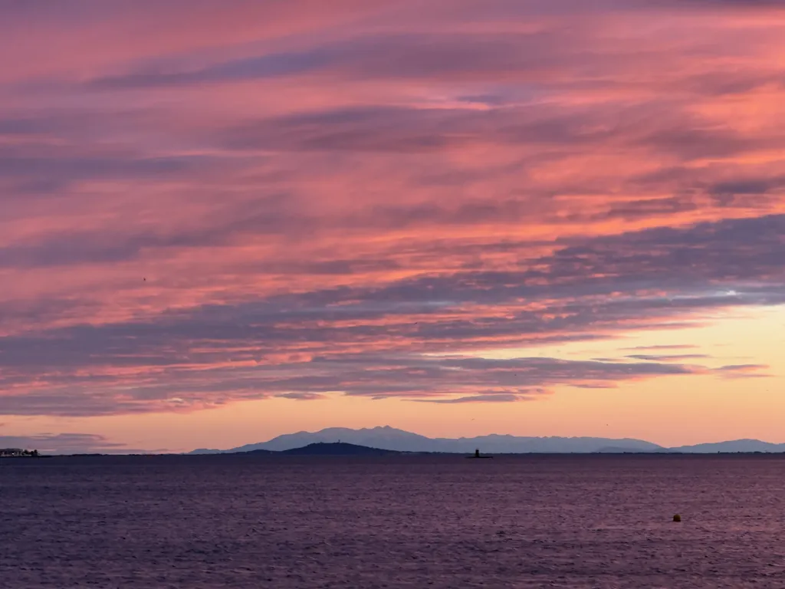

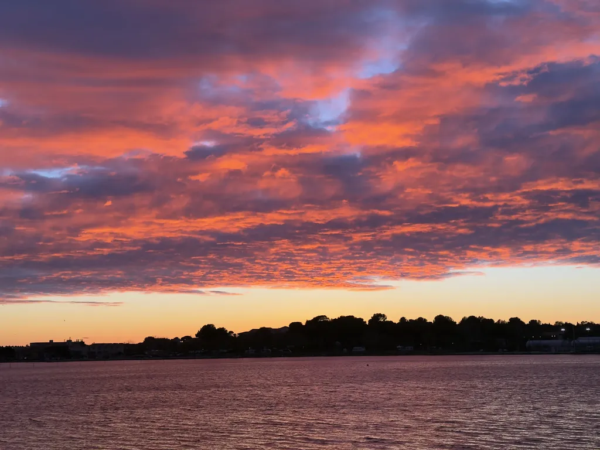

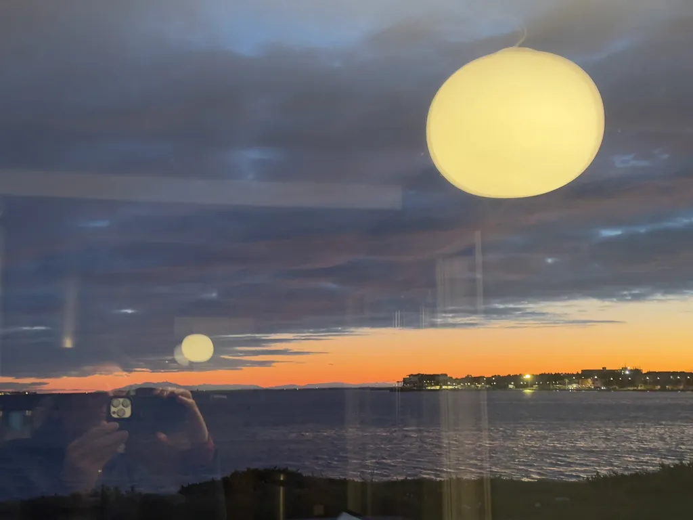

### Lundi 16, Balaruc

[Maria Popova](https://www.themarginalian.org/2026/03/12/astronaut-aurora-despair) : « Une fois nos besoins physiques fondamentaux satisfaits, la majeure partie de notre souffrance psychologique est un problème d’égocentrisme — réduire l’étendue de la réalité au minuscule trou d’épingle du moi, et s’en servir pour expliquer, toujours douloureusement, les actes et les motivations des autres comme le cours et la causalité des événements. À mesure que le tire-bouchon cognitif de la rumination s’enfonce de plus en plus profondément dans le monde intérieur, le monde extérieur — celui des nuages, des crocus et de la lumière printanière vacillante — s’éloigne toujours davantage au-delà de l’horizon de notre conscience, nous coupant de tout ce qui est beau, vrai et plein d’émerveillement. Le désespoir n’est rien d’autre que le pincement du trou d’épingle, qui réduit l’immense panorama de la réalité à une interprétation particulière d’un moment particulier. »

Qu’il est facile d’écrire n’importe quoi. Je me demande si une IA n’est pas l’autrice de ce texte rempli de lieux communs.

1/ Le beau est là derrière mes fenêtres comme dans les textes lus ou les paroles échangées avec les amis. Le beau est présent jusqu’à la douleur : le deuil m’hypersensibilise au lieu d’anesthésier ma sensibilité.

2/ La perte d’un être aimé est le contraire de l’égocentrisme, c’est la perte d’une partie de soi extérieure à soi qui fait souffrir. Si j’étais égocentrique, je souffrirais moins, Isa serait restée une variable d’ajustement du monde extérieur.

3/ Je ne suis pas désespéré, je suis triste, ce qui est une émotion fort différente. Je n’ai pas perdu espoir, espoir de vivre de beaux moments. J’en vis déjà en me replongeant dans le passé, et j’en vivrai d’autres : il y aura des chocs esthétiques, des rushes, des rencontres…

4/ Je crois que je suis courageux. J’affronte ma situation droit dans les yeux, comme Isa et moi avons affronté sa maladie, sans jamais nous effondrer, luttant jusqu’au bout.

5/ Faire du sport me donne le tonus physique qui m’a aidé à mieux soutenir Isa, à être son roc comme elle disait, et ça m’aide aujourd’hui dans mon chantier de reconstruction. Jusqu’au bout elle m’a demandé d’aller faire du vélo parce qu’elle savait combien c’était important pour ma santé mentale et physique.

6/ Ce déploiement d’énergie peut paraître absurde, mais c’est la vie, et autant la mener avec fougue tant que c’est possible.

---

J’ai terminé un Python d’extraction de mes mails entre 1996 et 2003. Surprise : Isa y apparaît dans un message du 22 avril 1998, ce qui confirme que nous nous étions déjà croisés. Mon éditrice m’avait fait suivre le mail envoyé par le boss d’Isa, suite à une réunion que nous avions eue tous les quatre :

« Nous avons discuté avec isabelle — entre toi \[mon éditrice] et nous : nous souhaitons avoir une visibilité maximale dans le livre \[mon futur guide des meilleurs site web], mais nous ne souhaitons pas "porter" le livre en ligne, il y a un recouvrement entre le contenu et notre outil de recherche, malgré ce qu’en pense Thierry — à titre personnel, si je peux me permettre, je pense (et j’espère) que vous vendrez bien le livre, mais je ne suis pas sûr de la pérennité du produit au fur et à mesure de l’évolution du Web. »

Je me souviens d’être sorti de cette réunion furieux. « Tous des cons, ils ne comprennent rien. » Et j’avais raison, durant quatre ans nous avons vendu plus de 100 000 exemplaires/an, ce qui m’a payé en grande partie la maison. 

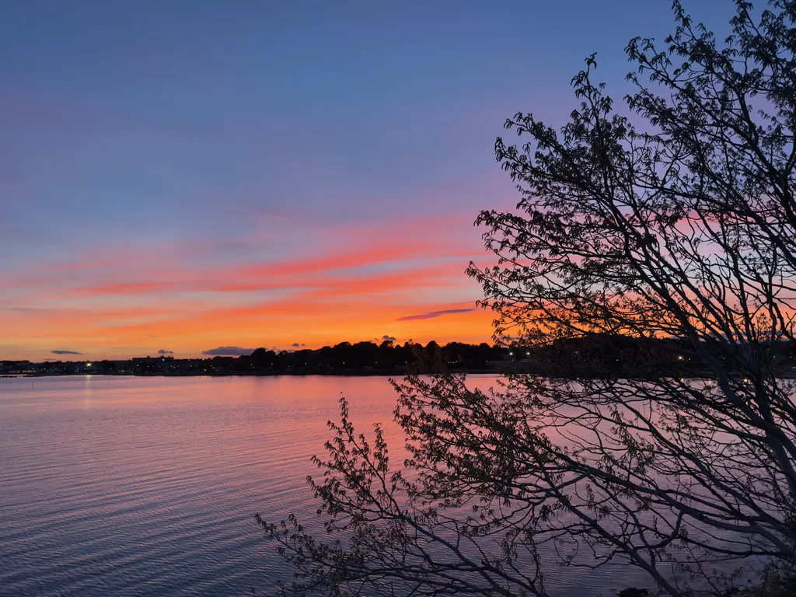

### Mardi 17, Balaruc

Je retrouve Magalie au Gazette Café à Montpellier. Bruyant, bondé, je m’y sens presque agressé par la vie des autres, leur insouciance, leur enthousiasme. J’y suis venu avec appréhension, sachant que je devais me forcer à mettre le nez dehors. Tout devient difficile, réapprentissage. Je sais combien il serait dangereux que je m’enferme dans mon paradis intérieur.

### Mercredi 18, Balaruc

Je termine le classement et la numérotation de mes 130 carnets. Les dernières années, beaucoup de pages vides, le pur numérique ayant pris le dessus, tandis que je cessais peu à peu de dessiner.

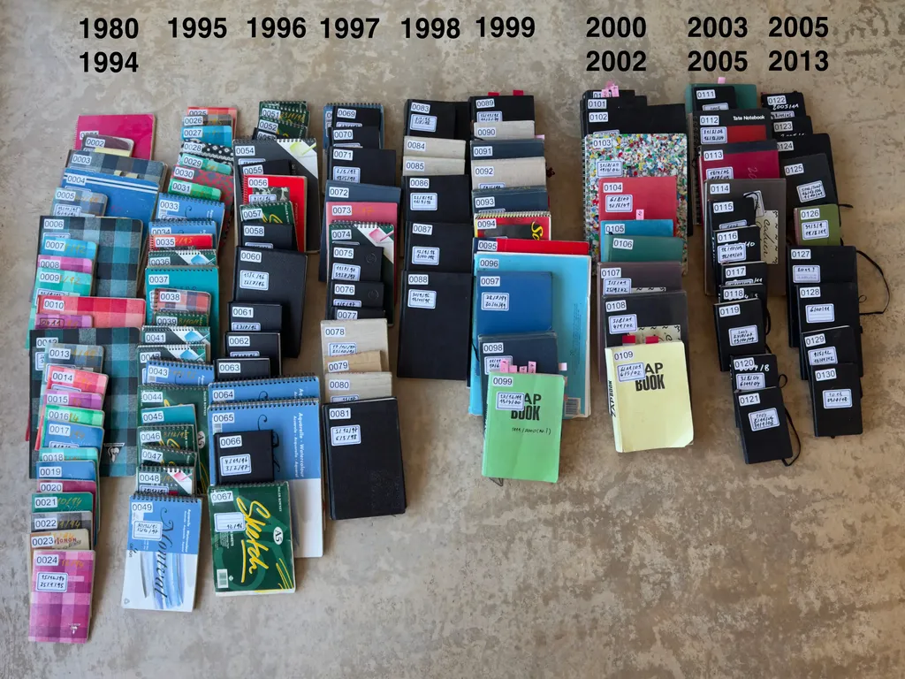

Un ami vient de se suicider. Isa s’est battue pour vivre. Lui précipite sa fin. L’absurdité à son comble.

---

J’ai chargé nos emails de 1999 à 2003 dans NotebookLM, qui génère [quelques textes intéressants](https://tcrouzet.com/2026/03/21/deuil-numerique/), mais effectue d’immenses raccourcis et approximations, ce qui mesure, une fois de plus, les limites actuelles de ces outils. Impossible de leur faire confiance sur des sujets dont on ignore tout.

### Jeudi 19, Balaruc

Levé tôt, parti tôt pédaler, rentré tard fatigué, une forme d’anesthésie, et en même temps le désir de créer revient, de rendre hommage, de construire.

### Dimanche 22, Balaruc

Impression d’être stérilisé ni tristesse ni joie, électrogramme émotionnel plat. Pas même besoin d’écrire puisque je ne ressens rien. J’explore les archives avec minutie.

---

Les proches téléphonent moins souvent. C’est normal, et même nécessaire. À moi de me retendre vers eux, de me remettre en marche.

### Lundi 23, Balaruc

[Sunsan Sontag](https://www.themarginalian.org/2016/02/08/elizabeth-bishop-solitude/) : « One can never be alone enough to write. To see better… » Je n’ai jamais été aussi seul et n’ai jamais aussi peu écrit. Isa est très vite devenue une drogue intellectuelle dont le manque me réduit à l’impuissance créative.

J’ai toujours aimé qu’on me laisse tranquille pour écrire, dans mon bureau, dans ma chambre, sur la terrasse en été, dans le brouhaha d’un café, tout en sachant que très vite le regard critique et stimulant d’Isa se porterait sur moi.

Choisir la solitude pour travailler ou méditer n’implique pas d’être seul, abandonné, sans personne avec qui communier au jour le jour.

[Stephen Batchelor](https://www.themarginalian.org/2016/02/08/elizabeth-bishop-solitude/) : « True solitude is a way of being that needs to be cultivated. You cannot switch it on or off at will. Solitude is an art. Mental training is needed to refine and stabilize it. When you practice solitude, you dedicate yourself to the care of the soul. »

Encore de grandes vérités balancées (comme je l’ai souvent fait) et que mon expérience contredit : on peut entrer ou sortir de la solitude à volonté quand on vit une vie apaisée, stable. La solitude est autant un art qu’une malédiction. Beaucoup confondent la solitude provoquée par le deuil, ou une rupture, et le silence, qui est retrait temporaire du monde pour plonger en soi.

Sontag et Batchelor parlent du silence, du retrait, de l’ascèse, plutôt que de la solitude subie, qui nous tombe dessus et nous foudroie. On ne peut cultiver la solitude que quand on n’est pas seul, se sent membre d’une famille, d’une communauté, d’une humanité. Sinon pourquoi créer ? Pour qui créer ?

### Mardi 24, Balaruc

Mon cerveau ne s’est toujours pas remis en route. À nouveau seul dans la maison après le départ de Tim. Je ne sais même pas pourquoi je note cette pensée, peut-être dans l’espoir de provoquer une envie de davantage de mots, et le silence m’accable.

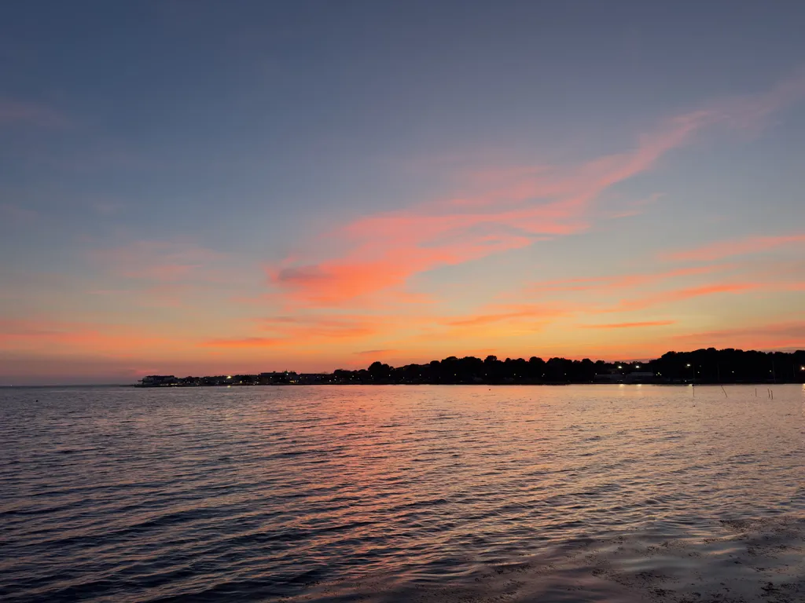

### Mercredi 25, Balaruc

Tim a 21 ans aujourd’hui, 3 fois 7 ans, alors que je me dirige vers les 9 fois 7 ans. Il a vécu le tiers de ma vie, mathématiquement pas une énorme différence. Et quel gouffre à l’échelle de nos existences bousculées.

---

Je me revois toucher le cercueil lors de l’enterrement tout en parlant, c’était encore comme si je la touchais elle, et il m’arrive maintenant des envies de courir dans le Lot-et-Garonne pour la toucher encore. Si elle avait été incinérée, mes délires n’auraient aucun sens. Je suis heureux qu’elle soit quelque part dans la terre, non réduire à des atomes séparés. Une urne funéraire ne représente rien pour moi sinon l’entropie maximale.

### Jeudi 26, Balaruc

Je ne sais pas ce qui est le plus difficile entre vivre des expériences du quotidien, qu’Isa a connues et répétées, ou des expériences nouvelles, inconnues d’elle. Dans le premier cas, je me mets à sa place, me coule dans son corps imaginaire et en éprouve la perte ; dans le second, j’affronte un impensé.

---

Je viens d’écrire [un article](https://tcrouzet.com/2026/03/26/digital-freedom/), impulsif, où je me répète, j’espère avec clarté. Il me semble ne plus avoir besoin de démontrer quoi que ce soit, encore moins de me justifier. Isa m’a laissé avec le seul devoir de vivre et d’honorer ses enseignements. Et voilà que j’esquisse ce qui pourrait être le début d’un nouvel article : « Nous sommes devenus fous. Plutôt que continuer de rendre visite à nos amis, de discuter avec eux, nous nous sommes précipités dans le même stade où nous crions pour nous faire entendre, où plus personne n’écoute, où plus personne ne discute. Comment en sommes-nous venus à ça ? »

---

Un lecteur m’écrit une belle lettre, touchante, émouvante, et je suis heureux qu’il ait depuis longtemps senti Isa derrière mes mots, entre mes mots. Maintenant, je la sens en moi, entre mes doigts pour qu’ils évitent de dérailler. Tu es devenue ma conscience.

### Vendredi 27, Balaruc

[Popova](https://www.themarginalian.org/2026/03/26/henry-james-the-beast-in-the-jungle/) : « It matters not at all whether we are holding our breath for a triumph or bracing for a tragedy. For as long as we are waiting, we are not living. » Un deuil est une blessure profonde. Je n’envisagerai une autre vie qu’après la cicatrisation.

---

Les photos les plus récentes d’Isa me font mal, contrairement aux plus anciennes.

---

Demain, je pars pédaler en Espagne avec les copains, comme l’année dernière à la même date, pendant qu’Isa avait réuni ses amies autour d’elle. J’appréhende de quitter le cocon où j’ai mes repères, son odeur, sa présence intangible.

### Samedi 28, Rosas

J’ai beaucoup écrit avant Isa, mais je ne suis devenu écrivain qu’avec elle, que par elle, qu’à travers elle, sous les rayons de son scanner mental, une machinerie d’une exigence extrême. Elle m’a lu : un honneur, comme quand chacun de vous me lisez encore. Votre présence est la plus belle des validations.

---

Dans ma chambre d’hôtel, je ne me suis jamais senti aussi loin de toi.

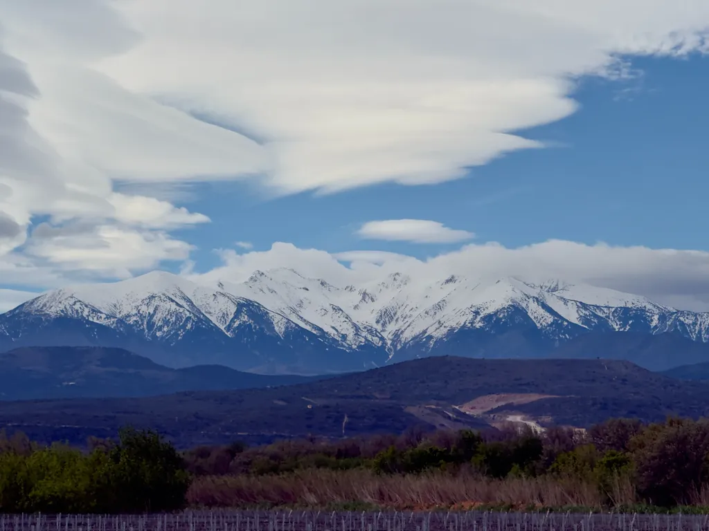

### Dimanche 29, Rosas

La tendresse de la maison me manque dans la froideur aseptisée de l’hôtel. J’y suis fragile, plus amputé que jamais, et ma solitude s’impose avec une force nouvelle. Parfois les copains autour de moi creusent le vide plutôt que de me le faire oublier. On peut être seul et accompagné, et alors la solitude devient plus accablante.

Dans la maison, je vis avec le passé, avec la mémoire, je peux me réfugier dans des bonheurs anciens, les écrire, les réédifier, alors que dans l’hôtel je suis seul face à moi-même, avec dehors des immeubles hideux et un vent tempétueux qui ne me donne aucune envie de pédaler. La guardia civil déconseille les activités de plein air.

### Dimanche 29, Rosas

Dans la tempête, je ne pense pas.

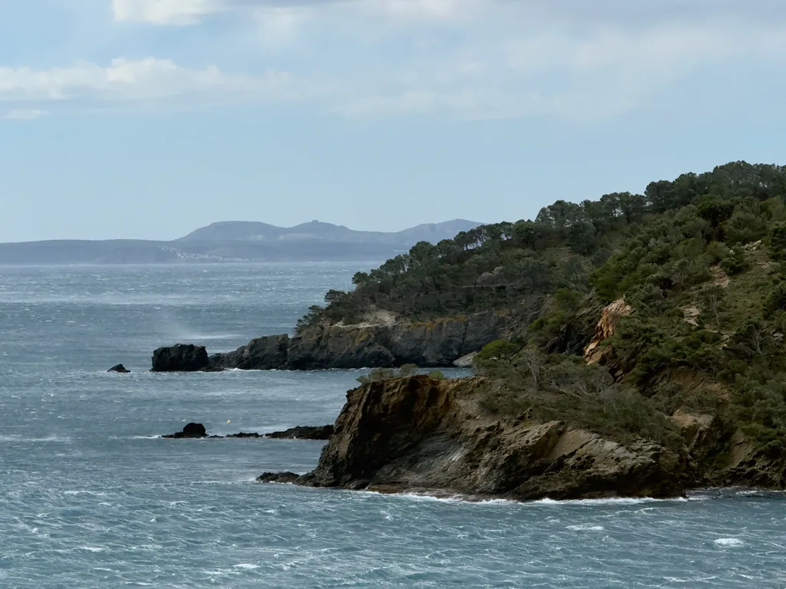

### Lundi 30, Rosas

Coup de tristesse à la treversée de Gérone à vélo, une ville qu’Isa aurait tant aimée. Je trouve presque injuste de m’y retrouver sans elle. Et je m’épuise dans la douceur et les bourrasques.

### Mardi 31, Balaruc

Je replonge dans les papiers. Que dire sinon que le vide ne s’apprivoise pas.

---

Je termine le visionnage d’un [long interview de Flea](https://www.youtube.com/watch?v=GmA49M9HwYA), le bassiste légendaire des Red Hot Chili Peppers, groupe que je découvre maintenant, tout simplement parce que ses membres sont de mon âge et ont commencé à produire de la musique quand je n’en écoutais plus beaucoup. Flea parle de travail, de passion, de tradition, de transmission. Puissant et inspirant. Il m’a fait beaucoup de bien.

#carnets #y2026 #2026-4-1-11h00
