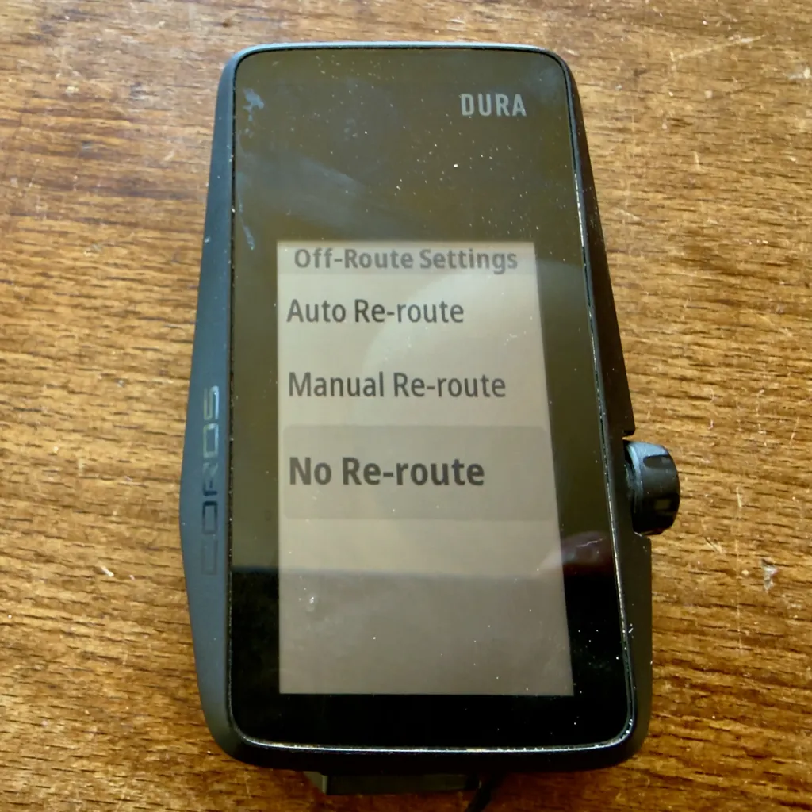
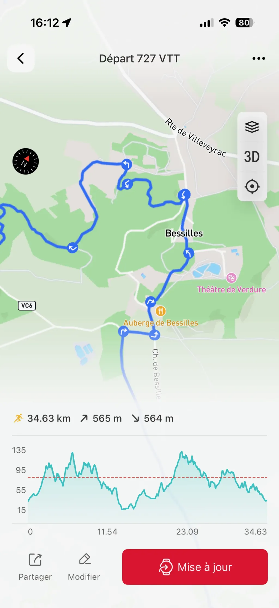
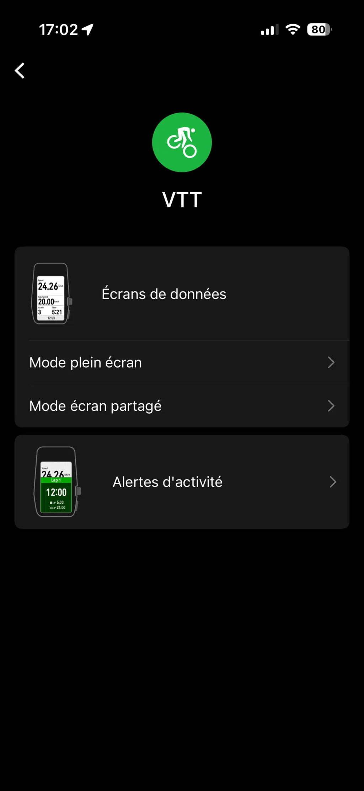
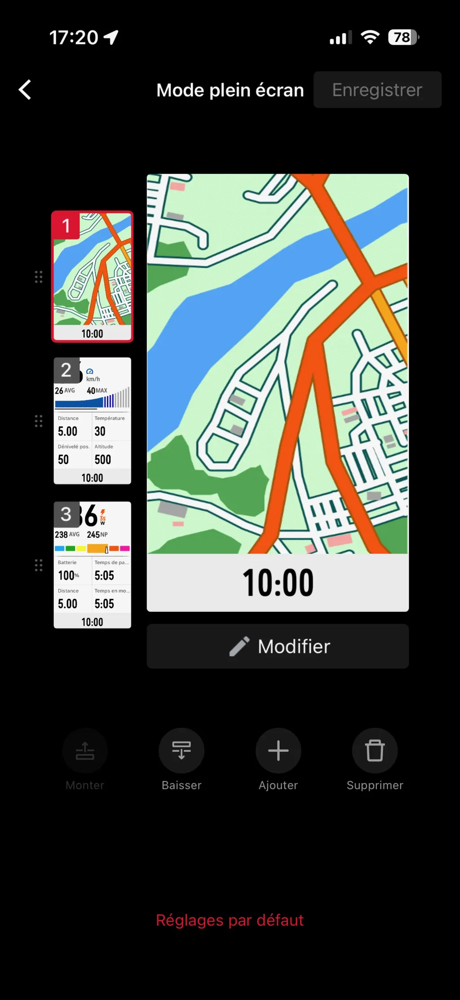
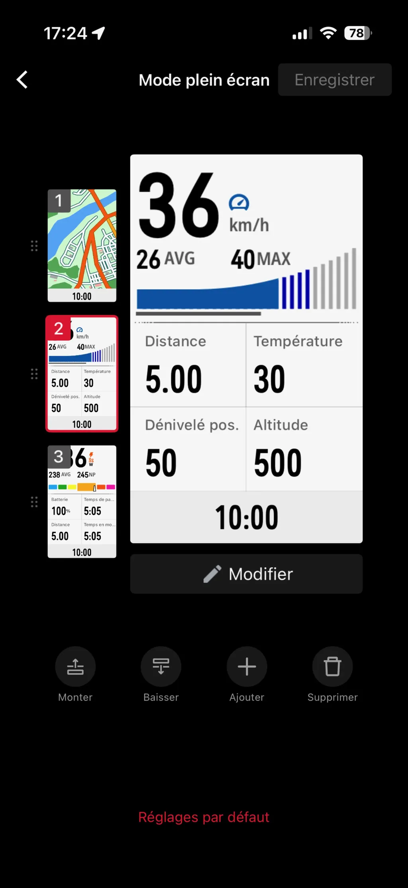
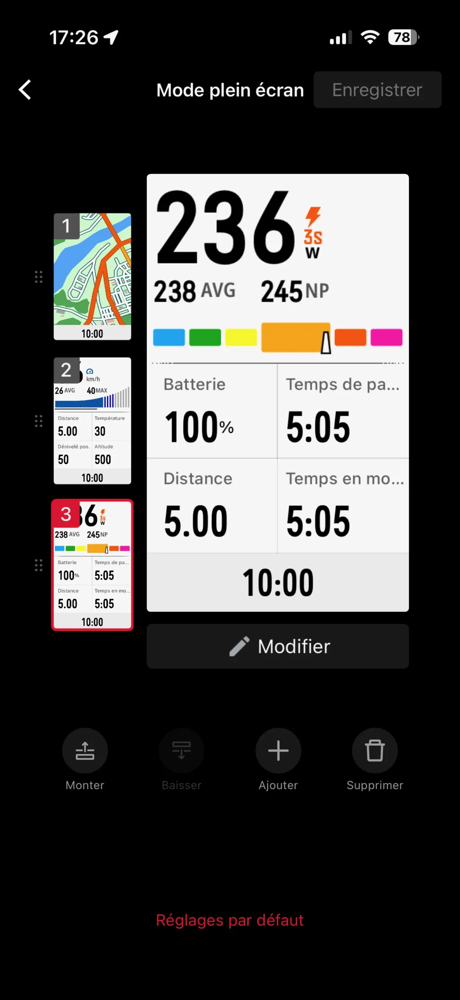

# Adieu Garmin, le Dura a tout changé pour le bikepacking

On ne cesse de me demander ce que je pense du [Dura](https://fr.coros.com/dura) (sorti en avril 2024), s’il plante toujours, si je suis revenu à un Garmin, si je suis satisfait.

Mon premier article d’avril 2025 était très négatif. J’y affirmais que [le Dura était quasi inutilisable](https://tcrouzet.com/2025/04/24/coros-dura-bugs/), à cause d’une série de bugs, d’une interface incomplète et d’une cartographie affligeante. En août, [je relevais la correction de quelques bugs et l’ajout de la possibilité de désactiver le reroutage, tout en reconnaissant que le Dura était le GPS idéal pour le bikepacking](https://tcrouzet.com/2025/08/01/bikepacking-auvergne-bretagne-dura/), grâce à son incroyable autonomie. Quelque mois et [mises à jours plus tard](https://support.coros.com/hc/fr/articles/32924317141652-Notes-de-version-COROS-DURA), je suis presque élogieux.

Je peux désormais partir en bikepacking sans powerbank. Pour moi, le bikepacking, c’est suivre durant plusieurs jours une trace qui, le plus souvent, nous emmène loin de l’asphalte. Le GPS affiche la trace sur un fond de carte et nous positionne. On ne lui demande rien d’autre.

Si nous voulons sortir de la trace, nous improvisons ou utilisons les cartes embarquées sur nos téléphones, bien plus précises et détaillées. Inutile de dupliquer ces fonctions sur le GPS : nous disposons déjà d’ordinateurs surpuissants dans nos poches. 

L’été dernier, après dix jours de bikepacking en Bretagne, mon Dura n’avait consommé que 50 % de sa batterie, quand les copains avec leurs Garmin, même trois fois plus chers, rechargeaient à minimum tous les deux jours, avec le stress de tomber en panne sèche. Rouler avec un Dura, c’est un souci de moins. Tu le montes sur ton vélo et ne t’en préoccupes plus durant des semaines. Je ne le charge plus qu’avant les départs en voyage. Il tient jusqu’au suivant, même en hiver. Garmin commet l’erreur de vouloir mettre toujours plus de puissance dans ses GPS. C’est absurde.

Quand nous suivons des traces hors asphalte, les copains avec les Garmin tournent souvent trop tôt ou me disent que je ne suis plus sur la trace alors mon Dura annonce le contraire. Les Garmin sont fébriles dès que nous quittons les secteurs dûment cartographiés. Ils ont tendance à rerouter automatiquement — faut bien qu’ils utilisent leur puissance —, et il est souvent très difficile d’arrêter ce reroutage. En gros, les Garmin ne font pas confiance à la trace, alors que les Dura ferment leur gueule et se contentent de l’afficher. Nous ne leur demandons rien de plus en bikepacking.

Venant d’un Garmin avec fond de carte IGN, la cartographie du Dura m’est initialement apparue des plus spartiates. Les dernières mises à jour séparent enfin les chemins des petites routes, ce qui était plus que nécessaire et attendu. La carte reste néanmoins le point faible du Dura, tout comme la réactivité. Quand on tourne, l’écran met deux ou trois secondes à réagir, ce qui est gênant quand la trace effectue des tours et détours dans des singles ou des rues avec beaucoup d’embranchements. J’ai appris à anticiper, mais je me trompe plus souvent qu’avec un Garmin.

Cette imprécision cartographique et cette lenteur sont le prix à payer pour une énorme autonomie, et c’est un prix que j’accepte avec joie. Pour aller plus vite, le Dura devrait embarquer un processeur plus puissant, donc consommer beaucoup plus (le Dura 2 résoudra peut-être ce problème).

L’app Coros sur téléphone a elle aussi fait d’énormes progrès, avec la possibilité d’afficher la trace sur fond satellite ou OSM. Nous utilisons souvent cette fonction lors de nos reconnaissances, même si elle ne fonctionne pas hors ligne (voilà pourquoi je reste fidèle à [MapOut](https://mapout.app/)).

Je recommande donc à tous les bikepackers de troquer leur Garmin pour un Dura. Quand un Garmin fait-il sens ? Je ne sais pas trop, peut-être pour suivre certains programmes d’entraînement. Je n’en suis même pas sûr : on peut connecter le Dura à des capteurs Ant+. Pour les bikepacker et les dilettantes de mon espèce — 11 000 km/an —, le Dura est désormais un no brainer.

Est-il parfait pour autant ? Loin de là. Voici ce qui lui manque encore.

* Carte personnalisable comme sur les Garmin. Coros devrait fournir aux geeks un générateur de cartes.
* Préréglage du zoom. Au départ d’une trace, je dois systématiquement zoomer au maximum, car le 200 m par défaut ne sert à rien.
* Le zoom à 50 m est insuffisant pour le VTT. Un zoom à 30 m comme sur les Garmin serait appréciable.
* Gros bug quand on prend une trace à l’envers ou fait demi-tour (la trace s’efface parfois).
* Réelle personnalisation des écrans, où s’affichent encore des informations non sollicitées comme la distance du prochain point d’intérêt ou le profil des montées (ce que j’apprécie plutôt, mais je ne l’ai pas choisi).
* Impossible d’afficher la distance restante jusqu’à la fin de la trace (seulement jusqu’au prochain POI, affiché automatiquement en bas d’écran).
* Impossible d’afficher la liste des prochains POI.
* Les profils des montées s’arrêtent souvent loin des sommets ou au moindre faux plat descendant.
* L’échelle des couleurs sur les profils n’est pas toujours la même. Standardiser serait bienvenue. Par exemple, rouge après 15 %, noir après 20 %. C’est un peu aléatoire pour le moment.
* Calculer correctement le pourcentage d’une montée. Le Dura se contente de diviser le dénivelé entre le début et la fin par la distance (et non le dénivelé total).
* Possibilité d’inverser le sens d’une trace avant de la lancer.
* Que le no-reroute ne soit pas associé à chaque trace, mais global.
* Que tous les réglages soient accessibles depuis l’app sur le téléphone, ce qui n’est pas le cas. Par exemple, les bips intempestifs se coupent uniquement sur le GPS.
* Mieux gérer les GPX très longs (Garmin ne sait pas faire non plus). J’évite les traces de plus de 250 km. Je ne sais pas à partir de combien de points le Dura commence à perdre les pédales (8 000 pour un Garmin). Il suffirait d’effectuer une découpage automatique sur l’app.
* Gestion des GPX avec traces multiples.
* Calibration de l’altimètre avant le départ. J’habite au bord de la mer et il m’arrive de partir à 200 m d’altitude ou à -100 m.
* Je ne vous ai pas parlé du reroutage sur le Dura, ça n’a aucune utilité. Je préfère recréer des traces à la volée sur mon téléphone et les renvoyer au GPS (possible sur le Dura sans arrêter l’enregistrement en cours, contrairement au Garmin).

### Ma config

Je n’utilise que le profil d’activité VTT (les écrans disponibles et les affichages non sollicités diffèrent selon les profils). Je n’utilise jamais le mode écran partagé. J’ai conservé trois écrans.

Par défaut, en bikepacking, je suis sur la carte, avec en bas la distance du prochain POI (ce qui s’avère très pratique en longue distance, notamment pour les points d’eau). En montée, le profil s’affiche sur le tiers inférieur de l’écran, ce qui permet de suivre la trace (bien plus sioux que le climb pro des Garmin). Mon but : que la carte occupe la surface maximale. Toute autre information est une distraction.

Le deuxième écran affiche les paramètres essentiels (vitesse, distance, température, dénivelé, heure…). Je n’utilise quasiment jamais le troisième, car je ne branche rarement mon capteur cardiaque.

Sur le GPS, je coupe les sons et désactive le reroutage avant de lancer une trace. C’est d’une simplicité biblique comparé à un Garmin. Je vous encourage à essayer.

#velo #gps #y2026 #2026-04-24-20h00
