# Avril 2026

### Mercredi 1er, Balaruc

S me suggère de lire *L’idée ridicule de ne plus jamais te revoir* de Rosa Montero, une grande dame avec qui j’ai passé deux jours à papoter en 2020. Elle écrit dès le début : « le journaliste Iñaki Gabilondo m’a dit dans une interview que le décès de sa première femme, morte très jeune des suites d’un cancer, avait été très dur, certes, mais également ce qu’il avait vécu de plus transcendant. »

Il s’est passé quelque chose de vertigineux quand Isa nous a quittés, comme si elle passait en nous. Sa maladie a été une expérience d’une puissance extrême, la plus puissante déflagration de ma vie. Continuer de lire Rosa ? Pas encore. J’ai peur qu’elle m’influence, ferme des portes. Pas envie de risquer des colorations étrangères avant de me lancer dans un projet dont je sens la nécessité sinon encore la force. Me contente du lui envoyer un message pour lui dire que je pense à elle.

### Jeudi 2, Balaruc

L’absence se glisse partout, me submerge, me prive d’énergie. On me parle des vagues du deuil et je descends toujours plus bas dans un creux monumental. Demain sept semaines, et c’était hier, Isa déjà si loin.

### Vendredi 3, Balaruc

L’écriture IA devient un business, alors se réfugier dans l’écriture humaine, en faire un jardin secret, tendre, chaleureux, loin de toute machinerie, de toute mécanique. Toujours je retombe sur le collage du carnet, au gré de la vie, plutôt qu’à dessein pour manipuler les émotions.

En littérature, l’IA provoque la même secousse que la photographie pour les arts visuels. Elle nous pousse à réinventer, à repenser. Pas vers plus d’abstractions — le XXe a donné —, mais pour plus d’intimité, de confidences et moins de classicisme, moins de formes codifiées.

Les manuels d’écriture sont bons à jeter. Comme ils ont été digérés par les machines, elles deviennent capables de les suivre à la lettre. Nous restent les terrains vierges, non balisés, l’exploration des contrées sauvages.

Très vite des peintres ont peint d’après photographies. Nous écrirons peut-être d’après des textes générés par IA. Pourquoi pas jouer à ce jeu, faire générer un texte, puis le réinventer. Seule différence : un paysage ou un visage photographiés restent agréables, donnent envie de les pénétrer. Rien de comparable encore pour les textes IA, rideau de fumée statistique devant la réalité.

### Samedi 4, Balaruc

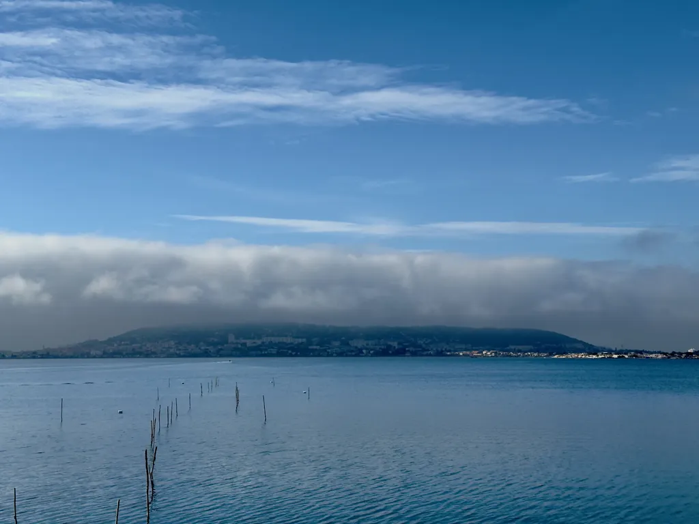

### Lundi 6, Balaruc

Lessivé après un intense week-end vélo, habité par un fond de tristesse malgré la joie des amis, et un peu à cause de leur joie.

Je regarde la vie sans réussir à m’y oublier, sinon quand pédaler fait mal. Là, des flashes d’Isa me traversent encore, toujours plus douloureux. Ils me prennent dans les virages, dans les descentes, quand la vue m’éblouit.

J’ai du mal à décrire mon état, sinon comme un vide, état qui n’appelle aucune attente, pas le moindre espoir de rémission. Je ne peux qu’apprendre à vivre avec l’absence.

Même les mots me deviennent difficiles. Le mois dernier, j’ai beaucoup écrit dans ce carnet, je n’y arrive plus, ou mal. J’ai peur d’être incapable de célébrer Isa.

Dès que je tombe de vélo, je me fêle une côte, ma cage thoracique transformée en puzzle depuis longtemps. Après la douleur des premiers jours, je traverse une phase d’accalmie, avant un réveil de la douleur au bout de trois semaines quand la cicatrisation s’achève, une douleur moins intense mais continue. J’en suis là. Après le choc, une vague anesthésie a suivi, et désormais j’éprouve un mal lancinant, sans être sûr que la cicatrisation soit à l’œuvre.

J’attends que la vie me vienne, plus que je ne vais à elle. J’attends les sauveurs et les sauveuses. J’attends le projet, des propositions…

Je fais le contraire de ce que je répète à mes fils : « Allez à la vie, elle ne viendra pas à vous. » Tout ce que je peux encore faire, c’est gribouiller. Je continue ce que j’ai toujours fait, plus par automatisme que nécessité.

À moins que ce soit le contraire, que l’écriture me devienne nécessaire seulement maintenant. Toutes mes années de travail auraient préparé ce moment où j’écris pour me sauver.

Isa n’aimait pas que je dise une chose et son contraire, elle me poussait à écrire la résolution de mes pensées plus que leurs méandres, et il ne subsiste que des hésitations.

Il n’existe pas de solutions, seulement des évolutions possibles. Je suis un arbre qui a perdu une branche maîtresse et qui continue de pousser. Il accueille des oiseaux dans ses frondaisons agitées par la brise. Un passant ignorant sa splendeur passée pourrait s’asseoir à son pied et s’y trouver apaisé par une chaude journée d’été.

Isa était une machine à métaphores et à fables. Elle les utilisait sans cesse pour faire comprendre son ressenti ou ses idées. Sa créativité explicative était extraordinaire. Elle n’a écrit qu’un livre par pudeur.

---

Fringale dans l’après-midi. Je fouille le placard de la cuisine et tombe sur un pot de compote de pomme que j’achetais souvent à Isa. Je me noue, me serre, me durcis. Sensation que jamais je ne sortirai de ce tunnel. Je ne veux rien oublier et moins souffrir. Je veux me projeter dans le futur et le temps ralentit jour après jour. Je mange un peu de compote : c’est comme si Isa la mangeait. Je l’apprécie comme elle l’aurait appréciée.

---

Je devrais vendre aux enchères mes carnets une fois retranscrits, surtout ceux remplis d’aquarelles. Une façon de les préserver. Qui pour les acheter ?

---

Le beau-fils des voisins de ma mère, dix ans plus jeune que moi, dont la femme est décédée d’un cancer a une nouvelle amie. Ma mère trouve ça scandaleux. « Seulement deux ans après ! » Comme s’il manquait de respect à la morte. Devait-il se mettre en stase ? Existe-t-il une durée légale pour le deuil ? J’aimerais disposer du manuel opératoire. Je suis sûr que cet homme aime toujours sa femme. Sa nouvelle amie n’y change rien. Si elle lui rend la vie plus supportable, je la félicite.

C’est une grande force de réussir à reconstruire. La douleur est si vive que parfois j’ai envie d’expérimenter des trucs. Je n’ai jamais été aussi près de suspendre tout jugement. Nous sommes des bricoleurs maladroits. J’ignore de quoi je serai capable et me fiche du regard des autres. Isa m’approuvera. En moi, elle veut vivre.

---

Je comprends ce que j’ai perdu une fois que je l’ai perdu. C’est le drame de ma vie. De nos vies ?

---

Je suis assis dans la cuisine, une seule lampe allumée, la nuit tout autour, je n’ose monter me coucher. Des frissons me traversent. Le frigidaire murmure. La maison craque. Les astronautes contournent la lune.

### Mardi 7, Balaruc

Je repense à ce veuf. Sa belle-mère voit surgir la remplaçante de sa fille unique. Pour elle, ce doit être terrible. C’est ça que voulait dire ma mère. Elle s’est mise à la place de celle qui a perdu un enfant et qui peut croire que le gendre survivant piétine le passé. Au prétexte que la belle-mère est plus proche de la fin de sa vie, et que nouer de nouvelles relations lui est désormais difficile, devrait-elle imposer le célibat à son gendre ? Ce serait une exigence odieuse. Les veufs, les veuves, les blessés de la vie ont le droit de se soutenir. Nous ne sommes pas faits pour vivre seuls.

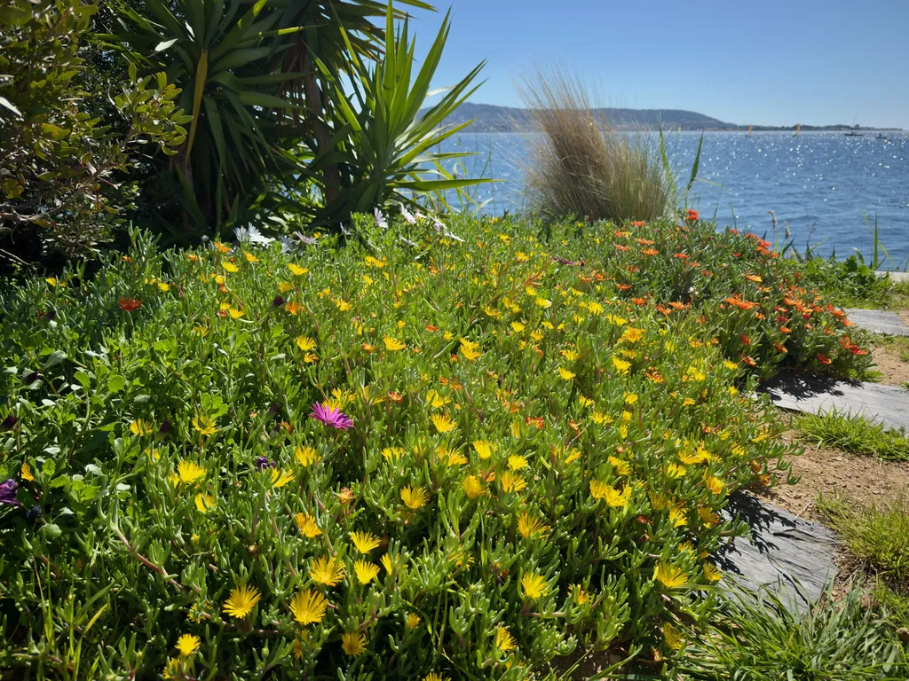

### Mercredi 8, Balaruc

Dans l’arrière-cuisine, mes yeux se posent sur les bouteilles qu’utilisait Isa pour les thés glacés. Je tremble, mes yeux se mouillent. Je me précipite au clavier pour écrire ces mots et mettre à distance la douleur. Quand je reste avec elle, en un mano à mano fiévreux, elle explose en un feu d’artifice absurde. Plus rien n’a de sens. Puis j’oublie la mort d’Isa, ou du moins sa mort n’occupe plus le devant de la scène, et je donne le change.

---

Je bouture des [Malephora lutea](https://www.jardin-sec.com/jardin-sec_web/fr/FICHETECHNIQUE.awp?P1=Malephora%20lutea&P2=FR) (jaune d’or) et des [Malephora crocea](https://jardin-sec.com/jardin-sec_web/fr/FICHETECHNIQUE.awp?P1=Malephora%20crocea%20var.%20purpureocrocea&P2=FR) (presque rouges) dans des pots de terre cuite qu’Isa empilait depuis des années. Ma tristesse est à la hauteur de ma satisfaction, un peu comme si je vivais pour elle. Il en sera toujours ainsi, pour elle et pour moi, pour les enfants, pour nous tous. Je me demande ce qui fait que la douleur s’atténue : peut-être l’habitude par mithridatisation.

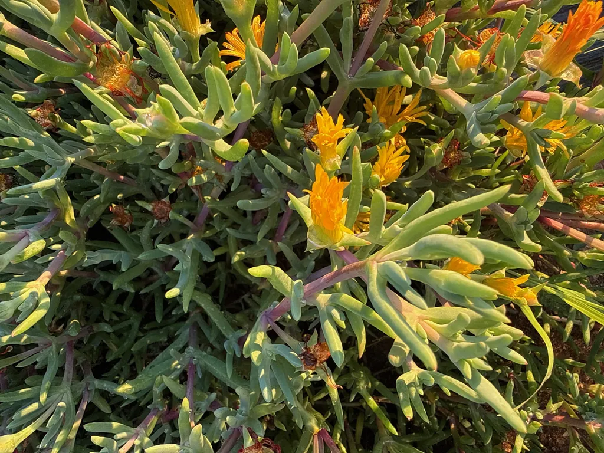

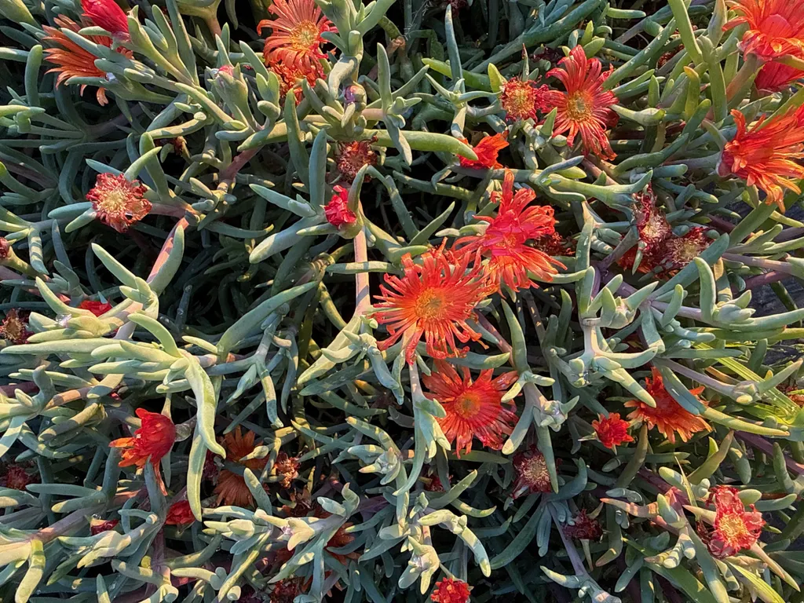

---

Depuis le retour du vélo, j’avais un léger mal de dos. Après le jardinage, je suis quasiment bloqué. La douleur me tourne autour depuis le début de l’année quand je devais soulever Isa.

### Jeudi 9, Balaruc

En moi, Isa guide mon regard, répond à mes pensées, me stimule, soulage mes faiblesses, m’ordonne de vivre. Le deuil serait cette acceptation d’elle en moi, cette familiarité nouvelle, cette complicité redoublée. Le deuil durerait un an, deux ans, mais ça n’a aucun sens. Isa veut vivre. Sa graine plantée en moi germe déjà, se préparant à fleurir. Je n’ai pas le droit de rester dans le noir à me morfondre, mon destin est de l’éclabousser de lumière, de rires, de couleurs. Elle me demande d’inventer, d’écrire, de rencontrer, d’aimer, d’éprouver. Moi : « Mais je manque de force. » Elle : « Comme si j’avais manqué de force à la veille de ma mort. »

---

Hier, j’ai relu la première partie du roman écrit à l’automne 2025, interrompu fin décembre même pas à mi-course. Aujourd’hui, j’ose replonger dans le texte sur Isa et la maison, écrit l’été dernier. Tout à reprendre : centrer sur Isa, son courage et sa philosophie.

---

Depuis la cuisine, je regarde le soleil se coucher sur les pots de terre cuite. Je ne cesse de manger, impression de devenir énorme. Tentative désespérée de remplir le vide. Isa n’est plus là, je n’ai plus à m’occuper d’elle, j’ai du temps à revendre dont je ne sais quoi faire.

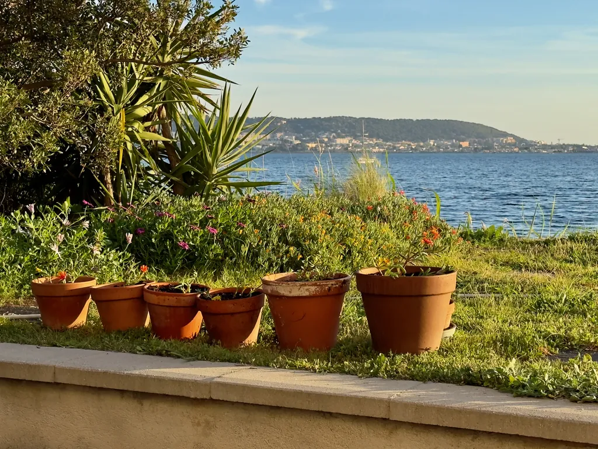

### Vendredi 10, Balaruc

Rosa m’écrit qu’après le deuil « you are going to invent a new life and it can be even better than the former one. » Pourquoi pas, puisque je suis plus grand désormais, avec Isa en moi. Rosa m’exhorte aussi à la patience. Tous ceux qui sont passés par là me le disent. J’aimerais qu’il en soit autrement, compresser le temps. J’ai toujours été impatient, sauf durant la maladie d’Isa : je voulais que le temps dure, s’étire, s’arrête.

---

Quand l’idée d’écriture IA s’effondre face à la nécessité de dire Isa. En quoi une machine me serait-elle utile ? J’ai besoin d’écrire pour me faire du bien, pour partager, pour célébrer, pour ne pas oublier. C’est à moi de le faire, à moi seul, et tant que nous vivrons, éprouverons, cette nécessité ne disparaîtra pas. Tous ceux qui parlent d’écriture IA sont des clowns qui n’ont rien d’important à partager. Ils m’insupportent à chercher à nous entortiller le cerveau. Non, je n’ai pas changé d’avis. L’IA est un outil, et quand nous demandons à un outil de prendre notre place, c’est que notre place n’était pas folichonne. Les IA sont bonnes pour écrire des distractions, pas des textes existentiels.

---

Je bricole mes bouts de textes sur Isa et prends conscience que toute tentative de reconstruction sera artificielle. La forme ne peut qu’être au plus près du jour le jour. Commencer le récit en août dernier comme je l’ai fait initialement, suivre l’avancée de la maladie jusqu’à son terme, au plus près du vécu. Ne plonger dans le passé que quand j’y plongeais, parce que je ne pouvais plus faire autrement.

### Samedi 11, Balaruc

Grande tentation de m’oublier dans le code. J’évite, j’en sortirai démonté. Apétence. Je pédale par hygiène. Plus rien ne me fait plaisir. Je ne désire rien. Je me moque de tout sauf des enfants, que je m’efforce de soutenir. Après une phase de suractivité, le deuil creuse un trou en moi, comme une maladie. Je le vois à l’œuvre, sans pouvoir l’arrêter. Même les mots n’ont plus de pouvoir.

J’entends Mathieu Simonet dire : « On peut pas affronter le deuil en face, à aucun moment on comprend ce qui se passe. » J’éprouve le contraire. Passés les premiers jours, l’inacceptable est là, manifesté par le vide, un vide contemplé à longueur de journée, vide figure du deuil, visage du seuil, corps en creux du deuil. Je comprends trop bien ce qui m’arrive, ce qui nous arrive, c’est simple, et cette simplicité provoque la douleur, parce que c’est inévitable, parce que nous n’avons pas voulu y croire durant des années — il nous aurait été impossible de vivre.

Le deuil n’est pas oublier Isa, mais la digérer, l’assimiler, la faire part de moi. C’est continuer de grandir avec elle sans qu’elle soit hors de moi. Cette digestion me prive d’énergie comme un repas de fête trop copieux. D’ailleurs, je m’abandonne à des siestes comateuses, peu désireux de m’éveiller.

Mathieu dit « Sans que ça empiète sur le vivant ». L’invasion est définitive, irréversible. Je ne suis plus le même, les enfants ne sont plus les mêmes. La mort d’Isa nous a transformés. C’est avec elle en nous que nous commençons à nous reconstruire.

« Ne pas rester calfeutré dans une maison de verre », dit encore Mathieu. Ce n’est même pas une métaphore pour moi. J’habite une maison de verre. En partir ? Non, ici, sur ce rivage au bord de l’étang, mes racines s’accrochent à la terre et me permettront de pousser plus haut, j’espère.

Mathieu parle de gestes qui ne lui appartiennent pas. Je viens de récurer le cul de la poêle, un truc que je ne faisais jamais, mais qui était de la plus haute importance pour Isa. Je fais tant de choses désormais qu’elle faisait, certaines non utiles d’ailleurs, simplement parce qu’elles étaient siennes.

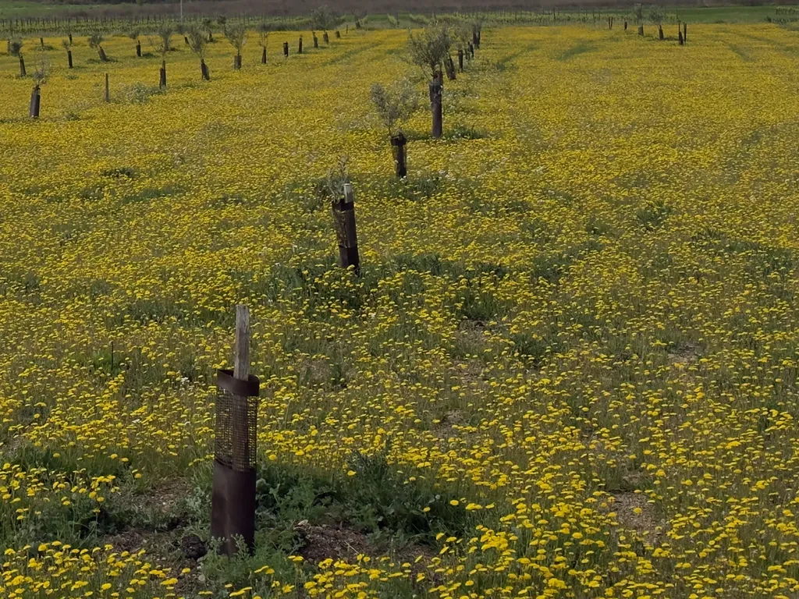

### Dimanche 12, Balaruc

Isa me décentrait, attirait mon attention vers elle, vers les autres. Sans elle, je me replie, même si par chance, comme aujourd’hui, des amis ont dormi à la maison.

« Laisse aller », je me le dis, sans en savoir la signification. Je regarde l’étang, le jardin, une mésange qui explore les lentisques. Je suis en vie. La vie me traverse jusqu’à la douleur.

Une fois les amis partis, Émile parti, l’absence ne me laisse rien d’autre à faire que manger.

Suis-je aussi mal parce que demain ça fera deux mois ? Ce n’est pas tant une question d’anniversaire que de distance, de creusement de l’absence.

Je n’envisage aucun futur heureux, même si j’en sais la possibilité théorique, même si Isa aurait détesté mon apathie. Je me vois seul, désespérément seul. Je ne sais pas comment les célibataires supportent cette torture.

Il est 18h30. Il nous arrivait souvent d’aller au cinéma en fin d’après-midi les dimanches avant d’avoir les enfants. J’ai presque peur de me mettre à regarder un film aussi tôt. Peur de faire des choses que je faisais sans scrupule avant. Peur de me distraire de la douleur.

Isa a regardé la mort en face, une bonne fois pour toutes. C’était une chose entendue, attendue. Il n’était plus question d’en parler ni de s’en préoccuper.

L’onde de choc me frappe avec deux mois de retard, dans toute sa puissance. Une réplique énorme, comme si elle avait patienté jusqu’à ce que j’épuise mes dernières forces.

### Lundi 13, Balaruc

Nous allons à un spectacle. Je perds Isa. Me retrouve dans la foule, dans une sorte de théâtre en arène de course. J’y croise de vieux amis. Le grand François. Sa fille joue. Mais un autre gars est encore plus grand. Je suis assis dans les gradins. Une femme hideuse s’endort et s’appuie sur mon épaule gauche. Quand je tente de la relever, elle fait scandale. On ne me laisse pas tranquille. Je m’enfuis. J’appelle Isa :  « T’es où ? » « Au Frigo. » Je cours partout, je ne reconnais pas la ville. Un gars me propose de me guider vers le Frigo. Nous passons une porte défoncée, nous enfonçons dans des caves lumineuses remplies de bruits de conversations, puis je me retrouve seul, perdu dans un labyrinthe. Je débouche dans un jardin luxuriant grillagé, une cour intérieure entourée de façades de pierres sombres, fenêtres noires, une ruine, impossible de sortir, jusqu’à ce que je trouve un trou sous le grillage. Je m’échappe par une rue étroite. J’appelle Isa, lui demande de se géolocaliser. Je me réveille. Sa mort s’impose.

Durant le cauchemar, j’étais persuadé qu’elle m’en voulait, qu’elle m’avait abandonné, ne faisant aucun effort pour que je la rejoigne. Elle me rejetait, était avec des amis plus dignes d’elle que moi. Je me réveille encore énervé contre elle. Il est presque trois heures. Je ne suis pas près de me rendormir. J’ai déjà fait ce genre de rêves. Ils datent de l’époque de ma séparation avec P, il y a plus de trente ans, puis Isa s’est substituée à P comme si j’étais en insécurité affective. Pourquoi ça continue ?

### Mardi 14, Balaruc

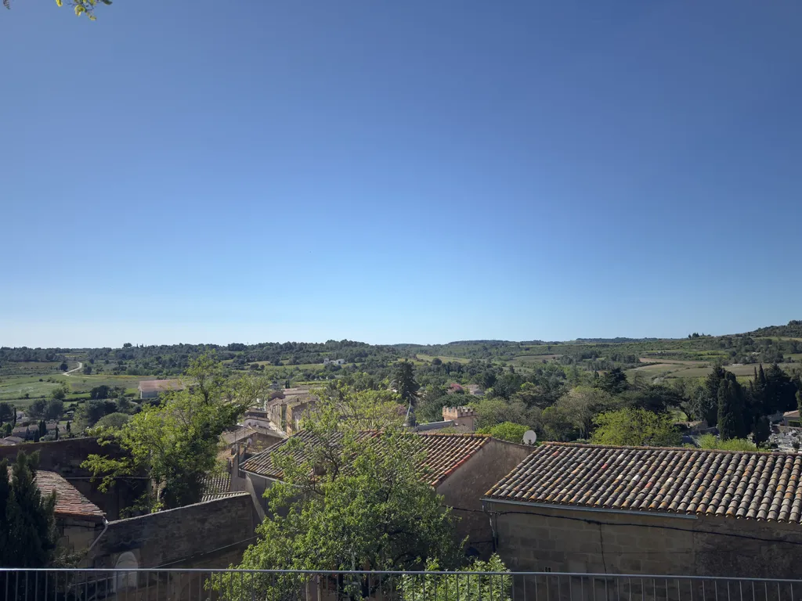

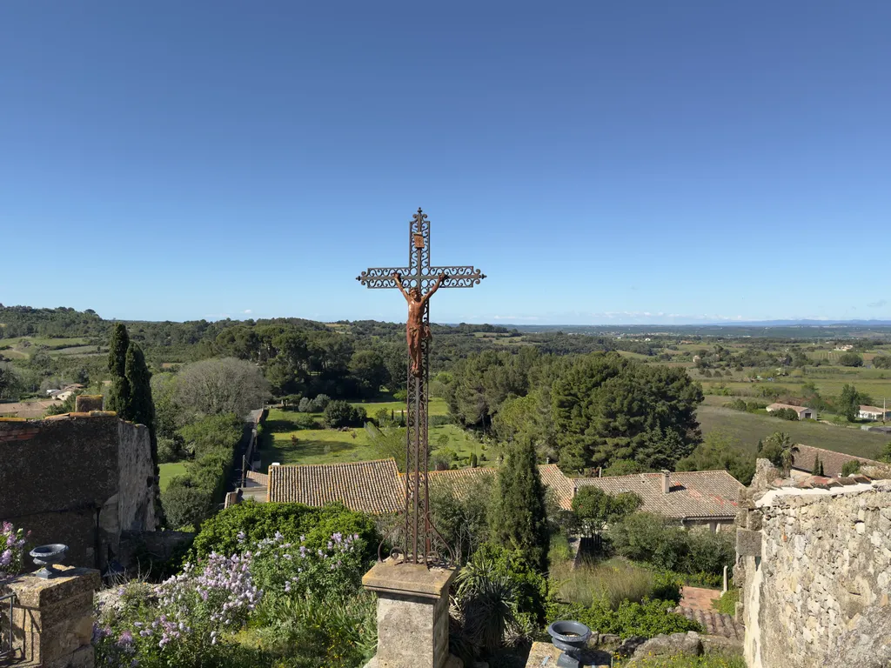

### Mercredi 15, Balaruc

Hier, je n’écris rien, non que je déborde d’activité mais d’impuissance. Quand j’essaie d’imaginer le futur, je n’y parviens pas. N’ayant jamais vécu longtemps seul, j’essaie de penser à une femme qui pourrait partager au moins en partie ma vie : une seule image se forme, Isa. Elle qui aimait les femmes plus que nous autres hommes, leur trouvait souvent plus de qualités, me juge étroit d’esprit. Je la fais penser au présent parce que j’entretiens avec elle en moi un dialogue constant. Suis-je en train de devenir fou ?

J’effectue quelques recherches sur mon syndrome. Si pour Freud le deuil était un travail de détachement, il semble selon la théorie de [Klass, Silverman & Nickman (1996)](https://thelossfoundation.org/stages-of-grief/continuing-bonds-theory-klass-silverman-nickman-overview/?v=82a9e4d26595) que maintenir une relation intérieure avec le défunt soit la norme, pas l’exception. C’est même souvent bénéfique. Me souvenir d’Isa m’aiderait à guérir. Me connecter à elle ne m’empêchera pas de revivre. Elle continuera de modeler ma vie de manière constructive.

Isa jubile, parce qu’elle détestait le freudisme, avait traduit des livres opposés. Je ne découvre donc pas seul cette façon de traverser le deuil, je la découvre avec Isa, grâce au fruit de ses années de lectures et de traduction. Le travail d’ingestion et d’intégration est à l’œuvre.

Les psychanalystes postfreudiens ont un mot pour ce que je vis : introjection, qui signifie incorporer l’autre en soi, construire une représentation interne stable de la personne aimée, qui devient un objet interne, une présence psychique réelle.

Si demain j’aime une autre femme, je l’aimerais avec Isa, avec son attention et son ouverture. Pourquoi je n’aimerais pas un homme à travers Isa ? Plus Isa a vieilli et plus elle a lu les féministes, plus elle a aimé les femmes. Elle s’est autorisée à les aimer, jugeant notre relation hétérosexuelle plutôt étroite. Une de ses amies me l’a écrit, m’avouant qu’elle était tombée amoureuse d’elle, sans savoir si Isa était tombée amoureuse en retour. Mais oui, je n’en doute pas, Isa débordait d’amour. Elle était bien plus ouverte que moi. Chez elle, l’éthique avait pris le pas sur la morale tombée du ciel, cette morale divine, arbitraire, indiscutable. Isa continue à me donner des leçons de vie.

Suis-je maintenant mieux capable d’imaginer l’Autre ? Non, ce n’est pas une histoire de prince à la recherche de sa princesse, je ne projette rien, mais je crois que je saurais grâce à Isa ouvrir les bras à la vie.

---

Mes lectures m’amènent à découvrir les cinq phases du deuil selon Kübler-Ross (1969).

1. **Déni.** Il m’a frappé dans les premiers jours. S’accompagne d’une impression d’irréalité alors que désormais la réalité du vide est tangible, incontestable. Le déni peut encore me traverser, mais comme un éclair.
2. **Colère.** Elle ne m’a jamais affecté, alors que je suis d’un naturel coléreux, mais pas quand c’est grave. Je n’en veux à personne ni aux médecins, surtout pas à Isa.
3. **Marchandage.** Il m’est arrivé de me dire « si j’avais fait ça », de me sentir coupable de n’avoir pas agi assez vite, de ne pas avoir été assez à l’écoute. Je suis moins là-dedans, sans doute parce que nos proches ne cessent de me dire que j’ai donné à Isa tout ce qu’il était possible de lui donner comme amour, présence, soutien. Quand je me laisse aller au marchandage, les enfants me remettent en place. J’ai dépassé cette phase aussi, pour l’essentiel.
4. **Dépression.** Il m’arrive souvent de ne plus avoir envie de rien, mais je continue de faire du vélo avec les copains, d’écrire ici, de parler aux amis. J’ai fait quelques tentatives timides de sortie. Encore du boulot de ce côté, surtout si je veux réinventer ma vie.
5. **Acceptation.** Ce serait justement réussir à intégrer Isa en moi. J’y travaille, ou plutôt nous y travaillons tous les deux.

Le deuil est une métamorphose. Je m’approprie les gestes d’Isa, ses pensées, ses goûts.

### Jeudi 16, Balaruc

Journée passée sur le vélo, [autour du golfe antique](https://tcrouzet.com/2026/04/17/g727-golfe-antique/). Isa avait une amie à Bages. Elle rêvait de se remettre et de pouvoir faire le tour du golfe avec moi. Dès que je quitte la maison, je ne cesse de me dire « Isa aimait ça, Isa pensait ça, Isa disait ça. » J’ai peur de finir par emmerder les copains, jusqu’à ce que je découvre que D a perdu sa femme dans un accident de vélo, alors que leurs enfants étaient jeunes. Il comprend ce que je traverse.

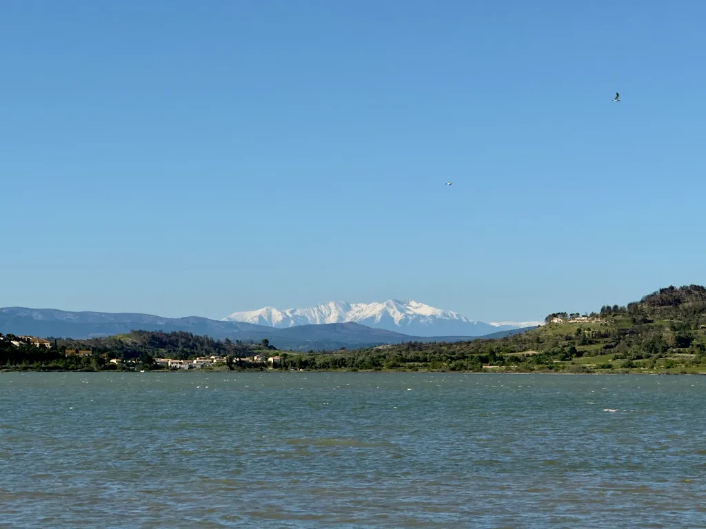

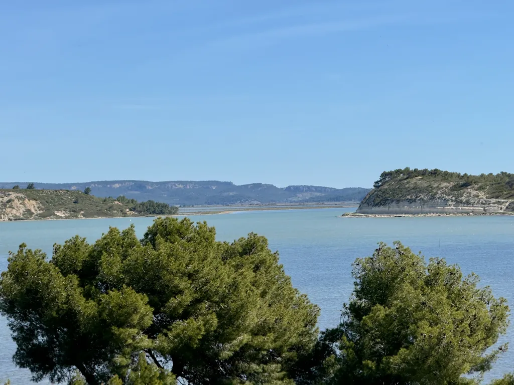

### Vendredi 17, Balaruc

À pas feutrés, je reprends le texte commencé l’été dernier, le complète, reviens sur les derniers mois d’Isa. Ça me fait du bien. J’ai cessé d’avoir peur de regarder cette matière. J’embrasse cette épreuve que nous avons vécue côte à côte. Je cherche à écrire à sa hauteur, pour rendre heureuse la part d’elle en moi.

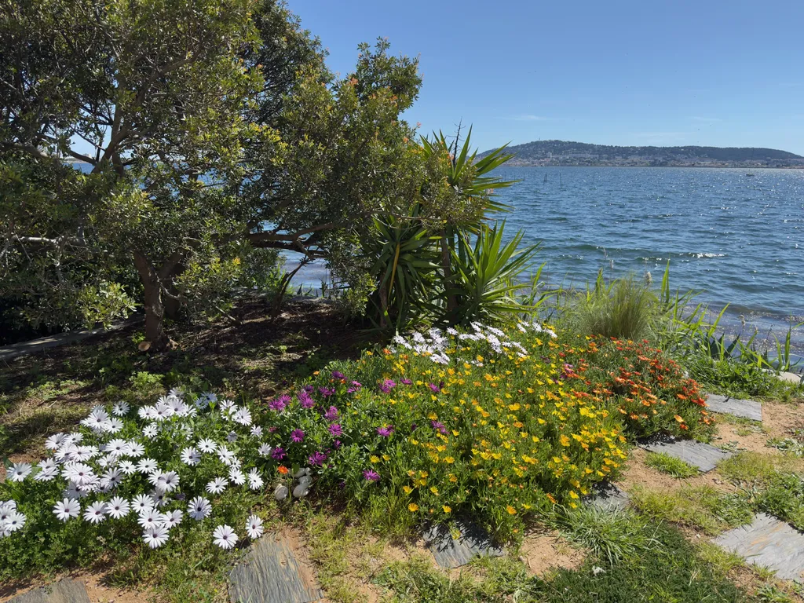

### Samedi 18, Balaruc

Joëlle m’envoie un passage de *Proche en proche*, livre d’Irène Mayaffre, présenté dans [*Libé*](https://www.liberation.fr/culture/livres/de-proche-en-proche-direne-mayaffre-le-silence-du-hameau-20260417_5P6N4OT4GBELHBHNAIYVF7BMYM) : « Quand ils disaient qu’ils s’aimaient, c’était l’absence de peur qu’ils éprouvaient. Ce n’était pas d’être aimé qui les rendait heureux, mais d’effeuiller le livre inconnu et ouvert qu’était encore l’autre, curieux qu’ils étaient de visiter son secret tandis que se distillait ils-ne-savaient-quelle-hormone d’attachement qui les rendait si intimes qu’ils croyaient être deux depuis toujours. »

Joëlle me dit : « Un passage qui m’a fait penser à ton couple. » Ce passage me fait surtout penser au sien. Isa et moi n’avons pas été deux depuis toujours. Nos vies d’avant nous ont fait découvrir le prix d’être deux et le danger permanent de casser cet équilibre des plus exigeants. Nous avons même frôlé la correctionnelle, ce qui a exigé beaucoup d’imagination pour nous en sortir.

### Dimanche 19, Balaruc

Une soirée. Isa jeune. Elle parle avec tout le monde. Je la regarde. Elle finit par venir vers moi. Je lui dis « J’ai besoin de toi. » Elle : « Moi, aussi. » Elle s’assoit sur mes genoux, passe ses bras autour de mon cou. Je m’éveille.

---

Une amie me dit qu’Isa lui disait : « Tu crois que je suis clivée pour ne pas avoir peur de la mort ? » Elle ne m’a jamais dit ça, sans doute pour me protéger. Je découvre que le clivage est un mécanisme de défense consistant à se couper de ce qui est douloureux ou angoissant pour ne pas le ressentir consciemment. Isa, face à sa mort inévitable, trouvait sa sérénité suspecte. Elle était incapable de trancher entre une forme de sagesse ou un déni. Je découvre que beaucoup de malades en phase terminale décrivent leur sérénité comme un don. Isa se questionnait. Elle restait égale à elle-même, désireuse de savoir. Elle a été forte de bout en bout, sage de bout en bout.

Je ne l’ai jamais vue désespérée. Après sa mort, je ne le suis pas non plus. Je connais d’immenses vagues de tristesse, mais jamais de désespoir. Je pense aux enfants et à Isa, à son courage, à son énergie. Suis-je clivé pour ne pas m’effondrer ? Je ne crois pas. Isa, par son attitude face à la mort, m’a préparé au deuil. Isa était résiliente, je suis résilient. Je me soigne en déchargeant sur vous mes émotions plutôt que de les transfuser à un psy.

---

Humberto Maturana et Francisco Varela : « To dismiss love as the biological basis of social life, as also the ethical implications of love, would be to turn our back on a history of living beings that is more than 3.5 billion years old… Love is a biological dynamic with deep roots. It is an emotion that defines in the organism a dynamic structural pattern, a stepping stone to interactions that may lead to the operational coherence of social life. »

L’amour m’a transformé et continuera de me transformer. Il m’a ouvert les yeux. À la fin, il ne reste que lui. Le deuil m’aide à reconnaître la puissance de l’amour. Il me prépare à de nouveaux amours.

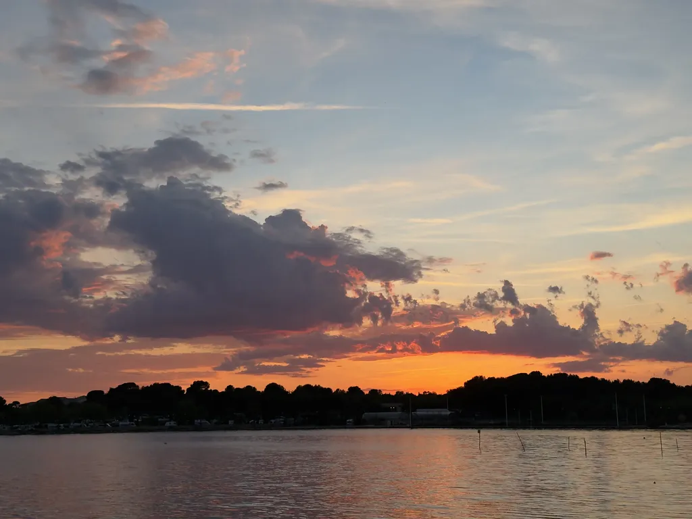

### Lundi 20, Balaruc

Je suis dingue d’écrire Isa, d’en faire une sainte, une perfection, mais impossible de la voir autrement.

### Mardi 21, Balaruc

Une amie m’entraîne voir *Juste une illusion*, une supposée comédie. Au bout de trois minutes, je comprends que c’est un nanar. Au bout de trente, je me barre, triste de ne pas avoir même souri, pensant à comment Isa et moi aurions détruit ce film censé être sur les années 1980, mais le pire des années 1980 : rien sur la technologie, les jeux vidéo, la musique ou presque, les jeux de rôle… Avec des acteurs qui surjouent, auxquels il m’est impossible de croire. Le ciné français populaire est dans un triste état.

### Mercredi 22, Balaruc

Si tous les veufs et les veuves écrivaient sur leurs amours perdus, ce serait insupportable. Comme ils ne le font pas, je peux le faire pour eux, un travail à usage collectif au-delà de ses vertus thérapeutiques.

---

Avant-hier, je range des livres dans le bureau d’Isa. Mets la main sur *Clair de femme* de Romain Gary. Pourquoi m’arrêter sur ce texte en particulier parmi des dizaines d’autres ? Parce que j’aime Gary sans connaître ce roman ? Parce qu’il était en haut de la pile, comme en évidence ? Je n’ai pas vu Isa le lire.

J’ai posé le folio aux pages jaunies dans ma chambre. Hier soir, de retour du cinéma, je lis la quatrième de couv. La femme du héros lui écrit : « Je vais disparaître mais je veux rester femme. Va à la rencontre d’une autre partie féminine. La plus cruelle façon de m’oublier serait de ne plus aimer. »

Je tourne autour de cette idée depuis la mort d’Isa, je sais que c’est exactement ce qu’elle pensait. C’est comme si elle me parlait par l’intermédiaire du roman de Gary. Le folio a été imprimé en 1996. Quelques passages ont été marqués dans les marges, d’un ou deux traits bleus verticaux, comme Isa pouvait le faire quand elle me relisait, mais des traits bleu ciel, délavés, anciens. Aucun commentaire.

Je lis. Michel rencontre Lydia, deux cabossés. On comprend peu à peu la situation. Yannick, la femme de Michel, est en phase terminale de cancer et lui a demandé de s’éloigner pour la laisser mourir seule et même se donner la mort. Lydia a perdu sa fille dans un accident. Son mari, qui était au volant, a le cerveau en compote.

Premier passage marqué, Lydia parle à Michel : « Téléphonez-moi un jour, quand nous reviendrons tous les deux des endroits très éloignés où nous nous trouvons en ce moment… »

Moi je note : « Deux désespoirs qui se rencontrent, cela peut bien faire un espoir, mais cela prouve seulement que l’espoir est capable de tout… »

Et tout de suite après. Yannick : « Je suis obligée de te quitter (donc de mourir comme Isa). Je te serai une autre femme. Va vers elle, trouve-la, donne-lui ce que je te laisse, il faut que cela demeure. Sans féminité, tu ne pourras pas vivre ces heures, ces années, cet arrachement, cette bestialité que l’on appelle si flatteusement, si pompeusement : “le destin”. J’espère de tout mon amour que tu vas la rencontrer et qu’elle viendra au secours de ce qui, dans notre couple, ne peut pas, ne doit pas mourir. Ce ne sera pas m’oublier, ce ne sera pas “trahir ma mémoire”, comme on dit pieusement chez ceux qui réservent leur piété à la mort et au désespoir. Oh non ! Ce sera au contraire une célébration, une permanence assurée, un défi à tout ce qui nous piétine. Une affirmation d’immortalité. Il faut qu’elle t’aide à profaner le malheur : nous lui avons témoigné, depuis des millénaires, assez de “respect”. Nous baissons trop humblement, trop facilement la tête devant ce qui nous traite avec tant d’indifférence et de barbarie. C’est pour moi une question de fierté féminine. Presque de survie. Une révolte, une sorte de lutte pour l’honneur, un refus d’être bafouée. Cette sœur inconnue, va à sa rencontre, dis-lui combien j’ai besoin d’elle. Je vais disparaître, mais je veux rester femme… »

Isa me parle à travers un personnage de Gary. Elle décrit mon état : « j’avais trop aimé pour être encore capable de vivre de moi-même. C’était une impossibilité absolue, organique : tout ce qui faisait de moi un homme était chez une femme. »

« Rien, dans ce qui nous unissait n’était à nous seuls, rien n’était différent, unique, rare ou exceptionnel, il y avait permanence et pérennité, il y avait couple, nous étions plus anciens que mémoire humaine. »

« S’imaginer que tout est fini parce qu’on a perdu la seule femme que l’on ait aimée, c’est un manque d’amour. »

Reste que Gary tire à la ligne, délaie, enchaîne les dialogues vides. Mais, de temps à autre, il lâche une phrase puissante, qui me donne le courage de poursuivre.

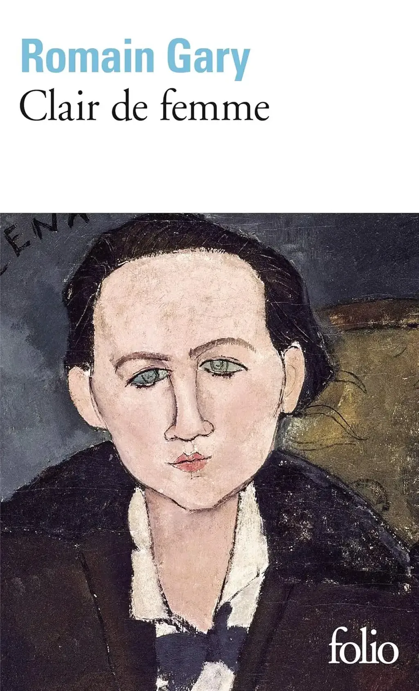

### Jeudi 23, Balaruc

Je continue de lire *Clair de femme*, sans grand enthousiasme, beaucoup de mots inutiles, improvisation virtuose sans grande portée, jusqu’à ce qu’une nouvelle phrase me saisisse : « Il fallait faire face, laisser mourir, aimer pour garder en vie. » On ne laisse pas mourir, on n’a pas le choix, j’ai fait ce que j’ai pu pour retarder la mort d’Isa, puis ça n’avait plus de sens, c’était devenu impossible pour quiconque. On ne peut que laisser mourir en soi. Ça ne veut pas dire grand-chose. On accepte, au mieux. C’est un préalable à la guérison. Aimer pour garder en vie, ça oui, en revanche : aimer Isa, les enfants, la famille, les amis et les inconnus à venir.

---

La tristesse frappe sans crier gare : sous la douche après le vélo, alors que les enfants vont à la base nautique pour un cours de wing foil.

---

Yannick : « Promets-moi de ne pas faire de ton chagrin une facilité, une dérobade. Une demeure grise entourée de ronces et de ruines. Ah non ! Je ne veux pas que la mort gagne encore plus qu’elle n’emporte. Tu ne t’enfermeras pas à double tour derrière les murs du souvenir. Je ne veux pas devenir aide à la pierre. Nous avons été heureux et cela nous crée des obligations à l’égard du bonheur. »

« Tu m’as tellement aimée que c’est presque mon œuvre. Comme si j’avais réussi vraiment à faire quelque chose de ma vie. »

« Cette sœur inconnue, je veux que tu lui dises combien j’ai besoin d’elle. J’aurais aimé la rencontrer, lui sourire, l’embrasser. »

« Lorsqu’on a aimé une femme de tous ses yeux, de tous ses matins, de toutes les forêts, champs, sources et oiseaux, on sait qu’on ne l’a pas encore aimée assez et que le monde n’est qu’un commencement de tout ce qui vous reste à faire. »

Voilà, j’ai terminé. L’alibi narratif invraisemblable : Yannick en phase terminale demande à Michel de partir loin pendant qu’elle se suicide. Pourquoi pas. Envisageable. Il ne réussit pas à partir loin, mais rencontre Lydia. Cette dernière étape ne tient pas debout. L’angoisse à ce moment interdit tout, surtout une recontre. C’est donc du romanesque pour du romanesque, et ça finit par ne plus rien dire. Reste que ce folio était en haut de la pile d’Isa. Je l’ai lu comme si elle était Yannick, avec un certain effroi. Un appel à continuer à vivre.

### Vendredi 24, Balaruc

<iframe width="560" height="315" src="https://www.youtube.com/embed/kqDIF840jg4?si=9NAsHLPDLiOA82dN" title="YouTube video player" frameborder="0" allow="accelerometer; autoplay; clipboard-write; encrypted-media; gyroscope; picture-in-picture; web-share" referrerpolicy="strict-origin-when-cross-origin" allowfullscreen></iframe>

Après la lecture, la bande\-annonce ne me donne aucune envie de regarder le film.

---

Idée : demander aux IA d’ajouter texte ou objet sur des tableaux célèbres (à la place de « aux IA » j’avais écrit « à Isa » — ce n’est pas simple).

%% Je découvre avec stupeur qu’Isa a pris contact avec un astrologue en octobre 2025, a priori sans aller au bout de la démarche. Elle ne m’en a bien sûr pas parlé, ça m’aurait inquiété. Je n’aurais pas ri, au contraire, mais j’aurais tenté de lui éviter de chercher des réponses dans le champ des charlataneries. Qu’Isa ait esquissé une telle démarche, sous l’influence d’une amie, me dit à quel point elle était perdue, déjà plus tout à fait elle-même, parce qu’influençable. Ça me rend malheureux. À moins qu’elle n’ait joué le jeu avec son amie, ne soit allée dans son trip pour lui faire plaisir, avant de faire marche arrière au dernier moment. %%

---

L’alibi de *Clair de femme*, c’est un peu comme si une de mes lectrices voulait me rencontrer pour être Lydia, comme s’il y avait une femme pour aller vers tous les hommes malheureux, c’est une perspective machiste. Gary déguise cette caricature par une rencontre impromptue à la descente d’un taxi, mais c’est bien de ça qu’il s’agit, de la femme providentielle tombée du ciel au bon moment. Un simple conte de fées. Après tout, j’ai rencontré Isa grâce à l’entremise de Claire. Ça revient au même : hasard, entremetteur, entremetteuse… Sauf en ligne, où il y a recherche, filtrage, ciblage. Bien peu romantique.

### Samedi 25, Balaruc

Je travaille au livre sur Isa. Je raconte qui elle était à travers les sept derniers mois de sa vie, parce qu’ils l’illustrent à merveille (courage, abnégation, joie…). Je lis ses messages, ses mails, je suis avec elle continuellement. Est-ce raisonnable ? Je n’en sais rien. J’ai l’impression qu’elle est encore vivante et me parle. Je n’ai pas d’autre objectif qu’écrire un texte discret comme elle l’était. D’ailleurs, elle adorait le film *La Discrète* et avait un côté [Judith Henry](https://fr.wikipedia.org/wiki/Judith_Henry), une actrice à qui elle se comparait dans sa jeunesse. Ma grande peur : échouer à lui redonner vie.

### Dimanche 26, Balaruc

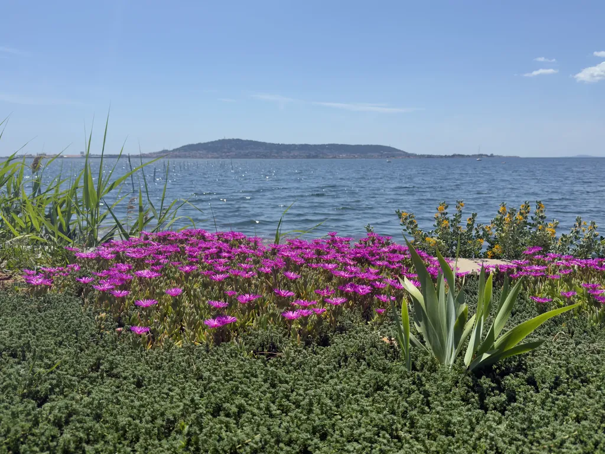

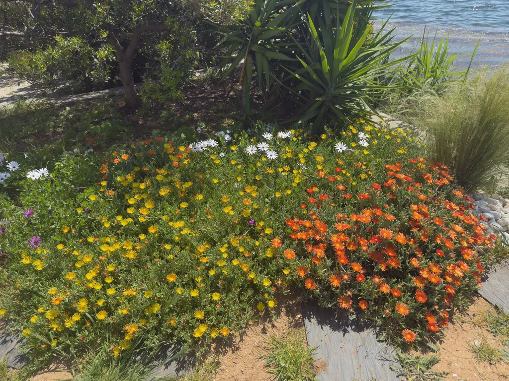

### Lundi 27, Balaruc

Le 1er février, en fin d’après-midi, après le départ d’Émile pour Nîmes, nous discutons Isa, Tim et moi sur le canapé. Je demande à Isa de chanter la chanson de Tim, puis celle d’Émile, des rengaines qu’elle répétait inlassablement pour les calmer quand ils étaient petits. Je l’enregistre, mon dernier enregistrement d’elle. Ce matin, j’ai le courage de réécouter, et sa voix faible, au bord de la rupture, me terrasse en même temps que notre vie se jette sur moi. Je n’ai jamais autant pleuré depuis la mort d’Isa. Les larmes viennent plus facilement désormais, parfois par surprise, comme si j’étais sans défense. Quand tout paraît aller bien, tout va mal.

### Mardi 28, Balaruc

Hier, nous avons abattu les deux mûriers-platanes de la terrasse, l’un mort, l’autre mourant, tous deux dévorés par les longicornes tigres comme tous les mûriers de la région. Ils disparaissent avec Isa, et ouvrent un vide sous nos yeux, métaphore de ce qui ronge notre cœur.

---

Depuis la mort d’Isa, j’ai mal au dos. Les étirements quotidiens n’y font rien. Ce soir, j’ai mal à la hanche droite, là où je me suis fracturé le col du fémur. Mon corps exprime ce que parfois j’oublie.

### Mercredi 29, Balaruc

Grand spectacle avec Tim devant le match PSG-Bayern, un chef-d’œuvre. Ou quand le sport produit des émotions esthétiques.

### Jeudi 30, Balaruc

Nous arrivons au bout d’une longue histoire d’invention d’outils d’écriture et de supports d’écriture, avec désormais des machines qui écrivent seules, et même des agents qui prennent seuls la décision de produire des textes.

Ces machines écrivent aujourd’hui 70 % des codes informatiques, bientôt plus, jusqu’à faire ce travail à notre place. J’y ai consacré tant d’heures, souvent vécues comme inutiles quand je débuguais, qui m’ont poussé à abandonner ce métier.

Quelle différence entre un code et un texte littéraire ? On demande à un code de fonctionner optimalement. Certains lui demandent en plus d’être beau, minimaliste, mais on s’en fiche désormais, parce que des machines effectuent la maintenance. En revanche, dans une œuvre littéraire, la forme est presque plus importante que le fond. La forme nous parle droit au cœur, elle est l’art. Elle nous signe en tant qu’auteur.

Les machines peuvent imiter un style, peuvent-elles l’inventer ? Peuvent-elles inventer tout court ? Par combinatoire oui, elles peuvent faire jaillir des combinaisons et les tester. Très utile en science. Est-ce que ça fait sens en art ?

[Un LLM aux connaissances de 1930 est incapable de prédire quoi que ce soit de nos avancées scientifiques et techniques ultérieures, sans parler de nos avancées esthétiques.](https://talkie-lm.com/chat) Nos LLM sont encore non imaginatifs, incapables de vivre des rushs, de provoquer des ruptures de paradigmes… Voilà ce qui nous reste. Un grand défi : dans une vie combien de sauts quantiques produisons-nous ? Mes enfants ont conscience d’entrer dans un monde étrange.

---

ForMe. ForCe. J’aime ces mots distants d’une lettre, aux structures liées, potentiellement aux sens liés. La forme est la force d’une œuvre d’art, ce qui la fait passer du champ de l’information à celui de l’esthétique.

Hier soir, nous avons regardé la seconde demi-finale de Ligue des champions : ennuyeuse, laborieuse, sans génie. Elle manquait de force parce qu’elle n’avait pas de forme. Elle respectait les règles du genre comme un LLM aurait pu le faire. Ni plus ni moins.

---

L’évolution par combinaison et sélection a inventé la vie, la conscience, le langage. Les LLM pourront donc inventer selon cette méthode, jusqu’à réussir à inventer comme nous. Je n’ai jamais eu de doute. Reste : qu’est-ce qui compte pour moi, pour les autres, pour le monde ?

#carnets #y2026 #2026-5-1-18h00
