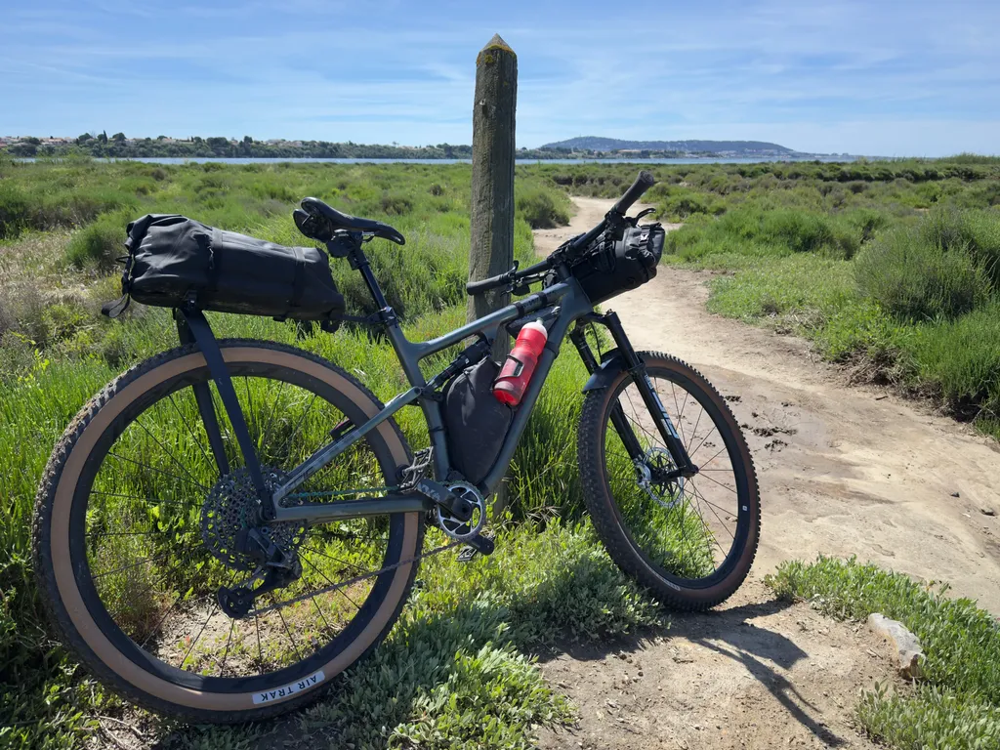
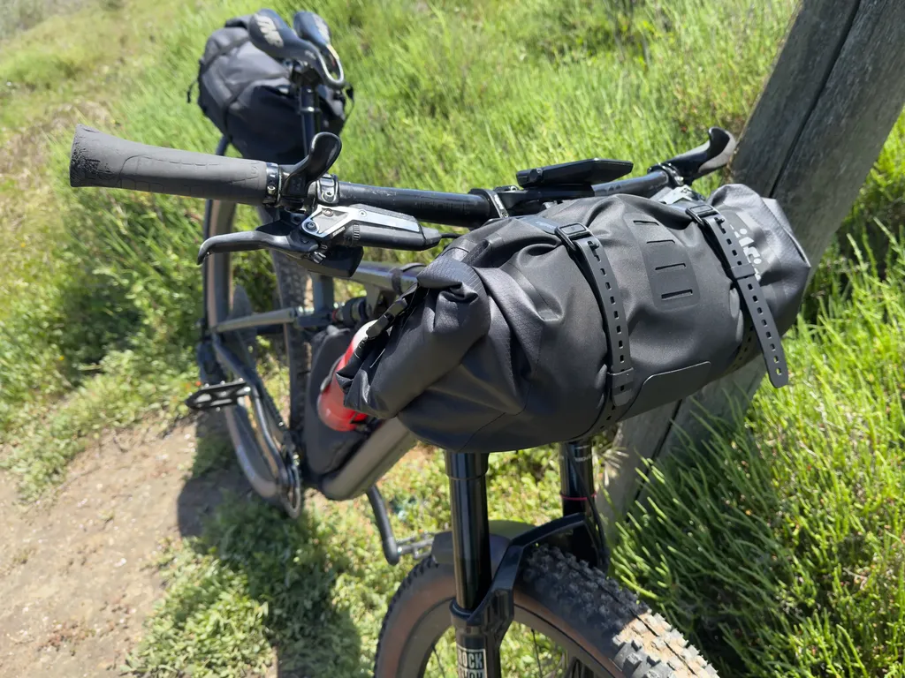
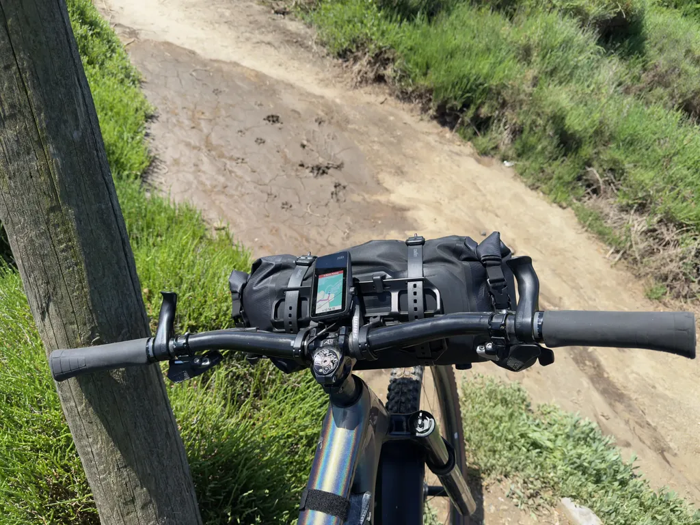
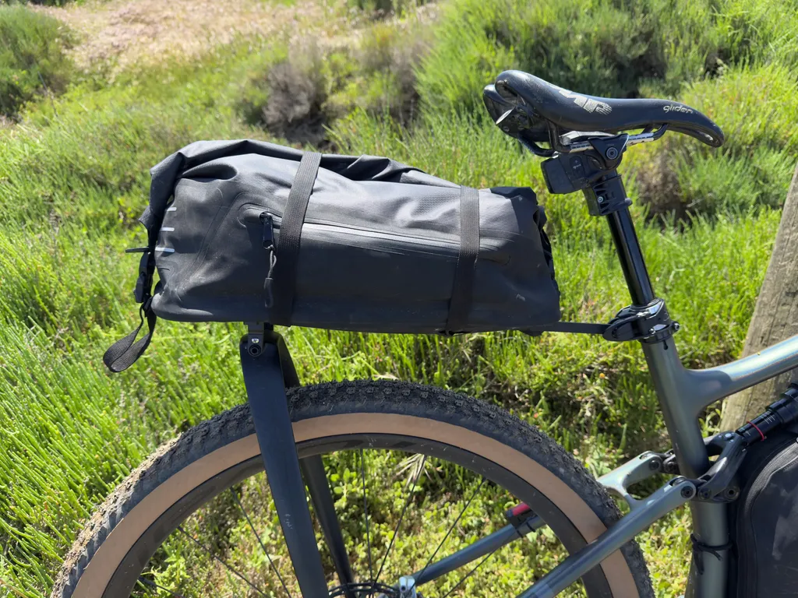
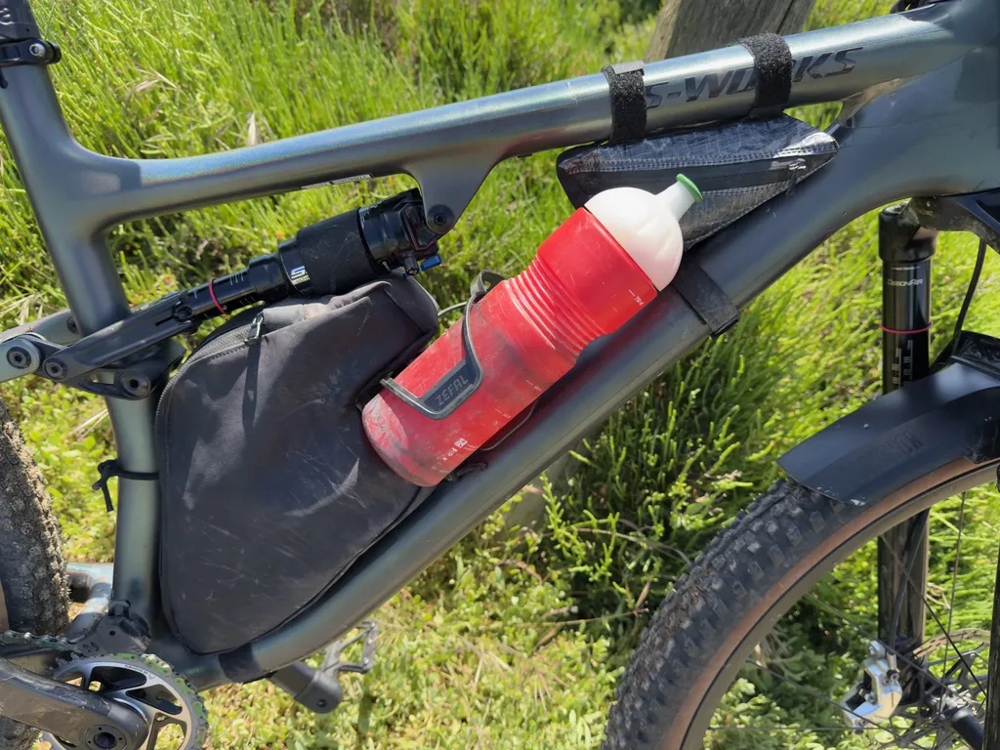
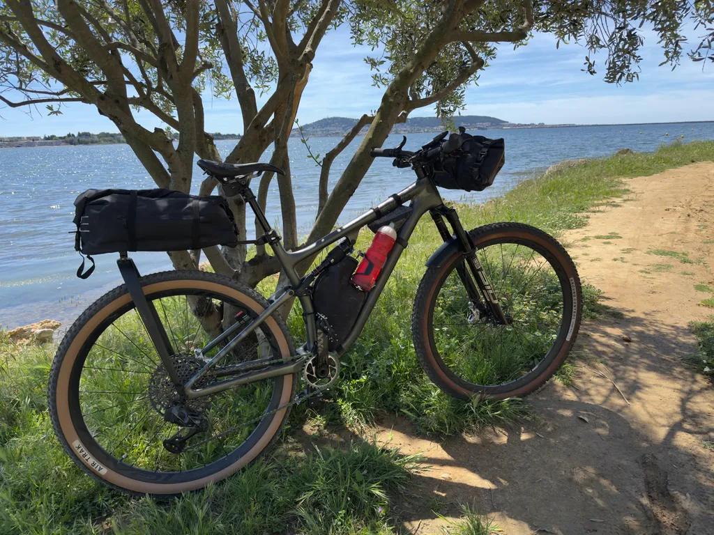
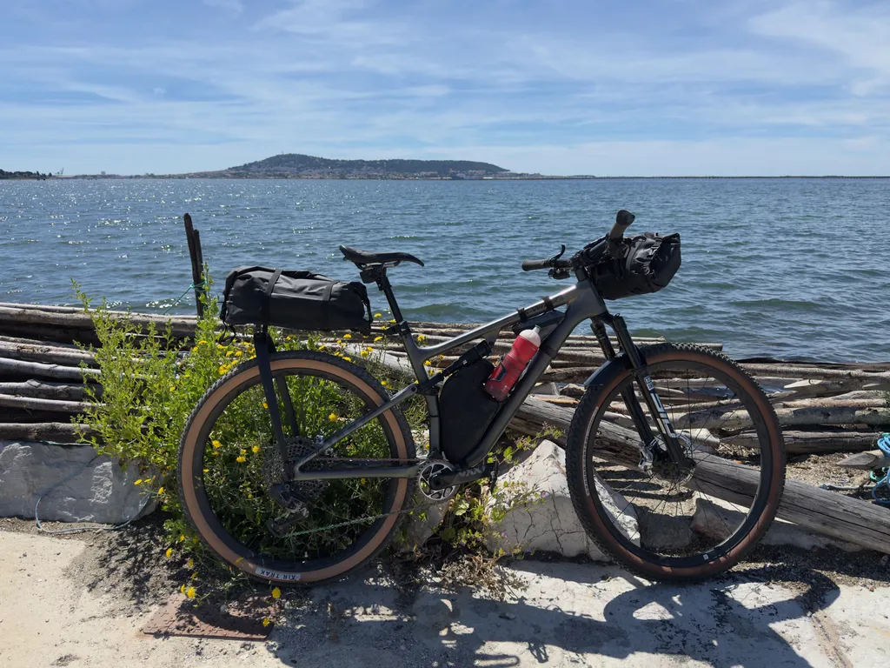

# Tailfin avant, Tailfin arrière : ma config bikepacking 2026

Depuis que j’ai mon [Diverge 4](https://tcrouzet.com/2026/03/27/le-meilleur-gravel/) ultra confort, j’envisage des voyages à gravel et non seulement à VTT. J’ai testé sur les deux jours de la [POU100](https://727bikepacking.fr/pou100/) avec succès, je testerai cet été sur [le Tour Magne](https://tourmagne.bike/), puis le [g727](https://727bikepacking.fr/g727-Grand-Depart/) en septembre. C’est une petite révolution pour moi.

Si sur un cintre VTT on peut facilement adosser un sac de guidon de 15 litres, voire plus, c’est beaucoup moins évident sur un cintre moustache. Dans mon cas, impossible de dépasser les 8 litres, donc il me faut gagner de la place ailleurs, c’est-à-dire essentiellement à l’arrière, car je n’aime pas les bagages sur la fourche ni qui dépassent latéralement, ce qui rend le pilotage pénible dans les singles (j’adore les singles, même à gravel).

Je n’aime pas davantage les sacs de selle de plus de 11 litres, qui ballottent, sont peu pratiques, remontent le centre de gravité, empêchent de sortir son cul dans les descentes techniques. Par ailleurs, je suis fatigué des sacs sur mesure : fragiles, rarement étanches, peu optimisés. Pas cool de retrouver son sac de couchage trempé après des heures à rouler sous la pluie. J’ai donc décidé de tester une configuration [Tailfin](https://www.tailfin.cc/), tout en sachant qu’elle implique un surplus de poids non négligeable et qu’elle reste onéreuse. Avant de partir à gravel, je vais m’engager sur le [727 VTT](https://727bikepacking.fr/727-Grand-Depart/) dans cette nouvelle config.

### Tailfin pour le cintre

J’ai choisi [le système de cage universel](https://www.tailfin.cc/product/bar-systems/bar-cage/), auquel on peut associer un sac Tailfin ou un sac d’une autre marque. Je suis parti sur un Tailfin de 15 litres max, pouvant dans sa taille minimale de 8 litres passer entre les moustaches de mon cintre gravel.

Poids de la cage : 249 g

Poids du sac : 357 g

Par rapport à mon ancienne config, un support Revelate Design Pronghorn (170 g) et un sac Dyneema sur mesure de 18 litres (128 g), j’ajoute donc 308 g. Un poids qui ne me paraît pas excessif vu la stabilité de la solution Tailfin, tenue à distance des durites et du tube de fourche. Plus besoin de gros scotch de protection. Montage simple. Sac démontable et transportable dans la tente lors des bivouacs. Ça fait beaucoup d’avantages.

Pour le VTT, j’ai logé dans ce combo avant sac de couchage, matelas, doudoune, fringues de nuit.

### Tailfin pour l’arrière

Je me suis fait prêter un Aeropac Tailfin de première génération, avec arceaux carbone. Volume de 18 litres pour un poids total de 976 g (Sac + arceau: 905 g, axe universel 71 g) à comparer à mon ancien sac Ortlib de 350 g pour 11 litres et axe d’origine de 34 g. Le malus de 592 g est conséquent, même si je gagne en volume — ce qui n’est pas nécessairement une bonne chose, car avec plus de place on a tendance à se surcharger.

Ce sac est pratique à l’usage : il s’ouvre en grand et me permet d’utiliser ma selle télescopique sans restriction. Un grand avantage à VTT quand on aime les descentes un poil joueuses. Pour le peu que j’ai roulé dans cette config Tailfin, la stabilité de l’ensemble rend le vélo plus compact et plus maniable qu’avec des sacs moins rigidement accrochés.

### Exit le top tube bag

Il aurait été tentant de conserver mon top tube sur mesure de 1,5 litre (128 g), mais je n’ai plus besoin de cet espace supplémentaire. Je répartis ce que j’y rangeais entre ma sacoche de cadre sur mesure de 2,8 litres et le Tailfin arrière, qui dispose d’une petite poche latérale facilement accessible.

Au final, basculer chez Tailfin me coûte 772 g.

### Électronique

Après [un an de bikepacking avec le Coros Dura](https://tcrouzet.com/2026/04/24/one-year-with-coros-dura/), j’ai constaté que je n’avais plus besoin d’une powerbank (150 g de gagnés).

J’ai longtemps roulé avec une frontale Stoot Kiska 2 à laquelle je faisais de moins en moins confiance — elle avait tendance à se décharger, ce qui m’imposait un second accu en réserve —  et elle venait avec un chargeur USB-A (poids total 140 g). Je l’ai remplacée par une Petzl Swift RL 1200, dont j’ai remplacé le bandeau de fixation par un 3M Dual Lock. Poids total : 81 g.

Je suis désormais 100 % USB-C. Je recharge si nécessaire, notamment mon téléphone, lors des arrêts café ou restaurant. Comme je roule peu la nuit, voire pas, cette config me convient.

### Outils

Du côté des gains marginaux, j’ai troqué le combo Wolf Tooth EnCase System (135 g) pour un Daysaver Essential8 avec dérive-chaîne (69 g).

### Pneus

Je roulais avec Fastrack devant, Air Track derrière. Je suis revenu au Ground Control devant qui me donne beaucoup plus d’assurance, avec un malus de 150 g. 

### Fringues

Comme Pedaled se fiche de nous, proposant des fringues mérinos hors de prix avec seulement 15 % de laine, je fais de plus en plus confiance à 7 Mesh. Je roule avec leur maillot [Ashu Merinos Jersey](https://7mesh.com/en-EU/products/mens-ashlu-merino-jersey-short-sleeve) (89 % de laine), leurs chaussettes [Ashu Merinos](https://7mesh.com/en-EU/products/ashlu-merino-sock), très souvent leurs shorts, et me protège des éléments avec leur [Guardian Air Jacket](https://7mesh.com/en-EU/products/mens-guardian-air-jacket) (202 g, en medium). Tout est top chez eux. Je n’ai été déçu que par leur cuissard, qui m’a limé le cul — ce n’était rien comparé à la sombre merde de SQLab : on dirait qu’on porte une couche en carton.

À la pesée, mon vélo arrive à 16 kg tout rond, avec quelques barres de céréales, des graines et diverses bricoles dont vous trouvez le détail dans le tableau. Vous pouvez aussi consulter [mes anciens articles de configuration](https://tcrouzet.com/tag/config_bikepacking/), où j’explique mes autres choix.

<iframe src="https://docs.google.com/spreadsheets/d/e/2PACX-1vQtXMtpZrGSpN66bcB2kZJOEYfbSKyhhKy6cAtTCVE7unBsf85UIawZni0HyVScCcyS2C1DRbdeiar6/pubhtml?widget=true&amp;headers=false"></iframe>

#velo #bikepacking #config_bikepacking #y2026 #2026-04-06-13h00
