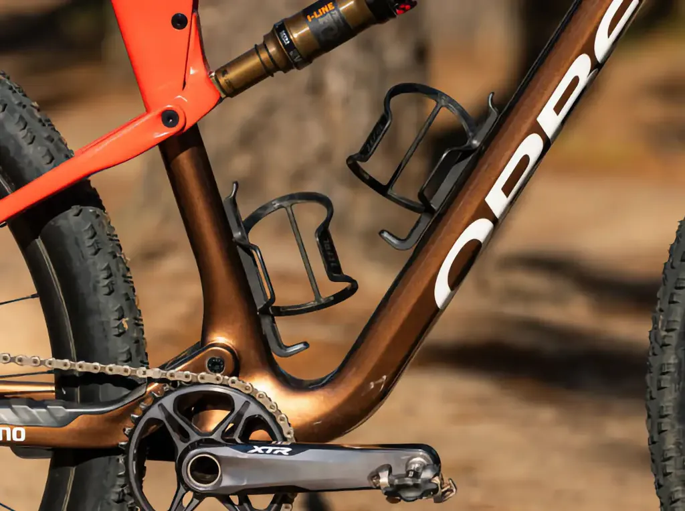

# Un infime détail vient de changer ma vie de cycliste

Depuis des années, à gravel ou VTT, je me bats avec des porte-bidons qui ne retiennent pas les bidons sur les chemins cabossés. Pour ne pas risquer de me retrouver sans eau, j’ai fini par assujettir le second bidon avec un élastique de sécurité. Au moins, il m’en reste un.

Pourquoi autant de problèmes ? Par le passé, sur ma config bikepacking, je montais les bidons sur la fourche. Quand elle se détendait, elle les éjectait parfois. J’en ai vu passer au-dessus de ma tête. J’ai testé divers modèles sans trouver la solution. Aujourd’hui, toujours en bikepacking, je roule avec deux bidons côte à côte sur le cadre et il m’arrive encore d’en perdre. Idem sur mes gravels avec mes deux porte-bidons en position traditionnelle. Dans ce cas, c’est le bidon sur le tube vertical qui est le plus à risque.

Autre détail : j’utilise des bidons sans BPA, en bioplastiques issus de la canne à sucre, notamment les Vaude Bio (78 g pour 750 ml), donc relativement souples, ce qui explique qu’ils agrippent moins aux porte-bidons. Ils ne donnent aucun goût à l’eau. Je ne comprends pas comment on peut encore utiliser des bidons issus de la pétrochimie.

On m’a vanté les [Fidlock](https://www.fidlock.com/consumer/fr/twist-bottle-750-compact-bike-base/09676). Je les ai vus à l’œuvre. Ils tiennent le choc dans toutes les circonstances. Point positif, les bidons s’accrochent quasi automatiquement, sans effort. Points négatifs : chers (45 €), lourds (le combo support/bidon pèse 187 g), pas universels (il faut des bidons Fidlock issus de la pétrochimie), sans ajustement vertical.

Et miracle ! Sur le dernier [727](https://727bikepacking.fr/727/), j’ai testé le porte-bidon idéal. Mon Epic était équipé de deux modèles carbone à extraction latérale de chez Specialized (24 g). Comme j’avais cassé le droit et n’avais pas l’intention de débourser 80 € pour le remplacer, j’ai commandé un [Zéfal Pulse S2](https://www.zefal.com/fr/porte-bidons/724-690-pulse-s2.html#/80-modele-droite).

<iframe width="560" height="315" src="https://www.youtube.com/embed/LPnA__8JjAI?si=4wyHb6hLgSLdBCH9" title="YouTube video player" frameborder="0" allow="accelerometer; autoplay; clipboard-write; encrypted-media; gyroscope; picture-in-picture; web-share" referrerpolicy="strict-origin-when-cross-origin" allowfullscreen></iframe>

Je ne lui ai trouvé que des avantages :

* Prix (moins de 20 €).
* Poids (28 g).
* Il retient fermement même mes bidons bio.
* Aucune éjection intempestive même dans les singles les plus chaotiques.
* Grande latitude d’ajustement vertical.
* En prime, ne tache pas les bidons (la plupart des porte-bidons carbone laissent du noir, notamment les Specialized).

Devant ce bilan plus qu’élogieux, je viens de contacter Zéfal pour voir s’ils pourraient nous fabriquer des porte-bidons Pulse S2 droite et gauche avec le logo 727 (j’en ai besoin pour mon gravel et mon second VTT). Et c’est possible. On peut même rêver de bidons bio 727… Vous en voulez ? Ça vous tente ? [Répondez au sondage.](https://forms.gle/bMdf24mj56nwM7Ee9)

<iframe src="https://docs.google.com/forms/d/e/1FAIpQLScLxJAvsLymyH7tulW6uz_xD-KauSx_MG28A-SaPiOfuF1YIQ/viewform?embedded=true" width="640" height="719" frameborder="0" marginheight="0" marginwidth="0">Chargement…</iframe>
*PS : Je ne suis pas devenu fan de goodies. Nous avons simplement la possibilité d’acheter des produits de qualité personnalisés. Les conditions dépendront du volume des commandes.*

#velo #y2026 #2026-05-13-13h00
