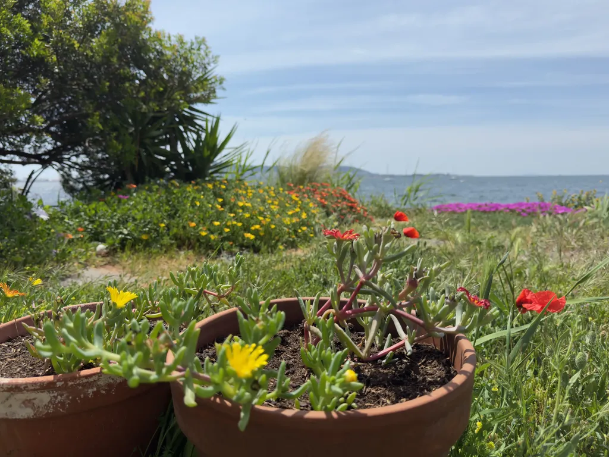
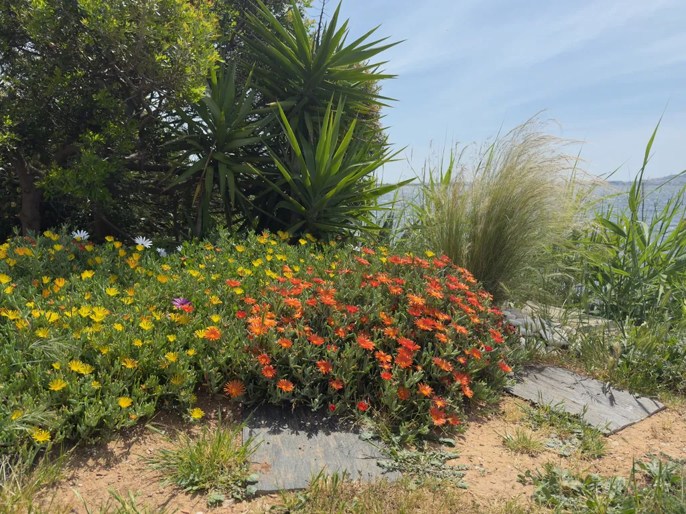
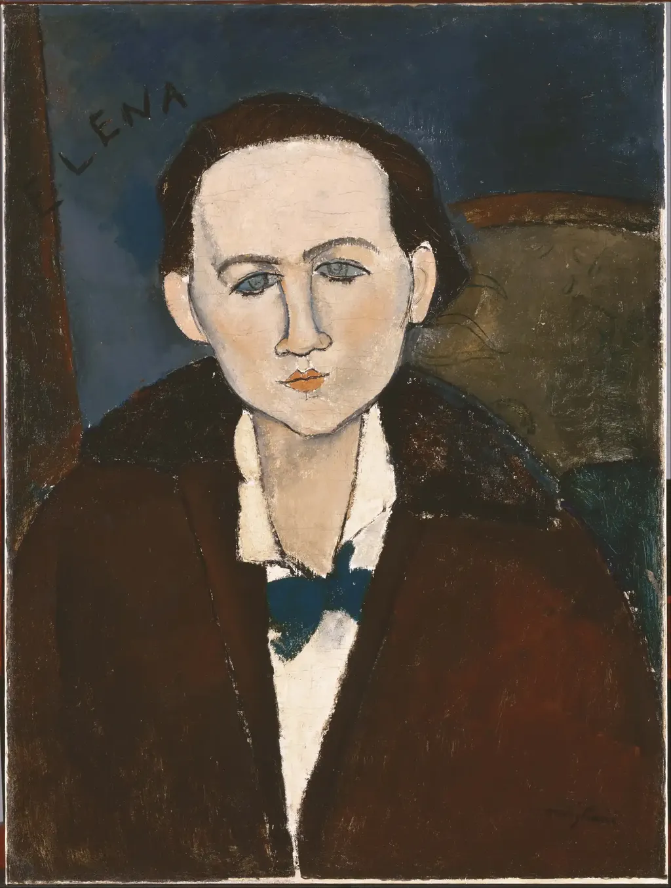
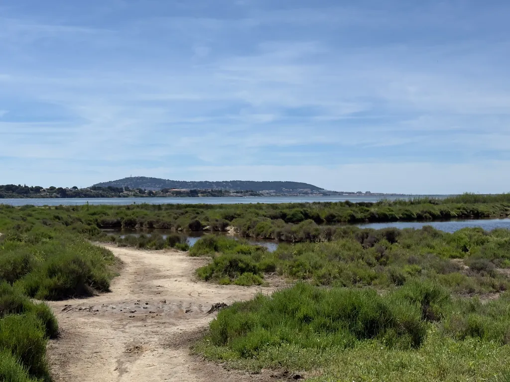
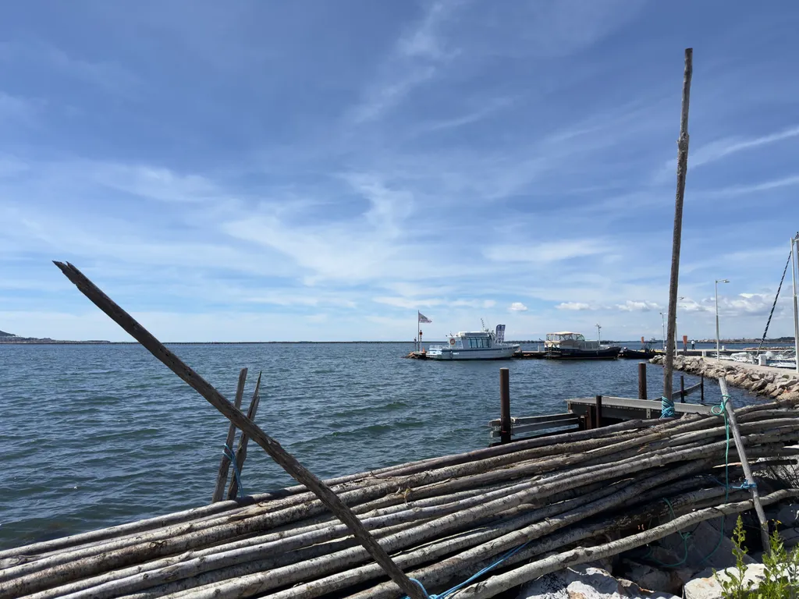
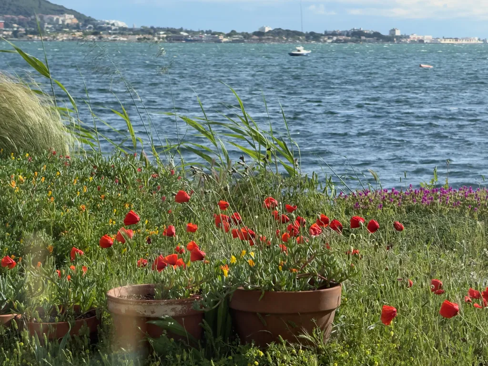
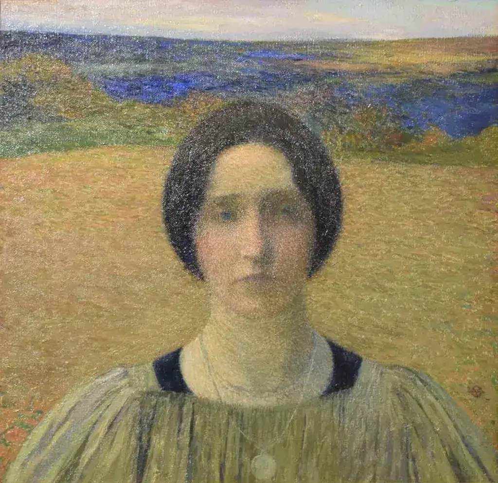
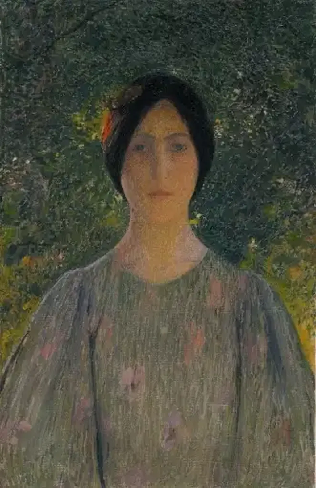
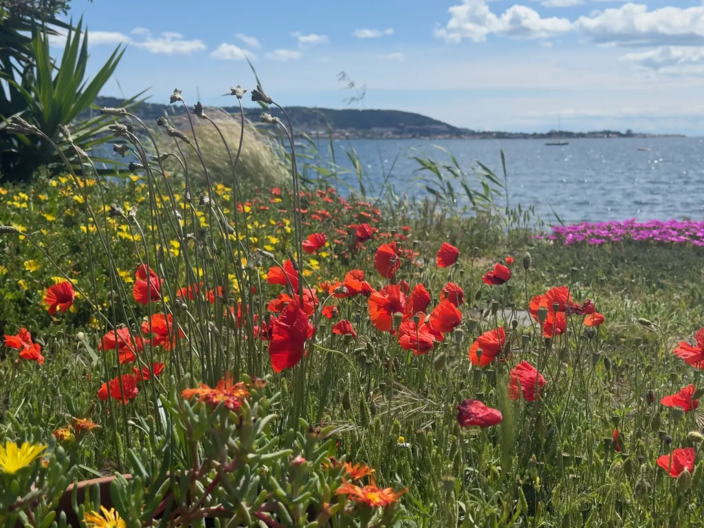

# Mai 2026

### Vendredi 1er, Balaruc

Je reçois encore des mails d’amis qui demandent des nouvelles d’Isa. Répondre me fait mal, puis répondre à l’émotion me ramène en arrière, alors que peu à peu je construis une image de joie autour d’Isa.

---

Émile me dit : « Onze semaines. » Il poursuit le décompte.

### Samedi 2, Balaruc

Le deuil entraîne une fatigue suspecte, sans cause évidente. Beaucoup de mal à m’arracher de la sieste, à entreprendre quoi que ce soit.

### Dimanche 3, Balaruc

Émile 19 ans. Premier anniversaire sans Isa. Une célébration douloureuse.

---

Je commence à écrire, je vois trouble. À cause de mes nouvelles lunettes, portées depuis lundi dernier ? Je reviens aux anciennes et tout redevient clair. Ça fait plus d’un mois que je refais faire les verres. Je croyais que c’était bon, mais non. Ils vont me prendre pour un dingue.

---

J’ai commencé à lire *The Buddha in the Attic*. Tout de suite séduit par le mode narratif, première personne, pluriel. Un nous choral dont les variantes racontent le destin de femmes envoyées en Amérique au début du XXe siècle pour y être mariées. « They took us flat on our backs on the bare floor of the Minute Motel. They took us downtown, in second-rate rooms at the Kumamoto Inn. They took us in the best hotels in San Francisco that a yellow man could set foot in at the time. » « We picked their strawberries in Watsonville. We picked their grapes in Fresno and Denair. We got down on our knees and dug up their potatoes with garden forks on Bacon Island in the Delta, where the earth was spongy and soft. » C’est pas juste un nous, mais un nous déployé. Très fort, et comme souvent avec les trucs narratifs, je m’en lasse assez vite. Isa aurait adoré ce texte sur la condition féminine, la forme servant à merveille le propos d’un héroïsme distribué.

---

Le jardinage a les mêmes vertus apaisantes que l’écriture. J’ai passé la tondeuse en évitant les coquelicots et les marguerites.

### Lundi 4, Balaruc

Mon livre sur Isa pourrait s’appeler *L’expérience humaine*.

---

Il pleut presque toute la journée, comme durant les dernières semaines d’Isa, et c’est difficile, d’autant que les vacances sont terminées et les enfants repartis à leurs études.

---

Passage de Laurence. Ça me fait toujours du bien de parler d’Isa avec ses amies.

### Mercredi 6, Balaruc

Hier soir, Line et Philippe me disent que sur la couverture de *Clair de femme*, le portrait d’Elena Povolozky (1882-1979) par Modigliani leur fait penser à Isa. Les yeux bleu-vert m’ont empêché de voir la ressemblance, mais oui : même haut front, même menton, mêmes cheveux. Isa avait simplement les lèvres plus amples, plus pleines. Dans les années 1990, avant que je la rencontre, a-t-elle acheté *Clair de femme* à cause de la ressemblance ? Le lui avait-on offert pour cette raison ? Mais le roman ne pouvait être en haut de la pile à cause de cette ressemblance. Je commence à me poser des questions auxquelles je n’aurai jamais de réponse.

### Jeudi 7, Balaruc

### Dimanche 10, Salagou

### Mercredi 13, Balaruc

Trois mois, déjà, si vite, si loin. Je rentre de [mon voyage à vélo](https://tcrouzet.com/2026/05/14/bikepacking-plus-que-du-velo/), épuisé. Je ramène les copains à la gare ce matin, puis range, ordonne, corrige pour ne pas penser. La suractivité contre la détresse.

Un lecteur me suggère de lire *De l’amour et de la solitude* de Krishnamurti, un recueil d’extraits de son journal. Une citation en exergue, datant de 1965 : « Sans amour, vous aurez beau faire — courir après tous les dieux de la terre, prendre part à toutes les activités sociales, tenter de remédier à la pauvreté, entrer en politique, écrire des livres, écrire des poèmes — vous ne serez qu’un être mort. Sans amour, vos problèmes iront croissant et se multipliant à l’infini. Mais avec l’amour, quoi que vous fassiez, il n’y a plus de risque, il n’y a plus de conflit. L’amour, alors, est l’essence de la vertu. »

Je n’apprécie pas le ton affirmatif, proclamatoire, sous la forme d’une vérité reçue et non démontrée. Krishnamurti énonce et ne raconte pas. Je tends peu à peu vers le contraire. Tel est désormais mon chemin. Raconter mon épreuve, la partager, sans en tirer des leçons universelles. Parce qu’Isa n’aimait pas les leçons. Elle se défendait d’utiliser « il faut » ou le verbe devoir. Je m’y exerce.

---

« Si Isa te voit de là-haut… » J’entends souvent cette expression, je l’utilise souvent, mais elle n’a aucun sens. Isa ne me voyait pas penser quand elle était vivante, surtout quand elle n’était pas dans la même pièce. Comment pourrait-elle me voir désormais ? Elle ne le peut pas parce qu’elle n’existe plus qu’en moi et en ceux qui l’ont connue. C’est avec mes propres yeux qu’elle me regarde, m’approuve ou désapprouve. Elle et moi on ne fait plus qu’un.

### Jeudi 14, Balaruc

Depuis notre retour de Floride, Isa travaillait demi-assise dans le canapé-lit de son bureau. Je lui répétais que ce n’était pas sain, elle me répondait qu’elle se sentait mieux ainsi. Nous ne savions pas encore qu’elle était malade. Il est presque dix heures quand je me force à me lever. Je descends au rez-de-chaussée et un instant j’ai l’impression que le fantôme d’Isa travaille à son bureau comme il y a déjà si longtemps.

---

Durant mon voyage à vélo, je n’ai pas écrit par manque de force, je n’en ai pas moins pensé à Isa, et même plus qu’à la maison. Elle en a profité pour envahir mes moments de vide et mes rêves.

---

Parfois je me demande à quoi bon continuer. Je passe plus de temps que jamais à partager avec la communauté vélo. J’espère continuer avec la communauté des lecteurs, avec mes fils, mes amis. Reste qu’il m’arrive de chercher le sens de tout ça, de n’en trouver plus beaucoup comme ce soir, après deux heures à remplir des tableaux pour les impôts. Je viens d’arroser le jardin. À Maillardou, la tante d’Isa a planté des iris sur sa tombe. Je suis si loin. En même temps, elle est de plus en plus proche, en moi. J’ai fait chauffer de l’eau pour un roïbos, ce qui ne m’arrive jamais d’habitude, ce que je faisais toujours pour Isa, et j’ai oublié de le faire infuser. Elle me pousse en avant, vers quel horizon ? Je sais la nécessité d’une autre vie, d’autres amours, mais suis incapable de les envisager. C’est de plus en plus surréaliste au fil des semaines.

### Vendredi 15, Balaruc

Je me remets à écrire Isa. Je trouve à cet exercice un apaisement incomparable. Il me semble que mon écriture approche la pureté d’Isa, son humanité. Elle écrit ce texte autant que moi : j’y copie-colle ses mots.

---

Aujourd’hui, je continue en solo la déclaration fiscale que nous faisions à deux depuis notre mariage. Quand je me connecte à Netflix, le profil d’Isa s’affiche. Quand je vais faire les courses chez Picard, la carte de fidélité est au nom d’Isa.

### Samedi 16, Balaruc

M m’envoie un [portrait de femme par Henri Martin](https://pop.culture.gouv.fr/notice/joconde/04670000407) qui évoque Isa, une Isa tristounette, des yeux bleus, mais on retrouve le haut front, l’ovale du visage, les lèvres pleines. Je trouve un autre portrait de cette femme, moins évocateur.

Jamais Isa n’aurait pu rester aussi froide. Elle avait un côté plus fougueux, que j’ai toujours défini « années folles », pensant à la [Renée de Jacques Henri Lartigue](https://levoleurdimages.paris/chronique/65-renee-biarritz/), mais en moins sophistiquée.

### Dimanche 17, Balaruc

Dans un monde obsédé par la rentabilité, l’efficacité, les rendements, faire des choses inutiles, ou qui n’ont de sens que pour mon plaisir, comme arracher les mauvaises herbes dans le jardin devant la maison. Inutiles pour les autres, mais pas pour moi, puisque ces gestes simples m’apaisent depuis qu’Isa est tombée malade. Je les prolonge aujourd’hui, souvent avec un pincement au cœur. L’inutile me devient utile.

---

Pour mon livre sur Isa et sa fin de vie, je relis nos échanges. Ce soir, alors que le soleil se couche, j’attaque décembre 2025 et suis incapable de dépasser le 14, ça me fait mal partout. Une tristesse immense remonte. Pour la calmer, je l’écris ici. Plus que les mots, mes doigts sur le clavier me distraient.

### Lundi 18, Balaruc

Krishnamurti m’insupporte : « Nul ne peut vivre hors de toute relation. » Toujours aussi assertif, péremptoire, tout ça pour balancer des banalités. Je suis d’accord avec ce qu’il dit là, mais sa façon de le dire m’insupporte. Pourquoi ne pas écrire : « Je ne peux vivre hors de toute relation. » Ça me paraît moins violent, moins dictatorial.

Krishnamurti déverse des vérités non démontrées. Je comprends que ça puisse à moment faire du bien, moi ça m’irrite, ça n’est que du vent sans fondement logique. Des messages pour lecteurs en recherche d’une vérité révélée, et non en recherche de leur vérité, c’est-à-dire selon une démarche exploratoire et expérimentale. Je ne vois pas Krishnamurti chercher, il me balance ses trouvailles, oubliant le cheminement qui y mène, ce qui les prive d’intérêt. Parce que le processus m’intéresse toujours plus que sa finalité. Je m’attendais à ce qu’il partage son expérience plutôt que de me sermonner.

---

Suis-je conformiste d’être en deuil ? Je fais comme tous les veufs. Je suis triste, incapable de me projeter vers le futur. Mais quand on se casse une jambe est-on conformiste d’attendre qu’elle guérisse ? Le deuil est une blessure. Il exige un temps de cicatrisation, variable peut-être mais toujours long, parfois infiniment long au risque de ne jamais en revenir.

---

Rosa Montero [citée par S](https://www.rosamontero.es/prensa/La%20rid%C3%ADcula.%20Le%20Monde%20des%20livres.pdf) : « Quand la douleur s’abat sur vous, ce qu’elle arrache en premier c’est les mots. » J’ai réussi à écrire un petit message pour annoncer la mort d’Isa le soir même : je devais le dire, puis seul dans le funérarium j’ai aussi écrit trouvant dans les mots une façon de rendre la douleur supportable.

J’ai beaucoup écrit tout en veillant Isa durant ses derniers jours. Je me suis toujours sauvé par les mots, ou toujours enfui. Encore une fois, je me méfie des généralités comme celle de Rosa. Ce qui a été vrai pour elle ne l’est pas pour moi. J’ai besoin des mots pour survivre, et Rosa aussi, c’est ce qu’elle raconte.

---

Je ne reverrai plus jamais Isa. Face à cette réalité au début inconcevable et qui me reste en grande partie inacceptable, je réinvente Isa en moi, je traque ses mots, les connecte et l’entends les prononcer. Je n’ai même pas besoin de regarder ses photos. Sa voix dans ma tête, c’est elle, avant tout.

Rosa comme moi n’a pas pleuré au début, en état de choc. C’est après qu’arrivent les larmes, par surprise, après un geste, une pensée, une odeur, souvent dans la solitude immense, décuplée.

Presque tous les jours je parle avec des proches. « Comment tu vas ? » Moi : « Je survis. Je ne suis pas déprimé, je suis triste, même quand je rigole, surtout quand je rigole. Je n’ai plus d’avenir. Je n’anticipe qu’une solitude terrifiante. »

Aujourd’hui j’ai terminé de réaménager la grotte d’Isa pour la rendre à son état de chambre d’amis. J’ai effectué des travaux qu’elle demandait depuis des années : fixer des patères, changer les matelas, revoir le système de ventilation, ajouter une moustiquaire, boucher les minuscules trous creusés par les fourmis. J’ai tardé parce que je n’aimais pas qu’Isa s’isole dans ce temple du féminisme. J’aime cette pièce boisée, en retrait de la maison, je l’aime parce qu’Isa y a passé beaucoup de temps. *A room without a view*.

### Mardi 19, Balaruc

Écriture, vélo, bricolage : j’installe une série de prises sur la cheminée pour éviter à des dizaines de câbles de traîner partout. Encore un truc qui dérangeait Isa. Voilà c’est fait, pour toi, en pensant à toi. Je commande aussi un sous-main pour la table de la cuisine, parce que j’ai tendance à la rayer avec mon ordi, et je me faisais toujours engueuler. Des remarques qui ne me touchaient pas deviennent des exigences bénéfiques.

---

Ma tante m’appelle. Elle a perdu le frère de ma mère à soixante ans. Elle ne s’en est jamais remise. Les soirées d’hiver lui restent insupportables dans la solitude.

### Mercredi 20

Je tombe sur [*L’invention de soi après une crise : le journal de deuil*](https://books.openedition.org/pur/56280?lang=fr). Ce que je fais serait commun, une façon de guérir. « Le deuil, de social et collectif, est devenu privé, individuel et doit cantonner son expression à l’intimité. Le mouvement de fond qui nous porte du début du XIXe siècle à aujourd’hui est donc celui d’une intériorisation croissante du deuil de moins en moins ritualisé et socialisé. »

Je ne cache rien, j’ai besoin de partager. Nous en sommes tous là avec les réseaux sociaux. Le rapport au deuil est-il en train de changer ? Avec mon carnet et mon livre en chantier, j’invente un rituel, je socialise mon deuil pour ne pas en faire une prison, avec l’espoir d’une libération, d’un nouvel épanouissement. Je suis d’autant plus poussé en avant qu’Isa avait cette exigence.

Barthes : « Le « Travail » par lequel (dit-on) on sort des grandes crises (amour, deuil) ne doit pas être liquidé hâtivement ; pour moi il n’est _accompli_ que dans et par l’écriture. » Il a écrit un journal de deuil après la mort de sa mère, publié à titre posthume. Mon partage en quasi\-temps réel devient un nouvel exercice, qui me fait du bien, et, plus étonnant, fait du bien à certains d’entre vous, qui ne connaissaient même pas Isa. Cette épreuve nous ramène à l’expérience humaine la plus stricte.

Gide aussi a été veuf : « Depuis qu’Em. m’a quitté j’ai perdu goût à la vie et partant, cesse de tenir un journal qui n’aurait plus pu refléter que désarroi, détresse et désespoir. » Lui, le grand diariste, s’arrête d’écrire avant d’accepter d’écrire son deuil. J’ai aussi peur de rabâcher ma tristesse, mais elle ne pèse pas toujours sur moi, surtout quand j’écris et malaxe ce qui m’arrive pour m’en grandir.

Le deuil, c’est l’appropriation du mort. Isa n’est plus là, mais je peux l’avoir pour moi seul, au plus profond de moi, sans que personne ne puisse me la dérober. C’est un amour total, sans menace de rupture, menace qui pèse sur tous les couples sains d’esprit.

« L’on ne peut manquer d’observer que le journal de deuil suscité par le deuil, monothématique en quelque sorte, semble plus fréquent à partir du XXe siècle qu’auparavant. Une hypothèse à vérifier serait la suivante : parce que l’épanchement lié au deuil trouve de plus en plus difficilement un vecteur social pour s’exprimer, le recours à une écriture articulée sur le calendrier, de même que le travail de deuil s’inscrit dans une durée, s’impose. Une publication possible du journal de deuil permettra même de ramener le deuil dans la sphère du social et du collectif : rendu public par l’écriture intime, il pourra de nouveau se faire entendre. »

Moi qui batifolais entre littérature, philosophie et technologie me spécialise dans le deuil. Je reste incapable de me projeter, d’ouvrir la porte au reste du monde. Je ne collecte des articles pour [mes digests](https://tcrouzet.com/tag/digest/) qu’avec difficulté, rien d’autre que ma peine ne m’intéresse, ce qui m’interdit d’aller vers les autres. Je redoute le week-end prochain où je serai à La Comédie du livre à Montpellier, face aux lecteurs.

_La Dépossession, Journal de Ligenère_ (Gallimard, 1973) de Jacques Borel et à _Je ne suis pas sortie de ma nuit_ (Gallimard, 1997) d’Annie Ernaux, deux journaux d’accompagnement de la mort d’un proche. J’ai tenu un journal de la maladie d’Isa très distendu, sauf durant les trois dernières semaines. Mon travail aujourd’hui : reconstruire les étapes antérieures. Il ne s’agit plus d’un journal, mais d’une réédification, d’une recréation d’Isa, non pas dans la maladie, mais grâce à la maladie. Je fais de la maladie le révélateur de qui elle était. Voilà ce qui m’intéresse, ce que je veux dire à nos fils, peut-être pour vous, parce que je crois qu’Isa était hautement philosophique, sage au sens le plus classique.

« L’écriture peut être entendue comme une manifestation du deuil, un des vecteurs du « processus intrapsychique, consécutif à la perte d’un objet d’attachement et par lequel le sujet réussit progressivement à se détacher de celui-ci. » J’ai été clair, je ne vais pas dans cette direction freudienne du détachement, mais vers une ingestion : je m’isabellise.

Eugénie Guérin : « Je ne sais, mais n’ayant plus le plaisir de lui faire plaisir, ce que je vois n’offre pas l’intérêt que j’y trouvais jadis. Cependant rien au-dehors n’est changé, c’est donc moi au-dedans. \[Jusque-là je partage, puis pas du tout.] Tout me devient d’une même couleur triste, toutes mes pensées tournent à la mort. Ni envie, ni pouvoir d’écrire. »

S’adresser au mort serait une constante. Il m’est arrivé d’écrire « tu » avant de basculer à la troisième personne, à mesure que je statufiais Isa.

De la différence entre perdre un père ou une mère (Roland Barthes) et perte la compagne ou leu compagnon d’une vie (Marie Curie, Rosa Montero…). Dans un cas, on sait depuis l’enfance que ce moment arrivera, avant notre vieillesse ; dans le second, on espère qu’il ne surviendra jamais ou très tard. C’est alors une perte souvent irrémédiable, et de nature très différente — je peux en témoigner pour avoir aussi perdu mon père. La perte d’Isa secoue ma terre et en change la géographie à jamais.

### Jeudi 21, Balaruc

J’ai vécu avec Isa presque la moitié de sa vie, vingt-sept années très exactement complètes, et je l’ai connue mieux que quiconque, mieux que ses parents, ses sœurs, ses ex. C’est un privilège et nous n’imaginions pas qu’il serait aussi bref.

[Pablo](https://es.wikipedia.org/wiki/Pablo_Lizcano), l’époux de Rosa Montero, est mort en 2009. Elle avait 58 ans. Trois ans plus tard, dans *L’Idée ridicule de ne plus jamais te revoir*, elle affirme que jamais personne ne la connaîtra mieux que lui (ils ont vécu 21 ans ensemble), même si elle vivait encore trente ans. J’aimerais oser lui demander où elle en est seize ans plus tard. Cet avenir me fiche la trouille.

Rosa cite une étude de 2011 expliquant que les veufs souffrent moins de dépression que les divorcés ou les séparés. Logique : nous n’en voulons à personne. Nous ingérons le disparu et continuons à vivre avec lui. Rosa s’interroge : « Est-ce que, à tout hasard, ces foutues morts pourraient générer une petite consolation, après tout ? » Consolation ne me paraît pas le mot juste. Plutôt un surplus de vitalité comme s’ils nous confiaient ce qu’ils n’ont pas consommé. Une exigence d’amour comme l’a écrit Romain Gary. J’ai la certitude d’être deux désormais. Pas simple pour les autres.

---

Siri Hustvedt commence à écrire *Ghost Stories*, son journal de deuil, deux semaines après la mort de son mari, Paul Auster. Je me suis remis à mon journal public presque exactement deux semaines après la mort d’Isa, comme si les mots partagés étaient la seule solution.

### Vendredi 22, Balaruc

Olga Tokarczuk, prix Nobel de littérature 2018, [reconnaît utiliser l’IA pour ses recherches et son travail préliminaire](https://artreview.com/why-olga-tokarczuk-is-wrong-about-ai-opinion-helen-charman/). Qui ne le fait pas, excepté les imbéciles, les mêmes qui n’utilisaient pas les moteurs de recherche à la fin des années 1990, les mêmes qui se croient de vrais littérateurs par opposition aux autres qui ne le seraient pas ?

De toute façon, plus personne ne lit, excepté les vieux et les jeunes fans de romances et de quelques genres dépréciés, car usant de tropes éculés, sans la moindre recherche stylistique ou formelle. Une littérature dont le but n’est pas de surprendre, déranger ou questionner, mais seulement de distraire, où on attend des saveurs déjà appréciées. D’où la mode des fanfictions, des clonages en série, des transferts de genre. Je lis *Fourth Wings* pour bien comprendre tout ça. C’est stupéfiant que de tels livres connaissent des succès planétaires.

Tu prends *Harry Potter*, tu changes le système de magie — des dragons dans le cas de *Fourth Wings* —, et tu réécris la même histoire, avec moins de talent, mais ça marche quand même. C’est tout simplement incroyable, un peu effrayant, qu’il y ait des auteurs pour faire ça — les IA en sont déjà capables —, des lecteurs pour lire de telles insanités, et moi en bout de chaîne pour plonger dans ce merdier.

À quoi bon lire quand on peut donner un texte à une machine qui nous le résume ? Moi, je sais, mais la plupart des autres ne le savent pas. C’est terminé, la lecture. Ça prend trop de temps. On dirait même que les derniers auteurs écrivent des textes rien que pour nous faire perdre du temps, ne nous proposant rien de neuf. L’écriture ne sera bientôt plus qu’une thérapie. À moins d’un sursaut que j’espère sans le voir venir.

Dire que j’ai accepté l’invitation à La Comédie du livre, dès cet après-midi, où je vais croiser des ennemis de l’IA qui écrivent comme des IA, des lecteurs qui n’aiment que relire les rares livres déjà lus, des prétentieux qui se croient de véritables auteurs. Moi, je serai là, parmi eux, à me demander ce que je fous là plutôt que d’arracher les mauvaises herbes dans le jardin. J’ai accepté l’invitation après le décès d’Isa, croyant que voir du monde me ferait du bien, et ça me fiche le bourdon rien qu’à l’idée. Pourvu que je croise quelques personnes sympathiques.

---

J’aime un texte quand il me dérange, me questionne, me donne envie de l’arrêter pour écrire ou réfléchir, quand il ne respecte aucun trope… L’IA est incapable de tout ça. Jamais elle ne surprend, jamais elle ne dérange, jamais elle ne me devient désagréable (sinon parce qu’elle est trop agréable). Je ne comprends pas les lecteurs qui cherchent le bien-être dans un livre. Un livre n’est pas un jacuzzi.

---

En route vers Montpellier, sur *La Terre au carré*, Samah Karaki explique comment notre cerveau se laisse séduire par les auteurs, les génies, les héros… Ce qui explique le succès des tropes. L’économie cognitive pousse au moindre effort. Faut-il un surplus de puissance cognitive pour dévier de cette trajectoire ? Ou du moins un entraînement, un conditionnement inverse ?

---

Je m’emmerde comme prévu, pas d’auteurs de part et d’autre avec qui discuter, l’un autrice de romance dont la quatrième de couv est un trope, l’autre une autrice jeunesse. Mais qu’est-ce que je fous là. Devant un défilé de lecteurs optiques, je termine le livre de Rosa, magnifique tissage entre son deuil et celui de Marie Curie. Un texte d’une grande liberté, sans interdit, d’une fluidité remarquable.

Beaucoup de passages résonnent avec ce que j’ai vécu.

« Le monde continue à l’identique sans lui ? Votre tête le comprend, mais votre cœur reste sans voix. »

« À croire que votre mort se réincarne en vous d’une certaine façon, et voilà que vous vous mettez à ressentir comme venant de vous certaines phobies ou passions de l’absent que vous partagiez pas avant. »

Rosa parle avec justesse du « temps sirupeux de l’attente du décès de l’être cher. \[…] La proximité de la mort vous emplit parfois d’une sérénité curieuse, presque visionnaire. »

Elle évoque la compositrice Minna Keal, revenue à la musique une fois à la retraite, donnant son premier concert à quatre-vingts ans. Et qui a déclaré : « Je croyais que j’arrivais à la fin de ma vie, mais j’ai maintenant l’impression qu’elle recommence. C’est comme si je vivais ma vie à l’envers. »

Enfin : « Plus on vieillit, plus on sent que savoir jouir du moment présent est un don précieux, comparable à un état de grâce. »

---

C passe me voir à mon poste devant mes malheureux bouquins orphelins de lecteurs curieux. Elle me dit qu’Isa lui a offert ses partitions de violoncelle, de quand elle était au conservatoire, des partitions annotées. C en était bouleversée, touchée par le cadeau et la confiance.

### Samedi 23, Balaruc

À vélo, nous longeons un sentier quasi fermé le long de la voie ferrée littorale quand nous rejoignons un chemin plus large et tombons sur un flic de la protection de l’environnement, dans son 4x4. Il nous accuse de déranger les oiseaux alors qu’un TGV passe à fond de train et que nous ne nous entendons même pas parler. Les oiseaux se seraient habitués à ce bruit. Sans doute aussi à celui du 4x4, comme à ceux des pêcheurs et des chasseurs. Je lui dis qu’il se fout de notre gueule. Mes amis temporisent. Je manque de patience avec les abrutis en uniforme. J’ai tenté de lui expliquer que quand la loi est mal faite, désobéir s’impose. S’il avait surgi avec un sac à dos ou à vélo, je l’aurais davantage respecté. Fais ce que je dis, pas ce que je fais. Tu parles d’une protection du littoral avec des cons pareils.

---

Table ronde sur l’IA à Montpellier. Comme toujours, les plus grands critiques de l’IA en sont les premiers consommateurs avec leurs comptes sociaux. Qui se veut vertueux doit l’être de bout en bout. Mon empreinte numérique reste très faible même s’il m’arrive d’utiliser l’IA.

### Dimanche 24, Balaruc

Siri Hustvedt commence par parler de la dislocation du temps qui accompagne le deuil, processus commencé pour moi dès le diagnostic du cancer.

Je trouve du réconfort dans les mots des autres écrivains. Je ne suis que le énième de la famille à vivre la perte et à en parler pour survivre.

Siri évoque sa désorientation initiale. Je n’ai rien connu de tel, je suis resté à la maison, y recevant les amis, leur répétant mes angoisses plutôt qu’à un thérapeute. Et quand j’ai pris mon vélo ou ma voiture pour les courses, je ne me suis pas perdu en chemin. J’ai continué à mal dormir (et je dors mieux depuis que j’ai débranché le réveil et basculé en régime sans gluten, ce à quoi s’ajoute mon vieux régime sans lactose). Soustraire des trucs non nécessaires, comme le gluten, ne peut pas faire de mal, surtout quand le cancer m’a privé de mon double, de ma moitié, de mon second cerveau.

Siri ironise, se moque d’elle-même. L’humour, sans doute une bonne façon d’affronter le deuil. Ça m’arrive, mais jamais quand j’écris. C’est un problème, pas nouveau.

Dans les jours qui suivent l’enterrement, Siri est prise d’une frénésie de rangement, comme moi. Tous les médicaments dans un sac direction la pharmacie, de quoi shooter un régiment. Mais moi je connais leur destin : le tout incinéré et non distribué aux pays pauvres, car la traçabilité n’est plus assurée. Argument fallacieux pour des boîtes non ouvertes.

Dès le départ du corps d’Isa de la maison, j’ai demandé aux enfants de m’aider à transférer dans le garage tout ce qui était médical. Comme pour effacer toute trace de ce qui venait de se passer, une réaction instinctive que personne n’a commentée.

J’ai rangé durant trois semaines pour finir par m’arrêter soudainement quand j’ai mis la main sur un des pulls d’Isa. Bloquage. Depuis je n’ai plus touché à rien.

Dans le livre sur Isa, je n’ai pas besoin de parler d’écriture puisque je reconstitue le journal de ses sept derniers mois à partir de souvenirs, mails, messages, notes. Mais si j’écrivais un livre sur le deuil, comme Siri, je serais obligé de dire à quel point l’écriture me sauve. Il me semble désormais impossible d’écrire le deuil sans parler de ce qui m’aide à tenir debout. Raconter est ma médication. Je le fais au téléphone souvent, et là, maintenant.

---

« Le deuil n’est pas une maladie », écrit Barthes. C’est une reconstruction, une réinvention, à la fois renforcement des fondations, ancrage, et mystère de ce qui pourrait advenir, souvent rien du tout, alors la reconstruction échoue, il ne subsiste que les fondations, que les ossements fossilisés.

J’ai perdu le goût des photos, toujours des photos en souvenir de lumière, pas des photos d’art — parce que je partage plus avec Isa, je perds le besoin de partager avec vous.

Le ciel est rouge sang ce soir. Les martinets se gavent d’insectes. Je regarde sans sortir mon téléphone. Je crie à Émile de regarder. Il ne m’entend pas. Il travaille toujours avec de la musique.

Le deuil me rend acceptable l’idée de ma propre mort. Je ne la souhaite pas, sans plus du tout la craindre. Je n’arrive plus à être terrorisé.

J’ai eu envie de gifler les gens qui m’ont dit : « Au moins elle ne souffre plus. » J’aurais préféré qu’elle souffre et vive, elle préférait souffrir et vivre, même si en quelques rares moments de désespoir elle m’a dit que ce n’était plus supportable. Aucun « au moins » n’est recevable. Surtout ne dites jamais une connerie pareille à un endeuillé.

### Lundi 25, Balaruc

J’écris sur Isa ici même et dans ce livre désormais intitulé *L’Expérience humaine*, et l’un et l’autre se colorent. Je triche parfois avec la chronologie des pensées, certaines écrites après se retrouvant injectées avant, parce qu’il me semble qu’elles appartiennent aussi à ce moment. Le temps a perdu toute réalité. Je date les entrées dans les deux textes, mais tout se carambole. J’aurais pu découvrir le roman de Romain Gary avant la mort d’Isa, sans oser lui en parler.

Siri : « He thought he had more time. He believed he had months. I felt sure he didn’t, but I said nothing. » Est-ce une constante ? Moi, aussi, je me suis souvent tu.

Siri s’agite beaucoup dans son texte alors que je passe le plus clair de mon temps à regarder l’étang, écrire, pédaler ou jardiner. J’étais invité hier soir à une soirée, je n’ai pas eu le courage d’y aller. Je n’ai rien à dire aux gens et quand ils me savent en deuil, ils sont embarrassés. L’intelligence d’Isa me manque. Je ne peux m’empêcher de comparer.

---

Le deuil équivaudrait à une amputation avec un membre fantôme d’après Merleau-Ponty et C. S. Lewis (évoqué par Siri). Et si c’était aussi la naissance d’un nouveau membre ?

---

Je me suis assez vite habitué à la mort de mon père. J’ai longtemps rêvé de lui, puis de moins en moins. Écrire *Mon père, ce tueur* m’a beaucoup aidé, mais c’était trois ans après. J’ai tout de suite su que je surmonterais ma peine. Il en va tout autrement cette fois, même si déjà il m’arrive de ne pas penser à Isa (pas longtemps, surtout quand le monde est beau, les gens heureux ou de vrais connards). Je n’entrevois pas d’après. Après n’existe pas. La mort d’Isa n’est pas un horizon à dépasser, ni même à atteindre, c’est un fait gravé en moi. Le deuil n’est pas une échéance, il n’a pas de date de péremption à un an ou deux. C’est un commencement, souvent d’une extinction plus ou moins rapide.

---

Je commence à ranger la buanderie, avec une montagne de babioles d’Isa, de vieilles fringues, des textiles divers. Les mettre dans un sac poubelle m’est difficile.

### Mardi 26, Balaruc

Siri parle surtout de Paul. Elle enchaîne les anecdotes. Je n’ai pas grand-chose d’anecdotique à raconter. Ce qui m’arrive est si énorme qu’il rend insignifiants les autres évènements. Quand une bombe atomique explose, on se préoccupe moins des coups de fusil.

---

Je termine le rangement de la buanderie, je jette des sacs, de vieux draps, des rideaux, des trucs invraisemblables entassés sans y être spécialement attachés. Puis je tombe sur des souvenirs des enfants que je dispatche dans la maison, des photos d’Isa, de nous. Je tombe sur une caisse remplie de chaussettes colorées comme Isa en portait à une époque. J’en ai essayé une, elle me va et je la conserve. Tous les jours, j’en essaierai une nouvelle.

---

L’été dernier, nous avions imaginé installer un store banne sur la terrasse de la cuisine. Il a été posé aujourd’hui, comme Isa l’aurait souhaité. Elle approuve. Nous n’aurons plus besoin de déplacer sans cesse le parasol.

---

Depuis la mort d’Isa, j’utilise son huile de douche Bioderma, ce qui me fait partager son odeur. J’ai aussi terminé ses tubes de dentifrice, mais ça m’a moins fait d’effet, nous utilisions les mêmes.

---

Laurence vient de me donner un enregistrement d’Isa d’une trentaine de minutes où elle la fait parler du bonheur. Mais pourquoi ça ne dure pas plus longtemps ? La séquence a été enregistrée un matin ensoleillé de février 2025 chez Laurence, sans doute avant qu’Isa commence les rayons, quand elle avait retrouvé un brin d’autonomie et conduisait à nouveau. Elle parle avec une clarté stupéfiante, une clarté radiophonique, avec une douceur extraordinaire. Laurence lui demande c’est quoi le bonheur et soudain j’éprouve du bonheur en écoutant Isa, et mesure combien j’ai été chanceux de vivre toutes ces années auprès d’elle. Je n’ai jamais rencontré personne d’aussi clair, d’aussi fluide. Je trouve sa voix de plus en plus belle, je la trouve de plus en plus belle.

---

J’aime l’odeur de la maison quand les draps sèchent sur la rampe de la mezzanine dans la chaleur de l’été.

### Mercredi 27, Balaruc

Me séparer du corps d’Isa, l’abandonner dans la tombe a été moins difficile que me séparer de ses fringues. Peut-être parce que c’était impossible de conserver le corps, peut-être parce que j’étais entouré. Là, je range seul, remplissant sac poubelle sur sac poubelle, mettant de côté les affaires à donner aux amies. Les placards vides me hanteront pour toujours. Je le sens.

---

Le récit de Siri devient un bulletin médical d’autant plus ennuyeux qu’il me rappelle de mauvais souvenirs. Elle et moi ne sommes pas dans la même situation en tant qu’auteurs endeuillés. Paul est une star et Siri n’a pas besoin de le raconter, alors que moi je veux montrer qu’Isa est le genre de star dont le siècle a besoin, une star anonyme, discrète. Je fais de la maladie un révélateur, un fil conducteur, elle n’est en aucun cas le sujet.

### Jeudi 28, Balaruc

J’ai le temps de faire des choses que je ne faisais pas. J’ai peur qu’elles se terminent et de rester paralysé. C’est comme le livre sur Isa. Lui aussi aura une fin, pas si lointaine. J’essaie de ralentir. Je prépare un diaporama pour la commémoration du 6 juin. Isa remplissait ma vie, c’est tout simple. Sa disparition fait peser sur moi un silence vertigineux. J’ai encore jeté aujourd’hui.

### Vendredi 29, Balaruc

Le livre de Siri sur Paul Auster n’est guère intéressant, encore moins littéraire, c’est un livre pour ne pas oublier ce qui s’est passé, un compte rendu, sans ambition artistique ou philosophique, un livre de famille partagé en public. Aucun éditeur ne l’aurait publié si ce n’était lui, si ce n’était elle. J’y découvre simplement que ce qu’ils ont traversé ressemble à ce que nous avons traversé, ce qui ne m’aide en rien, sauf pour savoir ce que je ne veux pas écrire, mais avec la crainte de tomber dans le même piège.

---

La rage du rangement m’a reprise. L’échéance du 6 m’aide à inventer des occupations, certaines absurdes comme installer une ampoule dans la niche de la cheminée.

---

Moins j’utilise les réseaux sociaux numériques, plus les comportements que j’y observe m’indisposent, comme ces gens qui s’abonnent à mon Substack et se désabonnent au bout de quelques jours alors que je n’ai rien publié (plutôt que de gens, je devrais parler de robots). Cette remarque, bien que souvent répétée, continue de me désespérer. C’est si dérisoire. Nous valons mieux que ça. 

---

Barthes : « La Dépression viendra quand, du fond du chagrin, je ne pourrai même plus me raccrocher à l’écriture. » Siri, qui a beaucoup lu sur le deuil, évite de répéter ce que tout le monde dit, ce dont ne se prive pas Barthes (il ne croit même pas écrire des observations originales — comme si on pouvait être original avec quelque chose d’aussi ancien que le deuil —, il se contente d’échapper à la dépression).

---

Nos enfants ont connu une seule maison jusqu’à ce qu’ils la quittent pour leurs études, c’est rare cette fidélité au lieu (avec la parenthèse en Floride). Isa a connu deux maisons familiales à Nancy, moi trois à Balaruc, tout ça dans des mouchoirs de poche, mais pas d’unité de lieu pour nous deux. Je ne suis pas sûr que la stabilité du lieu compte beaucoup dans le développement des enfants. Jamais rien lu à ce sujet.

### Samedi 30, Balaruc

Guillaume Vissac sur le livre : « si je ne suis pas la seule personne capable de l’écrire, ça ne rime à rien de le sortir. » Nous devrions toujours nous le dire. Mais aussi « si je suis la seule personne capable de le lire, ça ne rime à rien de le sortir. » En revanche : « l’écrire a toujours du sens. »

Je suis le seul capable d’écrire sur Isa comme je le fais, est-ce une raison suffisante pour un jour sortir le livre ? J’en sais rien, reste que je l’écris comme si des lecteurs qui ne nous connaissent ni l’un ni l’autre pouvaient le lire et y trouver matière.

J’ai un projet : « Montrer que les discrets, comme Isa, sont les véritables héros du monde en transition. » Isa avait la discrétion pour exigence, jusqu’à refuser les réseaux sociaux, les trouver suspects dès les premiers jours. Un paradoxe pour une responsable marketing.

Depuis que mon livre est devenu *L’expérience humaine* et non seulement *Isa*, il a changé de dimension, et la dimension d’Isa me paraît beaucoup plus vaste.

### Dimanche 31, Balaruc

Siri explique comment le cerveau fabrique des fantômes du disparu exactement comme avec les membres fantômes après les amputations. Il nous raconte leurs visites. C’est un magnifique romancier. Habitué à voir Isa à son bureau ou dans le canapé, il y matérialise Isa. J’en éprouve un contentement passager, mais je n’en tire aucune conclusion quant à l’existence d’une autre réalité. Je vis avec mes perceptions, je suis elles, mais elles ne sont qu’à moi, Isa est à moi, pas hors de moi. J’aimerais tant qu’il en soit autrement comme j’aurais aimé qu’elle ne tombe pas malade. Malheureusement mes désirs sont rarement exaucés.

Siri : « Many cultures distinguish good deaths from bad ones. Paul had a good death. » Isa aussi.

J’ai été célibataire jadis, avec cette sensation que tout restait à réinventer. Au contraire, le deuil me limite. Il exerce sur moi une pression morale dont je devine l’influence sournoise. Publier une petite annonce du type « veuf cherche veuve » me serait impossible. Penser ces quelques mots suffit à me terrifier. 

%% Des amis, même des proches, ne viendront pas à la commémoration pour Isa au prétexte que ce serait trop douloureux. Comme si c’était simple pour moi ? Une commémoration c’est pour célébrer le disparu et soutenir les proches, non ? C’est aussi pour se faire du bien, pour célébrer la vie. Du mal à avaler l’excuse du « trop douloureux ». Je préfère qu’on me dise avoir d’autres obligations. %%

#carnets #y2026 #2026-6-1-13h00
