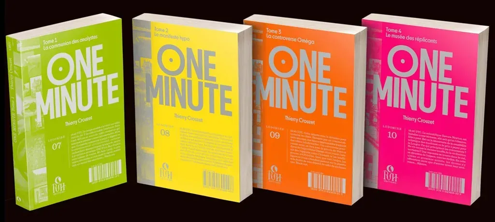
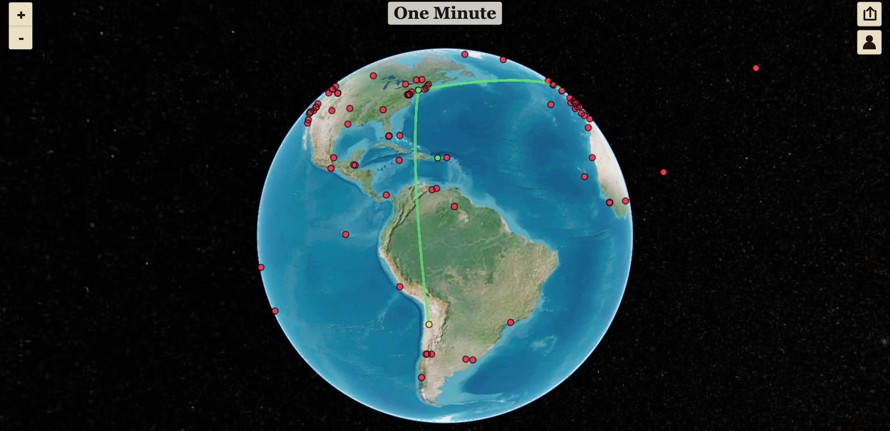
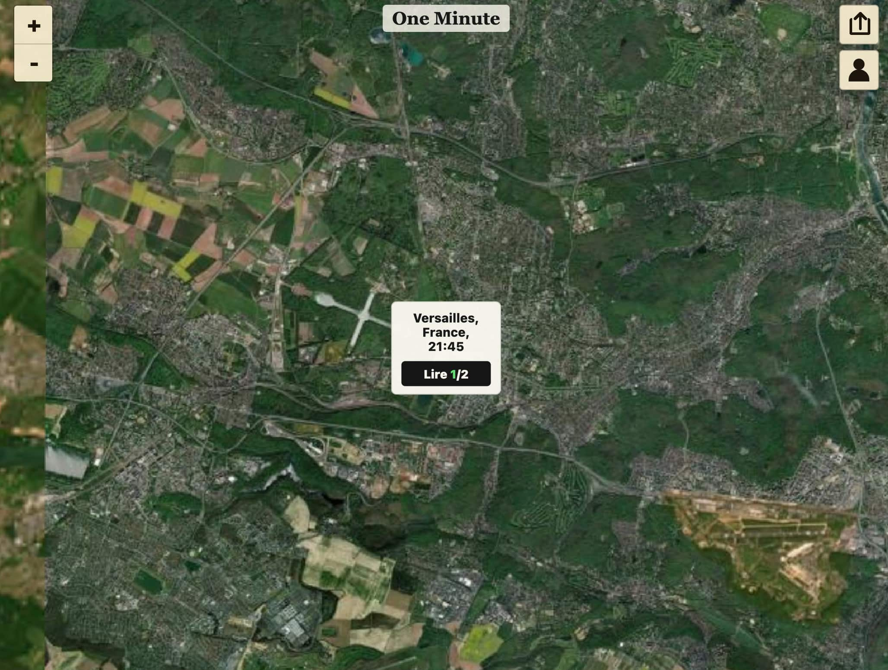
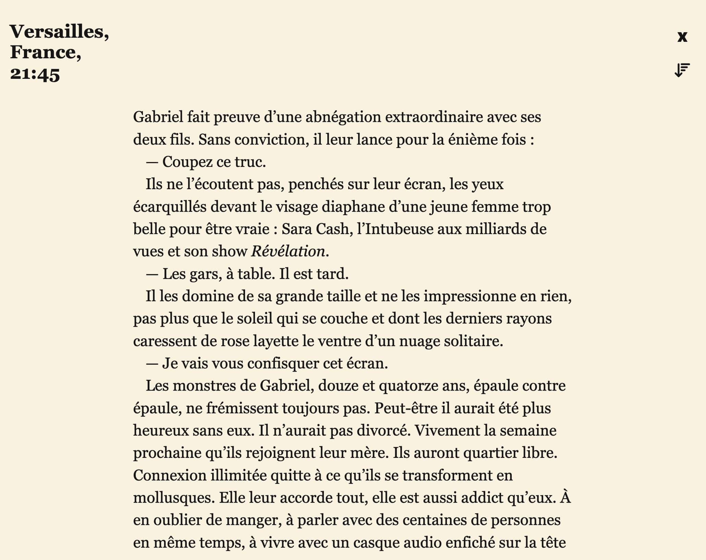
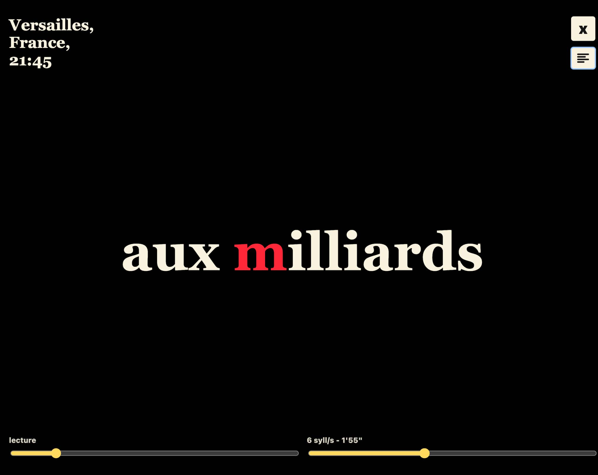
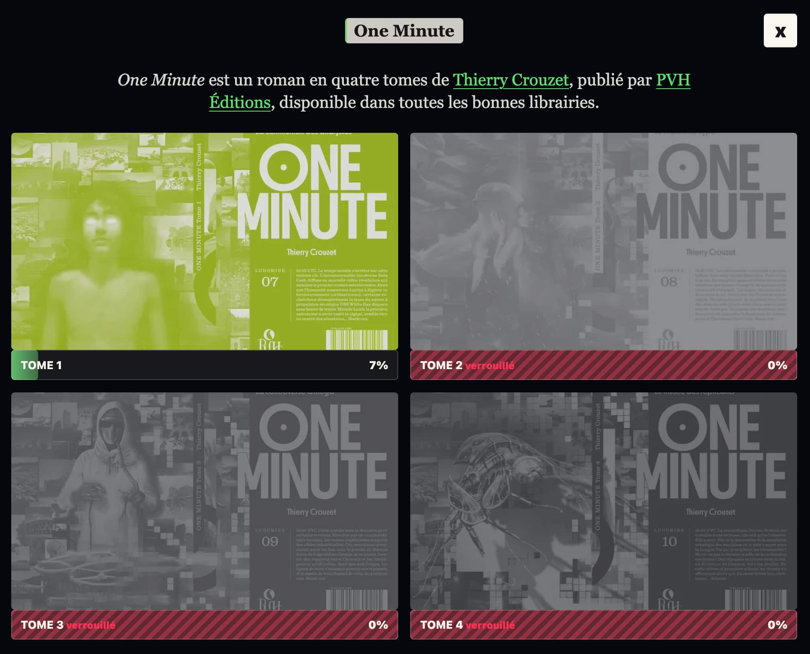
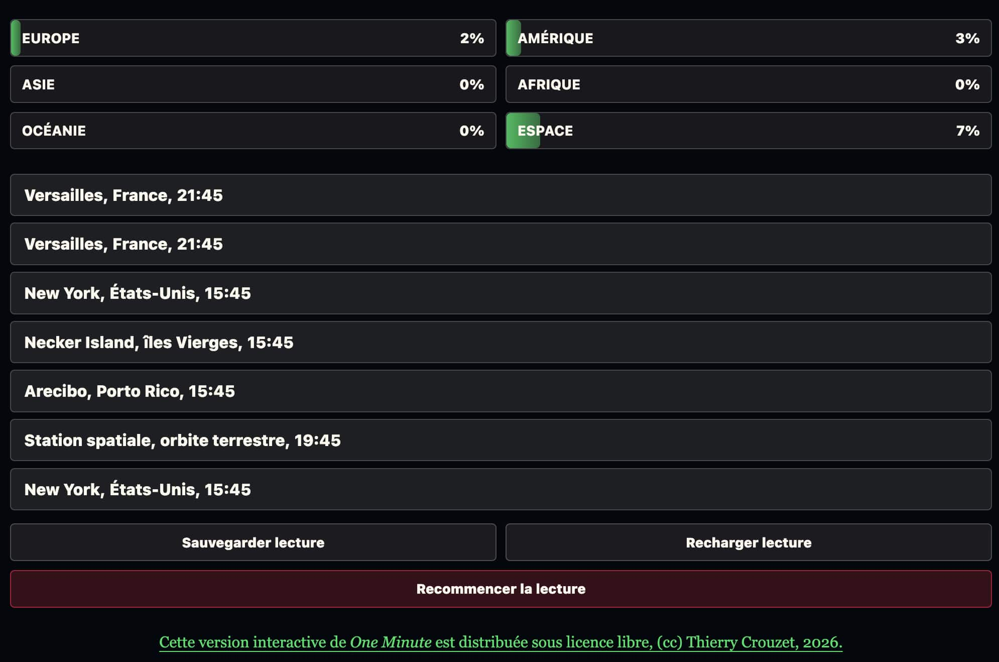

# J’ai transformé un roman en carte interactive du monde

L’IA peut venir au secours de la littérature, mais pas comme vous vous y attendez. Il n’est pas question de demander aux machines d’écrire à notre place, ni même de nous aider à brainstormer, plutôt de donner à nos textes de nouvelles formes d’existence.

Quand on écrit des textes nativement numériques, [comme mes carnets avec leurs photographies](https://tcrouzet.com/carnet-de-route/), on les repense nécessairement pour les projeter sur papier. Certaines projections sont homothétiques, les œuvres alors strictement identiques ; d’autres fois il y a une perte comme avec le globe terrestre projeté sur une carte.

Inversement, on peut projeter en numérique des œuvres initialement publiées sur papier, ce qui se fait le plus souvent de façon homothétique avec les ebooks.

J’ai eu envie de tenter une expérience un peu différente.

* En 2015, j’ai publié en numérique [*One Minute*](https://tcrouzet.com/books/une-minute/), un roman quasi interactif, nourri au fil des jours par les commentaires des lecteurs.
* En 2022, *One Minute* a été publié dans sa version définitive, sans les commentaires, sur papier.
* Aujourd’hui, en 2026, je republie le roman sous forme numérique, mais pas d’un ebook, plutôt d’[une web app](https://tcrouzet.github.io/OneMinute/) où j’explore la dimension géographique et non temporelle du récit, puisque les 380 chapitres se jouent à la même minute UTC.

Je rêvais depuis longtemps de cette mise en forme. J’ai vibe codé l’app, mais en disant exactement ce que je voulais, allant jusqu’à nommer les fonctions pour les protéger des modifications intempestives. J’aurais aimé que les chapitres soient lus à voix haute, mais je n’ai pas réussi à générer des lectures convaincantes. J’en suis maintenant à rêver d’une vidéo par chapitre.

Cette petite expérience laisse entrevoir une seconde vie pour les textes, en leur ajoutant du code. Certes la structure de *One Minute* se prête à ce jeu, mais l’expérience pourrait être reproduite pour beaucoup de textes, à des fins ludiques, promotionnelles, expérimentales…

[Peut-être qu’explorer le monde avec la web app *One Minute* vous donnera envie de lire dans le calme et loin des écrans les magnifiques livres publiés par PVH.](https://tcrouzet.github.io/OneMinute/)

[Le GitHub du projet *One Minute*…](https://github.com/tcrouzet/OneMinute)

#netculture #ia #y2026 #2026-7-19-11h00
