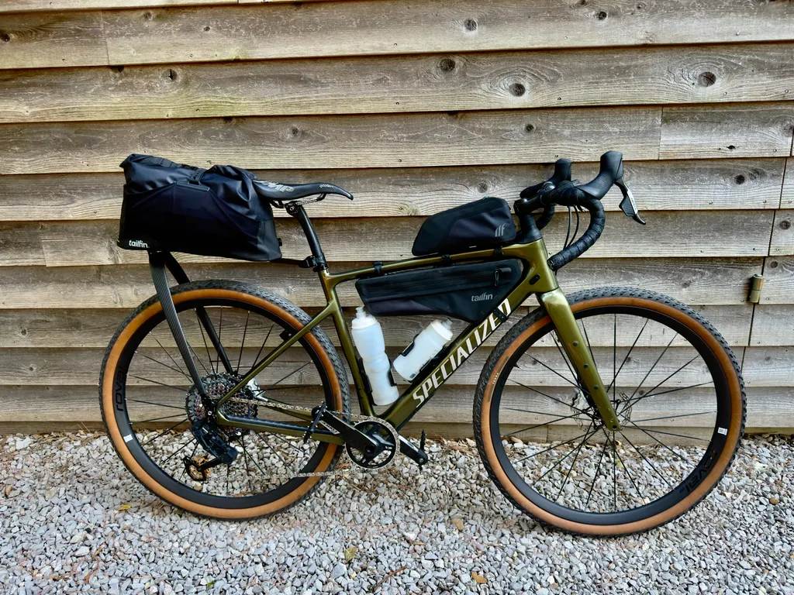
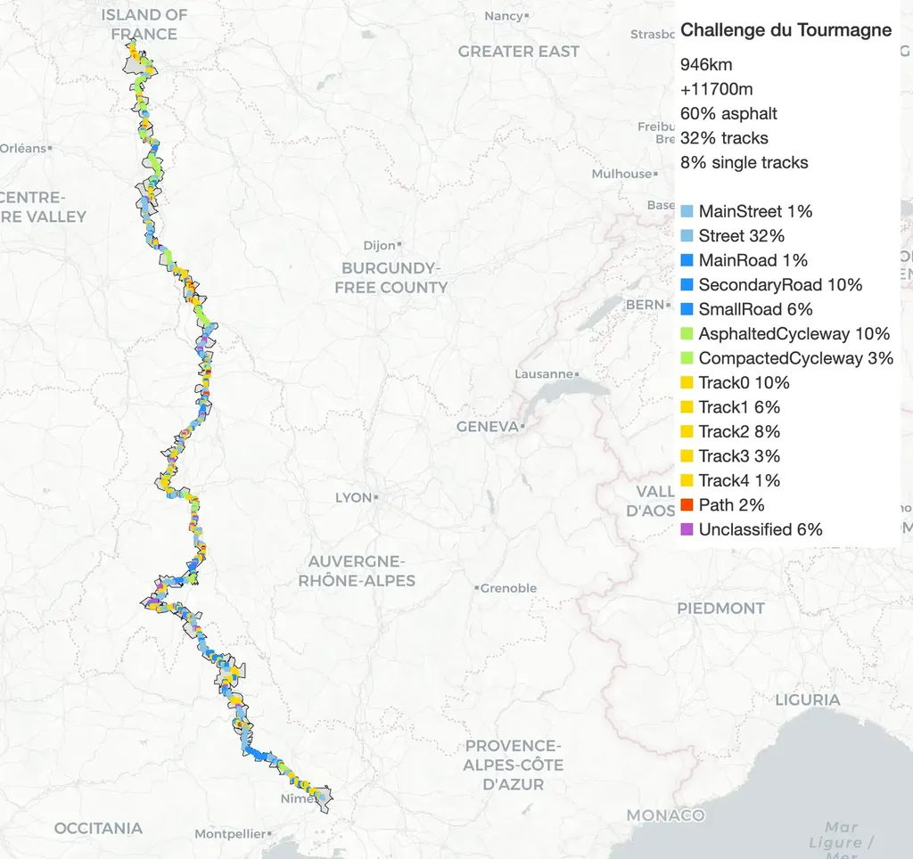
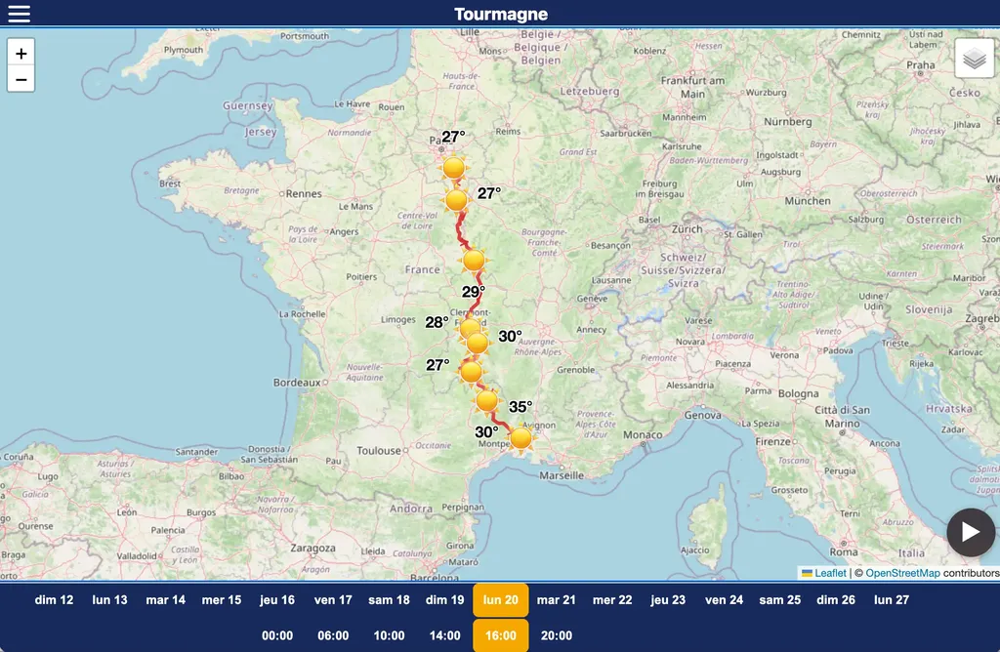
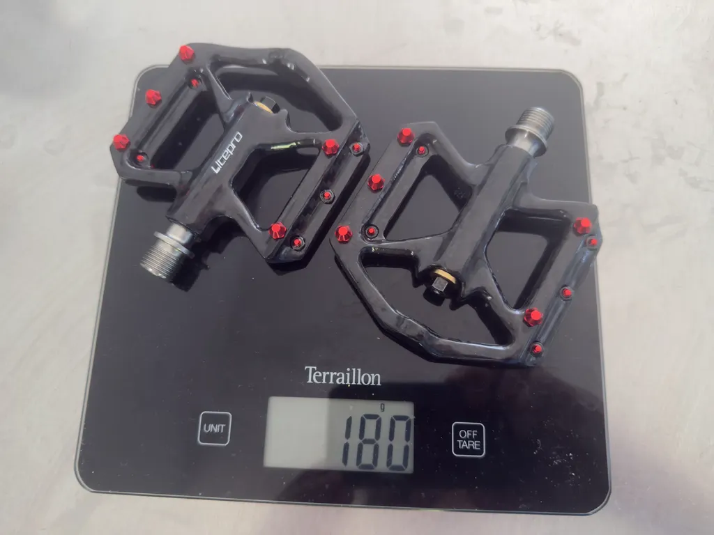
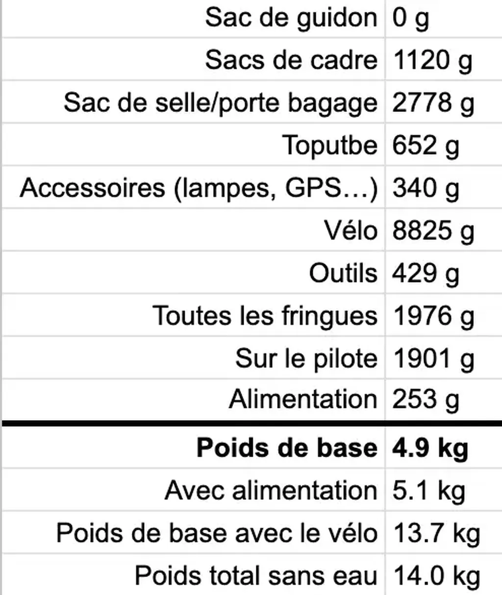
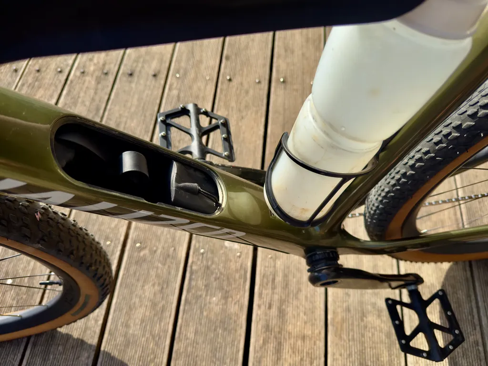
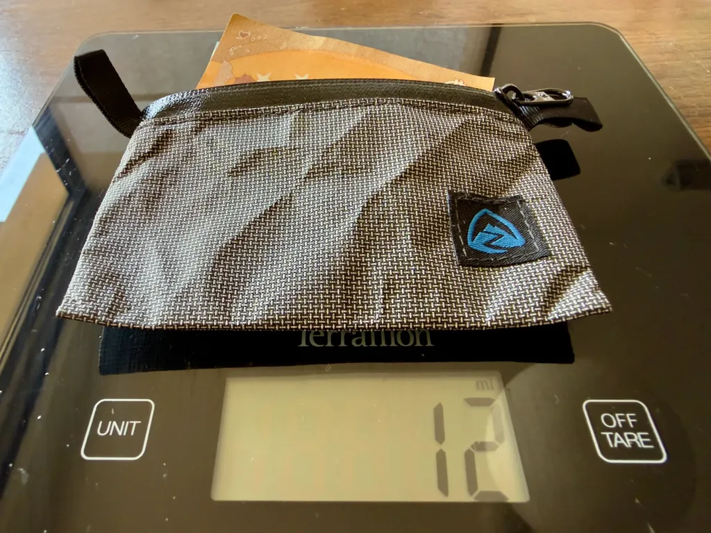
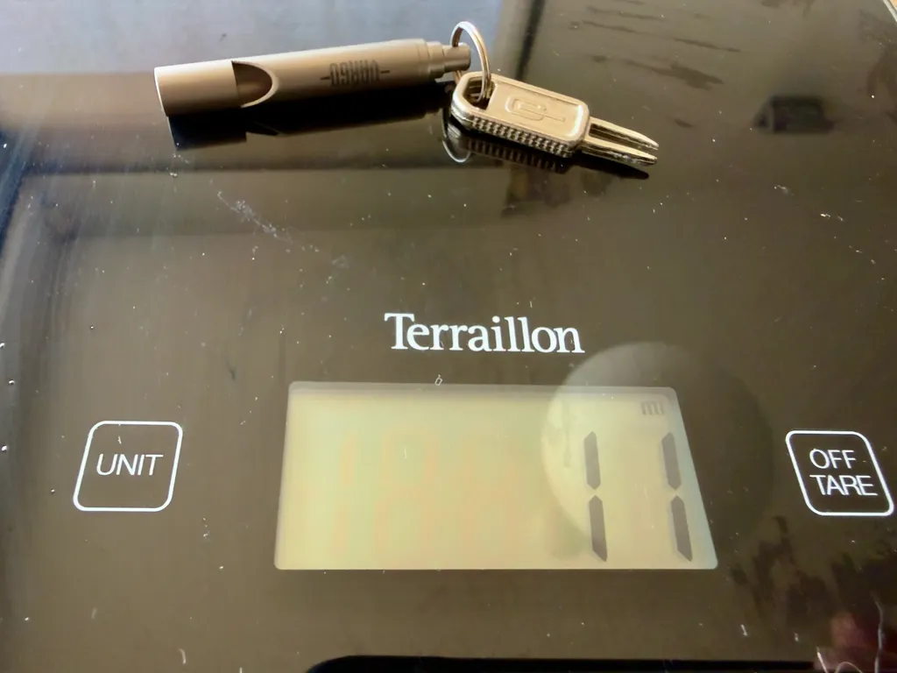

# Équiper un gravel pour le voyage

Ce sera une première : partir en bikepacking sur un itinéraire gravel, le [Tourmagne](https://tourmagne.bike/), avec un gravel alors que j’avais toujours juré que le VTT était le vélo de voyage idéal. Vous rigolez sans doute. Mais il paraît que seuls les idiots ne changent pas d’avis.

Trois choses me font réviser mon jugement et tenter l’expérience.

1. Le Tourmagne est gravel à tendance route, avec 60 % d’asphalte, alors que j’ai l’habitude de traces avec moins de 30 % ([estimations d’après la cartographie OSM](https://github.com/tcrouzet/img2gpx), voir [la trace par terrains](https://727bikepacking.fr/static/tourmagne.html)).
2. [Mon Diverge est confortable.](https://tcrouzet.com/2026/03/27/le-meilleur-gravel/)
3. J’organise la [g727](https://727bikepacking.fr/g727-Grand-Depart/) et la [POU100](https://727bikepacking.fr/pou100/), deux randonnées gravel : ça fait désordre de les rouler à VTT (même si je les reconnais à gravel).

À moins d’une semaine du départ, les prévisions météo s’affinent, et grâce à ma nouvelle web app [gpxWeather](https://tcrouzet.github.io/gpx-weather/), je peux maintenant choisir mon équipement, qui serait quasi identique à VTT (j’ai écrit [un article sur le développement de l’app](https://tcrouzet.com/2026/07/09/stupefaction-devant-IA/)). Il fera chaud, mais pas canicule. Il ne devrait pas pleuvoir. Je pars avec un bivy et un tarp léger. [Vous trouverez le détail de ma config dans un tableau comme d’habitude](https://docs.google.com/spreadsheets/d/1Co6BJql8z7uWCvAokGcDrKaEyAMb-X_zLue6_id3nB4/edit?usp=sharing), je me contente de quelques remarques.

## Le gravel

Mon Diverge pèse désormais 8,8 kg avec pédales, portes-bidons et support GPS, soit à peine 1,5 kg de moins que mon tout suspendu, quand j’y monte une tige de selle non télescopique et des pneus gravel. Des copains rouleront le Tourmagne avec des VTT semi-rigides à 8,5 kg. Je ne pars pas à gravel pour une question de poids, plutôt pour vivre une autre expérience, même si je crains de finir avec les mains en compote (un cintre plat, c’est très confortable).

Habitude prise sur le dernier 727 : pour ne pas m’embêter avec l’entretien de la chaîne durant le voyage, [je l’ai baignée dans la cire](https://silca.cc/en-eu/products/chain-waxing-system-1). En théorie, le traitement dure mille bornes. Suffit qu’il ne pleuve pas. Sinon il faudra quelques gouttes de cire liquide tous les soirs.

[J’ai testé des pédales en titane ultralégères et de les ai explosées en me mettant en danseuse.](https://tcrouzet.com/2026/06/18/g727-gravel-tailfin-assos/) J’ai testé [une autre paire à 180 g](https://liteprobicycle.com/collections/pedal-1/products/litepro-folding-bicycle-3-bearing-titanium-axle-pedal-mountain-bike-carbon-fiber-pedals-178g), mais elles n’ont aucun grip, sont trop petites et surtout bombées sur l’axe, si bien que les chaussures flottent. Pourquoi pas pour les sorties du dimanche, mais je ne prends pas le risque de partir avec sur le Tourmagne (à éviter à VTT, ça c’est sûr).

### La bagagerie

[Comme sur le 727 VTT 2026](https://tcrouzet.com/2026/05/07/config-tailfin/), je fais confiance à Tailfin. J’arrive à loger un 1,5 litre d’eau et leur sac de cadre de 3,5 litres, plus un toptube de 1,5 litre, ainsi qu’un litre dans les rangements Swat du Diverge. Pour que ça passe, j’utilise les portes-bidons Pulse S2 de Zéfal, faciles à ajuster verticalement. Le bidon sur le tube diagonal est un 550 ml, celui sur le tube vertical un 950 ml, bien sûr en bioplastique.

Le sac de cadre reste quasi vide : je le réserve pour les encas. Très pratique, on peut y attacher le piquet de tente avec des Velcros. Il dispose aussi d’une discrète poche portefeuille intérieure. Le sac n’est pas léger, mais solide et étanche. Dans le sac arrière, j’ai de la place à revendre. J’aurais pu ajouter ma tente, un duvet plus chaud et davantage de fringues.

Les outils et le kit médical se logent dans le tube diagonal du Diverge grâce aux rangements Swat. J’y accède en déverrouillant le porte-bidon.

Pouquoi ne pas équilibrer le gravel avec un sac de cintre ? Il ajouterait du poids (620 g pour mon Tailfin Cage) et risquerait de frotter contre mes mains, tout en m’offrant du volume inutile. Par ailleurs, bagages compris, je transporte moins de 5 kg de matos, avec 2,8 kg à l’arrière, 2,2 kg sur le cadre. Des masses quasi anecdotiques qui ne déséquilibreront pas le vélo. Avec l’eau, le gros du poids sera dans le triangle.

### L’alimentation

Comme je monte à Paris en TGV, je prends le minimum vital en nourriture, une barre et deux pâtes de fruits, que je ne touche généralement pas pendant mes voyages. J’emporte des graines de chia, indispensables à mon hygiène alimentaire – en bikepacking, j’ai tendance à me déshydrater puis à me constiper. Tout le reste sera acheté sur la route. J’évite de plus en plus les boulangeries qui, pour la plupart, vendent de la merde industrielle. Je préfère les supermarchés où on trouve presque toujours des produits bio et du pain sans gluten. Je ne crache pas sur les restaurants, bien sûr.

### Les fringues

Fatigué des sous-shorts Assos, de plus en plus médiocres, je testerai le [Mons Royale Epic Merino Bike Liner](https://eu.monsroyale.com/products/epic-merino-shift-mtb-liner-black-mens-fw23). Lors de mes essais sur petite distance, la qualité du pad m’a impressionné. Si chez Assos je suis en médium, là j’ai dû choisir du S.

Pour le maillot, j’ai recherché un mérinos ultra-léger, finissant par découvrir le [Isadore Signature Merino Air Jersey](https://isadore.com/signature-merino-air-jersey-antique-gold-26), supposé parfait pour des températures de 32 et plus. Structure intéressante avec du Polartec delta dans le dos. Isadore me conseille du S, j’ai acheté un L, et franchement plus petit je me serais transformé en saucisse (j’aurais presque dû prendre un XL).

Ces histoires de tailles, c’est du grand n’importe quoi. J’ai toujours été M et désormais j’oscille entre S et XL. Est-ce pour faire travailler les transporteurs ?

### Les gains marginaux

J’utilise depuis deux ans un portefeuille Dyneema de Zpacks, étanche, parfait pour le cash et mon sifflet de secours. Je traînais depuis des années un modèle en plastique et l’ai troqué pour [Vargo en titane](https://vargooutdoors.com/products/titanium-emergency-whistle) (3 g). Il me sert de porte-clés.

[Je vous laisse explorer le détail de ma configuration.](https://docs.google.com/spreadsheets/d/1Co6BJql8z7uWCvAokGcDrKaEyAMb-X_zLue6_id3nB4/edit?usp=sharing) Si j’apprécie le Tourmagne et [les deux cents communes traversées](https://727bikepacking.fr/static/tourmagne_road_book.html), je partirai avec la même config sur [le g727 fin septembre](https://727bikepacking.fr/g727-Grand-Depart/), sans doute avec la tente à la place du bivy+tarp.

<iframe src="https://docs.google.com/spreadsheets/d/e/2PACX-1vQtXMtpZrGSpN66bcB2kZJOEYfbSKyhhKy6cAtTCVE7unBsf85UIawZni0HyVScCcyS2C1DRbdeiar6/pubhtml?widget=true&amp;headers=false"></iframe>

#velo #bikepacking #config_bikepacking #y2026 #2026-07-13-21h00
