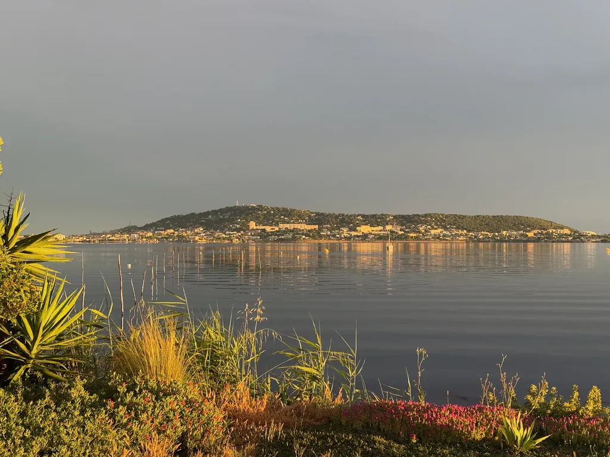
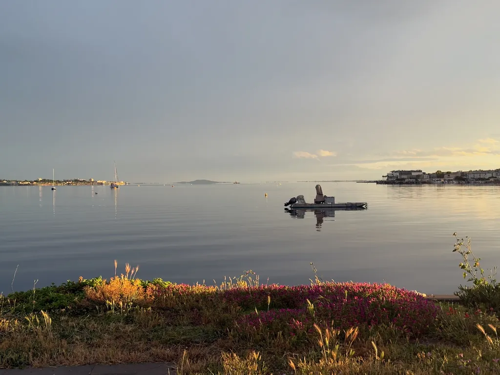
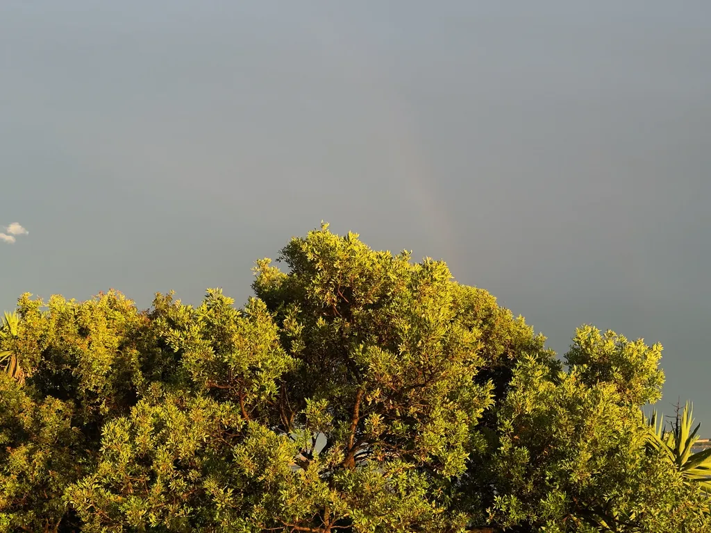
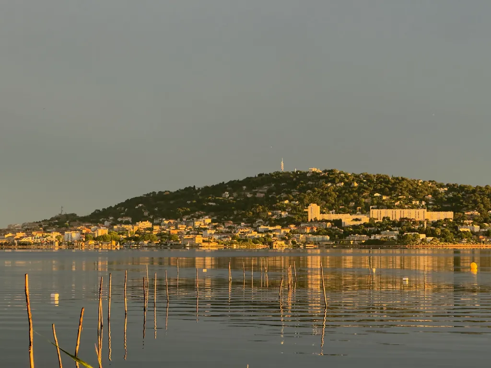
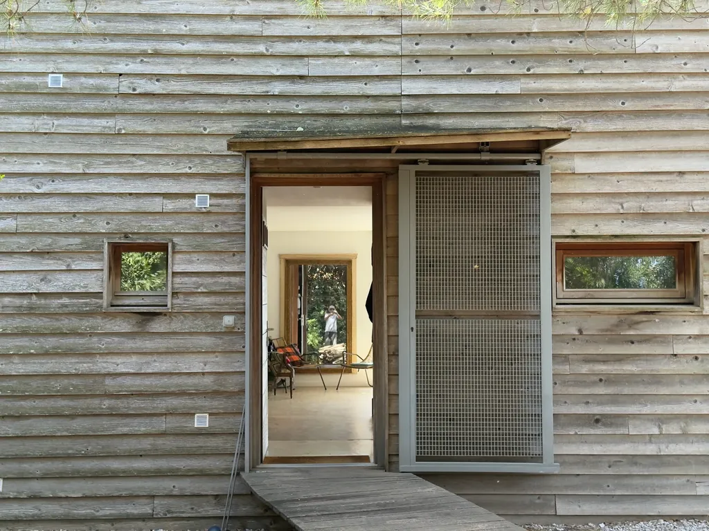
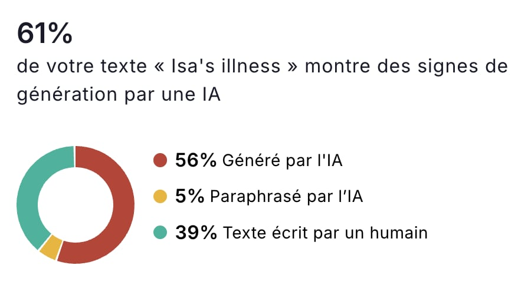
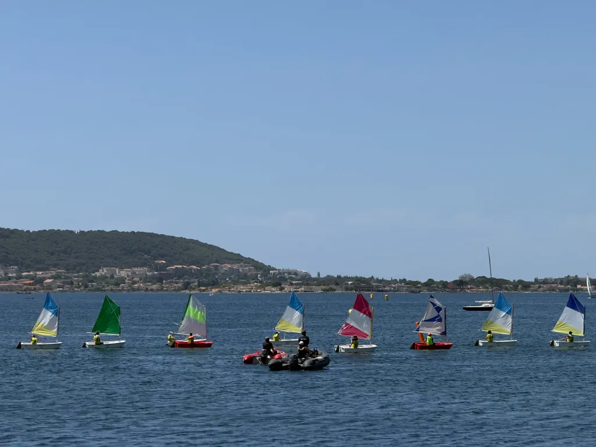
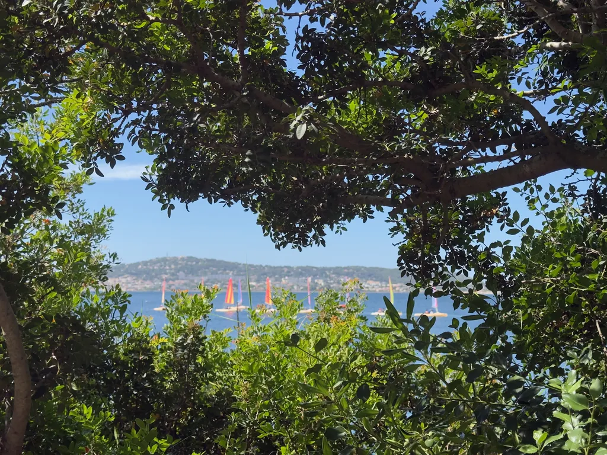
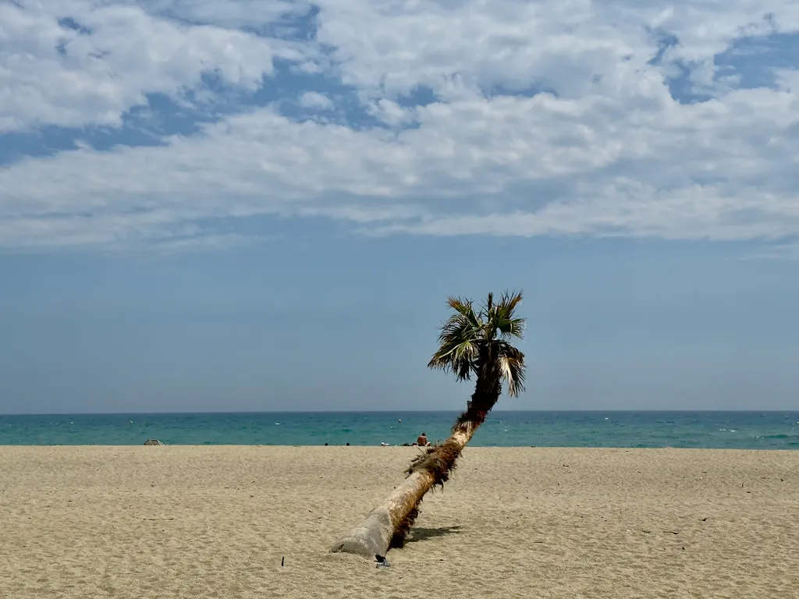

# Juin 2026

### Lundi 1er, Balaruc

Le deuil ni ne passe ni ne part, il s’enkyste.

Le deuil signe la fin des feed-back. Je n’ai plus de retour sur ce que je dis, ce que je fais. Je fais peut-être des trucs inutiles sans m’en rendre compte. Isa n’est plus là pour compter mes « putain ». Je deviens peut-être encore plus con qu’avant. Je tourne peut-être en rond. Vivre à deux retarde la sénescence, l’un protégeant l’autre.

---

Je passe la journée sur la terrasse à essayer d’arracher les souches des mûriers-platanes. Énormes. « Tu y arriveras pas », on m’a dit. J’insiste. Pas question de remplacer des arbres par une de ces ridicules pergolas bioclimatiques.

### Mardi 2, Balaruc

La lune m’a réveillé à 4h30. Impossible de me rendormir.

---

Une alerte sur mon téléphone : « Anniv d’Isa, demain. »

### Mercredi 3, Balaruc

Isa aurait eu 56 ans aujourd’hui et je pioche, ratisse, coupe, tronçonne, karcherise.

### Jeudi 4, Balaruc

Tout tombe en panne. Le Kangou à nouveau alors qu’il est chargé de déchets végétaux, le Karcher alors que je nettoie la terrasse. Pour couronner le tout, il se met à pleuvoir. Je n’avance pas sur mon programme. Il m reste deux jours pour préparer la commémoration de samedi. Je suis épuisé : deux siestes dans l’après-midi.

---

Les séparés auraient pour devoir de tourner la page, seuls les veufs auraient le droit de rester veufs jusqu’à leur mort – ne pas tourner la page serait alors presque en leur honneur (connerie, bien sûr).

Je ne suis pas veuf, je suis deux.

Je n’aime pas me penser comme veuf.

Un deuil ne se fait pas. Il n’est pas un étron à évacuer en tirant la chasse.

Couper le cordon, c’est nier ce qui a été vécu au lieu de construire avec.

Mes lecteurs comprennent ce que je vis parce qu’ils ont été traversés par des chagrins. Je crois au pouvoir des mots. Je ne crois pas aux expériences indicibles. Lire un endeuillé, c’est être en deuil à son tour.

---

Tous les soirs, je picore [un rêve de Kurosawa](https://www.youtube.com/watch?v=4jx0qMG_0ss).

### Vendredi 5, Balaruc

### Lundi 8, Balaruc

Je suis lessivé comme après un voyage à vélo. La commémoration a été joyeuse, vivante, les échanges intenses entre la cinquantaine d’amis éparpillés sur la terrasse et dans la maison, avec pour point d’orgue émotionnel la diffusion du film [*Gagner sa vie*](https://www.dailymotion.com/video/x8rjasv) de Laurence Kirsch et son [interview d’Isa de février 2025](https://www.youtube.com/watch?si=zatrM21biVUpdGKI&v=WgojZzXAIOA&feature=youtu.be). « Merci, merci, aurait dit Isa. J’ai de la chance. »

C’était une échéance, comme la fin anticipée de mon livre. On m’a dit : « Pourquoi tu fais pas une pause ? » Une pause dans quoi ? Dans la vie ? Ça n’a aucun sens. Un livre est un organisme dont la gestation a toujours chez moi une échéance. Ce livre, je ne peux l’arrêter. Il me fait pousser un second moi. Je vais au bout, là, maintenant, alors même que j’aborde sa partie la plus difficile.

Avant d’écrire un chapitre, j’établis la chronologie du mois, janvier 2026 cette fois, à partir de mes notes, des mails d’Isa, de nos échanges sur Signal. C’est douloureux, ça réveille un temps que la distance ensevelit déjà. Tout me revient, à vif.

### Mardi 9, Balaruc

Lumière rasante ce soir. Le soleil traverse de part en part le rez-de-chaussée. L’étang est presque noir, les verts intenses. Une beauté douloureuse : je n’ai personne avec qui la partager et en discuter. Vous, peut-être.

### Mercredi 10, Balaruc

La société est noire, écrire du noir c’est aller dans le sens du poil, c’est dénoncer ce que tout le monde sait, c’est conventionnel, c’est le contraire de ce qui est attendu d’un artiste, c’est se baigner dans la merde ambiante plutôt qu’en sortir. Même dans le deuil, je cherche la lumière.

---

Siri Hustvedt dit ne s’être jamais ennuyée avec Paul Auster. Je ne me suis jamais ennuyé avec Isa. Impossible de s’ennuyer avec quelqu’un d’aussi intelligent et curieux qu’elle. Je sais ce que j’ai perdu, je ne le vois nulle part ailleurs, surtout près de moi. Lire me donne un peu d’air.

---

*L’Expérience humaine* est un livre sur la discrétion et la douceur, et toute forme d’exhibitionnisme m’insupporte. Un seul bruyant suffit à me faire fuir. Je ne supporte plus les nombrilistes et les lieux où ils maraudent.

### Jeudi 11, Balaruc

Un lecteur me dit : « Je ne suis pas toujours d’accord avec toi. » Ma réponse : « J’ai perdu ma principale source de désaccord avec ma femme. »

### Vendredi 12, Balaruc

Demain quatre mois et Isa toujours dans mes rêves, une présence plus douce, plus trouble. Le temps se creuse. J’ai du mal à le remplir : aucune activité ne remplace mes discussions avec elle. J’écris sur elle, je revis avec elle.

De plus en plus souvent, je ne souffre pas. Au début, la souffrance de la perte était presque rassurante. Maintenant, je me dis que je ne suis pas un humain normal, comme si j’étais prêt trop vite à une autre vie. Bien sûr je ne présente aucun intérêt pour quiconque puisque je ne pense qu’à Isa, qu’à la célébrer, et suis donc incapable de m’intéresser aux autres. Reste néanmoins une forme de culpabilité parce que je ne vais pas si mal.

L’autrice de *Persepolis*, Marjane Satrapi, serait morte de chagrin un an après le décès de son époux. Elle a été hospitalisée deux mois pour une dépression sévère et aurait refusé de se soigner. Elle se serait donné la mort selon certaines sources. J’espère que le chagrin ne me rattrapera pas.

Ce ne serait pas faire honneur à Isa que me laisser mourir. Elle a voulu vivre, et je veux vivre pour elle, pour la maintenir vivante en moi. Je désire aimer d’autres femmes, curieux de découvrir ce qu’Isa a changé en moi dans la relation aux autres. Elle a encore à vivre à travers moi, comme à travers nos enfants et ses amies.

Je n’ai pas envie de me cacher, de jouer au veuf éploré. J’ai droit à la vie. C’est une exigence. Mais je désire, comme je rêve, sans être sûr que ce désir soit autre chose qu’une aspiration vaine. Je refuse de m’enfermer dans le deuil. D’en faire une prison. Alors le retourner, en faire un tremplin. Parce que je sais qu’Isa aurait voulu que je marche dans cette direction.

On me dit « Prends ton temps » ou « Ça ne fait que quatre mois ». C’est oublier la longueur de la maladie, c’est oublier qui nous étions. Ce n’est pas une question de temps, plutôt d’attitude. Je ne commande ni le temps ni mes processus psychiques. En vérité, j’aurais peur de toucher une autre femme, encore plus de la séduire, de tout recommencer. Pas envie d’une mascarade ritualisée. En fin de compte, je n’aspire qu’à ce que j’ai perdu, et c’est impossible, une impasse. Mon avenir dépend plus des autres que de moi. C’est à eux de venir à moi, de faire ce dont je n’ai pas la force.

---

Je découvre que, dans la nuit ou ce matin, alors que j’écrivais sur la terrasse, on nous a volé notre vieux pédalo, d’une monstrueuse valeur sentimentale. Le portail du jardin donnant sur l’étang a été déposé. OK, il était mal en point, mais ce n’était pas une raison pour entrer chez nous. Sentiment d’avoir été violé, que notre mémoire familiale a été profanée.

---

Le deuil s’arrête quand on cesse d’en parler. Ce journal est devenu le sismographe de mon deuil. Ce serait cataclysmique si je n’écrivais pas mon livre en parallèle.

---

Je suis écrivain parce que j’ai passé ma vie à écrire, parce que je vis pour écrire, parce que je me sauve en écrivant.

### Samedi 13, Balaruc

Nous y sommes, exactement, quatre mois. Barthes avait un projet de livre sur sa mère : « c’est comme s’il me fallait *faire reconnaître man*. » Construire un monument, non pas une tombe, mais une espèce de sculpture vivante. Voilà à quoi je m’essaie. Ça me fait du bien, pour les enfants, pour dire Isa philosophe de la discrétion. Isa dans la peau de Socrate et moi dans celle de Platon.

Demain le deuil ne s’effacera pas, il ne cessera pas de faire mal. Si j’ai envie de faire quelque chose, je le fais. C’est un peu comme avec le vélo. Je ne suis pas toujours au top de ma forme quand je pars pédaler le matin, mais j’y vais tout de même, et parfois c’est alors que je suis au mieux. Je ne suis pas du genre à attendre, mais du genre à faire, quitte à mal faire.

---

Je parle avec une amie de littérature, d’art, évoque des voyages possibles. Ça me change du « Alors, comment tu vas ? » Je veux vivre, regarder devant, sans oublier le passé, mais en le transformant en étage d’une fusée qui en comporte d’autres.

---

Barthes cite une merveilleuse lettre de Proust à Georges de Lauris qui vient de perdre sa mère (1907) : « Maintenant, je peux vous dire une chose : vous aurez des douceurs que vous ne pouvez pas croire encore. Quand vous aviez votre mère vous pensiez beaucoup aux jours de maintenant où vous ne l’auriez plus. Maintenant vous penserez beaucoup aux jours d’autrefois où vous l’aviez. Quand vous serez habitué à cette chose affreuse que c’est à jamais rejeté dans l’autrefois, alors vous la sentirez tout doucement revivre, revenir prendre sa place, toute sa place près de vous. En ce moment ce n’est pas encore possible. Soyez inerte, attendez que la force incompréhensible (…) qui vous a brisé, vous relève un peu, je dis un peu car vous garderez toujours quelque chose de brisé. Dites-vous cela aussi car c’est une douceur de savoir qu’on n’aimera jamais moins, qu’on ne se consolera jamais, qu’on se souviendra de plus en plus. »

Je commence à éprouver les douceurs dont parle Proust. Je retrouve une Isa en pleine forme, pétillante, souriante, brillante. Oui, c’est très doux, tendre, agréable, et douloureux que par accès passagers. Reste que Proust prend un risque énorme en généralisant, en tentant de faire de son expérience un universel, un de ses travers d’idéaliste. Je n’aurais jamais osé écrire une telle lettre, Isa encore moins.

### Dimanche 14, Balaruc

Je copie-colle un des chapitres de *L’Expérience humaine* dans [Justdone](https://justdone.com/fr/word-counter) et il me dit qu’il est écrit à 61 % par une IA. Je ne serais donc qu’à 39 % humain, ou ce service comme beaucoup d’autres est un attrape-couillon, d’autant qu’il propose une réécriture par IA pour que le texte ne sonne plus IA. Je serais presque tenté de payer pour lire le résultat.

---

Je parle d’Isa comme Barthes de sa mère, ce qui me paraît étrange, et dit sa relation toute particulière avec elle. Proust a aussi parlé de la même façon de sa mère. Tous deux homosexuels. Il doit y avoir un lien de cause à effet ou d’effet à cause. Je n’en sais rien, mais ma relation avec ma mère n’a rien de commun avec ma relation avec Isa.

---

Barthes : « Me suis toujours (douloureusement) étonné de pouvoir – finalement – vivre avec mon chagrin, ce qui veut dire qu’il est à la lettre supportable. Mais – sans doute – c’est parce que je peux, tant bien que mal (c’est-à-dire avec le sentiment de ne pas y arriver) le parler, le phraser. Ma culture, mon goût de l’écriture me donne ce pouvoir apotropaïque, ou d’intégration : j’intègre, par le langage. Mon chagrin est inexprimable mais tout de même dicible. Le fait même que la langue me fournit le mot “intolérable” accomplit immédiatement une certaine tolérance. » Des choses que j’ai plus ou moins écrites, avant de les découvrir chez Barthes, ce qui unifie nos expériences, les généralise, et les rend peut-être incompréhensibles pour ceux qui n’écrivent pas, ou ne lisent pas, car je soupçonne la lecture d’avoir un effet approchant.

---

On s’interdira des figures de style parce que les IA les utilisent. Isa aimait les tirets demi-cadratin, j’en utilise beaucoup dans mon livre.

---

Le texte de Barthes est aussi à 61 % inhumain ou les IA sont désormais de plus en plus humaines ?

---

Demander à une IA de réécrire un texte écrit par un humain pour qu’il ne sonne pas IA est le comble du comique contemporain.

---

Le deuil comme impuissance à aimer selon Barthes. Sans doute, à aimer de nouveau, à se laisser emporter. Le deuil me met sur la réserve. se glisse dans mon rapport aux autres. À vrai dire, je n’ai rencontré personne depuis la mort d’Isa, même l’idée de rencontre m’est étrangère – et je ne parle même pas de rencontre amoureuse, la possibilité de rencontres amoureuses ayant quitté ma vie au siècle dernier. Je me demande comment cette possibilité pourrait refaire chemin en moi. Peut-être un truc qui me tombera dessus sans crier gare. On sonnera, j’ouvrirai le portail et whoua ! Comme dans les romans. Ou peut-être que je connais déjà la personne que j’aimerai, et n’ai jamais pu envisager de l’aimer jusqu’à présent.

---

J’essaie de regarder *L’Étranger*, je n’y arrive pas, ce film est mauvais, si loin du roman, et il me plonge dans une tristesse sans fond. Des tableaux me feraient plus de bien. Ou une de ces vidéos sur l’histoire du Rock. Ou lire, je finis toujours par lire, parce que je ne subis pas quand je lis.

### Lundi 15, Balaruc

[Je lis une nouvelle de SF](https://legrandcontinent.eu/fr/dimanches/aux-confins-du-microscopique/), d’un auteur réputé, et elle souffre de dizaines de mièvreries littéraires, comme souvent les textes de SF.

---

Le bouquin de Siri de plus en plus désordonné, un copier-coller de souvenirs. Ça piétine comme le deuil. Je saute des passages. Le deuil n’a pas d’intensité dramatique, c’est tout le problème, le deuil ne fait pas un bon livre, il n’est que prétexte à un livre. Écrire pour se sauver, je comprends, mais pourquoi imposer le sauvetage au public ? On n’en sort pas du deuil, c’est une histoire sans dénouement, sans progression dramatique. Dans mon carnet, j’en parlerai moins. Il se dissoudra dans d’autres préoccupations, non qu’Isa sera moins présente, mais que je ne répéterais pas ce que j’aurais déjà dit – j’ai déjà cette peur : le deuil revient par vagues, avec les mêmes accès de tristesse qui provoquent les mêmes pensées. Les fixer, c’est peut-être monter un escalier. Je peux reprendre où je me suis arrêté.

---

Dans *Dream*, [*Crows*](https://www.youtube.com/watch?v=4jx0qMG_0ss), à 1h03 me fait pleurer de bonheur.

## Mardi 16, Balaruc

J’aime lire plusieurs livres en même temps, les picorer jour après jour, ce qui me met en familiarité avec l’auteur, et je suis toujours un peu triste quand je ne peux le retrouver, comme Barthes et son journal de deuil. Je m’éloigne de cet ami et ça me fait mal. C’est comme avec Isa, je dois écrire sur elle, penser à qui elle était, pour la garder près de moi. Mon texte sur elle me sert de compagnon imaginaire. Alors je ne suis pas triste. Hier, j’ai relu Août de mon livre et je me suis dit que je touchais à l’expérience humaine. Je me méfie de mes satisfecit, mais cette fois une douce confiance m’habite, une profonde paix intérieure quand je sens les choses à leur place.

---

Siri et Paul en 2022 dorment à Taormine dans l’ancien monastère transformé en hôtel comme moi avec Isa en octobre 2003. Les chemins de nos vies se croisent.

---

Siri comme Barthes parlent d’un second deuil, qui survient après six mois ou un an, et fait ressurgir la douleur apparemment jusque-là sous contrôle. Souvent l’évènement est synchrone avec l’automne, quand les longues nuits nous enveloppent. Pour le moment, la lumière estivale me caresse. Je reste à lire sur la terrasse jusqu’à ce que la nuit tombe et que les moustiques me dévorent.

### Mercredi 17, Balaruc

Impression que je n’arrêterai jamais de remplir des paperasses, de fournir des justificatifs. Nous avons construit un monde compliqué pour ranger la mort dans une catégorie administrative avec des cases à cocher.

---

Le livre de Siri me fait du bien parce qu’il décrit une relation entre Paul et elle assez semblable à la mienne avec Isa. Nos couples auraient pu s’entendre sur beaucoup de points.

### Jeudi 18, Balaruc

J’ai terminé le chapitre Janvier de *L’Expérience humaine*. J’approche avec grande peur du dénouement.

### Vendredi 19, Balaruc

Journée à monter un tableau électrique en amont de la maison, pour en séparer les modules et éviter des disjonctages intempestifs. Nous creusons aussi des trous sur la terrasse pour replanter des arbres. J’avais choisi des Faux-Poiviés, arbres qu’Isa trouvait baroques, et ce soir je les rejette aussi : ils ne sont pas caducs et feront trop d’ombre en hiver. Je resterai jusqu’en octobre avec deux énormes trous sous les yeux.

---

La France brûle, et alors que la nuit s’installe, j’ai froid sur la terrasse.

### Samedi 20, Balaruc

J’ai commencé à transcrire mes notes de février. *L’Expérience humaine* devient de plus en plus douloureuse, pas sûr que ce soit soutenable. Ce travail me tient, me capte, m’avale. Je risque d’en sortir en morceaux.

### Dimanche 21, Balaruc

J’ai oublié les détails. Sans mes notes au jour le jour, je serais incapable de raconter avec justesse.

### Lundi 22, Balaruc

Je commence *Aplologie de la discrétion* de Lionel Naccache qui m’épuise tout de suite : il ouvre sur une série de questions, pour moi arbitraires, car on pourrait en poser mille autres. Je n’aime pas cette façon d’écrire en rafales interrogatives. Une question peut relancer ou articuler un récit, mais les avalanches me repoussent, surtout quand pour chacune j’ai déjà des réponses.

Naccache parle des ensembles discrets et continus en maths comme s’il n’existait pas d’autres possibilités (bon, j’ai tout oublié de mes cours de topologie, mais je sais que la distinction dichotomique bien trop simpliste). Voilà comment en quelques lignes je prends en grippe un livre, un style, un auteur dont je ne sais rien. Il parle, il parle de son projet, de comment il le met en œuvre, et ne dit rien qui me touche, rien qui m’aiderait à mieux comprendre la discrétion d’Isa.

---

Dans mon récit je vois défiler les dernières fois d’Isa :

* Samedi 6 décembre, dernière sortie culturelle.
* Dimanche 4 janvier, dernière marche hors de la maison jusqu’à la base nautique.
* Dimanche 18 janvier, dernier mail.
* Dimanche 1er février, dernier enregistrement audio.
* Vendredi 6 février, dernière lecture.

Les dernières fois m’ont toujours fait peur. Nous en avons rarement conscience, heureusement.

---

Maintenant que j’ai un premier jet de *L’Expérience humaine*, je demande à NotebookLM et Claude de le résumer. Ils passent à côté de mon sujet. Je les recadre plusieurs fois avant qu’ils parlent sans trop d’erreurs du texte. C’est assez inquiétant pour ceux qui font aveuglément confiance à ces outils. Je finis par arriver à une quatrième de couverture :

« Sur les rives de l’étang de Thau, dans la maison que dix ans de tournage de la série *Candice Renoir* ont rendue célèbre, vit une femme dont personne ne parle. C’est précisément ce qu’elle veut.

« Isa, ancienne businesswoman avec quelques célébrités sulfureuses dans sa famille, a fait de la discrétion une philosophie : ne pas se mettre au centre, laisser de la place, habiter chaque instant sans en faire une démonstration. Son mari l’appelle la femme du futur parce qu’elle croit à la coopération contre la compétition, aux sourires contre les vociférations.

« Quand le cancer la frappe, elle applique la même règle. La maladie comme la douleur ne sont pas intéressantes. Ce qui est intéressant, c’est vivre jusqu’au bout.

« _L’Expérience humaine_ est un hommage à ceux dont la discrétion illumine tout autour d’eux. »

### Mardi 23, Balaruc

[J’écoute Timothée Parrique répéter ce que nous avons rabâché entre 2006 et 2010 dans mes texte  et avec les Freemen](https://www.radiofrance.fr/franceinter/podcasts/bistroscopie/bistroscopie-du-samedi-20-juin-2026-7489096), avant de renoncer devant l’immobilisme. Tant mieux que des jeunes reprennent le flambeau : avec le recul, ils avancent avec plus de clarté et des arguments supplémentaires.

### Mercredi 24, Balaruc

Le deuil me rend souvent inconfortable en présence de mes semblables. Je suis mieux seul, dans la maison, quand j’écris ou regarde l’étang comme je l’ai toujours fait : je m’accroche à des expériences partagées avec Isa.

Je n’ai aucun mal à accepter des invitations, mais quand l’heure arrive je me sens mal.

---

[Amanda Petrusich](https://en.wikipedia.org/wiki/Amanda_Petrusich) écrit dans [The New Yorker](https://www.newyorker.com/magazine/2026/06/29/what-science-knows-about-grief) : « Yet becoming a young widow was easily the most fascinating thing that has ever happened to me. » Je suis un veuf un peu plus âgé qu’elle, mais peu importe l’âge, devenir veuf est en effet une expérience fascinante, une transition dont on oublie de nous avertir : enfance, adolescence, adulte-âge, parent-âge, retraite, veuvage… Ben oui, c’est une étape possible de la vie, rien ordinaire, donc fascinante.

Je me transforme avec la même brutalité que lors du passage de l’enfance à l’adolescence. J’ignore tout d’Amanda Petrusich, mais me dis que je pourrais l’aimer, reconstruire avec elle : mon cerveau fabrique des scénarios d’autres vies, jamais longtemps, mais assez pour me distraire et me donner confiance dans le futur – une variante de mes scénarios pourrait se produire, bien que jamais des trucs racontés dans mes romans n’aient fini par m’arriver. Je suppose que le deuil doit être plus douloureux quand on perd cette capacité de construire des scénarios heureux pour la suite. J’ai toujours joué dans ma tête. Je continue. C’est ce qui me fait écrivain. Je n’appelle pas ça des fantasmes. Je n’y vois rien d’obsessionnel.

Amanda Petrusich cite Katherine Shear, une spécialiste du deuil : « I don’t think that any grief is pathological, actually. It’s a little bit analogous to pregnancy, in the sense that it’s a normal state, but it’s a high-risk state. The problem people have is not in the experience of grief itself. The problem is how to learn to accept the unthinkable. » J’accepte l’impensable en écrivant *L’Expérience humaine*, en me mettant les faits sous les yeux. Je l’accepte dans mon journal, en le publiant, en le partageant.

Maintenant que j’ai un premier jet de *L’Expérience humaine*, et que je ne cesse de le relire pour le retravailler, c’est comme si je me confrontais à la douleur pour l’apprivoiser par mithridatisation.

---

En anglais, « grieve » est un verbe, on n’est pas en deuil, on « deuille », et je trouve ça plus puissant, plus vrai, plus proche de la dynamique du deuil.

---

C’est étrange, mais comme je le raconte dans mon livre, je n’ai pas ressenti la mort d’Isa comme traumatique, plutôt comme un état de grâce, ce qui est assez dingue pour un athée. Si Isa était morte dans une chambre d’hôpital en mon absence, j’aurais vécu ça autrement, mais enir sa tête jusqu’au bout a été comme la capter en moi, la prendre en moi, la recueillir.

---

Amanda Petrusich : « Grief forces a kind of radical transformation, for better or for worse. I found it to be a shockingly generative state: I’d never been more pliable, tender, open, or raw. Miracles, catastrophe–it all felt so _possible_ in those early months. In that way, grief itself is a psychedelic journey. »

---

En 2008, à 70 ans, Joyce Carol Oates perd son mari après 48 ans de mariage. En 2009, sept mois plus tard, elle se remarie et dix ans après elle perd son second mari. Elle a écrit *Widow’s Story*.

### Jeudi 25, Balaruc

Ma vie est en stase, même si je vis comme d’habitude. Simplement quelque chose de neuf et d’agréable devra survenir pour que je transite. Je découvre qu’il existe des deuils de longue durée comme des covid de longue durée. Parfois je me dis que tout va bien, que ça ne peut pas aller mieux, mais non, il y a des grains de sable dans la mécanique.

---

Le deuil est souvent décrit comme un effondrement, une impuissance généralisée ; chez moi, il est hyperactivité.

---

Deuil et Seuil, deux mots très proches. Le deuil est un seuil à franchir pour entrer dans une nouvelle époque de la vie.

### Vendredi 26, Balaruc

J’éprouve une grande satisfaction quand je termine une procédure administrative, jusqu’au moment où une autre me tombe dessus, que je repousserai le plus longtemps possible. Les services publics ont tous des sites web antiques, avec des messageries où il est impossible d’attacher des documents, voire de répondre. Je suis obligé d’imprimer des PDF et de les envoyer par courrier ! Tout ça juste pour pérenniser La Poste.

### Samedi 27, Balaruc

À la fin de son livre, Siri dit qu’elle incorpore Paul, qu’elle devient lui ; un chemin usuel pour le veuf que de devenir le disparu, pour continuer à le sentir près de soi. J’ai très vite eu cette sensation, j’ai découvert que c’était la bonne approche pour survivre : ne pas pleurer la perte, mais célébrer la fusion définitive.

---

Depuis quelques années, je finissais par jeter les amandes fraîches faute d’un casse-noisette efficace. Je viens d’en acheter un rouge. Isa l’aurait adoré. Le deuil, c’est ça, penser à l’autre, choisir pour lui, dans les moments les plus ordinaires de la vie quotidienne.

Le deuil, c’est honorer le disparu, le cajoler en soi. Rien de tel lors d’une rupture amoureuse. Les deux expériences ont la douleur en commun, mais elles ne se logent pas aux mêmes endroits.

### Dimanche 28, Balaruc

*Widow’s Story*, genre de livre maîtrisé, mais sans grande saveur, qui se veut drôle, à distance, et ne réussit à faire passer que peu d’émotions. On dirait un roman, un de ces romans auxquels je ne crois pas. D’un autre côté, Ray meurt en quelques jours, c’est soudain, inattendu, difficile à croire. Je peux le comprendre : c’est déjà difficile avec des mois pour se préparer.

---

Hier soir, je rencontre une artiste âgée, disons comme moi, voire plus, qui ne comprend pas que nous n’intéressons plus les marchands et croit encore qu’elle peut percer. Je l’écoute avec compassion sans lui dire : « Tu es trop vieille. » Ce qui serait méchant, après tout, il y a toujours des cas particuliers comme cette chef d’orchestre anglaise révélée à 80 ans.

---

Un copain poste la vidéo du départ d’une course VTT amateur, je ne peux m’empêcher de dire : « On dirait des animaux. » C’est vraiment ce que j’ai pensé sur le moment. En quoi cette activité est-elle le propre de l’humain ? N’avons-nous pas mieux à faire que dépenser de l’énergie pour rien sauf à l’ego ridicule des compétiteurs ? Quand je fais du vélo, c’est pour socialiser, faire du sport, profiter du spectacle de la nature – activité presque politique, à coup sûr militante.

### Lundi 29, Balaruc

[*Quelque chose noir*](https://www.radiofrance.fr/franceculture/podcasts/les-nuits-de-france-culture/l-oeuvre-au-noir-de-jacques-roubaud-poemes-du-deuil-9101226) de Jacques Roubaud, juste sublime. « Ce morceau de ciel désormais t’est dévolu où la face aveugle de l’église s’incurve compliquée d’un marronnier, le soleil, là hésite laisse du rouge encore, avant que la terre émette tant d’absence que tes yeux s’approchent de rien. » Un recueil que Roubaud a écrit après la mort de sa femme en janvier 1983.

*Le Grand incendie de Londres* : « En ce temps-là, j’habitais les pièces trop grandes d’un appartement devenu vide, par un deuil. Je vivais depuis plus de deux ans dans cet espace qui flottait autour de moi, surtout la nuit. »

### Mardi 30, Balaruc

*Elegy for Iris: A Memoir*, magnifique chapitre introductif. [John Bayley](https://en.wikipedia.org/wiki/John_Bayley_(writer)) raconte sa rencontre avec Iris Murdoch et comment ils tombent amoureux, d’abord lui, puis elle. Livre écrit tout de suite après la mort d’Iris. Nous n’avons pas d’autre choix qu’écrire la perte et célébrer la disparue, le disparu. Iris me fascine. Je commence à la lire. [Belle série sur France Culture.](https://www.radiofrance.fr/franceculture/podcasts/serie-iris-murdoch-philosophe-des-drames-ordinaires)

---

Un auteur auto-édité annonce avec fierté qu’il a écrit cent nouvelles, je lui dis que nous n’en avons rien à foutre, il me répond que ce n’est pas vrai de tout le monde, sûr, il existe toujours des lèche-culs. Mieux vaut écrire une nouvelle solide que cent merdes ânonnées dans un style approximatif.

---

Iris Murdoch voulait rendre compte de l’épaisseur de la vie humaine, c’est exactement ce à quoi je m’attache dans *L’expérience humaine*, avec tout ce que la vie a de tragique et de sublime. Une ambition démesurée !

Je commence *The Sea, the sea*, qui débute par une description de la mer et d’une baignade, à renfort de descriptions détaillées, puissantes, imagées, trop ? L’accumulation parfois tue la représentation. J’ai parfois l’impression que l’auteur ne trouvant pas la phrase juste nous en déroule des variations parmi lesquelles il n’a pas choisi. Je ne dis pas ça pour Murdoch, je ne suis pas encore assez qualifié, mais j’entrevois les dangers de sa méthode pour un minimaliste de mon espèce. En tout cas, sa description introductive participe à l’objectif d’épaissir la vie, d’en mettre en scène toute la texture.

#carnets #y2026 #2026-7-1-22h00
