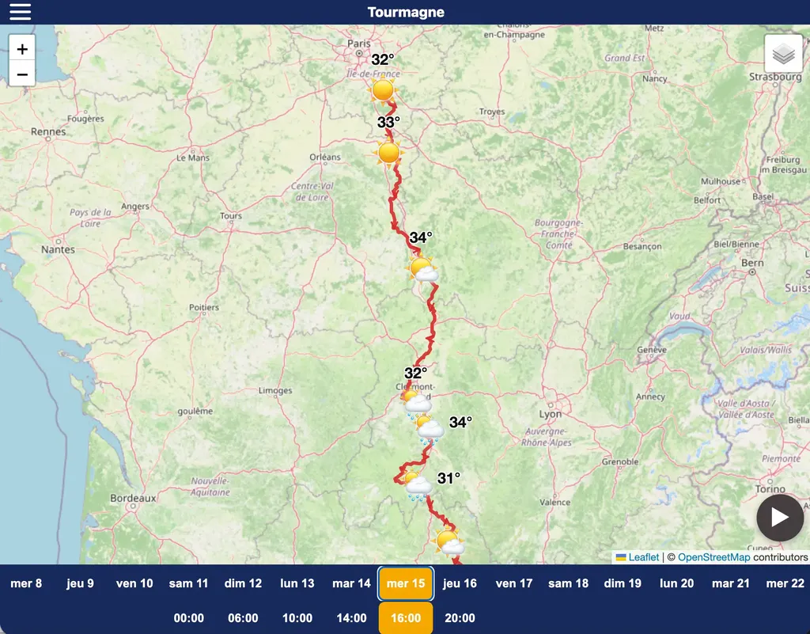
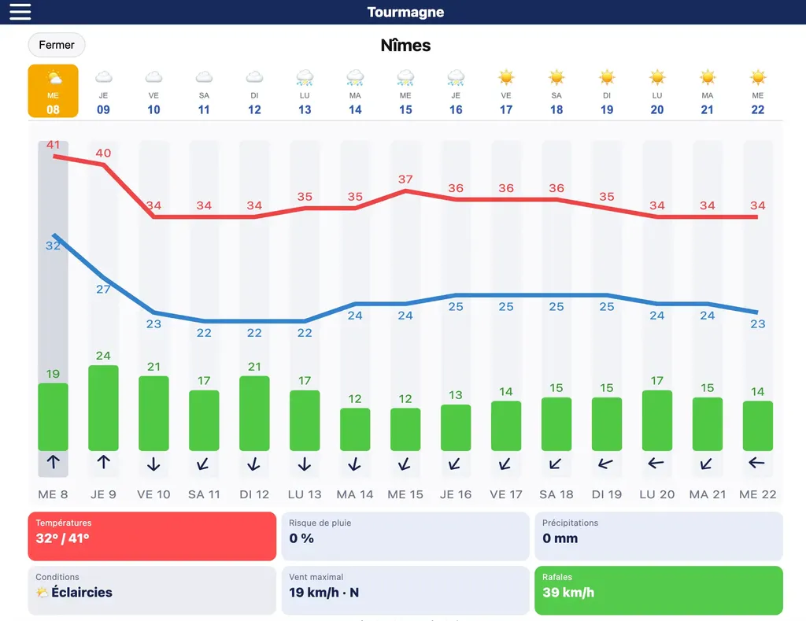
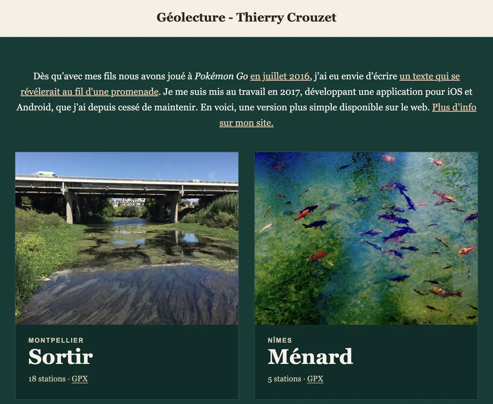
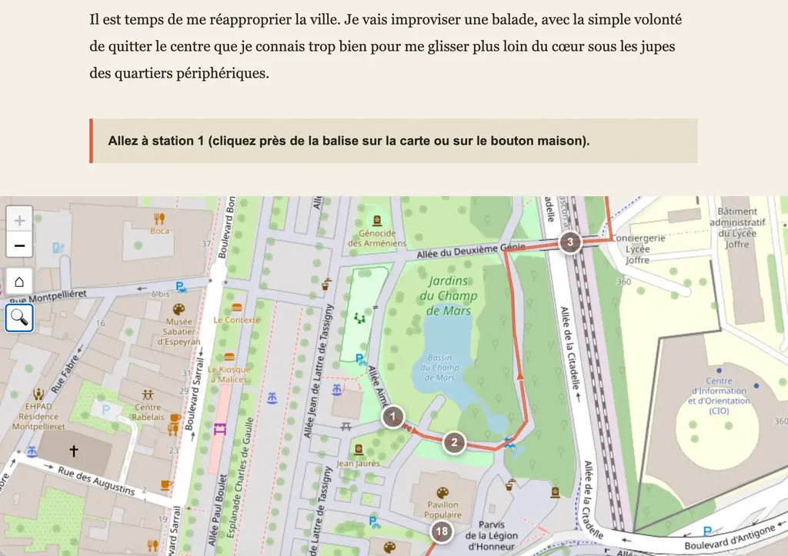

# L’IA fait le sale boulot : quand l’idée suffit

Mon fils aîné m’a poussé à tester Claude Code ou ChatGPT Codex, deux des outils de génération de code les plus puissants. Je suis encore tout étourdi après quelques bidouilles.

Depuis trois ans, je demande l’aide aux IA quand je code, sur le mode chat. Je n’avais pas franchi le pas des agents : je codais à la main, questionnais les IA, copiais-collais leurs réponses dans mon code avec grande précaution, un mode de développement à l’ancienne.

### GPX Weather

Cette fois, je n’ai pas écrit une ligne pour deux projets. Le premier est lié au vélo. Avec des amis, nous allons partir sur le [Tourmagne](https://tourmagne.bike/), un itinéraire gravel à travers la France. Pour choisir notre équipement, nous avons besoin des prévisions météo tout au long du parcours de près de mille kilomètres. Je me suis dit « Ça serait bien d’avoir une app à qui donner un fichier GPX, qu’elle repère les principales agglomérations et affiche pour chacune les prévisions à deux semaines. »

Mon fils m’a donné accès à son abonnement OpenAI. Sur ma machine, j’ai créé un dossier gpxweather, l’ai ouvert avec VisualCode et lancé dans le terminal la commande « codex ». Un prompt s’est affiché, j’ai décrit ce que je voulais : « Une web app avec un backend Python qui tournerait sur GitHub et qui serait accessible depuis une GitHub Page. » L’agent s’est mis au travail. Il m’a demandé de créer [un repository sur GitHub](https://github.com/tcrouzet/gpx-weather), l’a configuré pour moi et a commencé à générer l’application, fabriquant tous les fichiers nécessaires, structurant le code comme je le lui avais demandé. Hallucinant de le voir travailler, tester, corriger, retester, améliorer.

Bien sûr, le premier jet était imparfait, mais à force de discuter, et parce que j’ai tout de même de l’expérience en Python et cartographie, j’ai réussi à guider l’agent pour qu’il produise en une journée une application que j’aurais développée sans lui en deux semaines (ce que je n’aurais pas fait, faute de courage). Le plus bluffant a été sa capacité à gérer GitHub, à y lancer des tâches de fond pour que les données soient mises à jour automatiquement, des trucs que je n’avais jamais faits même si je les savais possibles.

Ma créativité a été stimulée. Plutôt que d’être noyé dans des lignes de code, je demandais exactement ce que je voulais, et j’osais des améliorations qui auraient été compliquées et chronophages, comme les vignettes météo par ville. J’ai donné des exemples d’écrans piqués sur des apps météo pour dire ce que je désirais. Et ça marchait ! Mon app fait maintenant ce dont j’ai besoin. J’ai même ajouté la possibilité de traquer plusieurs traces. Tout ça avec un abonnement OpenAI à 20 €/mois, bien moins puissant que ceux utilisés par les professionnels.

Ce travail ne m’a occupé qu’à temps partiel sur une journée. Pendant que l’agent calculait, je faisais autre chose. Quand il terminait une tâche, je testais, demandais des modifications et revenais à mes autres occupations. J’étais chef de projet.

* [Code source sur GitHub](https://github.com/tcrouzet/gpx-weather)
* [Web app GPX Weather](https://tcrouzet.github.io/gpx-weather/)

### Géolecture

J’étais si impressionné que je me suis lancé dans un second projet que je retardais depuis des années. En 2017 et 2018, j’ai créé deux [géolectures, des textes à lire sur le territoire grâce à des apps iOS et Android](https://tcrouzet.com/books/geolecture/) dont le développement m’avait rendu insomniaque. Comme maintenir ces apps gratuites dans les boutiques me coûtait, je les avais abandonnées. Je me promettais sans cesse de les convertir en web app. C’est chose faite, grâce à Codex. Je lui ai donné l’ancien code en React et lui ai demandé de le convertir.

Dès la première proposition, ça fonctionnait. J’ai demandé des ajustements, passant surtout du temps à retravailler les textes. Je ne me suis pas embêté à prévoir un mode de géolocalisation automatique, ce qui n’aurait guère posé de difficulté. On peut lire les deux géolectures en simulant des déplacements sur une carte. J’ai même fourni les fichiers GPX, si ça vous amuse d’aller lire mes textes *in situ* à Montpellier ou à Nîmes.

Encore une fois, pas la moindre ligne de code de ma part, simplement des directives. Je dialoguais en parallèle avec une seconde IA pour valider les choix techniques de Codex et envisager des optimisations ou des variantes. C’est assez vertigineux. Difficile de voir où tout ça nous mène, sinon à la surchauffe planétaire. Notre seule limite : nos idées. Notre créativité ne peut que bondir.

* [Code source sur GitHub](https://github.com/tcrouzet/geolecture)
* [Web app Géolecture](https://tcrouzet.github.io/geolecture/)

### Et pour la littérature

La différence est énorme. Je n’ai pas analysé le code généré, me contentant de le valider. En quelque sorte, je n’ai pas été regardant sur le style, ce qui est impensable en littérature. Je déteste toujours la prose IA, malgré les recettes des gourous. Mais alors que j’écris ces lignes une idée me vient. Que pourrait faire Codex de mon roman [*One Minute*](https://tcrouzet.com/books/une-minute/) ? Là, les possibilités sont immenses, presque délirantes. Je vais explorer quelques pistes avant mon voyage à vélo. Pour le moment, avec l’API de Google Gemini, j’ai essayé de créer une version audio encore approximative, mais là aussi les possibilités ne manquent pas. Je débute dans ce domaine. Vous en pensez quoi ? Tout ça fait un peu froid dans le dos.

<iframe width="560" height="315" src="https://www.youtube.com/embed/MYoN2rZDdjw?si=xCvIY5aGAVrDjg0P" title="YouTube video player" frameborder="0" allow="accelerometer; autoplay; clipboard-write; encrypted-media; gyroscope; picture-in-picture; web-share" referrerpolicy="strict-origin-when-cross-origin" allowfullscreen></iframe>

#netculture #ia #y2026 #2026-7-9-11h00
