# Êtes-vous humains ?

Les frontières se brouillent maintenant que les machines parlent, écrivent, dessinent, ne pensent peut-être pas encore mais en donnent l’illusion ; maintenant, et ce n’est pas nouveau, que des êtres à l’apparence humaine se comportent comme des bêtes ; maintenant que nous attribuons des sentiments aux animaux. Pas simple de se situer dans un continuum existentiel de plus en plus fluide.

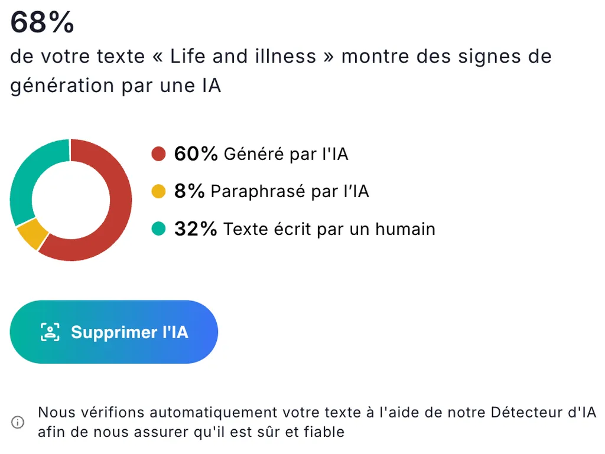

J’ai été ramené à un haut degré d’incertitude quant à ma nature en soumettant à [Justdone, un détecteur IA,](https://justdone.com/fr/word-counter) le chapitre inaugural de *L’expérience humaine*. Le verdict est sans appel : je serais une machine à 68 % – comme je n’ai pas confié à une machine le soin d’écrire un livre sur ma femme décédée, je suis donc une machine par-devers moi.

Quand j’ai publié sur Substack une note à ce sujet, un lecteur m’a raconté qu’une de ses amies freelance a été remerciée sans être payée pour avoir produit un texte IA, selon un outil du même genre.

Pourquoi des outils de détection existent-ils ? Je suppose qu’ils se destinent à ceux d’entre nous incapables de détecter les productions IA ou qui ne veulent pas se laisser abuser – les professeurs par leurs élèves – ou qui ne veulent surtout pas toucher à cette marchandise factice pour des raisons politiques, écologiques, philosophiques…

À ce jour, l’existence des outils de détection démontre que deux façons d’écrire s’opposent, l’une IA et l’autre humaine, ce qui n’est pas aussi simple puisqu’il existe autant de façons IA que d’IA, autant de façons humaines que d’humains.

Justdone a l’audace de proposer un service payant pour réécrire des textes de façon qu’ils ne sonnent plus IA – [fonction d’humanisation qui fonctionne au mieux à 26 %](https://arxiv.org/pdf/2501.03437). Ce glissement est en soi alarmant. On demande à une machine qui ne sait pas écrire humain de rendre des textes plus humains, et même des textes 100 % humains comme le mien. C’est à donner le vertige, surtout à ficher la trouille : les machines jugeraient notre humanité et en deviendraient l’alpha et l’oméga, capables de nous discréditer comme elles l’ont fait avec l’amie freelance de mon lecteur, capables de juger et de punir.

Bien sûr, Justdone vend une imposture parce que les IA ne savent pas encore écrire humain et aucune IA ne peut rendre un texte plus humain (tout au plus moins IA). Justdone tente sans grand succès de transformer un texte pour qu’il ne déclenche aucune alerte dans les outils de détection qu’il estime de référence : [GPTzero](https://gptzero.me), [Scribbr](https://www.scribbr.fr/detecteur-ia/), [Originality](https://originality.ai) et [Grammarly](https://www.grammarly.com/ai-detector). Ce texte transformé n’est en rien plus humain – il a été transformé par une machine –, il ne semble humain que pour d’autres machines de peu de jugement.

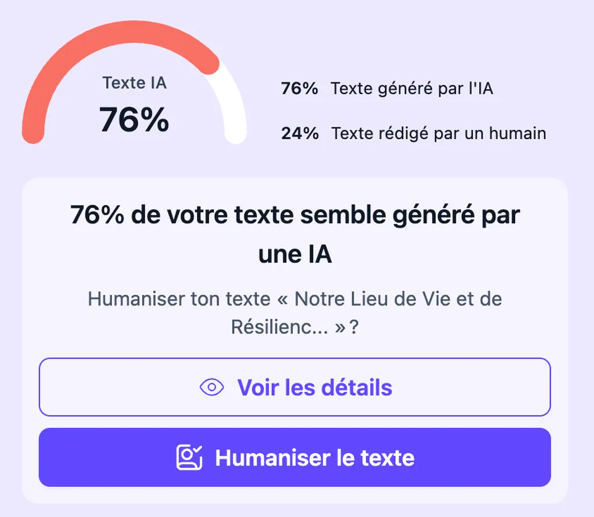

Convaincu que Justdone était un service merdique, j’ai alors testé [Textguard](https://textguard.ai/) (lui aussi mis en avant par les publicités Google). Encore mieux, je suis maintenant IA à 76 %. J’ai décidé de tester directement les outils soi-disant utilisés par les deux services, auxquels j’ai ajouté [Pangram](https://www.pangram.com/), [Turnitin](https://papercheck.in/) et [Copyleaks](https://copyleaks.com/fr/ai-detector), des outils [mis à l’épreuve dans une étude académique belge récente](https://link.springer.com/article/10.1007/s40979-026-00226-w).

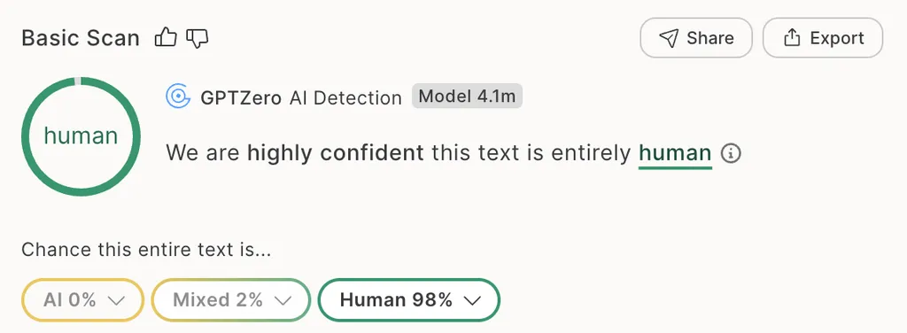

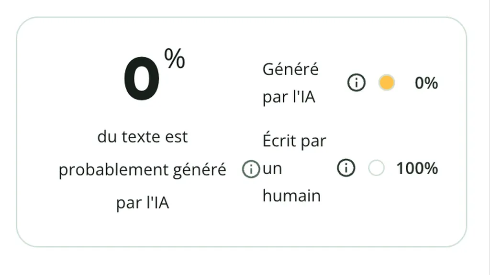

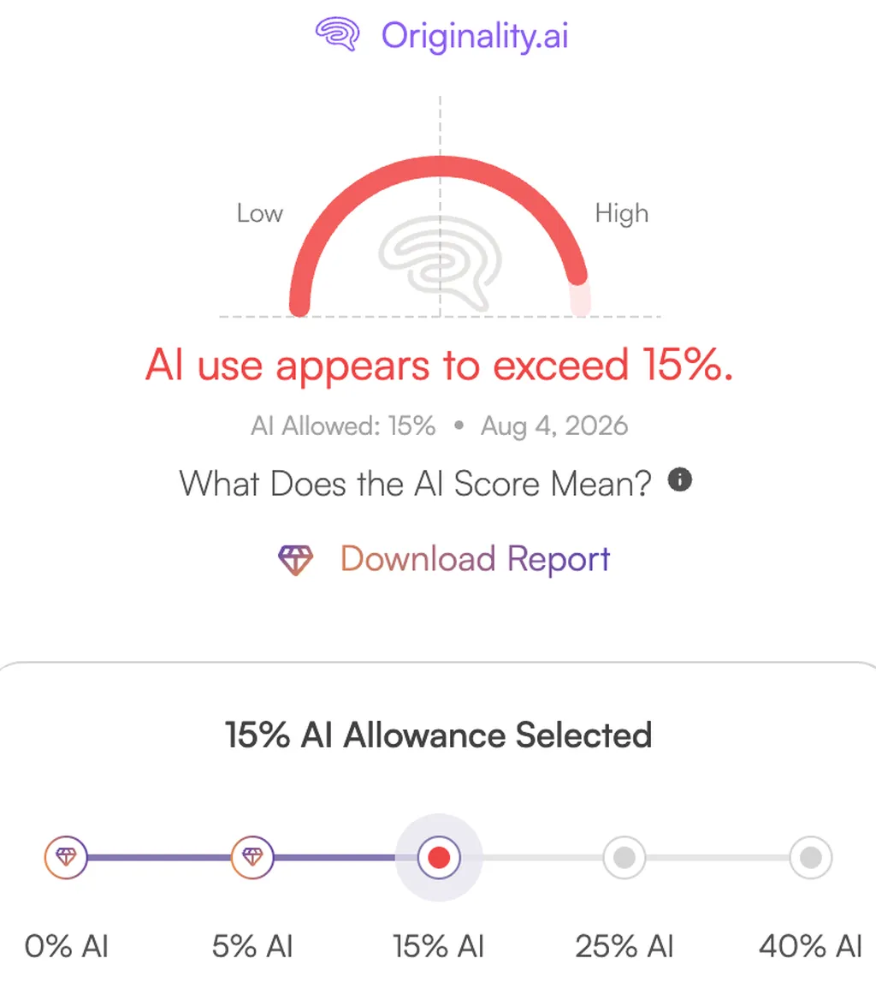

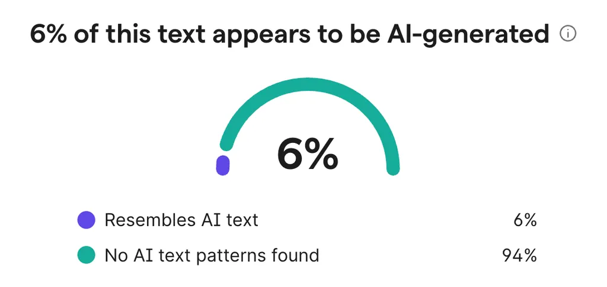

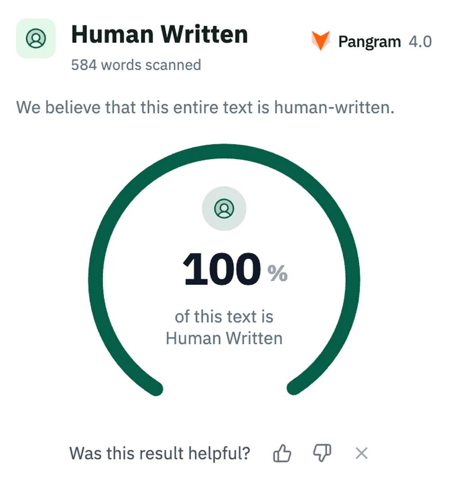

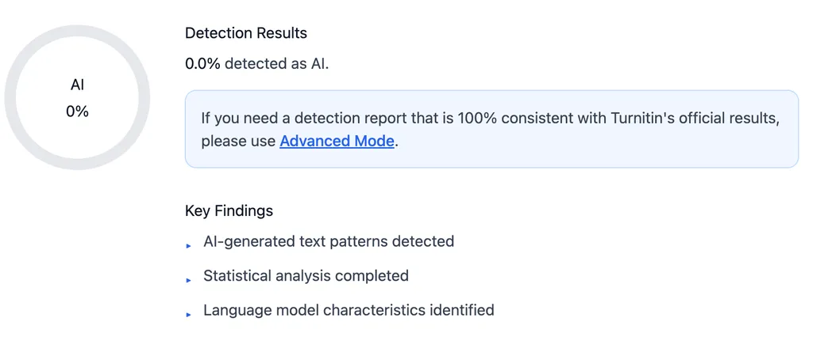

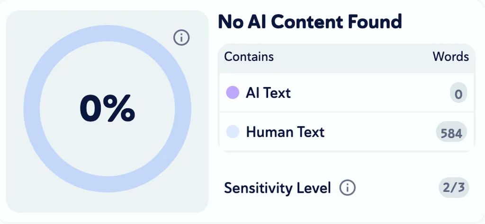

Mon taux d’IA varie désormais entre 0 et 15 %. Justdone et Textguard sont donc deux services attrape-couillons (clones l’un de l’autre et poussés sans scrupule par Google qui contribue activement à la merdification d’internet). Ils affichent des statistiques erronées pour nous inciter à payer une réécriture – ça s’appelle de l’escroquerie. Reste qu’il subsiste en moi une petite part IA selon Originality (faux positif), à moins que ce ne soit le contraire, que les IA aient réussi à s’accaparer à ce jour jusqu’à 15 % de notre humanité – ce qui serait logique puisqu’elles apprennent en nous imitant.

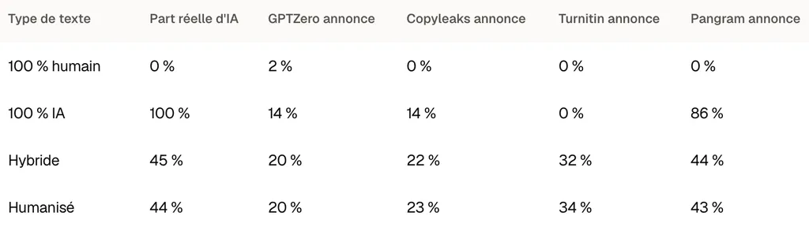

Dans l’étude belge, seul Pangram tire son épingle du jeu – [un article de Nature explique pourquoi la plupart des détecteurs échouent](https://www.nature.com/articles/d41586-026-01358-2). Il détecte un texte 100 % IA comme IA à 86 % (faux négatif), ce qui revient à leur accorder 14 % d’humanité, une part qui ne cessera d’augmenter. Plus amusant, Pangram détecte les textes hybrides coécrits avec IA et les textes humanisés, ce qui rend absurde l’usage des outils d’humanisation. Entre les faux positifs et négatifs se déploie une bande d’incertitude où écriture humaine et artificielle se confondent – et plus personne ne peut le nier.

Quand on parle d’humain en écriture, on évoque trois choses différentes :

* Un texte produit par un humain, certifié 100 % bio.
* Un style à l’apparence humaine dont l’origine est indiscernable (et nous venons de voir que les machines n’en sont pas encore là).
* Un texte qui implique un lien existentiel entre un auteur et des lecteurs (là, vous ête en train de me lire), ce qui n’a aucun lien avec le 100 % bio susceptible de produire des textes merdiques et désincarnés.

Tout se complique. J’utilise toujours des [tirets cadratins dans mes textes, longtemps concidérés comme un signe d’IA quand ChatGPT dans ses premières versions en abusait](https://www.fastcompany.com/91584243/how-to-identify-ai-generated-writing-viral-report-has-surprising-new-clues-economist). Je n’ai pas envie de transformer mon écriture, ou ne serait-ce que ma ponctuation, pour faire moins IA. J’écris comme j’écris, et souvent j’utilise des séries de trois qualificatifs ou subordonnées pour enfoncer le clou (1), proposer un contrepoint (2), une note déroutante (3). Cette façon d’écrire serait aussi IA. J’ai toujours aimé ces trinités pour leur équilibre formel et musical, et de nombreux auteurs aussi, voilà pourquoi les IA en abusent. Ça ne veut pas dire que cette forme est à proscrire. Ce serait un drame de nous interdire des formules parce que les machines les adoptent.

Nous n’avons pas arrêté de jouer aux échecs depuis que les ordinateurs battent les champions ; au contraire, le jeu est plus populaire que jamais (et les joueurs plus paranos que jamais face à la triche – un peu comme nos universitaires avec les textes). [Chess.com](https://www.chess.com) a franchi les 200 millions de comptes en 2025, le Championnat du monde 2024 a atteint 10 millions de spectateurs simultanés.

Que des machines écrivent désormais ne nous empêchera pas de continuer d’écrire, et même plus que jamais, parce que l’écriture est un des moyens les plus puissants pour témoigner de l’expérience humaine. Qu’une machine utilise une figure de style ne devrait pas nous dissuader de l’utiliser. Je tiens à ma liberté, devinant autour de nous une nouvelle pression liberticide aux origines troubles.

Un texte 100 % bio peut parfois laisser croire à l’intervention des machines du seul fait qu’elles passent leur temps à nous imiter. Reste que leurs tics nous influencent. J’ai souvent coupé des structures en trinité dans *L’expérience humaine* parce que les IA me les rendent de plus en plus insupportables. [Les machines transforment ma façon d’écrire](https://www.politis.fr/articles/2026/07/idees-ce-que-lintelligence-artificielle-fait-au-langage-humain). J’anticipe un avenir proche où nos textes et les leurs seront indiscernables. Il en sera fini du business des détecteurs. Nous apprendrons à nous fier à des auteurs de confiance, sans douter de leur humanité et de leur désir de partager l’expérience humaine. Nous serons à la recherche d’une intimité (1), d’une proximité (2), d’un partage d’expérience [comme je le fais dans mes carnets](https://tcrouzet.com/carnet-de-route/) (3).

On aura besoin de toucher les auteurs, de les voir travailler, et tout ça n’aura de sens que s’ils se démarquent des machines (1), que s’ils explorent de nouvelles perspectives (2), que s’ils travaillent ce qui nous terrifie et nous émerveille (3). J’y crois et j’ai peur : de nombreuses productions littéraires de masse s’apparentent à ce que les IA maîtrisent, et ça ne dérange guère les lecteurs, qui n’y voient rien d’inhumain, ce qui, en soi, est flippant.

Après tout, peu importe comment un texte est produit du moment qu’il nous touche. Tout se joue dans la relation auteur-lecteur. Si vous avez confiance en mon travail, si demain je publie un livre où j’aurai utilisé les IA pour explorer des terrains vierges à mes yeux – [déjà fait avec *Le code Houellebecq*](https://static.tcrouzet.com/books/le-code-houellebecq/) –, pourquoi ça vous dérangerait ?

Je trouve risquée l’injonction de déclarer si nous utilisons les IA ou non, et pourquoi pas alors ce que nous prenons au petit déjeuner – ce que je mange influence aussi ce que j’écris ? Déclarer « j’utilise des IA » entraîne un biais cognitif chez le lecteur, [une contestation immédiate de la qualité produite](https://www.sciencedirect.com/science/article/pii/S0749597825000172), alors que sans alerte un habile praticien peut glisser des passages IA réécrits à sa sauce pour qu’ils tombent juste. Cette affaire n’est pas une question de style, d’apparence humaine ou même de 100 % bio, c’est une question d’expérience humaine. J’utilise tous les moyens à ma disposition pour témoigner de cette expérience. Si les machines peuvent m’aider, pourquoi pas.

À la limite, pour les écologistes, un livre devrait arriver avec le bilan carbone de l’auteur pour la période d’écriture. Des auteurs opposés à l’IA font flamber la planète en voyageant en avion. Je ne vois guère que la confiance pour nous relier, et pas la confiance frelatée des réseaux sociaux, une confiance enracinée dans la fraternité et le compagnonnage.

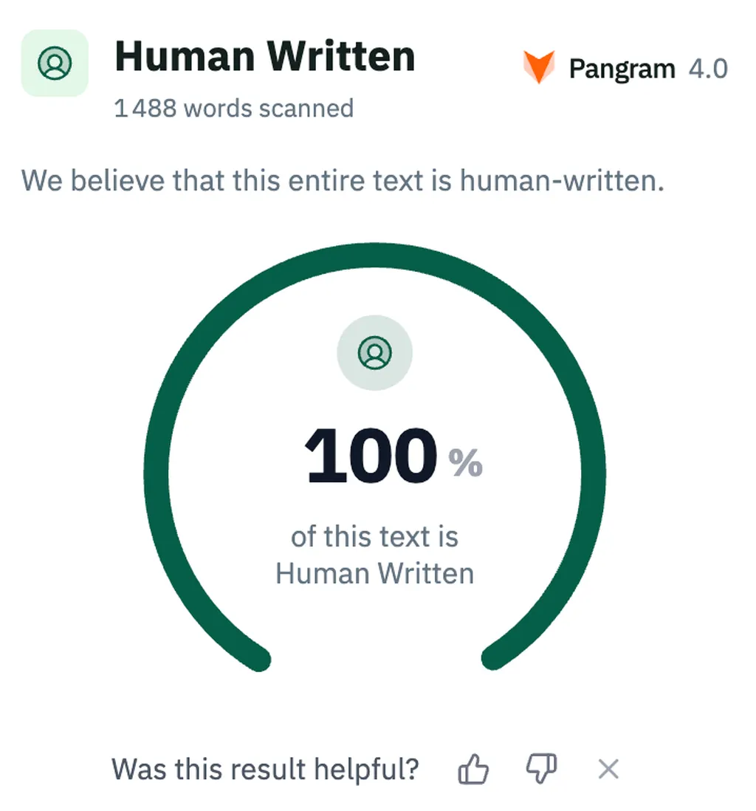

Rassurez-vous, cet article est 100 % humain selon Pangram, pourtant j’ai utilisé trois agents IA :

* Le premier pour me challenger après la version initiale (il m’a donné des sources à lire, m’a poussé à argumenter certains points, à corriger des chiffres… autant de choses indétectables si je n’en parlais pas).
* Le deuxième pour la correction orthotypo.
* Le troisième pour les métabalises.

Un texte n’a pas besoin d’être écrit par une IA pour contenir une part d’IA.

#netlitterature #ia #y2026 #2026-8-6-13h00
