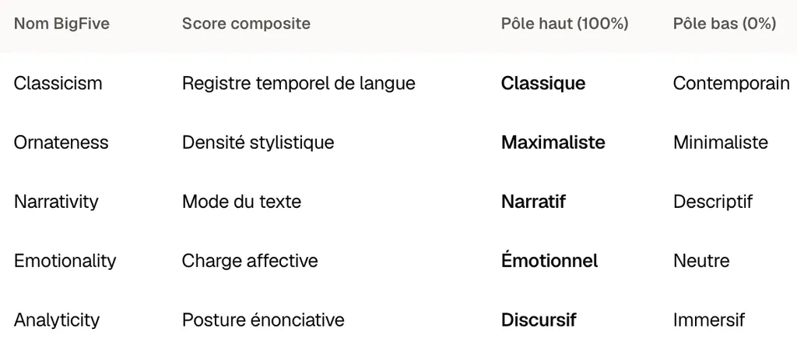
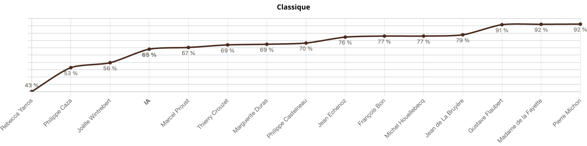
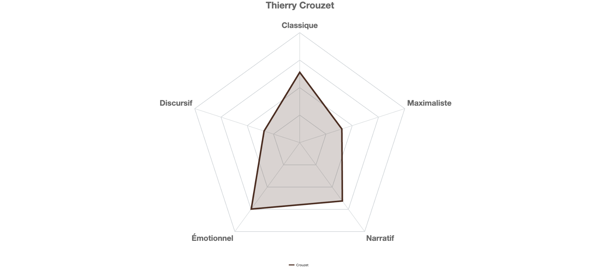
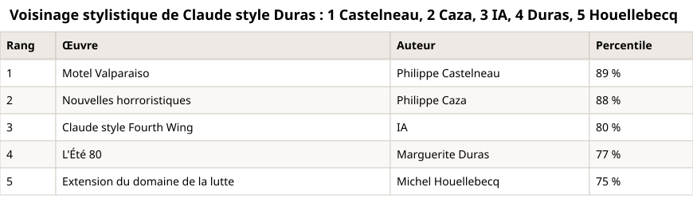

# Je n’utilise pas l’IA pour écrire mais pour me lire

Plus personne ou presque ne lit, mais nous restons nombreux à écrire. Alors sommes-nous plutôt classiques ou baroques, émotionnels ou neutres, discursifs ou narratifs ? Je connais des écrivains qui ne se posent pas la question – ils écrivent, point. Moi, au contraire, j’ai toujours tenté de me situer.

[Depuis que je joue avec les statistiques textuelles](https://tcrouzet.com/tag/textstat/), on me dit « Seul importe l’émotion », « Tu perds ton temps » ou « Les chiffres ne peuvent rien dire de la littérature », étonnant remarque alors que les machines produisent des textes sans relâche. Des maths engendrent des textes et les maths n’auraient aucun rapport avec la littérature ?

Une lectrice – il en reste quelques-unes – vient de m’envoyer une célèbre citation de Proust, extraite du *Temps retrouvé* : « Car le style pour l’écrivain aussi bien que la couleur pour le peintre est une question non de technique mais de vision. Il est la révélation, qui serait impossible par des moyens directs et conscients, de la différence qualitative qu’il y a dans la façon dont nous apparaît le monde, différence qui, s’il n’y avait pas l’art, resterait le secret éternel de chacun. » Si on en restait là, on en serait encore à regarder le ciel sans se demander pourquoi il est bleu. S’émouvoir face à une œuvre n’empêche pas de chercher l’origine de nos émotions, ni de se demander pourquoi un style nous parle, un autre pas. Comme si Proust n’était pas aux aguets, lui qui distend la structure syntaxique pour détruire la notion de temps. N’est-ce qu’une affaire de vision ?

Dans une lettre à Jean-Louis Vaudoyer du 12 avril 1913, il s’explique : « Il ne reste pas une ligne sur vingt du texte primitif (remplacé d’ailleurs par un autre). C’est rayé, corrigé dans toutes les parties blanches que je peux trouver, et je colle des papiers en haut, en bas, à droite, à gauche, etc. \[…] Je suis en train de faire sur les épreuves un travail de remaniement, de réécriture, qui est une véritable folie. » Cette folie n’est possible que grâce à une immense maîtrise technique : non une simple intuition, mais une forme d’objectivité, une conscience littéraire aiguë. Il serait dangereux de confondre l’inspiration, le [rush](https://tcrouzet.com/books/rush/), et le travail subséquent. Proust témoigne de cette dualité.

Les maths ne sont pas la littérature, à coup sûr, mais elles peuvent nous aider à mieux la comprendre, à différencier les œuvres et les auteurs. Les maths arrivent après, sans être inutiles, un outil de plus comme les dictionnaires de synonymes. Pour me prouver que je ne suis pas dingue, j’ai établi une brève chronologie des recherches dans ce domaine.

### Chronologie

- **1851** Dans une lettre, le logicien [Augustus de Morgan](https://en.wikipedia.org/wiki/Augustus_De_Morgan) suggère de [comparer la longueur moyenne des mots pour trancher une question d’attribution d’auteur](https://archive.org/details/memoirofaugustus00demouoft).
* **1887** Le statisticien T. C. Mendenhall compare les distributions de longueurs de mots chez Dickens, Thackeray et Mill.
- **1898** Le philosophe [Wincenty Lutosławski](https://fr.wikipedia.org/wiki/Wincenty_Lutos%C5%82awski) invente le mot [stylométrie](https://www.persee.fr/doc/reg_0035-2039_1898_num_11_41_5847) pour dater les dialogues de Platon par comparaison de leur style.
- **1935** Dans [*The Psycho-Biology of Language*](https://mitpress.mit.edu/9780262240055/the-psycho-biology-of-language/), le linguiste [George Kingsley Zipf](https://fr.wikipedia.org/wiki/Loi_de_Zipf) découvre que la fréquence d’un mot est inversement proportionnelle à son rang quel que soit l’auteur. Une loi si universelle qu’elle ne distingue personne.
- **1944** Dans [*The Statistical Study of Literary Vocabulary*](https://books.google.fr/books/about/The_Statistical_Study_of_Literary_Vocabu.html?id=DaCCAAAAIAAJ&redir_esc=y), George Udny Yule pose les bases de la richesse lexicale mesurée statistiquement.
- **1959** Cox et Brandwood publient [*On a Discriminatory Problem Connected with the Works of Plato*](https://academic.oup.com/jrsssb/article/21/1/195/7035315).
- **1962** Dans [*A Statistical Method for Determining Authorship: The Junius Letters, 1769-1772*](https://books.google.com/books/about/A_Statistical_Method_for_Determining_Aut.html?id=oJJO0gEACAAJ), Alvar Ellegård affine les classifications chronologiques et les attributions.
- **1963** Dans une étude fondatrice, [*Inference in an Authorship Problem*](https://www.tandfonline.com/doi/abs/10.1080/01621459.1963.10500849), Frederick Mosteller et David Wallace utilisent les fréquences de mots-outils et l’inférence bayésienne pour départager Hamilton et Madison.
- **1960-1970** En France, l’école de la statistique textuelle se développe avec Charles Muller, [Jean-Paul Benzécri](https://fr.wikipedia.org/wiki/Jean-Paul_Benz%C3%A9cri), puis Étienne Brunet et Charles Bernet.
- **2002** Avec [*’Delta’: a Measure of Stylistic Difference and a Guide to Likely Authorship*](https://www.researchgate.net/publication/240956478_’Delta’_a_Measure_of_Stylistic_Difference_and_a_Guide_to_Likely_Authorship), John Burrows propose une méthode dès lors standard pour comparer les empreintes stylistiques des auteurs (je l’utilise).
- **2010-2020** Machine learning et deep learning appliqués à la stylométrie, notamment dans des affaires judiciaires ([l’affaire Grégory, avec Florian Cafiero](https://www.radiofrance.fr/franceinfo/podcasts/les-documents-franceinfo/affaire-gregory-la-stylometrie-permet-de-savoir-qui-parle-a-partir-de-la-langue-employee-explique-florian-cafiero-7459843)).
- **2020-2026** Les [grands modèles de langage](https://fr.wikipedia.org/wiki/Grand_mod%C3%A8le_de_langage) ne se contentent plus d’analyser la littérature, ils en produisent aussi.

### Et ça continue

[Sébastien Bailly pointe une nouvelle étude](https://www.ecrireclair.net/posts/cinq-curseurs-un-167808486), [LiteraryBigFive](https://github.com/Znull-1220/LiteraryBigFive), qui propose de cartographier les œuvres selon cinq axes. Comme je venais de publier [mon application de cartographie littéraire](https://tcrouzet.com/2026/08/23/statistiques-litteraires/), j’ai eu envie de rebondir.

Le principe de LiteraryBigFive : donner à lire à un LLM, un Llama-2-7B-chat-hf, des textes annotés selon cinq traits (Classicism, Ornateness, Narrativity, Emotionality, Analyticity), puis des versions neutres des mêmes textes. Au cœur du modèle, la lecture laisse en empreinte un vecteur de 4096 nombres. La différence moyenne entre ces vecteurs, calculée séparément pour chaque trait sur l’ensemble du jeu de données, donne cinq directions, rendues indépendantes les unes des autres par une décomposition mathématique. On peut ensuite situer un auteur donné en projetant ses textes sur les cinq directions. Reste une question ouverte : rien ne garantit que la direction mathématique obtenue corresponde exactement à ce que le nom du trait annoté suggère.

Mon Mac prend de l’âge et ne peut pas exécuter ce vieux Llama : j’ai décidé de reprendre l’idée mais de façon déterministe. D’après les données de LiteraryBigFive, j’ai recréé leurs cinq axes en combinant des mesures objectives ([les détails sur le GitHub](https://github.com/tcrouzet/unshiter)). Je peux ainsi à mon tour créer un radar pour y situer des œuvres ou des auteurs.



J’ai eu beaucoup de mal à comprendre ce que les chercheurs désignent par leurs cinq axes. Ils sont nommés, sans que soit nommée leur valeur plancher. C’est quoi le contraire de classique ? Et le contraire de narratif, n’est-ce pas analytique ? On a pourtant deux axes différents pour ces valeurs.

J’ai donc tenté de recréer des axes non qualificatifs, mais esthétiques. Par exemple, un texte a une chance d’être plus classique s’il est écrit au passé simple plutôt qu’au présent. J’ai ainsi créé des formules combinant la cinquantaine de mesures à ma disposition pour générer des axes lisibles.



Pour tester puis valider, j’ai regardé comment se classaient quelques œuvres et auteurs sur les différents axes.

### Quelle utilité ?

Pour moi, elle n’est pas négligeable. Par exemple, quand j’analyse *L’expérience humaine*, je vois que le texte n’est pas discursif mais plutôt émotionnel, ce qui est mon objectif. Je pourrais peut-être le rendre plus maximaliste et varier davantage la longueur de mes phrases, du moins je n’ai pas à chasser obsessionnellement les relatives. Ce radar décrit le texte avec froideur. Il me permet de le regarder avec une certaine objectivité, ce qui n’est jamais facile pour un auteur.



L’autre utilité de l’application est de générer une empreinte stylistique d’une œuvre, d’un auteur ou d’auteurs en exportant leurs statistiques au format json. À partir de ces données, on peut alors demander à un LLM d’écrire un prompt de réécriture.

```
À partir des données stylistiques détaillées dans le fichier json attaché crée un prompt de réécriture dans ce style. Attention de ne pas produire un prompt que tu serais incapable de mettre en œuvre car trop complexe. Écarte les mesures dont la dispersion est inférieure à 0.1 (10%).
```

Voici le résultat pour le json des *Particules élémentaires* de Houellebecq.

```
Tu es un correcteur stylistique. Réécris le texte fourni en conservant intégralement son sens, ses informations et sa structure narrative, mais en transformant son style pour qu'il corresponde au profil suivant.

REGISTRE GÉNÉRAL
- Style classique et écrit : passé simple pour la narration, syntaxe active, aucune familiarité orale hors dialogue, aucun futur périphrastique ("il va faire" → "il fera").
- Tendance plutôt maximaliste que minimaliste : groupes nominaux étoffés, vocabulaire assez recherché, sans tomber dans la préciosité systématique.
- Équilibre scène/discours : ni pur récit d'action ni essai argumentatif ; quelques connecteurs logiques, mais la scène prime sur le commentaire.

PHRASES ET RYTHME
- Phrases plutôt longues (autour de 100-120 caractères / ~20 mots en moyenne), avec une amplitude réelle : alterner quelques phrases courtes et sèches avec des phrases nettement plus longues (fourchette large, du très court à plus de 200 caractères).
- Peu de subordination empilée : préfère la juxtaposition et la coordination à l'enchâssement de relatives ou de subordonnées. Profondeur syntaxique plutôt basse.
- Voix active dominante, verbes de mouvement/action.
- Paragraphes de longueur variable, parfois très inégale (ne pas viser une régularité mécanique).

LEXIQUE ET GROUPES NOMINAUX
- Adjectifs fréquents et noms bien modifiés : ajoute volontiers un complément du nom, une relative courte ou un adjectif aux noms importants, sans les empiler à l'excès.
- Vocabulaire assez rare/soutenu par endroits, sans jargon.
- Chaînes d'adjectifs coordonnés rares mais possibles, et plutôt longues quand elles apparaissent ("grand, sombre et silencieux" plutôt qu'un seul adjectif isolé).
- Comparaisons ("comme...") très occasionnelles seulement, ne pas en abuser.
- Quelques noms abstraits, sans excès théorique.

TEMPS ET MODES
- Passé simple net pour la narration ; passé narratif hors dialogue assez présent.
- Pas de subjonctif imparfait/plus-que-parfait, pas de tournures archaïsantes recherchées.
- Présent gnomique (vérités générales) possible mais rare.

PONCTUATION
- Densité de ponctuation modérée (ni haché ni fluide à l'excès).
- Varier les signes : point-virgule, deux-points, tirets, guillemets, parenthèses — pas seulement points et virgules.
- Aucune exclamation, aucune tournure exclamative ("Que...!", "Comme...!").

DIALOGUE ET AFFECT
- Le dialogue peut occuper une part notable du texte (environ un tiers), introduit par un tiret cadratin ; c'est dans ces répliques, pas dans la narration, que peut apparaître une légère familiarité orale.
- Verbes de réaction affective (trembler, pâlir, rire...) autorisés ponctuellement pour montrer l'émotion sans la nommer abstraitement.
- Peu de phrases négatives.

À ÉVITER
- Futur périphrastique, subjonctif littéraire, exclamations, comparaisons répétées, empilement de subordonnées, phrases nominales fréquentes, répétitions lexicales rapprochées du même mot (varie les synonymes et les lemmes sur une fenêtre d'une vingtaine de mots).

Applique ces consignes de façon organique, sans les mentionner ni les lister dans le texte réécrit. Le résultat doit se lire comme une prose naturelle et cohérente, pas comme une démonstration technique.

TEXTE À RÉÉCRIRE :
[insérer le texte ici]
```

Je trouve toujours amusant de demander la réécriture de textes à la mode d’un tel ou d’un tel – ça ne marche qu’approximativement, la preuve : ma réécriture à la mode Duras qui ne ressemble pas à du Duras –, mais ça me donne des idées et m’aide à changer de perspective.



Je n’utilise pas l’IA pour écrire mais pour me lire – la réécriture exige de lire, alors je vois ce qui échappe à l’IA et ses incompréhensions m’aident à préciser ou à brouiller davantage – souvent des idées m’arrivent. L’IA devient pour moi un miroir littéraire, jamais dans les moments créatifs, mais quand je relis, taille, ajoute, ouvre des parenthèses comme Proust avec ses paperoles.

Tous les jours, je me jure d’arrêter ces histoires de statistiques, ces fantaisies – je ne prétends à aucune vérité –, puis j’en rajoute, parce que j’ai la trouille de me remettre à la seconde version de *L’expérience humaine*, la trouille d’ouvrir les vannes, la trouille de me mettre en danger. J’attends la fin des vacances des enfants. J’attends d’être seul face à l’étang, face au texte. Une bonne excuse.

#netlitterature #ia #textstat #y2026 #2026-8-28-17h00
