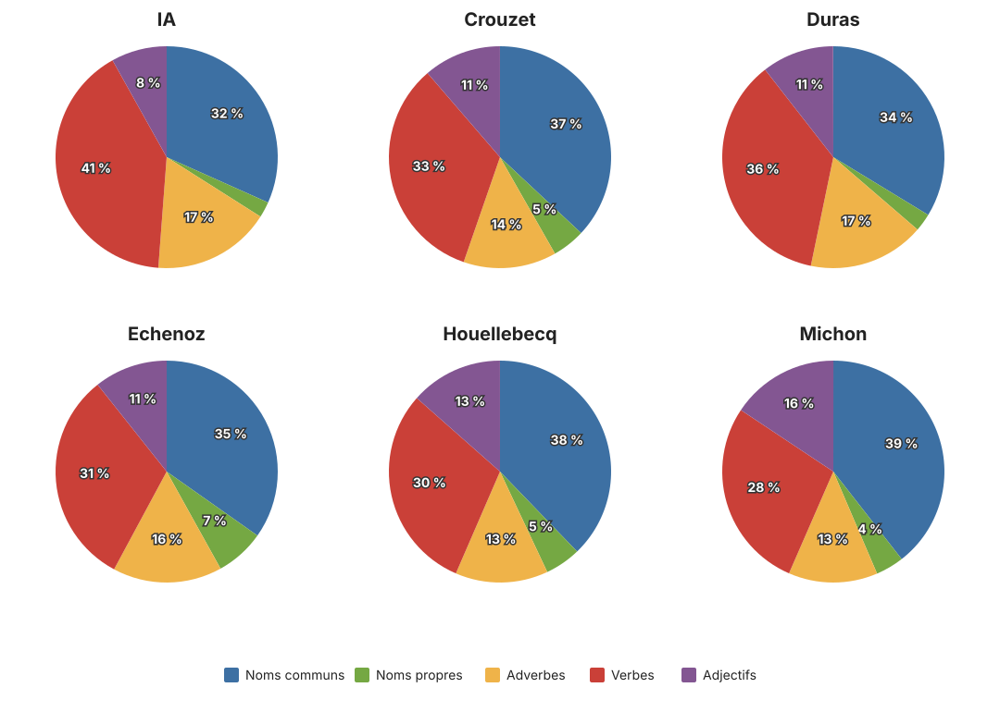
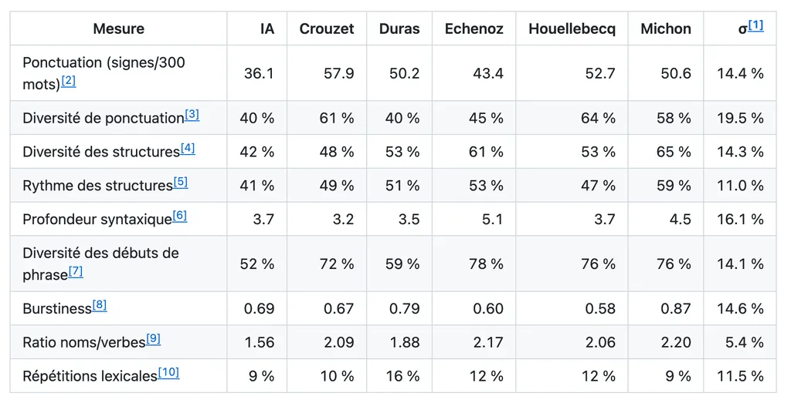

# La question n’est si c’est de l’IA mais si c’est bon

Attention : ce billet suit un chemin tortueux, son point de départ très éloigné de son point d’arrivée. Je vous raconte mon cheminement.

J’ai d’abord eu envie de réagir aux AI Act. Lors du dépôt d’une demande d’enregistrement de copyright aux US, [le déclarant doit indiquer si une partie de son contenu a été généré par IA](https://www.copyright.gov/ai/ai_policy_guidance.pdf), parce que seules les œuvres humaines peuvent être protégées par copyright. En Europe, selon [l’article 50 de l’AI Act](https://eur-lex.europa.eu/legal-content/FR/TXT/?uri=CELEX:02024R1689-20260727) « Les déployeurs d’un système d’IA qui génère ou manipule des textes publiés dans le but d’informer le **public** sur des questions d’intérêt **public** indiquent que le texte a été généré ou manipulé par une IA. »

Mes textes étant selon moi d’intérêt public, je devrais désormais vous dire si j’utilise de l’IA pour écrire telle ou telle phrase. Par exemple, j’ai demandé à Claude de me retrouver les liens sur les actes US et européens, des liens qui enrichissent mon texte et entrent sous le coup de la juridiction européenne. Je fais acte de contrition, j’avoue, la voix tremblante, avoir utilisé une IA. Je suis fautif, seigneur. J’ai trahi l’humanité. Ne vous croyez pas innocents. Si vous répétez un truc lu sur un réseau social privatif ou vu sur YouTube, vous péchez, puisque ces services utilisent l’IA à grande échelle.

Mais pourquoi, en plus de l’usage de l’IA, ne pas indiquer la quantité de café absorbée pour produire tel ou tel document, ou de viande, ou de pinard, ou de coke ? Pourquoi pas l’empreinte carbone ? Pourquoi pas le niveau de maltraitance animale ? Ou le degré de sexisme ? Parce que si l’IA n’est ni écologique ni éthique, ce n’est pas la seule. Si on se place sur ces terrains, allons-y à fond. Ne soyons pas hypocrites, sinon pourquoi deux poids, deux mesures ?

Quand je lis pour la première fois un texte, je me fiche de savoir s’il a été écrit en terrasse de café, dans une chambre climatisée ou dans un avion, avec un stylo ou un ordinateur. Une simple question : la lecture me procure-t-elle une expérience intellectuelle, émotionnelle, esthétique ? Si oui, je déclare le texte bon – une appréciation relative, mais parler de qualité dans l’absolu me paraît dictatorial. Si un auteur ou une autrice réussit à me faire vivre une expérience à l’aide d’IA, je l’embrasse sur la bouche. A priori, je préfère ne pas savoir s’il utilise l’IA de peur que [cette connaissance altère mon jugement – me dire « c’est IA » nuirait à mon expérience](https://arxiv.org/abs/2410.03723).

Malheureusement, les AI Act se fichent de mon plaisir de lecteur tout comme de l’écologie et de l’éthique. Les législateurs ont voulu éviter les tromperies sur la nature des interlocuteurs, limiter la désinformation, les manipulations à grande échelle, les deepfakes et les usurpations d’identité, tout ça en nous demandant de déclarer nos usages de l’IA, ce que feront sans sourciller les truands, [se débrouillant pour humaniser leurs créations](https://tcrouzet.com/2026/08/06/are-you-human/) et [virant les signatures introduites par les modèles](https://www.anthropic.com/news/claude-text-watermark) – déclarer son humanitude reviendra à se blanchir.

Le truc se complique quand on lit plus loin l’article 50 : « Cette obligation \[de déclaration] ne s’applique pas \[…] lorsque le contenu généré par l’IA a fait l’objet d’un processus d’examen humain ou de contrôle éditorial et lorsqu’une personne physique ou morale assume la responsabilité éditoriale de la publication du contenu. »

Les truands assumeront comme d’habitude. Moi-même je suis sauf : j’ai vérifié les liens ajoutés à mon texte. Je peux en assumer la responsabilité éditoriale. J’aurais pu me taire, ne pas vous dire que j’ai demandé une assistance mécanique – les auteurs porteur d’un pacemaker pourront aussi se taire, et je n’ai pas besoin de vous dire que je porte de nouvelles [lunettes Rayban](https://www.ray-ban.com/france/lunettes-de-vue/RX5451rb5451%20optics-noir/8056262835081) sans lesquelles je n’aurais pas pu travailler. J’assume la responsabilité et peux utiliser autant d’IA que je veux sans rien vous dire. En résumé : le législateur admet que l’origine d’un texte n’a pas d’importance. Seule compte la responsabilité. Autant s’arrêter là et jeter la déclaration.

### Au-delà du cadre législatif

Et de fil en aiguille, à la recherche d’une martingale pour savoir si un texte était généré par IA, j’ai abouti à tout autre chose, de plus intéressant à mes yeux.

Une fois ma première expérience de lecteur dépassée, je m’intéresse à l’auteur, à ses outils, à ses nuances stylistiques. Plus particulièrement, je me demande quels sont les travers des IA par rapport aux nôtres – des travers perçus instinctivement, qui me font rejeter les créations artificielles à visées littéraires ? Comment différencier ce que les machines écrivent de ce que nous écrivons ?

[Les chercheurs distinguent les modèles IA avec 97 % de réussite](https://arxiv.org/abs/2502.12150). Cela revient à créer leur signature stylistique. Je me suis dit : pourquoi ne oas refaire le job à ma sauce et l’appliquer avant tout à des auteurs humains ? J’ai parcouru la littérature consacrée à la détection IA, bricolé quelques indices de mesure, puis [créé une application d’analyse](https://github.com/tcrouzet/unshiter). Il semble impossible de détecter la prose IA à coup sûr sans utiliser d’IA, ce qui me paraît le comble de l’ironie : nous sommes prisonniers d’une boucle étrange dont nous ne sortirons plus.

Pour tester mon appli, j’ai comparé six textes :

* [Lettre 1 purement IA](https://github.com/tcrouzet/unshiter/blob/main/sources/lettre1.md), tirée de ma de [ma correspondance amoureuse](https://tcrouzet.com/2026/08/14/correspondance-amoureuse/).
* Le manuscrit de *L’expérience humaine*.
* *Les particules élémentaires* de Houellebecq.
* *L’amant* de Duras.
* *Les vies minuscules* de Michon.
* *Ravel* d’Echenoz.

J’ai sélectionné [parmi mes mesures](https://github.com/tcrouzet/unshiter/blob/main/README.md) celles à forte dispersion et les ai rassemblées sur un graphique en radar. On voit que les auteurs possèdent des signatures différentes. Une grande profondeur syntaxique pour Echenoz, beaucoup de répétitions pour Duras, une grande diversité de structures syntaxiques pour Michon. Le seul point fort de l’IA : peu de répétitions, ce qui est le plus simple à automatiser en remplaçant un mot par un synonyme, au détriment de la musicalité.

Un deuxième graphique montre que les auteurs utilisent sensiblement les mêmes proportions de noms, verbes, adverbes et adjectifs. L’IA emploie plus de verbes et moins de noms. Reste à savoir si cette observation est généralisable. Je laisse ce boulot à un doctorant. 

Si on calcule la surface des auteurs sur le radar, on constate que l’IA possède la surface la plus petite, donc le style le moins varié. Je ne peux en tirer de généralité, mais ça traduit souvent ce que je ressens à la lecture des IA : une forme d’ennui, et la certitude de perdre mon temps.

Je détaille le mode de calcul de ces valeurs dans [le Readme du projet GitHub](https://github.com/tcrouzet/unshiter/blob/main/README.md). Un second tableau propose d’autres valeurs, écartées parce que non déterminantes ou trop semblables d’un auteur à l’autre. Par exemple, on constate que j’utilise moins de subordonnées et de relatives que les autres auteurs, et même que l’IA, ce qui est une caractéristique de mon style – mais ni particularité positive ni négative. Par conséquent, mes phrases sont souvent courtes, ce qui implique une moindre diversité stylistique que chez Michon, aux phrases amples et de longueur très variable. 

Les statistiques racontent nos écritures. Par exemple, j’ai découvert mon usage prononcé des ponctuations alors que Houellebecq, lui, utilise presque tout l’arsenal typographique à sa disposition. Le radar peut aussi suggérer des pistes de travail, comme pour moi allonger certaines de mes phrases pour créer plus de diversité rythmique.

Pour reboucler avec mon introduction, les histoires de contenus IA nous font trop souvent oublier les contenus eux-mêmes : leur texture, leurs propriétés, leur esthétique. À quand une loi pour nous obliger à déclarer si un texte nous a bouleversés ? C’est pourtant la seule chose qui compte.

Je suis conscient de n’avoir qu’effleuré le sujet, même si je me suis battu avec les statistiques pour essayer de différencier les styles. Ça serait cool de créer des cartographies sur beaucoup d’auteurs. Et répondre à des questions comme « Les best-sellers jeunes adultes affichent-ils des radars semblables ? » Je n’en serais pas surpris. Le radar est peut-être le meilleur moyen de détecter l’absence de travail sur la langue.

#netlitterature #ia #y2026 #2026-8-17-20h00
