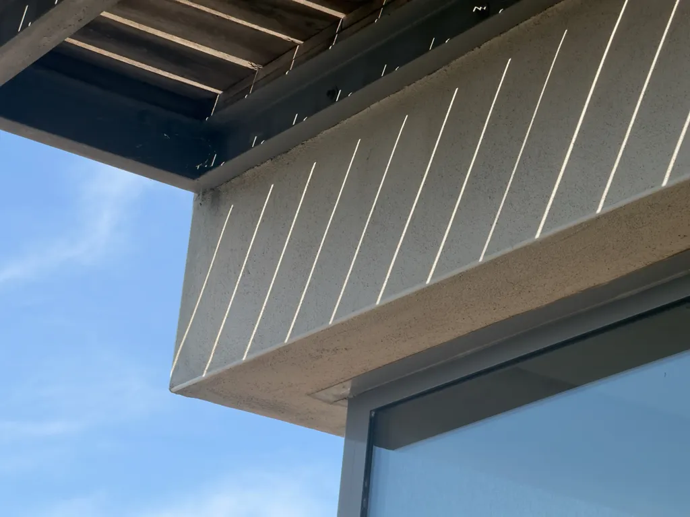
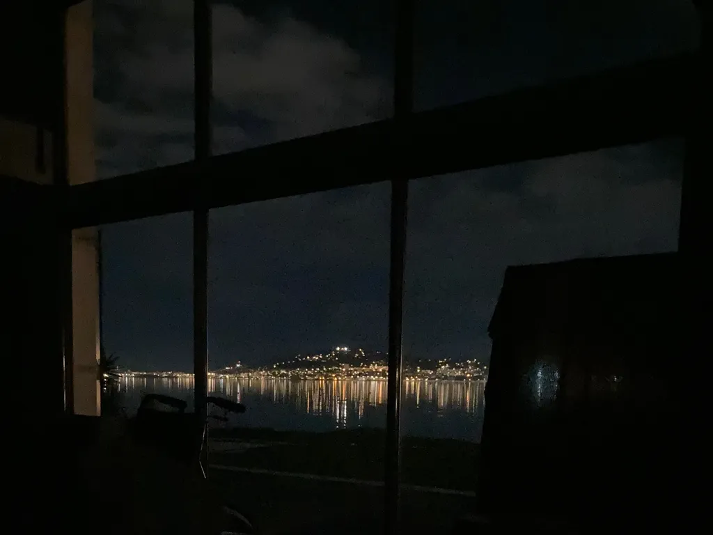
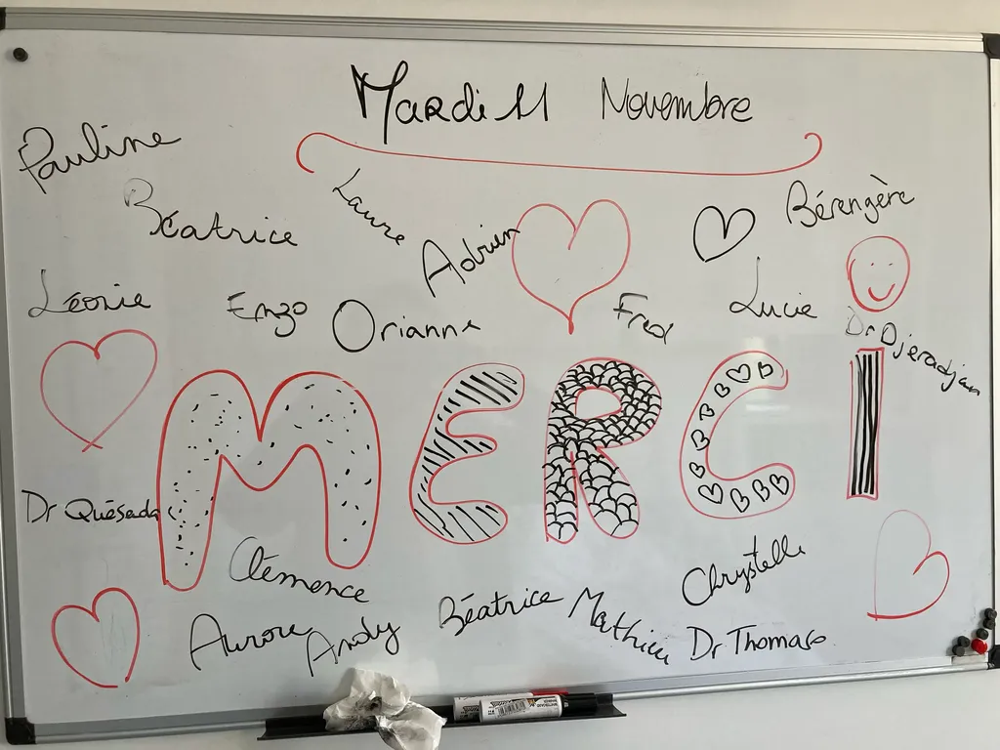
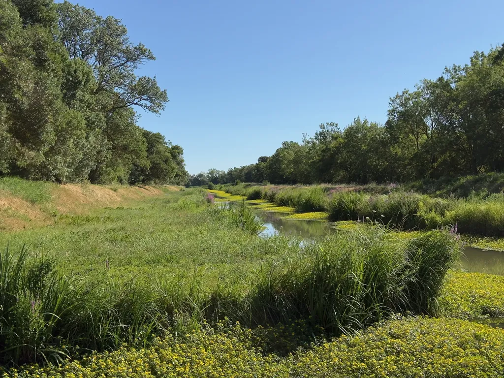
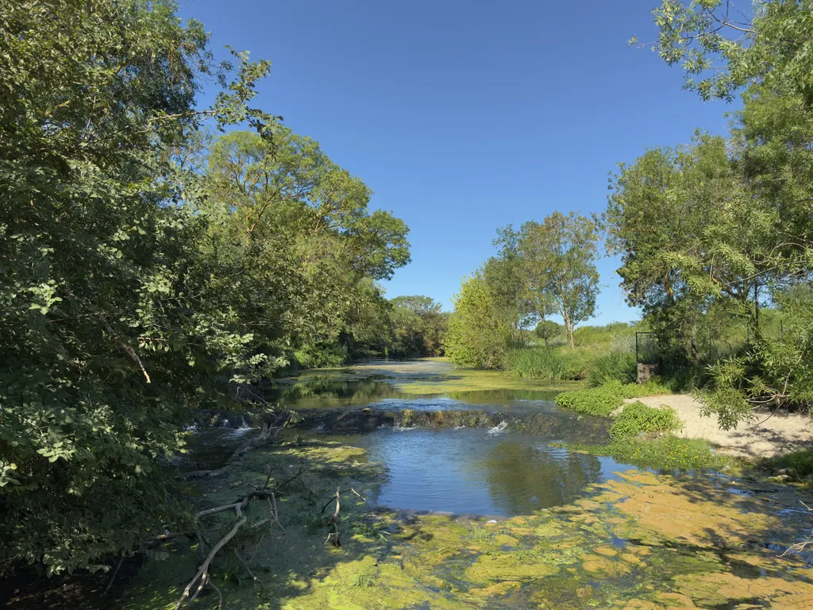
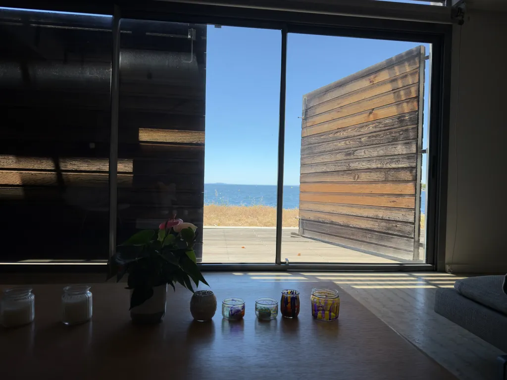
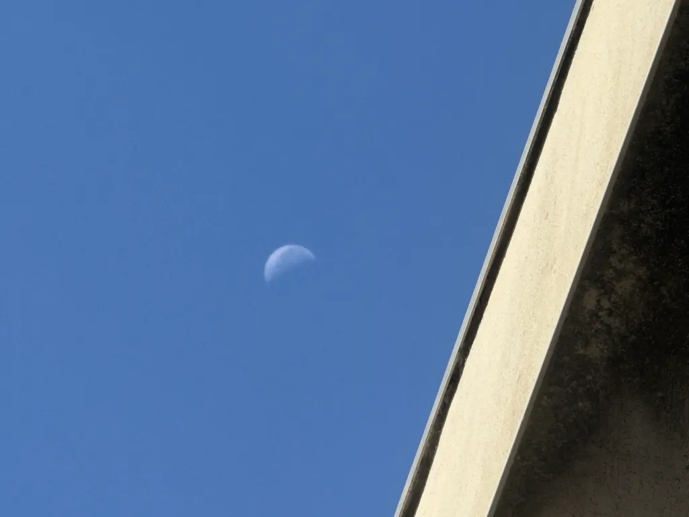
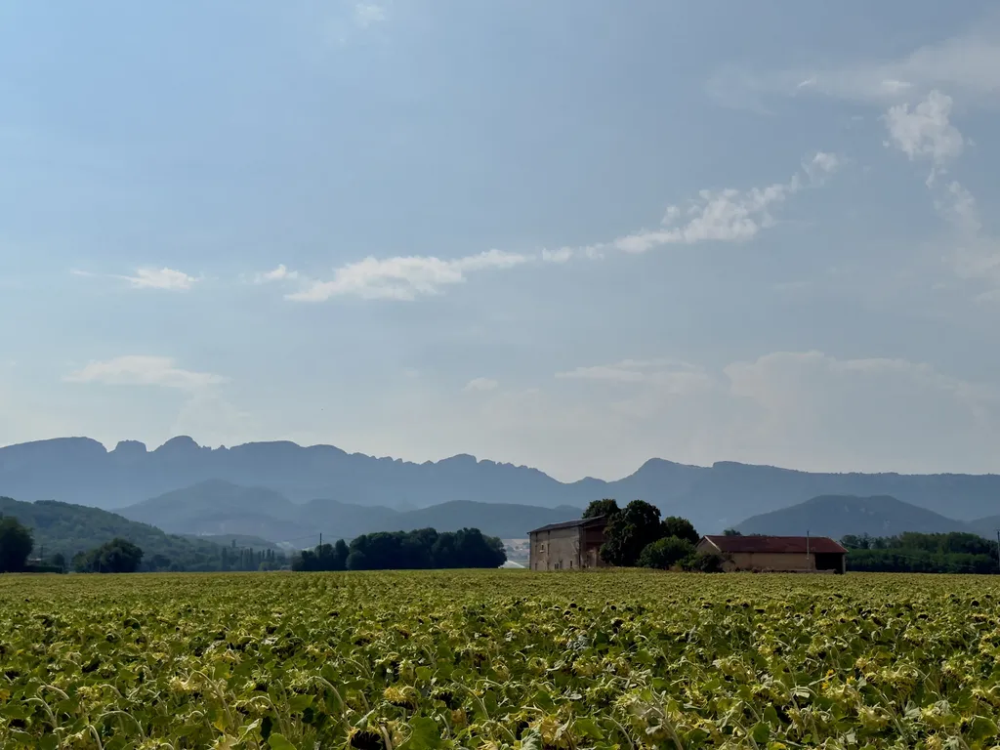
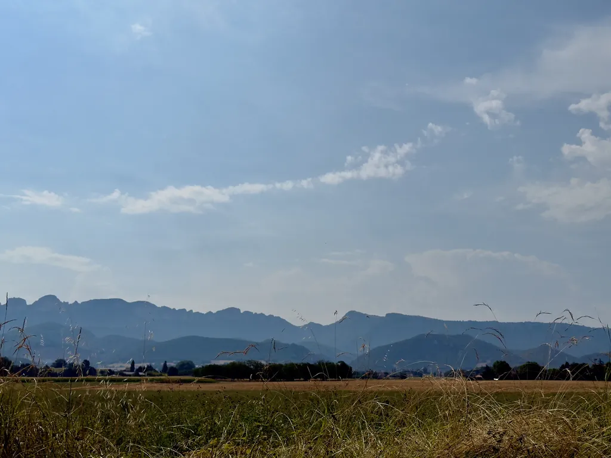

# Juillet 2026

### Mercredi 1er, Balaruc

Un vent du nord à tout arracher, brûlant, gifle les vagues et les lentisques.

### Jeudi 2, Balaruc

Dans *The Year of Magical Thinking*, Joan Didion dit « Notre maison » longtemps après la mort de son mari. Je dis « notre » en pensant à Isa et moi, et maintenant aux enfants et moi, mais ça me fait bizarre, ce « notre » flotte.

---

Humour noir : un livre sur le deuil, c’est doublement un bon coup : 1/ beaucoup de veufs, 2/ il n’y a plus guère que les vieux qui lisent.

---

Un veuf ne devrait pas s’inquiéter de finir sa vie seul car il y a beaucoup plus de femmes seules.

---

La dernière photo prise par Isa date du 29 janvier, une photo de l’étang depuis son lit médicalisé, installé dans le salon, devant la baie vitrée. J’avais placé un portant avec un drap noir pour masquer les projecteurs du stade de Sète, trop éblouissants. Elle était heureuse aux larmes.

Je trouve une autre photo, du 11 novembre, qui résume Isa : sur le tableau blanc de sa chambre des soins palliatifs, elle avait rendu hommage à l’équipe qui s’était occupée d’elle.

### Vendredi 3, Balaruc

Plus je plonge dans Murdoch, plus je me dis qu’Isa l’aurait adorée, et je m’intéresse à elle grâce à Isa:: elle en moi est curieuse de Murdoch. Et Murdoch me parle comme si elle était Isa.

### Samedi 4, Balaruc

Murdoch : « Art then is not a diversion or a side-issue, it is the most educational of all human activities and a place in which the nature of morality can be _seen_. » Je suis d’accord, mais ça tombe un peu du ciel dans *The Sovereignty of Good*.

Elle dit combien écrire la mort est difficile. *L’Expérience humaine* n’est pas un récit sur la mort, mais sur la marche vers elle, quand c’est encore la vie. Il n’y a rien à dire sur la mort.

« In intellectual disciplines and in the enjoyment of art and nature we discover value in our ability to forget self, to be realistic, to perceive justly. » En effet, s’oublier, c’est être plus en accord, en communion, en perception. En tout cas, ça me fait ça, et je m’intéresse à Murdoch parce qu’Isa tentait toujours de s’oublier, de faire passer tout le reste d’abord. Ce faisant, on est dans le bien selon Murdoch, si j’ai bien compris.

Celui qui s’oublie dans sa voiture et écrase quelqu’un n’est ni en communion ni attentif. Pas plus que le tueur. S’oublier et se tendre exige un effort. Faire le bien est difficile.

Murdoch pose des questions comme : « Dois-je me séparer de ma compagne au risque de nuire à nos enfants ? » Première tâche, je me mets en retrait, je fais taire mon ego. Donc, a priori, je ne quitte pas ma femme si mes enfants sont plus heureux quand nous sommes ensemble. En revanche, je la quitte si ensemble nous les rendons malheureux, ou je tente d’être à nouveau heureux avec ma femme pour rendre nos enfants heureux. Ce serait sans doute la voie choisie par Murdoch, celle que nous avons un jour choisie, Isa et moi, pour notre plus grand bonheur.

### Dimanche 5, Balaruc

Simone Weil : le dépassement de soi passe par l’attention (aux autres, au monde, et Murdoch ajoute au langage). C’était Isa, à chaque seconde.

L’attention implique une mise de côté de l’ego, pour une totale plongée dans l’objet ou le sujet de l’attention. On se vide de soi, on se décentre, pour laisser l’objet et le sujet apparaître dans sa plénitude, sans parasitage par notre égoïsme et nos autres travers. Pour Murdoch, l’attention s’apprend, se cultive, c’est une technique, à la poursuite du bien.

Je me vois attentif à Isa tout au long de sa maladie, au sens de Murdoch, avec cette sensation de faire le bien, parce que mon attention n’avait aucune visée personnelle, du moins je le suppose. L’attention à l’autre au sens de Murdoch est amour, la plus haute forme possible de l’amour : il n’est en aucune manière exclusif, ça aussi Isa l’avait compris.

---

Je ne lis presque que des femmes, je n’écoute presque que des femmes, je suis en manque de féminité.

---

[Rainer Maria Rilke, 1923](https://www.themarginalian.org/2014/12/10/joanna-macy-a-year-with-rilke-death-mortality/) : « Death is our friend precisely because it brings us into absolute and passionate presence with all that is here, that is natural, that is love… Life always says Yes and No simultaneously. Death (I implore you to believe) is the true Yea-sayer. It stands before eternity and says only: Yes. »

---

[Hermann Hesse](https://www.themarginalian.org/2026/07/02/hermann-hesse-solitude-suffering-destiny/) : « When destiny comes to a man from outside, it lays him low, just as an arrow lays a deer low. When destiny comes to a man from within, from his innermost being, it makes him strong, it makes him into a god… » J’ai tendance à attendre quelque chose de l’extérieur en ce moment alors qu’en effet ma vie d’après Isa, avec Isa, ne peut venir que de moi.

---

Comment ne pas être assertif, comment ne pas affirmer des vérités comme plus haut Rilke ou Hesse ? Peut-être en se montrant en recherche, hésitant, disant une chose et son contraire, avançant à tâtons… ou en écrivant des romans avec des personnages qui défendent des positions différentes. C’était en quelque sorte de projet de *One Minute*.

---

Suis-je un écrivain raté ? Si un écrivain raté n’a pas de lecteurs, je ne suis pas tout à fait raté, même si je suis loin d’être réussi, au sens du gâteau délicieux. Si un écrivain raté n’écrit pas, ne vient pas à bout de ses projets, ne prend jamais de plaisir à écrire, ne se sauve pas grâce à l’écriture, alors je suis un écrivain plutôt réussi.

---

Murdoch, *The Black Prince* : « I am as clever as he is. He has just blocked me off from everything. I can’t work, I can’t think, I can’t be, because of him. His stuff crawls over everything, he takes away all my things and turns them into his things. I’ve never been myself or lived my own life at all. I’ve always been afraid of him, that’s what it comes to. » J’espère qu’Isa n’a jamais pensé ça de moi, et j’ai en même temps peur qu’elle l’ait pensé, parfois.

### Mercredi 8, Balaruc

Murdoch, à la fin de *La souveraineté du bien* : « Humility is a rare virtue and an unfashionable one and one which is often hard to discern. Only rarely does one meet somebody in whom it **positively** shines, in whom one apprehends with amazement the absence of the anxious avaricious tentacles of the self. »

Traduction française officielle : « L’humilité est une vertu rare, passée de mode et souvent difficile à discerner. Il est rare de rencontrer quelqu’un chez qui elle rayonne **de manière positive** \[très contestable traduction de *positively*, je ne suis pas sûr que Murdoch ait voulu faire la différence entre une façon de briller positive et une autre négative, ce qui n’aurait aucun sens pour une vertu en elle-même positive – pour moi Murdoch insiste simplement], chez qui on découvre avec stupéfaction l’absence des tentacules avides et anxieux du moi. »

Ma traduction : « L’humilité est une vertu rare, démodée, souvent difficile à discerner. On ne rencontre qu’exceptionnellement quelqu’un chez qui elle brille, chez qui on perçoit avec stupeur l’absence des tentacules avides et anxieux du moi. »

J’ai commencé par traduire *positively* par « vraiment » pour marquer l’insistance, puis me suis rendu compte que l’adverbe, comme souvent, n’avait aucune utilité, qu’il affaiblissait le propos, même dans la version originale. Ça brille ou ne brille pas. Je m’attarde sur ce passage parce qu’Isa était une de ces personnes rares, elle brillait par sa discrétion, ce qui est un paradoxe, bien sûr.

*La souveraineté du bien*, première ligne de la VF :  « Chez les êtres humains, le développement de la conscience est indissolublement lié à l’usage de la métaphore. » C’est balancé, prends ça dans la gueule. Mais d’où ça sort ? Murdoch va chercher ça où ? Personne n’est encore capable de comprendre comment la conscience fonctionne et en 1970 Murdoch sait des trucs sur son développement. C’est très surprenant, voire faible.

Elle ne dit pas qu’elle pose ça comme postulat comme elle fait plus tard pour d’autres hypothèses. Du coup, tout s’écroule. Personne pour tiquer sur la série d’émissions France Culture dédiée à Murdoch. Elle affirme, assène, très rarement nuance comme quand elle dit : « Il me semble toutefois impossible de discuter certains types de concepts sans recourir à la métaphore, étant donné que les concepts sont en eux-mêmes profondément métaphoriques et qu’ils ne se laissent pas analyser en composants non métaphoriques sans y laisser de leur substance. » Là on est un peu plus pragmatique, elle aurait pu commencer comme ça. Sauf qu’elle introduit la substance du concept, encore un truc venu de Mars. Ça continue ainsi. Ce n’est pas très bon, sauf si on la lit comme une moraliste qui donne une leçon. Pourtant elle me parle, j’y trouve à penser.

---

Viens de me nouer le ventre avec [Iris](https://www.youtube.com/watch?v=4lKxdTOze1o), le film sur Murdoch. Tristesse dans le silence de la nuit épaisse, bien trop chaude pour qu’il soit encore possible de dormir.

### Jeudi 9, Balaruc

Maintenant que je ne suis plus dans mon livre, que je l’ai mis à distance, je suis moins avec Isa et son absence me manque beaucoup plus.

J’orbite dans un univers quasi exclusivement masculin, et prends conscience de l’énergie féminine qu’Isa me donnait : c’est la double peine, elle me manque, et me manque ce qu’elle me donnait. Plusieurs prises ont été déclenchées : affective, féminine, intellectuelle.

### Vendredi 10, Balaruc

Émile me parlant d’une amie : « Elle était bleue. » Moi : « Elle avait peur ? » Lui : « Mais non, elle avait trop bu. » Moi : « Nous, on disait noir. » Lui : « On peut plus dire ça, aujourd’hui. » En disant de quelqu’un qu’il était noir, je n’ai jamais pensé qu’il pouvait y avoir une connotation raciste. D’ailleurs, on utilise noir pour dire « plonger dans la nuit, avoir le cerveau embrumé, la vision embrouillée… » : aucun rapport avec les Noirs.

### Samedi 11, Balaruc

Après mon livre, je suis dans le noir. Le plus dur commence peut-être. Une amie m’a fait remarquer qu’Isa avait beaucoup d’amies et que j’orbitais dans un monde de femmes soudain évaporé. Le féminisme d’Isa était une source d’énergie à laquelle je ne suis plus branché. Peut-être les femmes sont mieux armées que les hommes pour vivre seules, capables de produire assez d’énergie masculine pour vivre ? Si elles sont sur secteur alternatif, nous sommes sur tension continue.

Deux fois ce matin, j’ai traversé à vélo une route par un passage piéton, deux fois des gars ont klaxonné, un m’a même foncé dessus. Je me suis arrêté pour demandet au premier s’il avait mal dormi. Il est devenu tout rouge, a commencé à ouvrir sa portière. Moi : « Maintenant tu veux me frapper parce que j’ai traversé une route par un passage piéton ? » Il est reparti.

J’ai du mal à comprendre. Laisser passer un vélo ne fait pas perdre de temps : nous traversons parce que les voitures avancent lentement. Il leur suffit de ralentir puis d’accélérer pour reprendre leur place dans la file. Que nous forcions le passage déclenche chez l’automobiliste une décharge d’énergie noire. C’est étonnant. Ce phénomène de *bike rage* a été étudié. En gros, l’automobiliste se sent propriétaire de la route et nous juge comme des intrus. Pour lui, ralentir, c’est une remise en cause symbolique plutôt qu’une simple contrainte de circulation. Autrement dit, nous assistons à sa perte de pédale, tandis que nous autres appuyons sur les nôtres avec douceur.

### Dimanche 12

La question du Murdoch : « Comment nous rendre meilleurs que nous ne sommes ? » Par exemple : comment ne pas perdre les pédales ?

Elle parle de « homme ordinaire » ou de « croyant ordinaire », expression détestable, et même en contradiction avec ce qu’elle dit par ailleurs, puisque l’attention permet de déceler les différences, les nuances, faisant exploser l’idée d’ordinaire. Il n’y a rien d’ordinaire et mieux on regarde, plus l’extraordinaire nous traverse.

La beauté nous détourne de nous-mêmes pour nous aspirer, elle réveille notre attention. Depuis la mort d’Isa, en écrivant sur elle, sur sa beauté, je me suis détourné de moi-même. Je fais pareil quand je pédale. Je suis un corps dans le monde, je ne suis plus obsédé par mon moi (ce qui n’est pas le cas de tous les cyclistes, surtout les compétitifs).

Très beau passage sur l’épervier : « Je suis en train de regarder par la fenêtre, l’esprit inquiet, amer, oublieuse de tout ce qui m’entoure, remâchant peut-être quelque préjudice infligé à mon prestige. Quand soudain je remarque le vol d’un épervier. Et voici que tout change en un instant. Le moi ruminant sa vanité blessée s’est évanoui. Seul demeure cet épervier qui plane. Et si je viens à repenser à l’idée qui me préoccupait auparavant, il me semble tout à coup qu’elle a perdu de sa gravité. Et, assurément, il y a là quelque chose que nous pouvons aussi pratiquer délibérément : accorder notre attention à la nature pour délivrer notre esprit du souci de soi. »

VO : « I am looking out of my window in an anxious and resentful state of mind, oblivious of my surroundings, brooding perhaps on some damage done to my prestige. Then suddenly I observe a hovering kestrel. In a moment everything is altered. The brooding self with its hurt vanity has disappeared. There is nothing now but kestrel. And when I return to thinking of the other matter it seems less important. And of course this is something which we may also do deliberately: give attention to nature in order to clear our minds of selfish care. »

---

Je suis toujours surpris de lire de magnifiques lettres d’auteurs anciens, ou même les messages qu’on m’adresse, et je réponds toujours en style télégraphique. Je ne possède pas l’art de la correspondance, je n’ai jamais correspondu avec personne, la relation épistolaire est fantasmatique pour moi. Je ne réussis à être authentique que quand je m’immerge dans un texte long, littéraire, loin de mon propre moi, l’objet de ma pensée hors de moi. Je n’y arrive pas avec les mails, je devrais peut-être revenir à l’éctiture manuscrite. Pourquoi je n’emporterais pas un carnet dans mon voyage à vélo ? Un fantasme, pour le moment.

---

La douleur, plus sournoise, pesante, prend à la gorge, peut-être parce qu’Émile est à Nîmes avec des copains.

### Lundi 13, Balaruc

Cinq mois.

---

Émile : « D’autres écrivent encore des livres comme toi ? » Pourtant depuis qu’il est petit il croise des écrivains à la maison, sans que ça lui provoque la moindre envie.

### Mardi 14, Balaruc

[J’aurais encore l’âge de tomber amoureux.](https://www.femina.fr/article/une-enquete-revele-l-age-a-partir-duquel-on-serait-juge-trop-vieux-pour-tomber-amoureux) J’en lis des conneries.

### Jeudi 16, TGV

Mon père, aujourd’hui, aurait eu 90 ans. Son copain d’enfance est toujours vivant. Moi, je monte à Paris pour la première fois depuis la mort d’Isa. Jusque-là je n’avais quitté la maison que pour pédaler, et cette fois aussi, mais d’abord un arrêt de trois jours, pour passer un peu de temps avec Tim. Ventre noué. Toujours cette sensation d’être sur les rails d’une voie de garage connue d’avance. J’en suis réduit à écrire des banalités, ce qui est sans doute le propre de la voie de garage.

---

C’est fou comme Murdoch enchaîne des affirmations dans *La souveraineté du bien*. Elle parle d’un art authentique. J’aimerais savoir ce que c’est que l’art authentique. Suis-je un artiste authentique ? J’en suis à ma seconde lecture, parce que le texte m’intrigue, et en même temps je le trouve peu féminin, un peu frimeur.

« L’œuvre d’art a le pouvoir de transcender les limites égocentriques et obsessionnelles de la personnalité, et d’agrandir la sensibilité de celui qui contemple cette œuvre. » Elle devrait raconter comment une œuvre d’art provoque cet effet sur elle, plutôt que généraliser, parce que je suppose que les œuvres d’art n’ont pas cet effet sur tout le monde. Sur certaines personnes elles n’ont aucun effet. Je n’ai jamais vu mes parents bouleversés par l’art, encore moins être arrachés à eux-mêmes par lui.

Chez Murdoch philosophe, son « je » me manque. Ce qui m’intéresse, c’est pourquoi elle pense telle ou telle chose, plutôt que la pensée en elle-même, souvent contestable, voire réfutable, par un seul contre-exemple – mes parents. Je suis plus curieux du processus que du résultat. Dire : « Aujourd’hui, je pense ça. » C’est incontestable en quelque sorte. On peut dire que je me trompe, mais on ne peut nier que j’ai pensé ça.

Bien sûr, c’est la même chose quand Murdoch écrit, mais comme elle use très peu du je, et trop peu, j’ai tendance à me dire qu’elle croit à ce qu’elle dit, qu’elle veut m’en convaincre, et établir une sorte de vérité. Là, je me sens agressé, tutoré, pris par la main. Non, raconte-moi ton expérience et peut-être je la ferai mienne. Ou alors sois scientifique, démontre, avance pas à pas. Pose tes postulats, appuie-toi sur eux.

### Jeudi 16, Paris

La ville m’était devenue étrangère, et désormais elle est étrange, excessive, bruyante. J’ai marché jusqu’à la boutique vélo du Vieux Campeur ; avant c’était un temple, aujourd’hui un grenier rempli de merdouilles. De chez moi, j’ai accès à tout ce qui se fait de mieux, merci la globalisation. Paris n’a même plus de vertu consumériste.

---

On me demande comment je vais. Je vais au mieux que je puisse aller. Je suis un alpiniste au meilleur de sa forme physique, engagé sur une voie étroite quand une tempête se lève. Pour le moment, il va bien, mais il risque de tomber à tout moment alors qu’il ne peut faire marche arrière.

---

Vieillir en couple, c’est s’adapter à l’autre, c’est se faire la pièce exacte qui s’emboîte dans lui, c’est comme la lune qui tourne autour de la terre et tourne sur elle-même exactement à la même vitesse pour toujours lui montrer la même face. Dans un couple, il y a la même friction gravitationnelle. Quand l’un des deux astres disparaît, le survivant continue de tourner pour lui, ce qui l’empêche de tourner pour quelqu’un d’autre. Ou il faut imaginer une prise mâle et une femelle, mais de formes très particulières, uniques, et pour lesquelles il n’existe pas de pièce de rechange.

S’il est toujours difficile de se trouver une contrepartie, ça devient presque impossible après avoir été embouti durant des décennies par une autre. Le deuil est donc doublement difficile, parce que d’un côté il y a l’absence, le manque de l’ancienne force de gravité, qui était rassurante, une présence, une caresse, et la certitude d’être devenu impropre à de nouvelles intimités, et même d’en perdre le désir.

### Vendredi 17, Paris

Imaginer une lettre, imaginer une réponse, essayer de m’approprier l’art pour moi perdu de la correspondance.

---

Coder avec un agent, c’est comme écrire. Les idées arrivent, je les note, les propose. Quand je codais moi-même, le codage cadenassait ma créativité. Là, elle se libère.

---

Mal aux jambes d’avoir trop marché. Je suis un vieux bout de bois.

---

Dîner avec A et S, la meilleure amie d’Isa et son mari, comme pour renouer avec elle à travers les liens ancrés dans le passé qui désormais nous attachent. Mais que mon anglais est rugueux. Des mots du quotidien aussi simples que *owner* ne me viennent pas. Je passe mon temps à lire en anglais, mais ça se joue dans mon cerveau sans arriver à ma bouche.

---

A me raconte une anecdote qui, selon elle, a signé la rupture affective entre Isa et son père. C’était chez nous, lors de sa première visite, avant la naissance des enfants. Il ne trouve rien à dire de gentil. Il passe un doigt sur la table et la trouve poussiéreuse. C’est tout ce qu’il dit. « Tu pourrais nettoyer chez toi. » Suis-je aussi avare de mes sentiments ? Suis-je aussi sec ?

### Samedi 18, Paris

Le début de *The Sea, the sea* de Murdoch est sublime : la description de la mer donne envie d’y courir, et aussi du pays, de la lande, de la maison. Puis le narrateur raconte sa misérable vie, son étroitesse d’esprit vite étouffante. Murdoch fait tout pour que je le déteste : objectif réussi. So what ? Je commence à m’emmerder dans ce roman peu romanesque.

---

Des moments comme à cet instant, où monte une envie folle de parler avec elle, d’échanger avec elle, de me confier à elle, et d’entendre ses paroles apaisantes. C’est d’autant plus fort ce matin, dans l’appart, alors que Tim a dormi chez son amie.

### Mardi 21, Nevers

Né en 63, j’ai 63 ans. Isa n’aura pas eu la chance de naître en 70 et d’avoir 70 ans. Elle occupe mes rêves, toujours là, le plus souvent bienveillante, parfois je suis persuadé qu’elle m’a quitté pour un autre et je suis jaloux.

### Samedi 25, Balaruc

[Périple à travers la France terminé.](https://tcrouzet.com/2026/07/28/tourmagne-gravel-bikepacking-des-origines/) Des amis dorment à la maison.

### Dimanche 26, Balaruc

Pas encore la force de remettre le cerveau en marche. Je discute avec JM jusqu’à ce le raccompagner à la gare.

## Lundi 27, Balaruc

Je ne cherche pas après un mot le plus probable, mais le plus improbable. Après une phrase, je cherche la phrase la plus improbable. C’est même tout sauf une question de probabilité, plutôt de musique, de sensation, de couleur. Je ne suis pas un LLM, même s’ils croient que j’écris comme eux. Mon écriture fait en sorte que le mot suivant devient le plus probable pour le lecteur, même si ça n’avait rien d’évident au départ. Le style clair produit un effet de probabilité, qui exige un grand travail d’affinage.

---

Désormais, plutôt que de dire « Lisez cet article, il est top », on nous balance tout un article IA pour reformuler l’article source avec moins de précision (souvent sans même le citer).

---

Je vois monter la peur d’un grand écroulement cognitif chez nos jeunes. Moi, j’ai confiance en nos jeunes, en mes jeunes. Ils sauront mettre à profit l’IA et toutes les nouvelles technologies pour corriger les délires causés par les anciennes technologies. Ce n’est pas comme si nous-mêmes avions été parfaits. Nous avons contribué à détruire la planète plus qu’aucune génération avant nous, et peut-être que nos jeunes arrêteront cette course infernale, je les en crois capables. La technologie sera un des ingrédients de la solution, parce qu’elle fait partie de nous depuis l’homo habilis.

### Mardi 28, Balaruc

Réveil les larmes aux yeux. Frappé par l’absurdité. Je ne suis rien, et parce que je ne suis rien j’ai un devoir d’émerveillement. Moins ça fait sens, plus je donne du sens. J’aimerais être un pur contemplateur – état que m’interdisent encore les paperasses – et je ne suis qu’un faiseur. J’ai encore besoin de faire, de léguer, de transmettre alors que je sais comment tout ça se termine, je l’ai vu, je le vois encore.

### Mercredi 29, Balaruc

Devant un sportif aux résultats hors norme, les gens dans la norme crient systématiquement au dopage. Mais alors pourquoi ne s’étonnent-ils pas des QI hors norme ? Peut-être parce qu’ils ne prennent pas l’intelligence au sérieux, ou qu’ils manquent eux-mêmes de QI.

Pour ma part, le sport professionnel est un spectacle. Quand un sportif ou une équipe font le spectacle, j’applaudis. Je me fiche de la mise en scène. Je ne suis pas pour le dopage, pour que des jeunes se détruisent la santé. J’ai tout fait pour protéger mes enfants des drogues. Moi-même je n’ai jamais rien pris, pas même du shit ou de l’alcool, je suis un ascète, et je revendique cet ascétisme, mais si certains prennent des risques avec leur santé je n’ai rien à interdire, sinon tenter de les dissuader si j’en ai l’occasion.

Pour rappel, Isa n’a jamais pris aucun risque, ça ne l’a pas empêchée de mourir jeune. Des sportifs dopés à mort dans leur jeunesse sont encore là soixante ans plus tard. Idem pour les artistes. La vérité : tout le monde essaie des trucs, parce que nous sommes mortels. Moi, j’essaie l’ascétisme, et le sport par-dessus, c’est ma drogue à moi.

---

Je suis toujours dans les papiers, les classements. J’ai le malheur de cliquer dans le dossier de ma boîte mail où atterrissaient les mails d’Isa. Je vois son icône avec son visage, son dernier message du 17 janvier, et les larmes arrivent, de très profond, plus facilement qu’avant, plus abondamment.

### Jeudi 30, Les Beauriants

J’ai rejoint une amie dans la maison de famille de son compagnon, avec une foule de parents, de proches, et l’absence est chaque fois plus douloureuse que quand je suis seul chez nous.

Hier, à la recherche de justificatifs, je fouille une caisse dans le garage et tombe sur des souvenirs, écartés du quotidien par Isa. Ils me sautent à la figure : boîte en coquille d’œuf achetée à Londres, empreintes des mains et pieds des enfants dans des blocs de plâtre, photos de classe encadrées, colliers qu’Isa ne portait jamais, pinces à cheveux, des babioles insignifiantes qu’elle n’avait pas jetées, parce qu’elles racontent la vie.

Le temps passe, et je reste sur la berge à le regarder filer. Toute tentative de me remettre en marche est douloureuse, d’autant plus que nous avions décidé de nous sédentariser, d’explorer le monde depuis notre duo, lui était mobile, agissant, plein de projets. Seul, je ne suis capable que d’écrire ou de faire du vélo, deux habitudes trop enracinées qui se perpétuent d’elles-mêmes.

J’aimerais que *L’expérience humaine* soit publié, que l’hommage soit reconnu au-delà du cercle des amies. Ce serait une façon de maintenir Isa vivante hors de moi, de dissoudre ma tristesse dans la vie, de continuer de parler d’elle, de projeter un second livre. Je n’ai jamais pensé à la publication en écrivant. J’étais dans le désir d’œuvrer, de faire au mieux, au plus juste, et j’ai la trouille de donner le texte à lire, surtout à nos proches.

Autopublier ce texte m’apparaît impossible comme il m’aurait été impossible de manipuler le corps d’Isa après sa mort et de le traîner moi-même dans la tombe. J’ai eu besoin d’aide, là aussi j’en ai besoin, besoin d’être entouré, soutenu.

J’ai toujours cru que mes textes me permettraient d’aller de l’avant, et d’une certaine façon c’est ce qui s’est passé. J’ai rencontré des amis très chers grâce à eux et aujourd’hui même je suis dans cette grande maison par l’entremise d’un essai publié il y a vingt ans. Je crois à cette magie du texte qui rapproche, qui insidieusement fait changer de voie. Le texte comme intermédiaire, comme machine à provoquer de la vie. J’y crois, encore. Je suis peut-être un des derniers.

---

Un mail d’un lecteur de *Résistants*, version US qui se termine par : « You changed my life forever! » Étrange ce message concomitant avec ce que j’ai écrit ce matin.

### Vendredi 31, Les Beauriants

Je n’ai souvent rien à dire parce que ce que je pourrais dire je l’ai déjà écrit. Puis il y a les choses déjà dites et redites, que je peux répéter par habitude, mais qui ne comptent plus guère, alors j’écoute et questionne.

---

Hier, nous jouons à *Stay cool*, un jeu incompatible avec ma façon de fonctionner. Il implique multitâche et distractions, alors que je suis un monotâche compulsif, capable d’une extrême concentration. Mon cerveau s’est spécialisé dans l’écriture, toute autre tâche lui est difficile, et même douloureuse. J’étais un grand joueur et le jeu me confronte désormais à des compétences négligées au profit d’une seule.

---

Ici grande maison de rassemblement, du faire famille, maison qui fixe, qui enferme, protège, maison bulle, jardin épicurien, hors du temps, du monde. Un rêve longtemps poursuivi par Isa pour Maillardou, et que notre maison a souvent été, avant la maladie. L’évidence s’impose : impossible pour moi d’entretenir deux lieux de cette nature sans me ruiner et m’épuiser. Notre centre est à Balaruc.

Je suis suffisamment enfermé chez moi pour aller m’enfermer dans un second chez moi. J’ai besoin de prendre le large, de rouler dans le monde. Il me fait du bien le monde : sa brise me caresse et me raconte des histoires. J’ai envie de marcher, de grimper, de pédaler, d’écarquiller les yeux devant les monuments et les œuvres d’art. De retourner à Venise, à Sienne, dans les montagnes et au bord de l’océan.

#carnets #y2026 #2026-8-4-12h00
