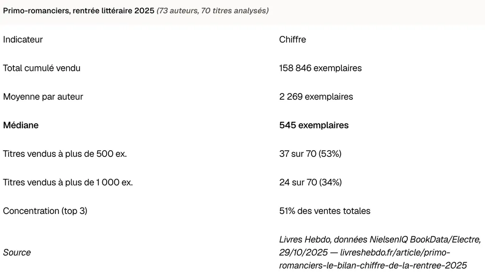
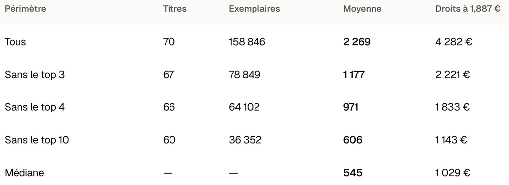
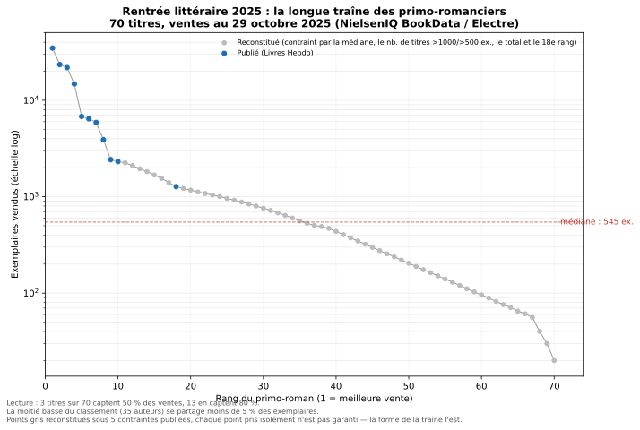
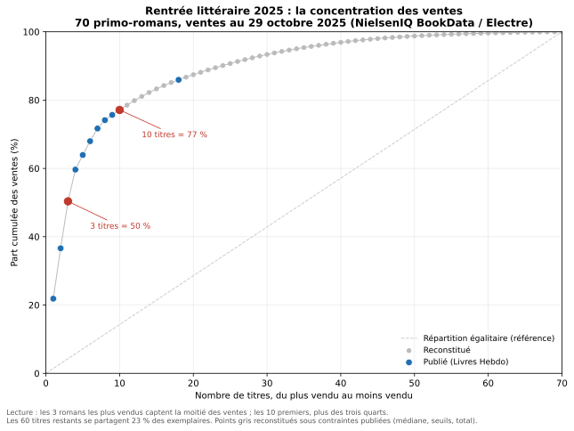
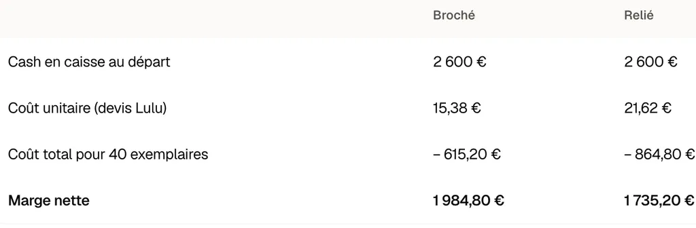

# Quand 40 abonnés rapportent plus que 1 000 ventes en librairie

Si vous aimez la littérature, la rentabilité d’un livre vous intéresse sans doute moins que si vous êtes un auteur désireux de vivre de son art et de remplir son frigidaire. Elle devrait pourtant vous importer.

Si les artistes occupent un job rémunérateur à côté de leur job d’artiste, les deux peuvent se nuire, et beaucoup d’artistes souffrent de cette dualité. Pour ma part, je ne suis pas sûr qu’être artiste à plein temps soit une bonne chose, pas plus que politicien à plein temps. Kafka serait-il Kafka sans son boulot dans un cabinet d’assurance ? Moi-même j’écris parce que je vis d’autres trucs à côté, sans quoi je ne sais pas de quoi je parlerais.

Reste que l’argent est l’alpha et l’oméga de notre société, n’en déplaise à Bourdieu et à sa théorie du capital symbolique : si nous ne gagnons pas, nous ne sommes pas reconnus, et pas reconnus nous avons tendance à nous dévaloriser. Les artistes ont besoin de reconnaissance, l’argent en est une parmi d’autres. Tous les lecteurs devraient tenir à ce que les auteurs gagnent leur vie. Payer un livre, c’est plus que rétribuer un auteur, c’est lui dire « j’aime ce que tu fais ». C’est plus puissant qu’un like ou un partage sur un réseau social.

[Si je me réfère aux chiffres de vente des primo-romanciers lors de la rentrée littéraire 2025](https://www.livreshebdo.fr/article/primo-romanciers-le-bilan-chiffre-de-la-rentree-2025) (chiffres arrêtés au 29 octobre – mais la plupart des titres n’étaient déjà plus en librairie deux mois après leur sortie, fin août, et les ventes n’ont propablement guère progressé, sauf pour les best-sellers), 66 % des primo-romanciers ont vendu moins de 1 000 exemplaires, 47 % ont vendu à moins de 500 exemplaires et, plus remarquable et inquiétant, les trois best-sellers ont rassemblé 50 % des ventes.

Je n’ai pas trouvé de données comparables pour l’ensemble des romans publiés chaque année, mais je parie que la tendance est identique, voire plus défavorable, les primo-romanciers bénéficiant d’un effet de curiosité (les amis et la famille achètent le bouquin). Nous assistons au développement d’une distribution où quelques acteurs raflent la mise au détriment de tous les autres (power law reconstituée à partir des données disponibles). Nous sommes dans un monde compétitif où la guerre fait rage. Est-il possible de changer de terrain de jeu ou de l’étendre ?

Si la question financière n’a plus grande importance pour moi, c’est une autre histoire pour les jeunes créateurs. Pour mener une expérience, [j’ai lancé fin novembre 2025 un abonnement payant à ma newsletter Substack](https://tcrouzet.com/2025/11/27/abonnements-payants/) avec pour tous les abonnés à l’année ou ayant payé douze mensualités consécutives l’opportunité de recevoir un inédit, en l’occurrence la suite de [*Mon père ce tueur*](https://tcrouzet.com/books/mon-pere-ce-tueur/). Vous pouvez encore vous abonner pour participer à l’expérience et la rendre plus démonstrative (surtout si vous avez apprécié *Mon père ce tueur*). Je ferai les comptes fin novembre et les livres seront disponibles à partir de début décembre.

Sur la base financière actuelle de 40 abonnés, voici quelques calculs. À ce jour, mon revenu brut annuel sur Substack est de 3 500 $, soit un chiffre d’affaires net d’environ 2 600 € (certains abonnés m’ont soutenu bien au-delà des 50 €/an demandés).

En décembre, si les choses restent en l’état, j’imprimerai 40 exemplaires et les enverrai. Je n’ai aucune envie de passer par un imprimeur, puis d’expédier les exemplaires moi-même par La Poste ou un transporteur plus compétitif. Lulu fera le boulot pour moi. Je piloterai le service d’impression à la demande par son API via un script Python. J’enverrai un lien à mes abonnés, ils saisiront leur adresse postale dans un Google Form et, après confirmation, le livre sera imprimé et leur sera envoyé. Je recevrai la facture. Manutention minimale.

D’après mes estimations, l’impression et l’expédition me coûteront 15,38 € pour un livre broché, 21,62 € pour un livre relié. Dans le premier cas, je dégagerai une marge de presque 2 000 €, dans le second de 1 700 €.

Maintenant, je fais le calcul à l’envers. Le prix public du livre s’il sortait en librairie en 2026 serait de 19,90 €, soit 18,87 HT, et mes droits avoisineraient 1,887 €/exemplaire (je m’accorde 10 % de droits alors que [les auteurs touchent souvent moins](https://www.sgdl.org/sgdl-accueil/l-actualite-sgdl/observatoire-sgdl-adagp-des-remunerations-des-auteurs-du-livre)). Il me faudrait donc vendre 1 051 exemplaires pour gagner autant qu’avec la contribution d’une quarantaine de lecteurs fidèles. C’est choquant. Quelque chose ne tourne plus rond.

>En librairie, un lecteur me rapporte 1,887 €, soit 26 fois moins qu’un abonné.

Je performe mieux en CA que 66 % des primo-romanciers de 2025, avec le seul support de 40 lecteurs.

Je pourrais maximiser ma marge en imprimant les exemplaires via Amazon KDP (4,5 €/exemplaire livré chez moi), puis en les expédiant via Mondial Relay (4,9 €/exemplaire). Ma marge nette serait de 2 224 €.

OK, je ne suis plus tout à fait primo, mais je fais avec les chiffres à ma disposition. Mon expérience, mes plus de vingt ans de présence en ligne et mes dizaines de livres publiés en librairie suffisent-ils à expliquer mes 2 300 abonnés gratuits et mes 40 abonnés payants – taux de conversion de 1,7 % ? Est-ce une rente post-édition ou une véritable alternative ? Ni l’un ni l’autre, mais deux approches complémentaires.

Je constate que beaucoup de jeunes Substackers font mieux que moi. Sur Substack, le ticket pour obtenir une rémunération supérieure à ce qui se pratique le plus souvent dans l’édition me paraît très bas, même si la compétition y fait aussi rage. J’ai voulu montrer qu’un auteur aujourd’hui ne devrait négliger aucune piste.

Vous pourriez me reprocher de ne pas avoir pris en compte les à-valoir perçus par les auteurs à compte d’éditeur. [D’après une étude déclarative sur mille auteurs SGDL et ADAGP, donc des auteurs déjà installés, auto-sélectionnés](https://www.sgdl.org/sgdl-accueil/l-actualite-sgdl/observatoire-sgdl-adagp-des-remunerations-des-auteurs-du-livre), la médiane serait de 2 500 € d’à-valoir. J’en doute quand on parle de l’ensemble des auteurs. Nombre de mes connaissances touchent des à-valoir symboliques de l’ordre de 1 000 €, voire de 500 €. Par ailleurs, 50 abonnés me suffiraient pour toucher l’équivalent de l’à-valoir médian avec ma méthode par abonnement.

Tout ça ne me rend pas heureux. J’aime les éditeurs et les libraires. J’aime travailler avec eux, améliorer mes textes, les pousser plus loin, puis les défendre devant les lecteurs. À choisir, je préfère passer par la chaîne du livre traditionnelle.

>Je préfère avoir 1 000 lecteurs d’un de mes livres plutôt que 40.

Je préfère que la culture circule de main en main comme je l’ai expliqué dans [*Le livre contre-attaque*](https://tcrouzet.com/books/livre-contre-attaque/). Se tenir en retrait de la techno fait souvent le plus grand bien, d’autant que [les livres papier réduisent la charge mentale](https://www.psypost.org/neuroscientists-discover-previously-unknown-cognitive-benefits-of-reading-physical-books/) (OK, étude menée sur les lecteurs de manga).

Mais on fait quoi pour que les livres continuent de circuler ? Pour que les auteurs aient une chance de manger à leur faim ? Si j’étais un jeune auteur, je tenterais d’être édité tout en explorant des voies de distribution alternatives. Les éditeurs pourraient autoriser leurs auteurs à vendre des tirages de tête à leurs abonnés. Il reste à inventer des modèles hybrides. Voilà à quoi je joue avec mon abonnement payant. J’expérimente, tout en me donnant la chance de publier un tirage à diffusion confidentielle — sans interdire une diffusion plus large dans le futur.

Expérimenter, encore expérimenter, c’est ce qui me tient debout.

*PS : Les éditeurs et les auteurs sont vent debout contre les textes coécrits avec IA, des textes comme* Daggermouth *par ailleurs parfois plébiscités par les lecteurs qui pour la plupart se fichent [du 100 % bio](https://tcrouzet.com/2026/08/06/are-you-human/) ? La profession n’est-elle pas en train de se tirer une balle dans le pied, laissant la porte ouverte aux indépendants qui trouveront des canaux de distribution lucratifs et parallèles ?*

#edition #y2026 #2026-8-10-14h00
