# Qu’est-ce qui différencie l’homme de la machine ?

Cette question se pose désormais. Elle me stimule : si des machines deviennent plus intelligentes que moi, j’aurai avec elles des conversations passionnantes.

Hier soir encore, un cousin très croyant me disait : « Elles n’éprouveront jamais de sentiments. » Va savoir. Je n’ai aucune certitude. Si nous sommes les fruits du hasard et de la nécessité, nous ne possédons probablement aucune qualité spéciale. Alors pourquoi ne serions-nous pas capables de créer nos doubles ? Et s’il existait des forces encore incomprises, comme un champ de conscience primordial, pourquoi ne pourrions-nous pas y connecter nos créations ?

[Dans mon dernier article](https://tcrouzet.com/2026/08/17/ia-texte-origine-ou-qualite/), je me suis amusé à produire des statistiques qui montraient une couverture stylistique des textes IA inférieure à celle des humains. J’ai poursuivi le travail, [généralisant mon outil](https://github.com/tcrouzet/unshiter) au prix de longues heures de bricolage, pour comparer des corpus plus vastes. En pratique : je glisse dans un dossier des fichiers ePub de livres publiés, génère des statistiques pour chacun et les affiche dans [un tableau de bord avec lequel je vous invite à jouer](https://tcrouzet.github.io/unshiter/).

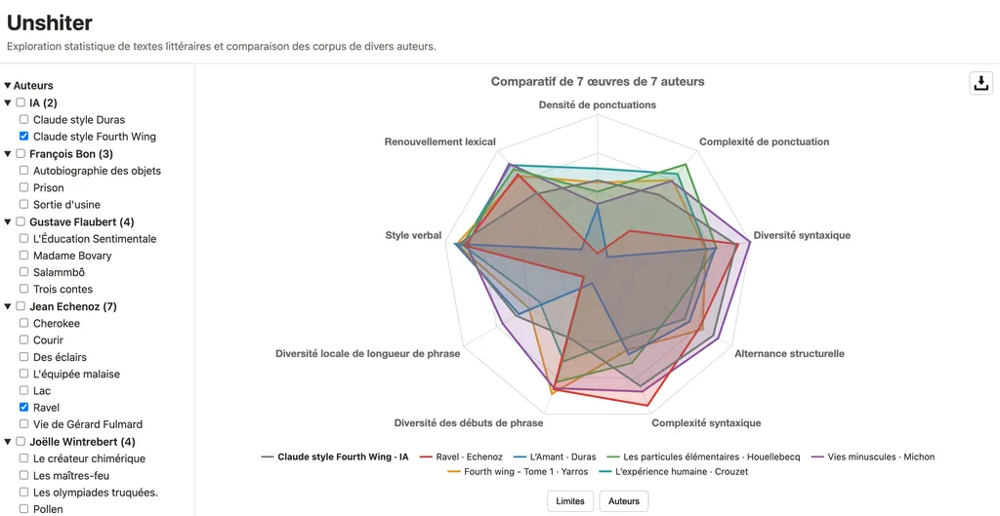

Si nous voulons nous comparer aux machines, savoir ce qui nous caractérise, autant commencer par nous comparer les uns aux autres. L’exercice étant compliqué, je me contente de comparer des écrivains. J’ai choisi un échantillon restreint d’auteurs admirés ou amis, ou les deux. Il suffit de me faire parvenir des ePub pour que j’étende le corpus.

### Constants ou versatiles ?

En affichant les stats, je n’ai cessé de faire des découvertes, certaines confirmant mes intuitions, d’autres plus étonnantes.

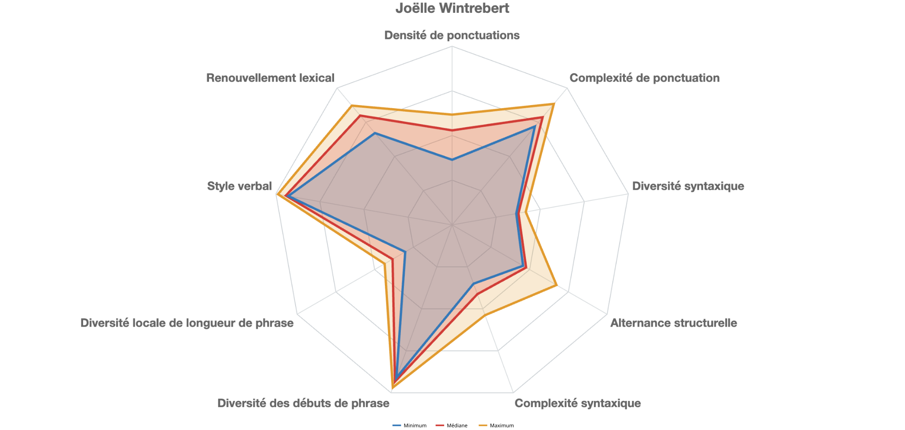

Par exemple, le style de mon amie [Joëlle Wintrebert](https://fr.wikipedia.org/wiki/Jo%C3%ABlle_Wintrebert) varie peu au fil des quatre œuvres romanesques du corpus, publiées en une vingtaine d’années. Elle a trouvé sa forme une fois pour toutes.

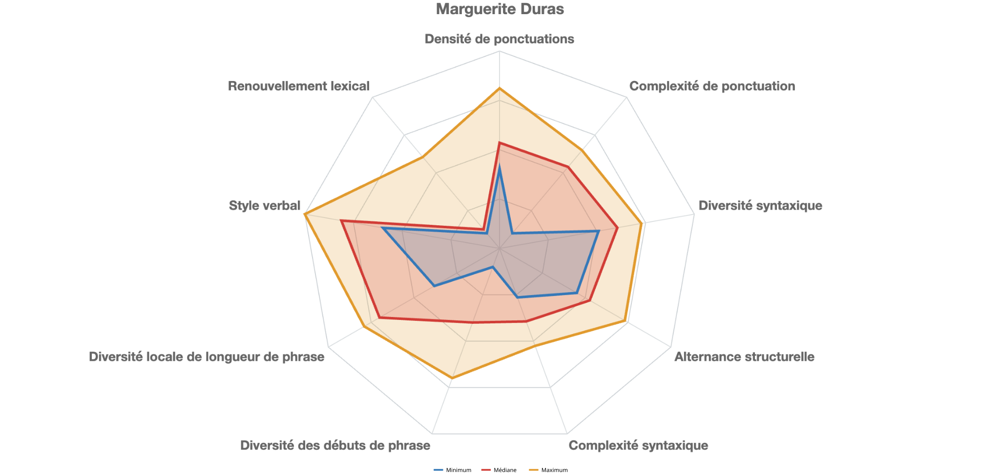

D’autres traversent des remises en cause profondes. Duras est la championne : elle va toujours vers plus de simplicité, répéte sans relâche les mêmes sonorités pour nous les implanter dans le crâne – et parfois nous agacer.

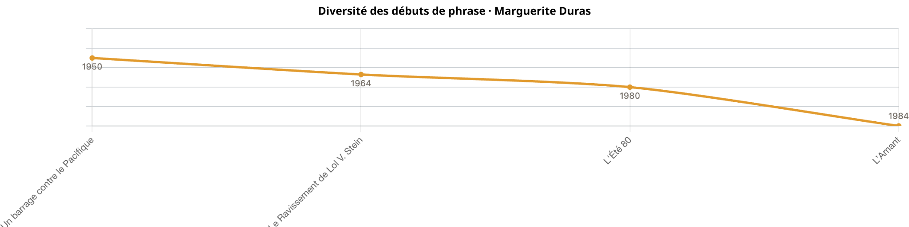

Je joue aussi avec les données pour m’étudier. Si j’ai certaines constances, ma densité de ponctuation varie énormément d’un texte à l’autre tout comme ma complexité syntaxique. Contrairement aux dérives progressives de Duras, mon style dépend des textes plus que du moment de leur écriture. Pas de révolution chez moi, je m’étire plus ou moins selon les axes de mesure.

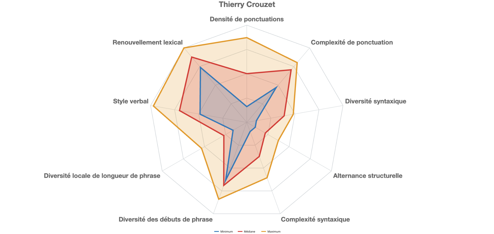

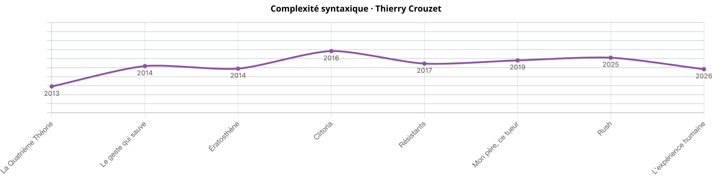

Une fois des mesures sélectionnées et leur orientation choisie, on obtient un graphe de couverture stylistique.

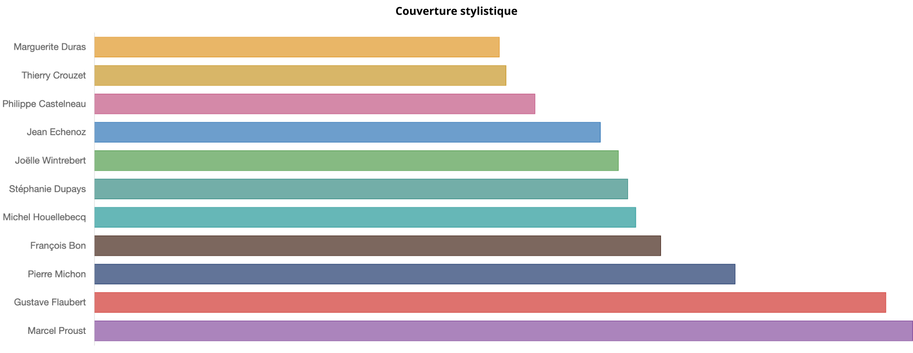

Ce graphe est un guide d’analyse, sans rien dire de la qualité des œuvres. Par exemple, si j’ajoute des mesures qui favorisent ma manière d’écrire (sparcité des subordonnées, métaphores, adverbes et participes présents), le classement change de visage.

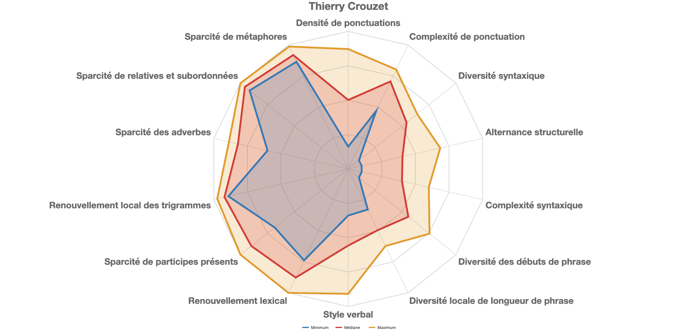

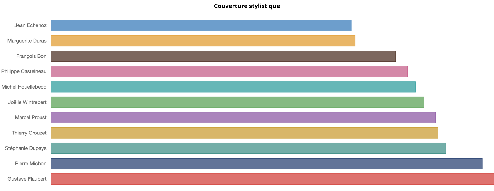

J’insiste donc sur la relativité de ces graphiques. Ils nous parlent des textes sans les juger. Ils expriment avant tout nos différences.

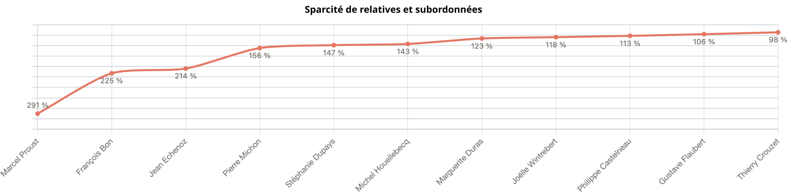

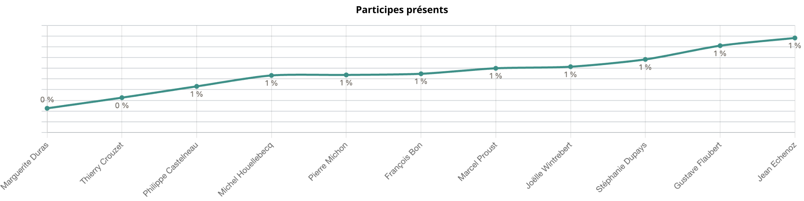

Par exemple, ma maniaquerie à réduire les subordonnées et relatives me pousse à limiter la longueur de mes phrases, donc la complexité syntaxique. C’est un travail conscient, en partie hérité de Flaubert, ce que laissent sous-entendre les courbes ci-dessus. Pour couronner le tout, j’économise aussi les participes présents, ce qui limite encore les possibilités syntaxiques.

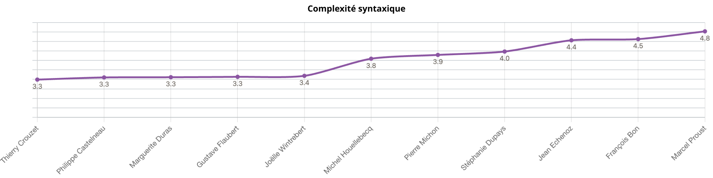

J’ai également un dégoût des formes métaphoriques introduites par « comme », que je trouve trop convenues – je ne parle bien sûr pas de l’usage très particulier du « comme » chez Proust.

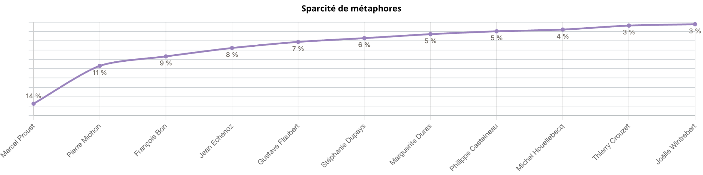

### Quid du style IA ?

[Pour reprendre mon étude préliminaire et la généraliser](https://tcrouzet.com/2026/08/17/ia-texte-origine-ou-qualite/), j’ai généré depuis [Dust](https://app.dust.tt/) une bible pour un roman, puis j’ai demandé à Claude de rédiger un à un les chapitres dans le style de *Fourth Wing*, la romantasy new adult du moment – je me fichais que ça sonne réellement *Fourth Wing*, il m’importait de donner une direction stylistique au LLM. Le processus, automatique après quelques réglages, a duré une paire d’heures ; à la fin j’avais un roman IA de 300K signes.

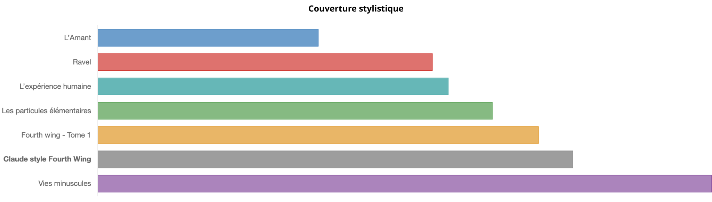

Quand j’ai glissé ce roman dans mon outil d’analyse, sa couverture stylistique n’était plus en bas du corpus, contrairement à ma première étude menée avec une lettre IA, mais presque au sommet, tout à côté du véritable *Fourth Wing*, ce qui démonte mon hypothèse d’une couverture IA systématiquement faible.

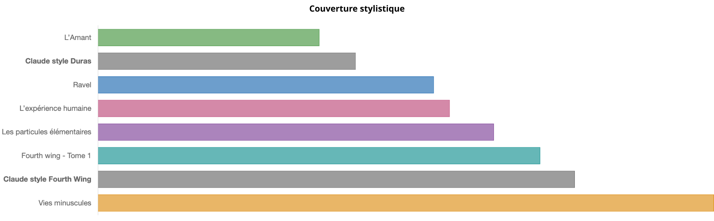

Je me suis alors prêté à une seconde expérience. Depuis mon appli, j’ai exporté les données stylistiques de *L’Amant* de Duras. Je les ai soumises à Claude avec un prompt demandant la réécriture selon ces paramètres stylistiques. La seconde version du roman IA apparaît juste au-dessus de Duras dans le graphe de couverture, démontrant qu’il est possible d’altérer le style des textes IA avec des IA et quelques consignes *ad hoc*.

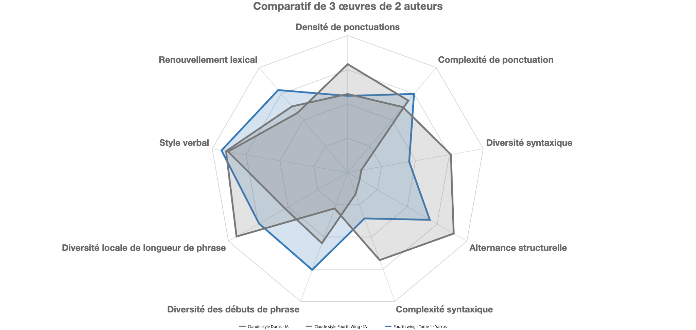

### Analyse des auteurs

À partir des données exportées depuis l’app web en json, j’ai demandé à Claude une analyse stylistique des auteurs du corpus. Il a écrit au sujet de sa propre prose.

>Les deux textes rassemblés sous l’auteur IA affichent des écarts très nets sur presque toutes les mesures : la longueur moyenne des phrases passe du simple au double, la profondeur syntaxique suit le même mouvement, la densité de comparaisons introduites par « comme » plus que double également. Le second texte s’appuie aussi davantage sur les relatives et subordonnées, tandis que le premier reste ponctué de façon plus dense et plus resserrée.

>Sur ce fond de forte divergence, certains repères restent au contraire stables : le rapport noms/verbes, la part de voix active et la densité de mots grammaticaux varient peu entre les deux textes. Ce sont donc des traits qui traversent les deux productions malgré des rythmes de phrase différents.

J’ai donc essayé de tracer un nouveau radar plus discriminant pour les IA, sans réussir à placer les deux compositions IA tout en bas.

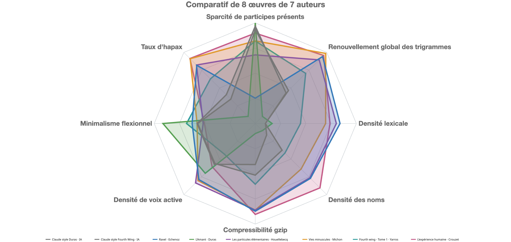

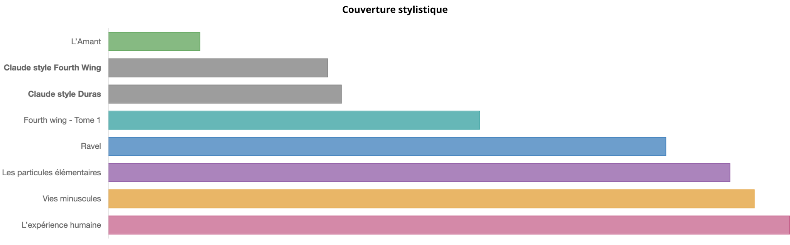

En revanche, ramenées au corpus total, les IA apparaissent en bas sur les nouveaux axes.

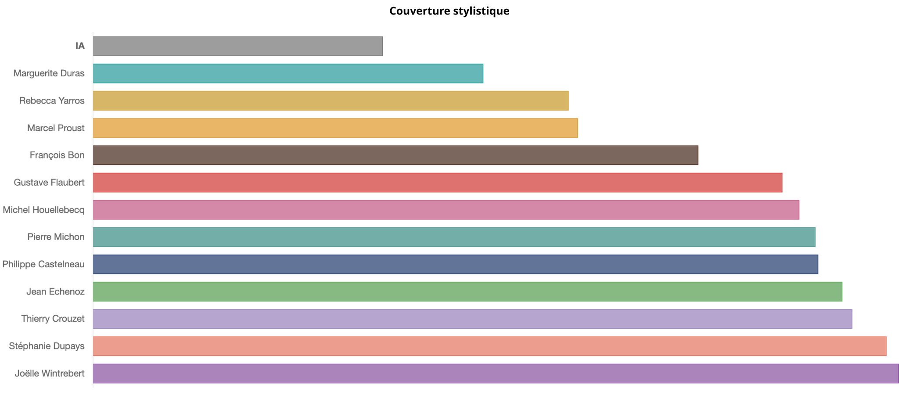

Mais pourquoi choisir telle ou telle mesure de façon arbitraire et ne pas dégainer la totalité de l’arsenal ([distance de type delta, inspirée de Burrows](https://www.semanticscholar.org/paper/’Delta’%3A-a-Measure-of-Stylistic-Difference-and-a-to-Burrows/1081e505f03a9ae0dc3d55881b59a67e264f2d1f)).

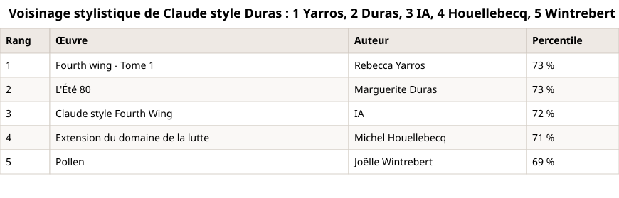

On découvre que le véritable *Fourth Wing* est le plus proche du roman IA à la mode Duras, suivi des textes de Duras, puis du roman généré par Claude à la mode *Fourth Wing*.

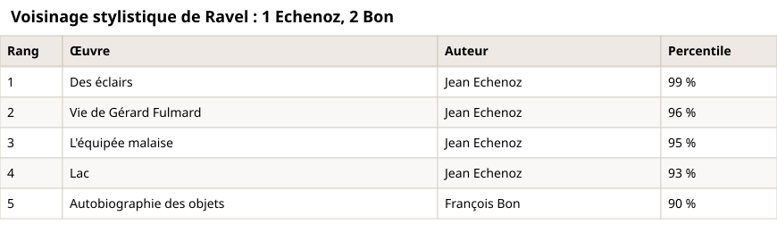

Le même tableau pour les auteurs humains montre que leurs propres œuvres restent souvent les plus proches, ce qui est logique. Cinq romans d’Echenoz écrits sur vingt-cinq ans se reconnaissent entre eux à 93-99 %. Deux textes de Claude, l’un réécrit à partir de l’autre, ne se reconnaissent qu’à 72 %. Echenoz ne peut être qu’Echenoz. Claude peut être n’importe qui.

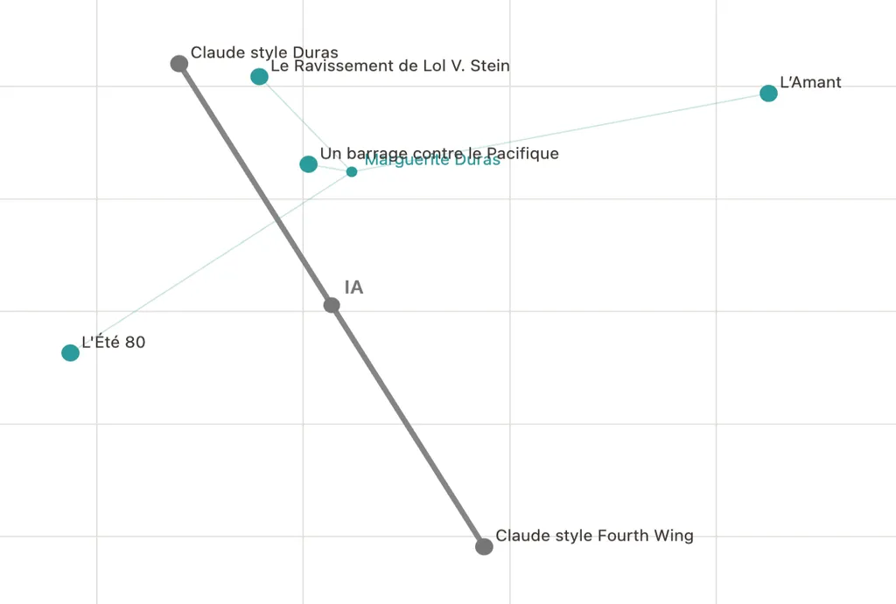

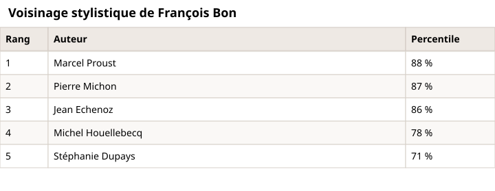

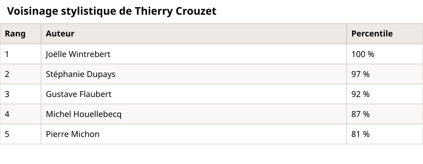

Tout ça me fait gamberger même si j’ai encore du mal à trouver de réelles différences entre nous et les machines quand il s’agit d’écriture. J’utiliserai mon outil pour analyser mes propres textes plus que pour traquer les IA. Je les laisse tout de même conclure avec une analyse des auteurs du corpus à partir des statistiques.

## François Bon

Les trois œuvres se caractérisent par des phrases nettement plus longues que la moyenne du corpus, avec une ponctuation moins dense : le texte progresse par blocs plus étendus plutôt que par ponctuations rapprochées. Cette tendance au flot continu se double d’une densité de subordonnées et de relatives supérieure à la moyenne, ainsi que d’une profondeur syntaxique élevée, ce qui suggère un phrasé qui empile les propositions plutôt qu’il ne les juxtapose.

La variation entre les trois textes est importante. *Prison* se distingue des deux autres par une densité de subordonnées bien plus forte et une lisibilité Flesch beaucoup plus basse, alors que *Sortie d’usine* et *Autobiographie des objets* restent plus proches l’un de l’autre sur ces points.

Sur le plan lexical, le ratio noms/verbes est au-dessus de la moyenne, ce qui indique une tendance plus nominale que verbale. Les taux de répétition locale restent proches de la moyenne, sans signal marquant dans un sens ou dans l’autre. L’échantillon de trois œuvres permet de voir une tendance commune (phrases longues, peu ponctuées, syntaxe emboîtée) mais aussi une variabilité réelle d’un texte à l’autre, notamment sur la complexité syntaxique.

## Gustave Flaubert

Les quatre œuvres montrent un profil homogène : la longueur de phrase reste proche, voire légèrement inférieure à la moyenne du corpus, mais la ponctuation y est nettement plus dense et plus diversifiée que la moyenne. Les textes alternent donc des signes de ponctuation variés sur des phrases de taille modérée plutôt que de longues coulées peu ponctuées.

Un ensemble de mesures concordantes se dégage sur le renouvellement lexical : les taux de répétition sont tous inférieurs à la moyenne, tandis que le taux d’hapax et la diversité des formes sont au-dessus. Le vocabulaire se renouvelle donc plus que la moyenne, avec peu de retours rapprochés d’un même mot ou d’une même famille. La voix active est également plus fréquente que la moyenne.

## Jean Echenoz

Les sept œuvres présentent des phrases plus longues que la moyenne, avec une bonne diversité des débuts de phrase et une diversité syntaxique élevée : les constructions varient souvent d’une phrase à l’autre. Une tension apparaît toutefois entre cette longueur de phrase et la variation locale de longueur, plus basse que la moyenne : les phrases sont longues mais d’une longueur relativement régulière d’un énoncé à l’autre, plutôt qu’un mélange marqué de phrases très courtes et très longues.

La densité de subordonnées et de relatives est supérieure à la moyenne, de même que la profondeur syntaxique, ce qui accompagne logiquement des phrases longues. La ponctuation, en revanche, est un peu moins dense et moins diversifiée que la moyenne : peu de signes différents reviennent pour construire ces phrases longues.

La variation entre les sept œuvres est notable sur la longueur de phrase, qui va d’environ 90  caractères en moyenne pour *Cherokee* à plus de 170 pour *Des éclairs*, un écart bien plus large que pour la plupart des autres auteurs. Le taux de comparaisons introduites par « comme » varie aussi sensiblement d’un texte à l’autre. Cette dispersion invite à ne pas résumer l’auteur à une seule valeur mais à une plage assez large.

## Joëlle Wintrebert

Les quatre œuvres partagent un profil assez cohérent : des phrases plus courtes que la moyenne, une diversité des débuts de phrase élevée, mais une diversité syntaxique et une profondeur syntaxique plutôt en dessous de la moyenne. La densité de subordonnées et de relatives est également inférieure à la moyenne, ce qui va dans le même sens qu’une syntaxe moins emboîtée.

Le taux de comparaisons introduites par « comme » est nettement plus bas que la moyenne, un signal qui reste stable d’une œuvre à l’autre. Le renouvellement lexical est légèrement supérieur à la moyenne, sans repli marqué sur les mesures de répétition locale, qui restent proches de la moyenne.

La variabilité entre les quatre œuvres reste modérée pour la plupart des mesures : les valeurs de longueur de phrase, de ponctuation et de répétition se tiennent dans une fourchette resserrée. Le score de lisibilité Flesch varie un peu plus, notamment pour *Pollen*, plus élevé que les trois autres titres.

## Marcel Proust

Les deux œuvres présentent des phrases très longues, parmi les plus longues du corpus, avec un dixième supérieur des phrases (P90) dépassant largement la moyenne générale. Cette longueur s’accompagne d’une densité de subordonnées et de relatives nettement supérieure à la moyenne, ainsi que d’une profondeur syntaxique parmi les plus élevées : les phrases empilent les propositions et les relations grammaticales avant de rejoindre le verbe principal.

Le ratio noms/verbes est plus bas que la moyenne, ce qui, combiné à la construction syntaxique complexe, indique un style qui reste verbal malgré la longueur des phrases plutôt qu’un style nominal et statique. La ponctuation est également plus diversifiée que la moyenne. Le taux de comparaisons introduites par « comme » est l’un des plus élevés.

## Marguerite Duras

Les quatre œuvres se distinguent par des phrases plus courtes que la moyenne et par un ensemble de mesures de répétition qui pointent toutes dans le même sens : les taux de répétition locale, de répétition familiale et de répétition brute sont systématiquement au-dessus de la moyenne, tout comme la redondance des trigrammes. Ce faisceau de signaux concordants suggère un texte qui revient plus souvent sur les mêmes mots ou les mêmes familles de mots à courte distance.

Cette tendance à la répétition va de pair avec une diversité lexicale et un taux d’hapax plus bas que la moyenne, ainsi qu’un ratio formes/lemmes très élevé, le plus élevé de l’échantillon : un même lemme y apparaît le plus souvent sous une forme quasi unique, avec peu de variation flexionnelle. La voix active est un peu moins fréquente que la moyenne.

La variation entre les quatre œuvres reste modérée sur la plupart des mesures, à l’exception de la surface de couverture stylistique, nettement plus faible pour *L’Amant* que pour les trois autres titres ; cet écart concerne une mesure agrégée liée au positionnement sur l’ensemble du corpus et ne se répercute pas franchement sur les autres indicateurs de rythme ou de répétition.

## Michel Houellebecq

Les sept œuvres montrent des phrases plus longues que la moyenne et une ponctuation plus diversifiée. Une tension apparaît toutefois entre cette longueur de phrase et la densité de subordonnées et de relatives, plus basse que la moyenne : les phrases longues ne s’appuient donc pas particulièrement sur l’empilement de propositions subordonnées, ce qui suggère d’autres moyens de les allonger, par exemple la coordination ou l’énumération.

La voix active est un peu moins fréquente que la moyenne, et le score de lisibilité Flesch est plus bas, cohérent avec des phrases longues. Le taux de comparaisons introduites par « comme » reste bas par rapport à la moyenne.

## Philippe Castelneau

Une seule œuvre, *Motel Valparaiso*, est disponible. Le texte présente des phrases plus courtes que la moyenne, avec une densité de subordonnées et de relatives également inférieure à la moyenne, ce qui va dans le sens d’une syntaxe moins emboîtée. Le ratio noms/verbes est bas par rapport à la moyenne, avec un ratio de verbes plus élevé que la moyenne, ce qui indique une tendance plus verbale que nominale.

Le score de lisibilité Flesch est élevé, cohérent avec des phrases courtes et une syntaxe peu subordonnée. Le taux de comparaisons introduites par « comme » reste bas.

## Pierre Michon

Les quatre œuvres se caractérisent par une variation locale de longueur de phrase parmi les plus élevées : des phrases très courtes voisinent avec des phrases très longues, un effet de rafale marqué. La longueur moyenne des phrases est elle-même parmi les plus élevées, portée notamment par un dixième supérieur des phrases très étendu.

La diversité syntaxique et la densité de relatives sont au-dessus de la moyenne, ce qui accompagne cette amplitude de longueur. Le taux de comparaisons introduites par « comme » est également élevé.

## Rebecca Yarros

Une seule œuvre, *Fourth Wing*, est disponible. Le texte présente des phrases plus courtes que la moyenne, une densité de subordonnées et de relatives inférieure à la moyenne, et un score de lisibilité Flesch parmi les plus élevés. Une tension apparaît entre un ratio noms/verbes plutôt bas (tendance verbale) et une proportion de phrases sans verbe conjugué (nominales) au-dessus de la moyenne : les deux mesures ne pointent pas dans la même direction, ce qui montre que la balance nom/verbe globale et la fréquence de phrases strictement nominales sont deux informations distinctes à lire séparément.

La voix active est un peu moins fréquente que la moyenne. Le taux de comparaisons introduites par « comme » reste bas.

## Stéphanie Dupays

Les deux œuvres disponibles se ressemblent beaucoup sur l’ensemble des mesures, avec des valeurs proches d’un texte à l’autre pour la longueur de phrase, la ponctuation et les taux de répétition. La longueur moyenne des phrases se situe légèrement en dessous de la moyenne.

Le ratio de noms est nettement au-dessus de la moyenne, alors que le ratio noms/verbes global reste, lui, proche de la moyenne : cette différence suggère une proportion de noms élevée sans que cela se traduise mécaniquement par un déséquilibre marqué entre noms et verbes, une nuance qui invite à ne pas confondre les deux mesures. La densité de subordonnées et de relatives reste proche de la moyenne.

## Thierry Crouzet

Les huit œuvres disponibles pour cet auteur présentent des phrases plus courtes que la moyenne, avec une densité de subordonnées et de relatives nettement inférieure à la moyenne, et une profondeur syntaxique elle aussi en dessous de la moyenne : la syntaxe reste, en moyenne, moins emboîtée que celle de l’ensemble du corpus. Plusieurs mesures de répétition sont concordamment inférieures à la moyenne, ce qui va dans le sens d’un vocabulaire qui revient peu souvent à courte distance.

Le taux d’hapax et la diversité des formes sont au-dessus de la moyenne, cohérents avec ce faible taux de répétition locale. Le taux de comparaisons introduites par « comme » est bas. Le score de lisibilité Flesch est généralement au-dessus de la moyenne, avec toutefois des écarts sensibles d’un texte à l’autre.

#netlitterature #ia #y2026 #2026-8-23-17h00
