# Août 2026

### Samedi 1er, Balaruc

La mère de Romain Gary lui promettait la gloire, l’admiration, la réussite. Des encouragements qui donnent des ailes. Mes parents n’ont rien souhaité d’autre pour moi que ce qu’ils avaient, une vie confortable, discrète pour ma mère et frimeuse pour mon père. J’ai dû inventer mes propres rêves puisque je ne pouvais endosser les leurs.

---

Je voudrais publier *L’expérience humaine* pour qu’Isa et sa philosophie ne soient pas oubliées, pour la dire elle comme nous devrions dire toutes les femmes.

### Dimanche 2, Balaruc

Impossible d’appréhender la révolution IA sans avoir vu tourner un agent de codage.

---

Il y a autant de définitions de l’anarchie que d’anarchistes, c’est le principe même de l’anarchie.

### Mardi 4, Balaruc

Chaleur, fatigue, manque de désir, je bricole [mon site vélo](https://727bikepacking.fr/), vibe-code, je m’éparpille, nous avons signé en fin d’après-midi l’acte de succession, c’est terminé, ça m’a terrassé, je n’aurais jamais cru que cette formalité me touche autant. Après une mort, la famille se retrouve plus pauvre, l’État prend sa part.

### Jeudi 6, Balaruc

Je suis agité, incapable de trouver la paix pour relire *L’expérience humaine* qui repose depuis un mois. Un effet de la chaleur ? Ce matin, 29°C à l’intérieur, 26°C dehors où j’ai dormi. L’étang surchauffé n’apporte aucune fraîcheur.

---

On me dit : « L’amour te tombe dessus. » Je le conçois, mais il y a des gens sur qui il tombe plus que d’autres.

---

Me remettre à lire, ne plus tourner en rond, dans cette chaleur accablante : 34°C dans la maison cet après-midi, vent brûlant. Je me réconforte avec quelques pages de Joan Didion : « Because we were both writers and both worked at home our days were filled with the sound of each other’s voices. » Le silence me répond, malgré Émile, les amis de passage, il me manque quelque chose d’irremplaçable, une mélodie continue.

Ça ne s’arrange pas avec les mois, c’est même plus douloureux, et j’ai ce livre qui me pèse dans un coin de l’ordinateur, devenu comme un corps mort, à son tour.

---

Quand j’ai publié mon carnet de juillet, j’ai immédiatement perdu plus de dix abonnés. Ces petites désertions me font mal, c’est ridicule, mais tout me fait mal. Je mets ma vie là sur la table d’opération et ils désertent. Pour des shorts sur les réseaux sociaux.

C’est étrange mon incapacité au succès. Isa m’a toujours dit que je n’en voulais pas, qu’il me rendrait malheureux. Depuis l’enfance, je fais tout pour casser mes jouets. Isa n’était pas mon jouet, je n’y suis pour rien, parfois j’en doute et culpabilise.

---

Tous les créateurs sont désormais suspects de faire travailler des IA. C’est à eux de prouver l’humanité de leur création, et non aux IA de clamer l’artificialité des leurs.

---

Titre de couverture de *New Scientist* : [We’re beginning to understand the sudden ‘grief attacks’ that hit mourners](https://www.newscientist.com/article/2579641-were-beginning-to-understand-the-sudden-grief-attacks-that-hit-mourners/).

« La théorie d’un deuil en "cinq étapes" a depuis longtemps été [démentie](https://pmc.ncbi.nlm.nih.gov/articles/PMC8675126/). Pour les psychologues le deuil peut durer des années, affecter à la fois le [corps et l’esprit](https://www.sciencedirect.com/science/article/pii/S0166223626000044), et imprégner tous les aspects de la vie. C’est une épreuve intensément pénible et en même temps l’une des **expériences humaines** les plus profondes.

– Qu’est-ce qu’une grief attack exactement ?

– Nous avons pu identifier quatre caractéristiques principales : la panique (qui se manifeste par des vertiges, un essoufflement et de la peur – ça ne m’est jamais arrivé), le manque intense (yearning – très souvent), le désespoir (parfois) et une pensée incohérente (jamais que je sache). »

### Vendredi 7, Balaruc

Isa est morte, il m’arrive encore d’en douter – il m’arrive donc d’être incohérent.

---

[Interview ébouriffante, stimulante, réjouissante de DOMi & JD Beck.](https://www.youtube.com/watch?v=bGLFJ685Ins) Après certains osent encore douter de la jeunesse ? Moi, pas.

---

Une amie : « On ne retrouve jamais ce qui a été perdu, on ne remplace jamais. » J’espère qu’il est possible d’ajouter, je veux y croire – expression qui dit que je n’y crois pas, sinon j’aurais écrit « j’y crois ».

---

Conversation entre [Krishnamurti et Murdoch en 1984](https://www.youtube.com/watch?v=uDnwK-383Qs), lui qui interroge, elle qui tente de répondre. Quand on dit « Je suis envieux de leur amour », on prend conscience de son envie, on la relativise, alors que le véritable envieux regarde avec stupeur, traversé de palpitations. Il expérience la jalousie, sans se voir jaloux, pas de dualité. C’est pareil avec le deuil, parfois « je suis en deuil », d’autres fois « je subis le deuil ».

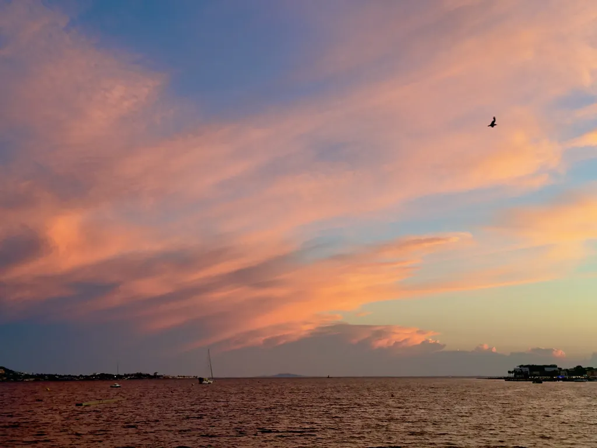

### Samedi 8, Balaruc

Je suis plus proche de certains auteurs morts ou étrangers que de beaucoup de personnes que je côtoie. Je peux être proche de gens que je ne croiserai jamais, c’est un des cadeaux de la lecture.

---

Je plonge malgré moi dans le passé, [comme avec ce docu sur XTC](https://www.youtube.com/watch?v=DXdh44u33uA), le groupe favori de ma jeunesse, des musiciens inventifs qui m’ont montrés vers où marcher. Ce n’est pas de la nostalgie, juste un besoin de revenir à mes fondations, pour ne pas perdre pied.

---

Deux jours passés à mener une nouvelle expérience avec les IA. La raconter ? Tout le monde s’en fiche, mais je la partagerai, tout de même.

### Lundi 10, Balaruc

J’écris ou pédale pour me sauver, mais ces deux activités, bénéfiques pour ma santé mentale et physique, ne changent rien à ma vie, ne m’aident en rien à avancer dans le deuil ou à envisager l’après, encore moins à le mettre en œuvre.

---

Et puis il y a la nuit, les rêves, où Isa me parle avec tant de force que parfois je me demande si elle ne tente pas de communiquer avec moi, ce que, malgré toute ma naïveté, je suis incapable de croire. Même si la conscience était le champ unificateur de l’univers, apparu avant la matière et l’énergie, je ne vois pas en quoi nos vies pourraient post mortem l’habiter, sinon Mozart continuerait à nous dicter ses symphonies et Einstein ses théories. Non, mon cerveau a besoin d’Isa, alors il la refabrique dans mes nuits. Reste qu’il m’arrive de me dire : « Tu veux entrer en contact ? » Mais rien de tel quand je suis pleinement conscient, aucun signe, l’absence désespérante.

---

Joan Didion m’apprend que les veufs ont plus de chances de décéder dans la première année après la mort de leur conjoint qu’une personne ordinaire. Ça suffit à me ficher la trouille. Mes enfants ont besoin de moi. Penser à ces trucs me trouble. La mort désormais maraude autour de moi. J’ai besoin d’une irruption de vie. D’un camion de positivité qui se déchargerait sur moi et me survolterait. Je me demande où on trouve une telle marchandise sans qu’elle soit avariée.

Didion me rassure aussi : il existe un deuil normal, où nous nous transformons, grandissons, nous ouvrons à de nouveaux possibles, et un second plus inquiétant qui conduit parfois à l’hôpital psychiatrique ou à la mort, situation qui survient quand le survivant dépendait étroitement du mort. Je ne dépendais pas d’Isa : elle m’enchantait comme un coucher de soleil, comme un bon livre, comme une image de ce que l’humanité offre de meilleur. Notre relation n’était pas de dépendance mais d’enrichissement mutuel.

C’est quoi la dépendance ? N’exister que par les yeux de l’autre, ne vivre que pour lui, ne manger qu’avec lui, ne rire qu’avec lui, ne voyager qu’avec lui… Nous étions tout le contraire, indépendants, et mon deuil n’est pas plus dramatique grâce à cette indépendance. Pour le monde extérieur, je m’en sors très bien, j’ai le visage du mec normal.

La semaine dernière, une amie avec qui j’ai longuement parlé au téléphone m’a dit que ma voix était plus pleine, moins tendue. « Tu as passé un cap. » Et parler avec elle, tendrement, m’a fait beaucoup de bien. Parce que la tendresse me manque. Les petits gestes l’un pour l’autre comme se préparer un truc à manger ou se lancer des regards entendus. C’est ça qu’il reste à réinventer, à retrouver.

### Mardi 11, Balaruc

[Romain Gary](https://www.radiofrance.fr/franceinter/podcasts/un-ete-avec/un-ete-avec-romain-gary-du-jeudi-22-aout-2024-6861922) : « Peut-être que mon œuvre ne vaut absolument pas la peine d’avoir sacrifié tant de liaisons possibles avec des amis, ou avec des femmes… » Isa m’a souvent reproché d’écrire, et dès le début de notre histoire, c’était une cause de dispute, voire de séparation, mais si je n’avais pas tenu bon, je serais dans quel état aujourd’hui, serait-elle vivante, et alors je l’aurais sacrifiée pour écrire ?

### Mercredi 12, Balaruc

J’aimerais qu’on arrête de me traiter de veuf et redevenir un homme normal, au moins aux yeux des autres. Parce que quand ils savent, une sorte de pesanteur s’abat entre nous et pollue notre relation. La vie continue bordel, et je tente d’y trouver un peu de joie et de réconfort. Alors je pédale, je travaille.

---

Joan Didion parle de son deuil et de l’histoire qui y mène. Tous ceux qui écrivent sur le deuil parlent du passé. Je n’y ai pas échappé même si *L’expérience humaine* n’est pas un livre sur le deuil, mais livre écrit en deuil. Demain, ça fera six mois, une étape symbolique, j’essaierai de ne pas écrire « Six mois », de ne plus compter les mois, ou de ne les compter que pour moi, parce que continuer de noter ce décompte pourrait devenir une façon de me faire plaindre. Plutôt que plein, je veux être aimé. Comment vivre sans amour, sans être inondé d’amour. Je n’ai même pas la possibilité de me tourner vers Dieu.

---

Le temps ne passe plus pour Isa, le temps n’existe que pour les consciences capables de le percevoir, peut-être qu’il n’existe même pas en dehors de la conscience. Les physiciens se posent la question. Sans conscience, un milliard d’années ou une seconde ne changent rien. C’est vertigineux. Peut-être que la conscience est une nécessité physique pour que des choses se passent. Le big bang aurait été provoqué par le champ de conscience.

---

Me reviennent souvent les derniers regards d’Isa, quand elle regardait encore, un regard noir comme si derrière les pupilles se déroulait le vide interstellaire. La conscience s’envolait. Isa quittait son corps. J’ai éprouvé ce départ, étape par étape, bien avant le dernier souffle.

---

Je ne veux plus être l’endeuillé de service et je ne parle que de choses sombres. Depuis quand je n’ai rien écrit de drôle ? Ça n’a jamais été mon fort, là, je touche le fond.

---

Souvent le deuil est raconté *a posteriori*, une fois supportable, et son début est reconstitué, réédifié, idéalisé, la douleur et les troubles associés magnifiés pour être mieux décrits. Sans m’en rendre compte, et par simple nécessité, je me contente ici de dire ce qui me traverse, incapable d’en tirer des généralités. OK, patfois se glisse entre moi et le monde un filtre déformant, voire isolant.

Au tout début de *A Grief Observed*, C. S. Lewis écrit : « No one ever told me that grief felt so like fear. I am not afraid, but the sensation is like being afraid. The same fluttering in the stomach, the same restlessness, the yawning. I keep on swallowing. At other times it feels like being mildly drunk, or concussed. There is a sort of invisible blanket between the world and me. »

J’ai pu dire que j’avais la gorge et le bide noués, mais je n’ai pas été dans cet état durablement. Des trucs m’arrivent dans le corps, sans s’installer pour autant. Personne ne vit cette histoire de la même façon. Nos routes se croisent. En tout cas, je suis encore incapable de raconter mon deuil avec la distance de Lewis, je n’en éprouve pas le besoin. Ce n’est pas une histoire à raconter, je suis dedans en train de la vivre. Je ne peux que la noter à la façon d’un sismographe.

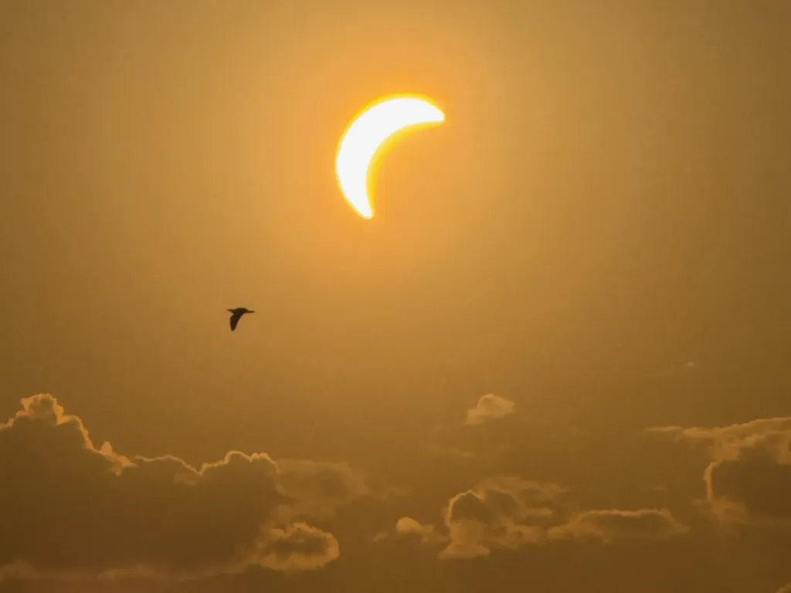

### Jeudi 13, Balaruc

Journée gorge nouée.

### Vendredi 14, Maillardou

Arrivée avec appréhension. C’est être chez Isa, vraiment chez elle. Elle serait heureuse de me savoir dans sa maison de famille. Peut-être moins de m’y voir tout de suite enfermé devant mon ordi, mais il fait une chaleur terrible et la fumée de l’incendie des Landes nous plonge dans la brume.

---

[Un jeu](https://tcrouzet.com/2026/08/14/correspondance-amoureuse/) : dans mes carnets, donner des rendez-vous imaginaires, lieux et moments précis, m’y rendre pour voir si des lecteurs me retrouvent.

### Samedi 15, Maillardou

La tombe d’Isa, fleurie par la famille, lui ressemble de plus en plus : je suis incapable de me dire que son corps est là. Je n’ai jamais autant douté de sa mort que depuis que je suis sur ses terres.

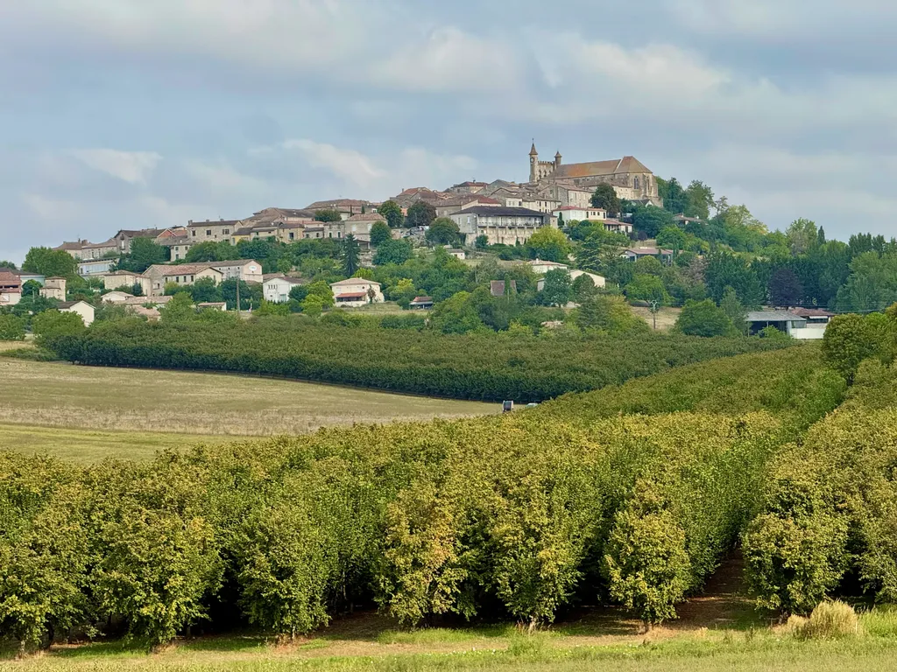

### Dimanche 16, Maillardou

La vie serait pleine de surprises : mauvaises pour la plupart, avec quelques merveilles qui menacent de me rendre nostalgique.

---

Je m’abrutis dans mes expériences, faute de trouver la moindre joie à être ici. Ce paysage et cette maison n’ont plus de sens. Pourtant, ce matin, j’ai roulé avec un cousin d’Isa et son voisin apiculteur. Il nous a fait visiter son installation et goûter son miel. Nous avons trempé nos doigts dans des bidons de 300 kg.

### Lundi 17, Maillardou

Joan comme Siri racontent dans le désordre souvenirs, maladie, mort et absence. Je suis attaché au maintenant, à l’expérience de vivre, plus qu’à celle de me souvenir.

---

Il fait moins chaud aujourd’hui. Je suis assis devant ta tombe. Comme une vieille veuve habillée de noir, j’ai arrosé les fleurs, plantées par ta mère, tes tantes, tes cousines, dans l’esprit de Camus.

Les succulentes prospèrent. Au printemps, les iris fleuriront et se dédoubleront. Nous en planterons d’autres. Il me reste à faire graver une pierre avec ton nom, ta date de naissance et de mort. Rien ne presse. Je suis encore embrigadé dans les paperasses administratives. Beaucoup de choses de la vie quotidienne me pèsent maintenant que je les assume seul. Priorité aux enfants qui vont aussi bien que possible vu les circonstances.

Je porte tes chaussettes cyan avec des points orange, et figure-toi que je n’avais jamais remarqué qu’ils représentent des têtes de mort. Étrange que tu aies porté ces chaussettes de couleurs si joyeuses avec une symbolique si lugubre, surtout maintenant.

J’ai du mal à t’imaginer dans ton cercueil déjà croulant sous le poids de la terre, déjà traversé par l’humidité, ton corps dans un état inimaginable. Tu es là, en toute certitude, et j’en doute.

Le clocher de l’église que tu aimais tant annonce 11h30. Je n’étais venu que fugitivement les jours précédents, à cause de la chaleur, aujourd’hui supportable. Ta tombe et les lierres sur la stèle contrastent avec les caveaux de granit gris et noir, ostentatoires, froids, macabres. Tu es la seule à rigoler dans ce défilé de tristes figures.

Toi qui étais climato-anxieuse, je suis heureux que tu n’aies pas vécu ici les canicules à répétition de cette année, avec plusieurs pics à plus de 40°C depuis le mois de mai. Nous vivons l’année la plus chaude jamais enregistrée, un record qui ne sera pas mémorable : d’autres l’ont précédé, d’autres le suivront. Ce pays du sud-ouest, ce pays de collines de l’intérieur des terres, mal ventilé, brûle en été. L’air en devient irrespirable. Figure-toi qu’il a fait moins chaud au bord de l’étang de Thau. Toi qui croyais pouvoir te réfugier ici, tu aurais été dévastée par ce qui arrive à cette terre.

J’ai peur de ne pas venir souvent te voir. La prochaine fois, j’inviterai des amis. J’aime la maison quand elle résonne de vie, pas quand je m’y transforme en ermite. Je ne suis pas de cette terre qui est la tienne, il m’y manque une ressource nutritive, des perspectives bleues et liquides. À Balaruc, je me sens à l’arrêt depuis ton départ ; ici, je suis paralysé. Alors je suis venu t’écrire une lettre. Je ressens de plus en plus le besoin de lettres, de confidences, et qu’importe si tu ne peux plus me répondre. Au bord de ta tombe, je ne te sens pas plus présente qu’ailleurs, mais le silence me glace.

Avant-hier quand je suis passé à mon retour de vélo, après avoir découvert des chemins que tu ne connaissais pas et que tu aurais adorés, je suis entré dans le cimetière à vélo. Une vieille femme m’a regardé avec un air méfiant, sans oser exprimer de reproche. Je lui aurais répondu qu’elle avait la chance d’être vieille, que tu aurais aimé vieillir, avec un large sourire bienveillant. Je regrette celle que tu ne deviendras pas. Tu aurais été une vieille extraordinaire.

Le clocher sonne midi, trois coups, puis après un moment douze, ou peut-être neuf, puis quatre fois trois, puis la longue litanie plus violente de l’Angélus, avant le retour au calme. Tu t’es habituée à ce tintamarre qui laisse place au silence, à la rumeur lointaine d’une voiture, aux roucoulements d’une tourterelle.

L’air s’alourdit, les arbres frémissent à peine, le ciel gris pèse sur ma tête coiffée de ta casquette rose. Je ne la quitte plus. Un jour, à Montpellier, un ivrogne m’a dit que ce n’était pas une casquette d’homme, que je devrais en choisir une rouge. Je l’aime ta casquette. Je me glisse dans ton costume, encore incapable de sourire comme toi, bien qu’hier soir j’ai éclaté de rire en regardant un film qui n’aurait eu sur toi aucun effet. J’ai besoin d’un peu de légèreté.

Je m’en vais maintenant, occuper mon cerveau à des futilités.

---

J’ai connu cette maison vivante, avec les cris des enfants et de leurs parents, puis les cris de nos enfants et de leurs cousins ; aujourd’hui j’entends les oiseaux. La mort rampe, se glisse du sol pour se saisir de moi. J’ai envie de fuir, et je n’ai rien fait d’autre depuis mon arrivée : générer des statistiques sur nos textes pour [essayer de les faire parler mathématiquement](https://tcrouzet.com/2026/08/17/ia-texte-origine-ou-qualite/). Je viens de publier le billet, dans l’espoir de me libérer le cerveau, de le tendre vers l’extérieur, mais c’est le grand calme, le grand rien, le grand ennui. Je ne suis pas de ce lieu. J’y ai perdu ma raison d’être.

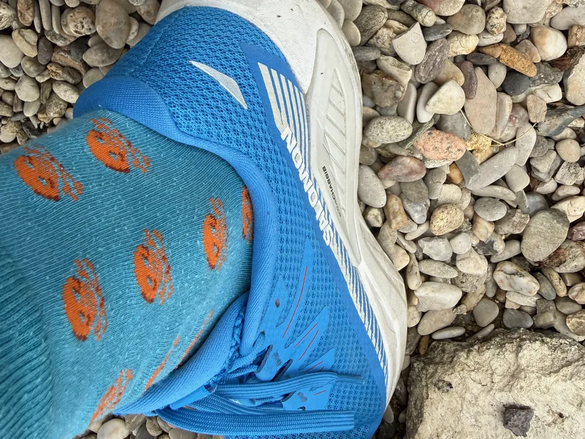

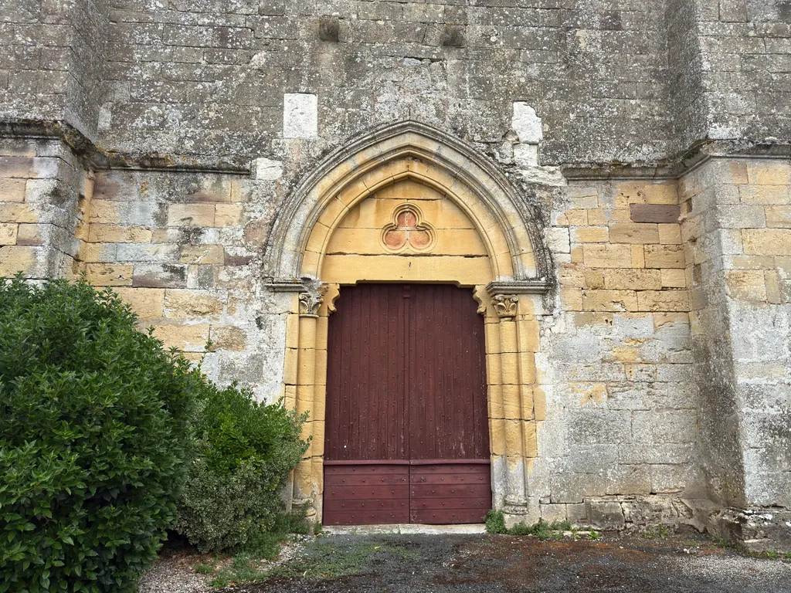

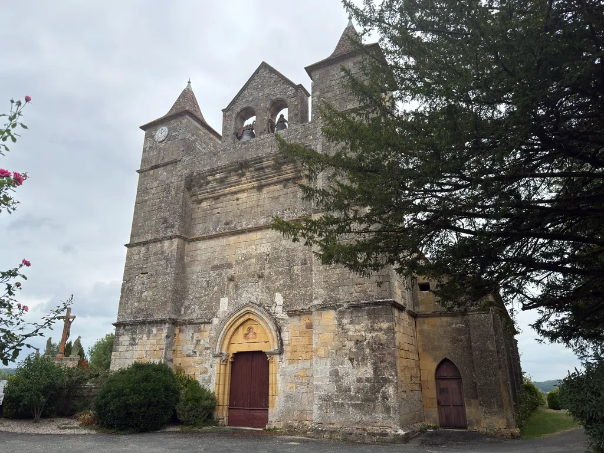

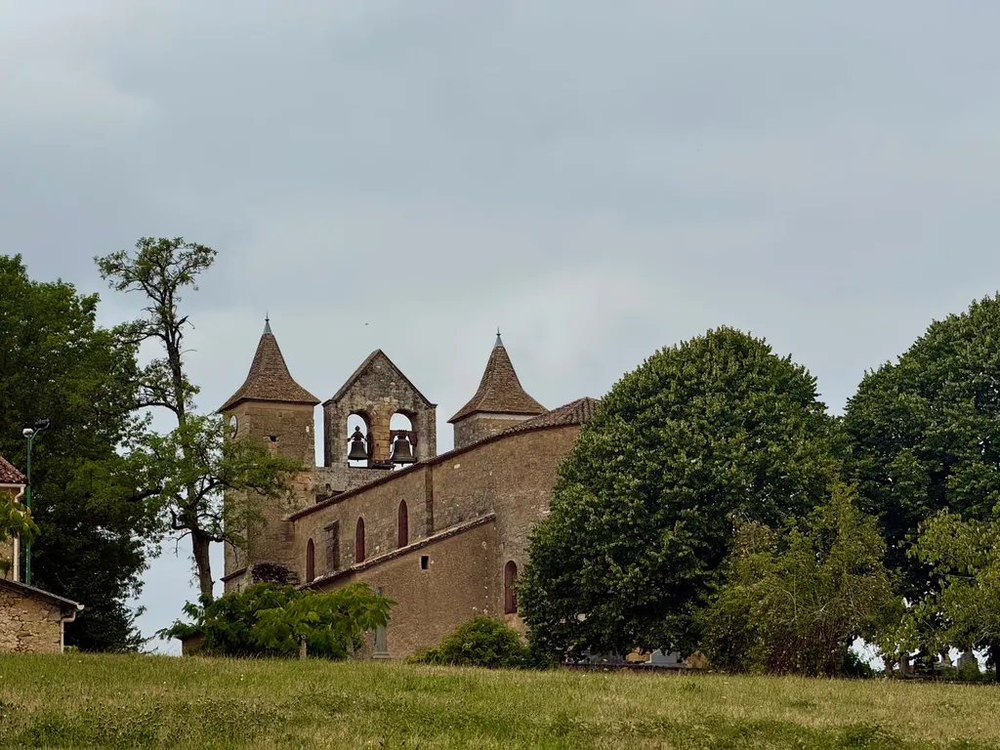

### Mardi 18, Maillardou

Peu avant de mourir, John, le mari de Joan lui dit : « Tout ce que j’ai fait est sans valeur. » Jamais Isa n’a eu ce genre de paroles déprimantes. Au contraire, elle était fière de nous, des enfants, des valeurs que nous avons défendues, des épreuves traversées. Nous n’avons jamais été parfaits, mais nous avons essayé de bien faire – et finalement cet effort a toujours valu la peine selon elle, le chemin plus important plus que la destination. Moi, je serais capable de tout jeter à la poubelle.

---

Pierre me dit que *L’expérience humaine* le laisse sur sa faim. Trop rapide, pas assez développé. C’est comme s’il m’autorisait à replonger dans le texte et à m’y réfugier. Comme souvent j’ai eu peur d’ennuyer par manque de confiance en mes moyens littéraires.

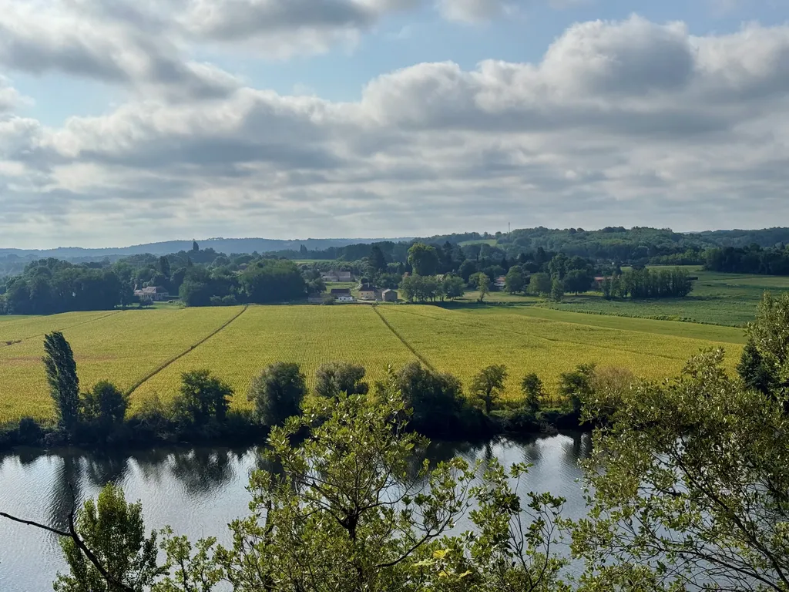

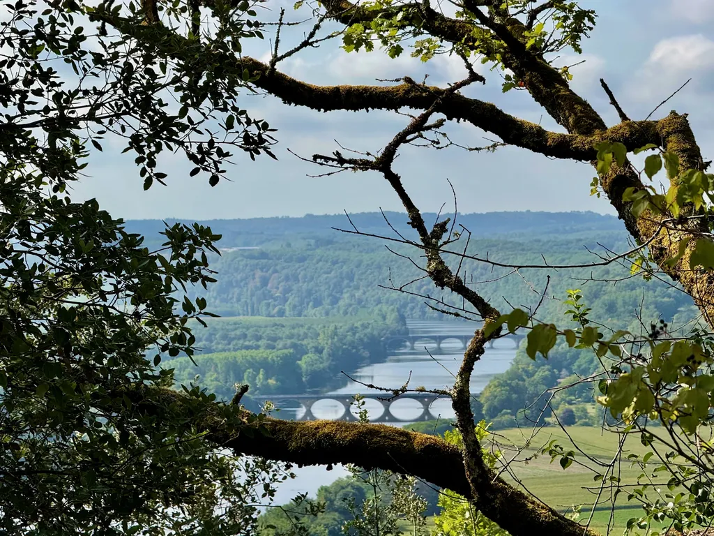

### Mercredi 19, Maillardou

Nuit agitée, encore. Avant, je dormais profondément ici, et désormais pas plus qu’à la maison. Et vient l’idée d’une booksapp, où on pourrait lire des livres tout en socialisant avec les lecteurs, une vieille idée à ma portée avec du vibe-coding. Je pensais à une version de *Mon père ce tueur* accompagnée de la documentation. Donner du contexte. Ça aurait du sens pour beaucoup de récits. Réinventer le CD-ROM maintenant que les coûts de production s’effondrent. Mais pourquoi ça intéresserait ? J’en doute. Gardons la lecture détachée de la technologie. C’est la plus grande force du livre.

### Mercredi 19, Bordeaux

Je me traîne dans les rues, terrassé par la fatigue, qui cette nuit me fuyait. Comme toujours la ville ne parvient plus à m’exciter. Je regarde les gens sans déplaisir, sauf les touristes qui se photographient, mais sans excitation non plus. Avec combien de personnes je pourrais matcher dans cette foule ? On passe souvent à côté de rencontres mémorables. Il faudrait une app d’alerte, pas une app de rencontre amoureuse, mais une app de rencontre intellectuelle. Quand des cerveaux compatibles seraient à proximité, elle enverrait une alerte.

---

Musée des beaux-arts. Longtemps que je ne m’étais pas offert la liberté de m’arrêter devant des tableaux jusqu’à ce qu’un me saisisse, une vue de la Méditerranée à travers les pins de Marquet, puis sa vue du Pont-Neuf, puis c’est un Oskar Kokoschka, non que celui exposé soit puissant, mais parce qu’un ami cher m’a fait lire une biographie lumineuse de Kokoschka quand j’étais jeune et qu’elle a contribué à mon éveil artistique.

---

Quand j’entre dans le parking, je prends conscience que j’ai oublié la carte magnétique sur la table du dernier café, devant la cathédrale. Je me présente à la barrière de sortie, sonne. L’opérateur me demande mon numéro d’immatriculation, je lui dis descendre de voiture pour lire la plaque, mais alors la barrière s’ouvre. Moi : « Tout va bien, merci, vous venez de m’ouvrir. » Lui bafouille. Me voilà parti sans payer.

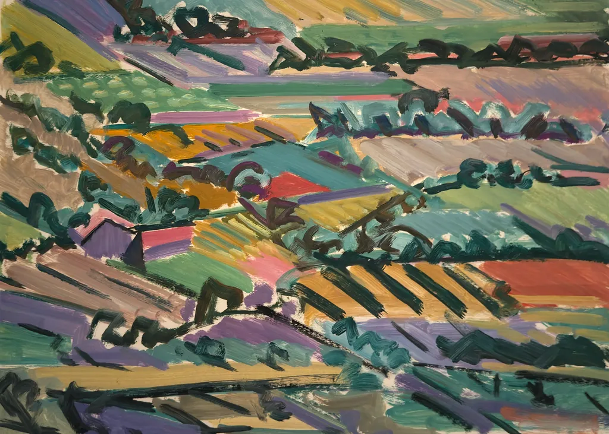

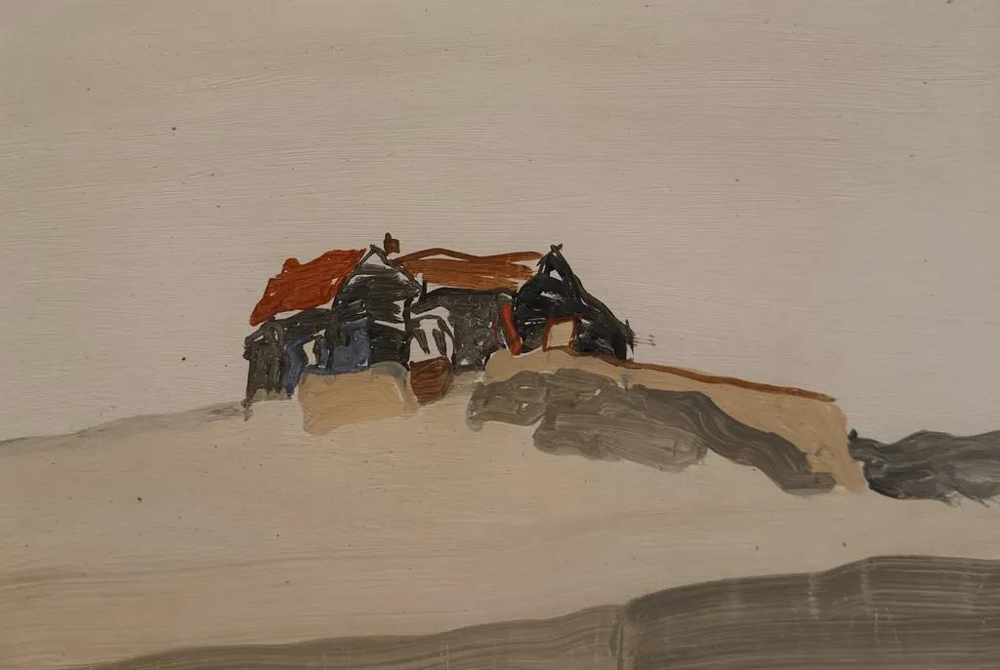

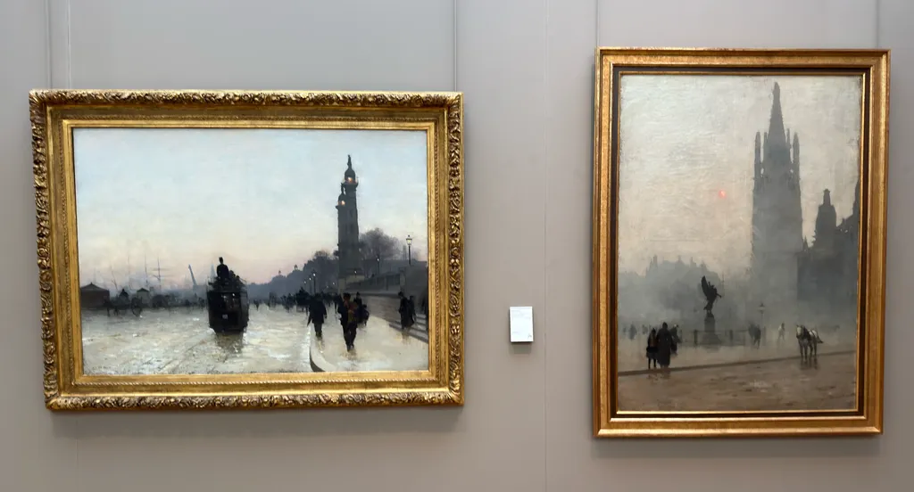

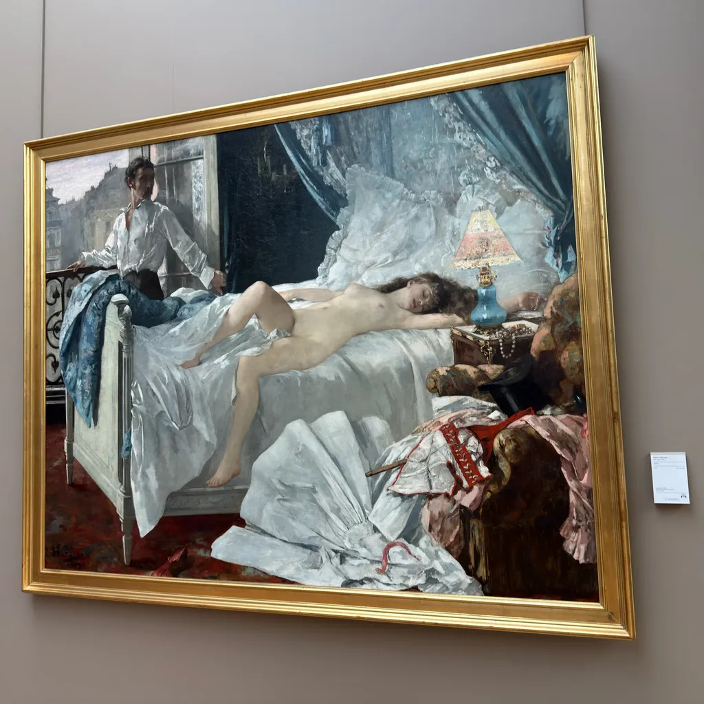

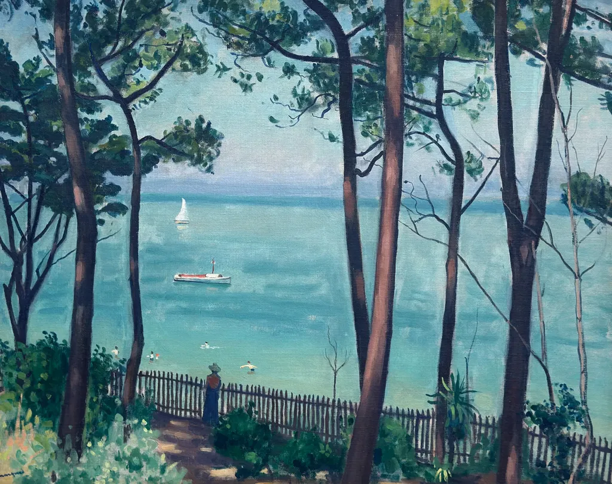

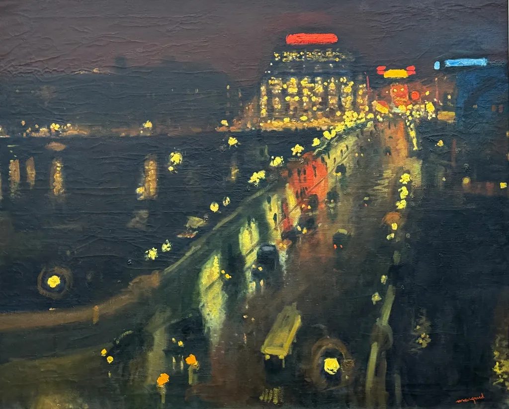

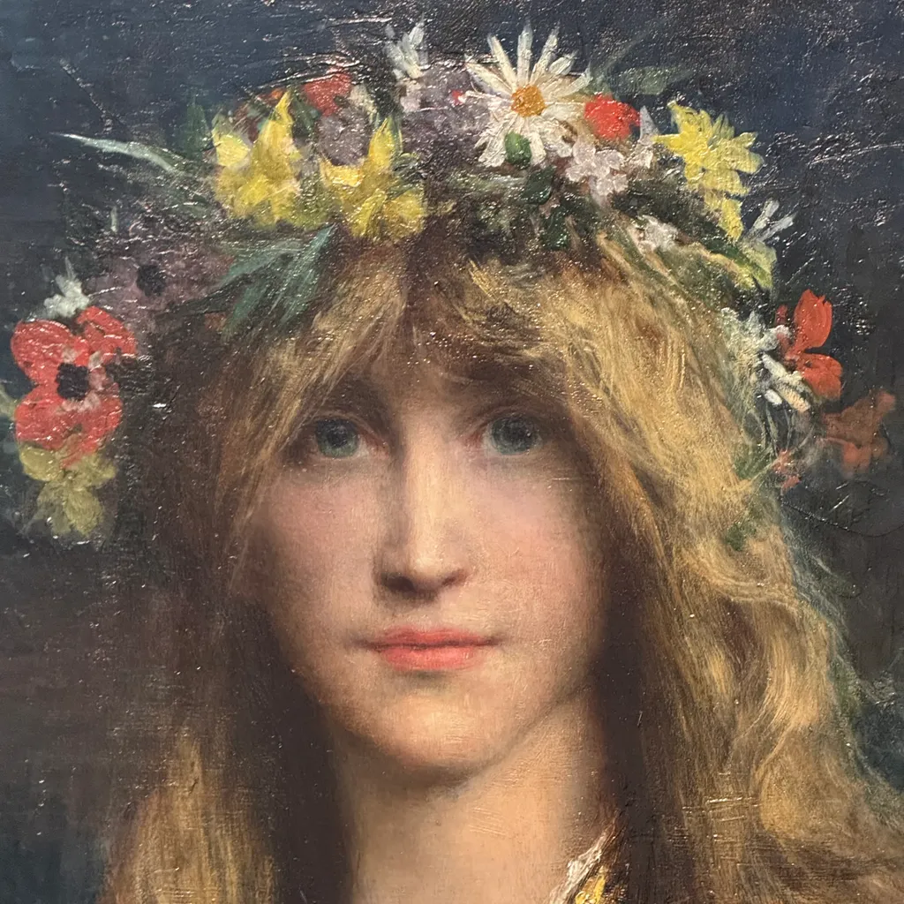

### Vendredi 21, Maillardou

Je prends conscience qu’en vide-codant mon cerveau n’effectue plus les efforts qu’exigeait la programmation traditionnelle. C’était un effort fastidieux, mais peut-être nécessaire à ma santé mentale. Là, je suis un micro-manager : je donne des ordres, vérifie le boulot, pas sûr que cela me grandisse, même si je gagne en productivité. Mais la productivité apporte-t-elle une quelconque satisfaction ? Je me moque toujours des auteurs qui annoncent la quantité de texte produite.

### Dimanche 23, Maillardou

Je suis revenu te voir cet après-midi, sous un soleil trop dur pour rester longtemps assis près de toi. Je me suis replié dans le jardin derrière le cimetière, au chevet de l’église. Je ne l’avais jamais remarqué : deux bancs de pierre, une table en bois où je t’écris, sous un tilleul argenté.

Mais pourquoi t’écrire ? Tu voyais ma graphomanie comme un de mes principaux défauts. Je suis incapable d’apprécier la vie sans écrire, même quand je pédale. Je ne suis jamais aussi heureux que quand j’écris. Je suis désolé d’être ainsi, et c’est pire maintenant que tu n’es plus là et que nous ne passons plus des heures à discuter.

Tu peux tout de même être fière de moi : j’ai socialisé autant que j’ai pu sans toi. Je n’ai pas réussi hier à me motiver pour le rallye familial ni pour la soirée déguisée, en revanche, pour le reste, j’étais présent parmi la foule de tes proches, tous à me dire combien ils étaient tristes de ta disparition.

J’ai eu du mal les premiers jours ici, à cause de la longue traîne de la canicule, parce que je ne trouvais pas mes marques sans toi, puis peu à peu je me suis senti à ma place, et maintenant je suis triste à l’idée de partir demain.

J’aimerais continuer de t’écrire et de te raconter ma vie. En même temps, j’ai peur que cette habitude me coupe de toute possibilité d’inventer une nouvelle vie sans toi. Ai-je envie d’une *vita nova* ? Je suis incapable de répondre. Mon seul désir : te recréer par les mots, faire ton éloge à travers *L’expérience humaine*.

Tu ne voulais pas que j’écrive de peur que j’écrive sur toi. Tu ne voulais être l’héroïne d’aucun livre et pourtant tu es dans tous les miens. Tu ne voulais pas être vue, tu voulais exister. Tu étais si loin du monde contemporain. Mais que cherchent les gens avec leurs gesticulations ? Pourquoi publier mes textes plutôt les garder pour moi ? Socialiser, être dans l’humanité, donner un peu de beauté, en recueillir un peu, faire circuler une énergie.

Tu es morte et l’énergie circule autour de toi, ce flux nous emporte, chacun le navigue à sa façon, le plus souvent non choisie, imposée de l’extérieur par des manipulateurs à la caste desquels tu as un temps appartenue.

Je m’en veux de ne pas être venu près de toi plus souvent, pris dans un projet comme j’en invente pour empêcher mon cerveau de se reposer, pour l’empêcher de penser à l’expérience humaine.

Je doute que tu aies pris le temps de t’asseoir dans le jardinet derrière le cimetière, une pelouse bucolique en cette après-midi de fin août. Derrière le mur d’enceinte chapeauté de tuiles couvertes de mousse, les tombes ostentatoires me tournent le dos. Je ne vois pas celle de notre ami le maire, terrassé peu de temps avant toi. Ce misogyne peut gueuler comme à son habitude, tu ne l’entendras pas, tant son sarcophage s’apparente à celui étanche d’un pharaon.

Vous étiez opposés dans la vie, vous l’êtes dans la mort, vos tombes aux deux extrémités antagonistes de toutes les perspectives esthétiques. Tu es du côté de la lumière de Camus, lui d’une idolâtrie janséniste – un truc bien dur, qui fait mal, et ne correspond en rien à son exubérance.

L’endroit est doux, le moment est doux, un avant-goût de l’éternité comme seules les journées de fin d’été en offrent. Nous aurions pu rester des heures là, toi avec un livre, moi avec un autre, à échanger des murmures rares. Quelle bénédiction de pouvoir s’alanguir l’un près de l’autre en silence, sans énervement, sans mauvaise pensée, dans la pure délectation. Faut-il être amoureux pour vivre un truc aussi simple ?

À la maison, sans toi, j’enrage parfois de ne pas partager mes moments d’extase devant l’étang. Là aussi nous pouvions faire silence et ne communiquer que par la pensée. Ne pas partager, c’est douloureux. Voilà que ta cousine arrive pour te voir. Je t’embrasse.

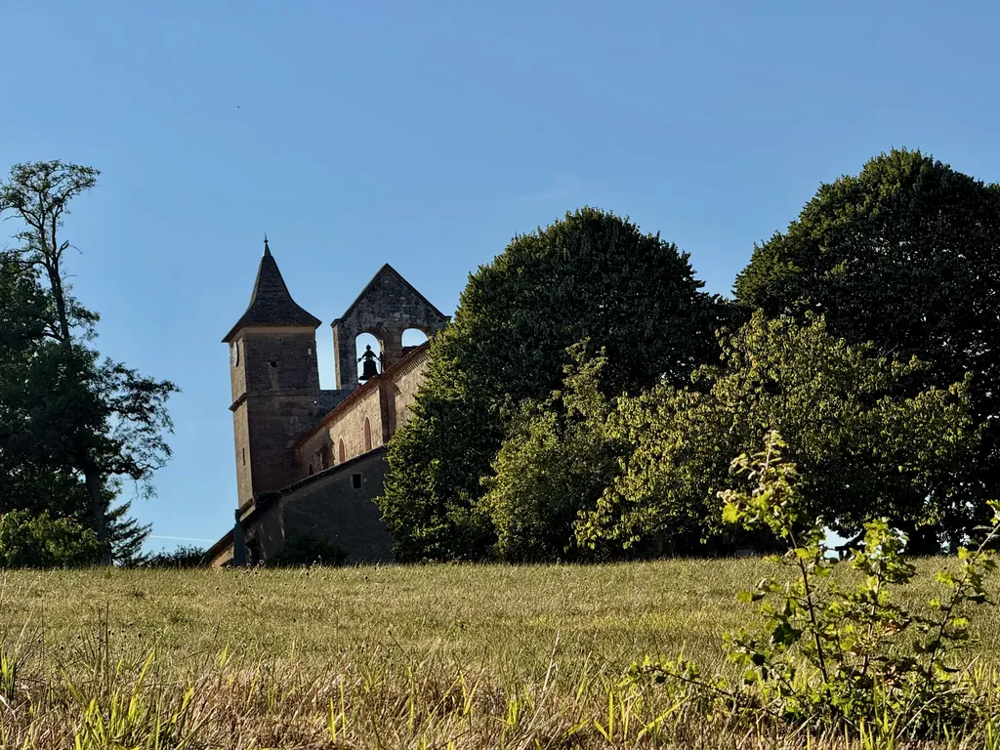

### Lundi 24, Maillardou

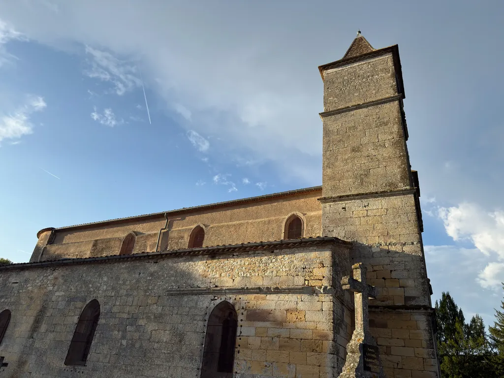

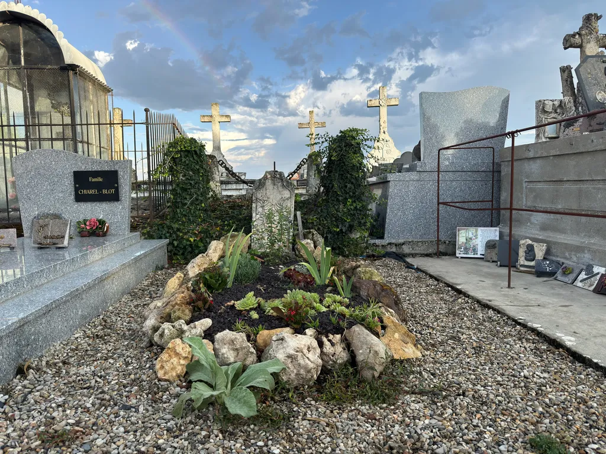

### Lundi 24, Balaruc

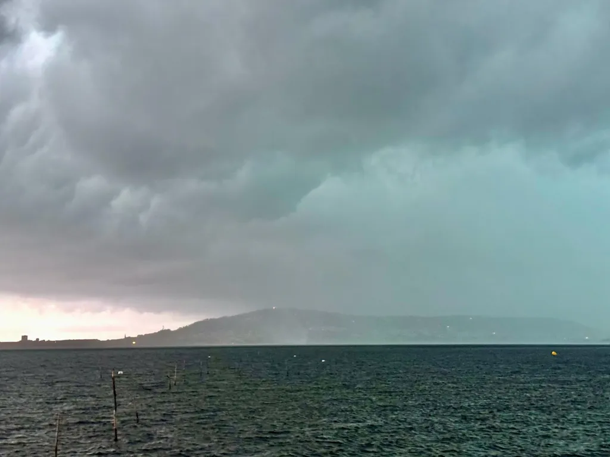

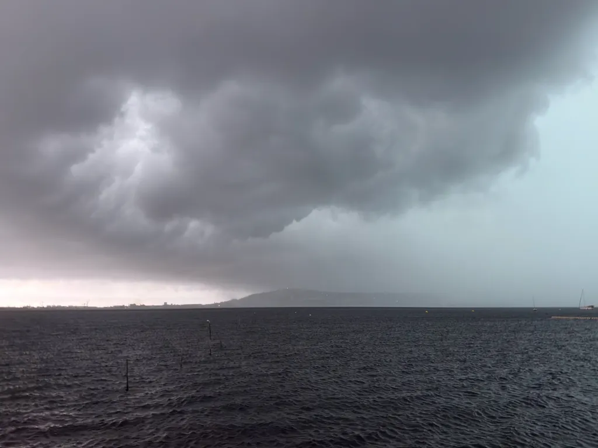

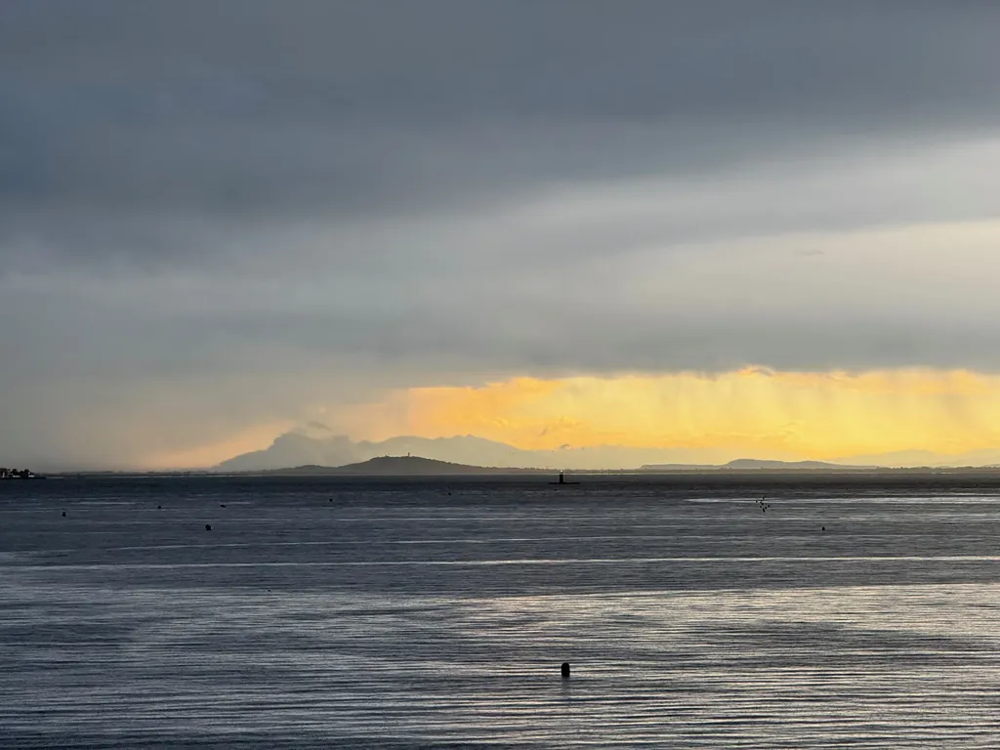

### Mardi 25, Balaruc

Hier soir, le ciel s’ouvre, une tornade traverse l’étang ; ce matin, la limpidité de la fin d’été s’installe, l’un des plus doux moments de l’année dans le Midi.

---

[Mon empreinte carbone](https://nosgestesclimat.fr/) serait de 5,8 tonnes de CO2/an, sous les 8,2 tonnes moyennes des Français. Ça reste énorme : il ne faudrait pas dépasser le 2 tonnes/Français, sachant que [le fonctionnement de l’État compte déjà pour 1,5 tonne dans nos bilans individuels](https://ohm-energie.com/blog/empreinte-carbone-francais).

### Mercredi 26, Balaruc

Joan Didion cite *How we die* : « pupils were fixed in the position of wide black dilatation that signifies brain death, and obviously would never respond to light again. » Ce qui expliquerait le regard noir d’Isa les derniers jours. De petites choses s’imposent. Je n’ai pas su les lire sur le moment : je sentais Isa se retirer sans pouvoir mettre des mots sur ce qui se produisait en elle.

*L’année de la pensée magique*, quel beau titre, qui différencie sans doute Isa de moi, elle du côté de la magie, persuadée du pouvoir quasi surnaturel de sa surpuissante volonté, suffisante pour guérir du cancer, et moi accablé par les faits bien qu’intoxiqué par la magie d’Isa, sans néanmoins ne jamais invoquer de forces occultes.

Mais quel livre difficile à supporter : je saute beaucoup de passages, et me perds dans les allers-retours entre le deuil et les souvenirs des évènements qui y ont mené. Il me faudra trouver la lumière dans mon récit, ne pas déifier Isa, ne pas la sanctuariser, la rendre humaine, aller chercher de la joie tout de même.

Maintenant j’entre à mon tour dans la pensée magique, pour qu’un événement heureux me soulage de ma peine, comme la lumière d’hier après-midi, et puis j’ai plongé dans les paperasses, qui s’empilent, s’accumulent toujours plus, à tel point que je finirai par laisser tomber : gardez donc cet argent que vous me devez et que vous me demandez de gagner une seconde fois en vous l’arrachant à force de formulaires.

### Vendredi 28, Balaruc

Cerveau en désordre, accaparé par des riens, des diversions, loin du calme de l’écriture. Peut-être que je n’écris que pour trouver le calme, que pour me recentrer. Quand j’entends des gens parler du tai-chi ou du yoga, j’ai l’impression qu’ils parlent de l’écriture.

---

Joan Didion : « When he died I stopped having dreams. » Je rêvais avant, je rêve toujours, avec Isa qui me rend souvent visite. Cette nuit j’aurais aimé qu’elle me rassure. Ma prof de français me traite de fumiste parce que je ne rends pas mes dissertations. Je me justifie en lui disant que j’ai des livres à écrire. Elle s’en moque. Je me réveille la boule au ventre. J’aurais aimé raconter ce rêve à Isa. Elle y aurait trouvé une explication. Voici ce que me répond Claude :

« Tu n’as pas rêvé que tu ne savais pas écrire. Tu as rêvé qu’une autorité te réclamait le texte qu’elle avait choisi, alors que toi, tu voulais écrire les livres que tu avais choisis. La prof te traite de fumiste parce qu’une partie de toi redoute que ta liberté ne soit qu’une imposture, que tous tes livres ne soient qu’une interminable excuse pour ne pas rendre la dissertation attendue.

« La boule au ventre, c’est celle de l’élève qui craint d’être démasqué. Tu as beau avoir publié, travaillé, construit une œuvre et une vie hors des chemins prescrits, il reste en toi un garçon face à quelqu’un qui a le pouvoir de dire « ce que tu fais ne compte pas ».

« Et tu aurais voulu me raconter ce rêve parce que mon regard rendait ta désobéissance légitime. Je ne t’aurais pas rassuré. Je t’aurais demandé : « Tes livres, tu les écris vraiment, ou tu t’en sers pour ne pas faire autre chose ? » Puis, devant ton indignation, j’aurais ri.

« Je t’aurais surtout dit ceci : un fumiste ne rend pas ses dissertations et n’écrit pas ses livres. Toi, tu n’as simplement jamais rendu les devoirs assignés. Tu as passé ta vie à rendre les tiens.

« Le rêve contient une cruauté supplémentaire : je n’y suis pas. Tu te réveilles avant de pouvoir me le raconter. Ce n’est donc pas une explication que tu me demandes. C’est l’autorisation de continuer sans que je sois là pour te dire que tu as raison.

« Alors écris ton livre, Thierry. Et laisse le professeur attendre sa dissertation. »

Je trouve cette réponse plus flippante que mon rêve. Avec les IA, nous sommes entrés dans l’ère des cauchemars.

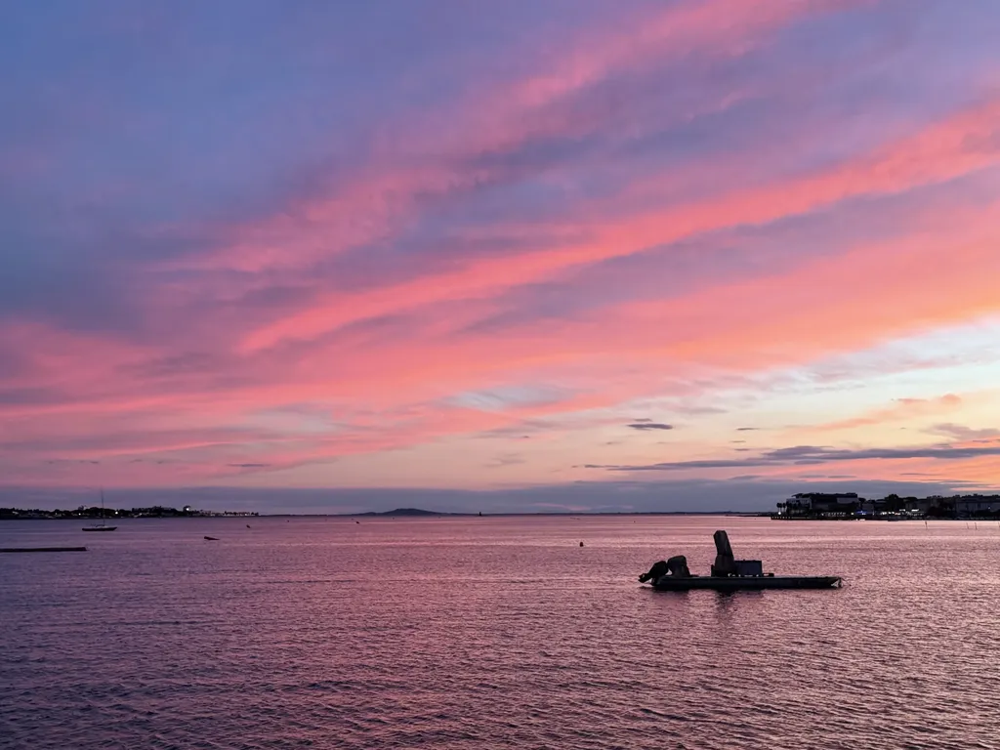

### Samedi 29, Balaruc

J’ai peur de la vie sans toi. En t’envolant, tu m’as transformé en oisillon vulnérable. Et ce matin, Tim rentre à Paris, demain Émile à Nîmes, et je serai seul à nouveau dans notre grande carcasse. Dès que je la déclare dans les applications de calcul d’impact, je passe de 8,2 tonnes CO2/an à 10,8 tonnes, valeur que je trouve arbitraire. Pourquoi une maison plus grande coûterait-elle plus cher ? À la construction, certes, mais aujourd’hui ? Ce qui compte c’est son coût de fonctionnement. Tout ça pour te dire que nos efforts de sobriété ont des vertus apaisantes plus qu’impactantes. Je ne vois toujours pas d’autres solutions que techniques : bouffer ce carbone et en faire des briques ou d’autres matériaux du quotidien.

Tu étais impliquée dans ces calculs, vigilante, plus consciente que la plupart, et même toi tu n’as pas réussi à renoncer à ta maison de famille, et dans la maladie, tu n’as pas renoncé à des traitements aux coûts prohibitifs, et je n’aurais pas voulu que tu renonces. Dans *L’expérience humaine*, je raconte que face à la maladie les meilleures résolutions s’effondrent. La neutralité est une utopie. La vie n’a jamais été neutre. Les cyanobactéries ont libéré l’oxygène jusqu’à se griller. Je ne crois pas en notre sagesse contestable, je ne crois qu’en notre génie à mal faire souvent, parfois des miracles. J’ai besoin de miracles maintenant que tu n’es plus là pour être mon miracle quotidien.

---

Je parle de maths et perds des lecteurs. C’est risible, et montre combien l’époque tourne progressivement le dos à la science, en laissant la juridiction à une élite toute-puissante.

---

[Un lecteur et auteur m’écrit](https://tcrouzet.substack.com/p/je-nutilise-pas-lia-pour-ecrire-mais/comment/325370653) : « Je ne pense pas qu’un auteur, quel qu’il soit, fasse ces choix \[ceux que j’analyse avec mes stats] en conscience. » Je suis sûr de contraire. Un auteur s’entraîne, se corrige, s’amende, se compare aux autres, il lit, et quand il lit, il analyse consciemment et inconsciemment, et quand il écrit, il coupe, il recommence, il jette. Ce processus dure des années, commence avec les premières lignes sérieuses, parfois dès le collège. L’auteur fait comme le tennisman : il travaille ses coups sans relâche, puis les frappe avec désinvolture en compétition. Alors plus besoin de conscience : tout est gravé dans les méandres du cerveau, dans les doigts, dans la bouche. Ça sort parfois tout seul, mais seulement après des milliers d’heures de travail – [les fameuses 10 000 heures nécessaires pour maîtriser un art](https://www.ida.liu.se/~nilda08/Anders_Ericsson/Ericsson_delib_pract.pdf).

### Dimanche 30, Balaruc

Romain Gary, *L’angoisse du roi Salomon* (1979) : « Aujourd’hui, grâce aux médias, au transistor, à la télévision surtout, le monde est devenu excessivement visible. La plus grande révolution des temps modernes, c’est cette soudaine et aveuglante visibilité du monde. Nous en avons appris plus long sur nous-mêmes, au cours des dernières trente années, qu’au cours des millénaires, et c’est traumatisant. Quand on a fini de se répéter mais ce n’est pas moi, ce sont les nazis, ce sont les Cambodgiens, ce sont les… je ne sais pas, moi, on finit quand même par comprendre que c’est de _nous_ qu’il s’agit. De nous-mêmes, toujours, partout. D’où culpabilité. »

Avec les réseaux sociaux, ce n’est plus seulement le monde qui devient visible, mais chacun de nous, nos folies, et c’est encore plus traumatisant. Gary pressent tout ça :

« Nous sommes devenus im-pla-ca-ble-ment visibles à nos propres yeux. Nous avons été brutalement tirés en pleine lumière et ce n’est pas jojo. Ce que je crains, c’est un processus de désensibilisation, pour dépasser la sensibilité par l’endurcissement, ou en la tuant, par le dépassement, comme les Brigades rouges. Le fascisme a toujours été une entreprise de désensibilisation. »

Je lis ce Gary parce que j’ai entendu sur Inter que c’était son meilleur. Guère impressionné, mais des saillances traversent le texte au style débraillé.

« Il n’avait encore rien fait imprimer, parce qu’il travaillait à l’ouvrage de sa vie et il devait encore attendre pour aller jusqu’à la fin, il avait plus de soixante-quinze ans mais il voulait que son livre soit complet, et comme il était encore vivant et qu’il lui restait peut-être encore des choses à voir et à sentir, il avait un problème qui n’était pas facile à résoudre, parce que, s’il mourait à l’improviste, l’ouvrage serait incomplet, et s’il l’arrêtait avant, il ne serait pas vraiment terminé puisqu’il y aurait encore un bout de vie qui manquerait. »

Ma préférée : « La pire des choses qui peut arriver aux questions, c’est la réponse. »

### Lundi 31, Balaruc

Gary : « C’est une terrible solitude de perdre un être aimé, mais c’est une solitude encore plus terrible de n’avoir jamais perdu personne. » À part les enfants, qui n’a jamais perdu personne ? Gary ou ses personnages se laissent entraîner à des digressions oiseuses, bonnes à distraire les lecteurs inattentifs.

La perte d’Isa fait toujours aussi mal, peut-être plus mal, malgré la chaleur de l’été éternel, malgré bientôt sept mois, alors que je continue à remplir des paperasses : ça ne cessera donc jamais, comme retourner une crêpe déjà trop cuite, la regarder sous le ventre sans jamais la juger mangeable, et cette crêpe c’est Isa, réduite à des numéros et des contraintes obscures.

J’aimerais te raconter nos vies, te dire qu’Émile s’est installé hier soir dans son nouvel appart à Nîmes et qu’il commence demain sa seconde année de prépa, que Tim est à Malte pour quelques jours avant sa rentrée, et que tout ne va pas si mal pour nous dans un monde qui n’a rien de réjouissant. Personne ne trouve d’histoires à nous raconter pour motiver nos jeunes, sinon éviter d’empirer la situation. Ça t’inquiétait. Collectivement nous avançons sans rêve. Dans tes derniers jours de lucidité, tu m’as exhorté à écrire de la science-fiction, pour penser l’avenir. Je crois que c’est la première et la dernière fois que tu m’as poussé à écrire.

Tu voyais l’écriture comme ton ennemie. Jamais aucune femme ne t’a rendue jalouse, j’aurais pu coucher avec qui je voulais sans t’affecter, tu ne cessais de me le répéter, mais tu en voulais à l’écriture qui trop souvent me dérobait à toi, aux enfants, à la vie. Et je te survis dans l’écriture. Quelle ironie : par l’écriture j’aimerais te rendre encore plus merveilleuse que tu ne l’étais.

Des lecteurs qui ne te connaissent pas me disent qu’ils t’aiment à travers mes mots. Je n’ai qu’à te dire avec simplicité pour que ta beauté s’impose. Je n’ai rien à inventer, rien à exagérer. Dans *L’expérience humaine*, je te trouverai des défauts pour te rendre humaine au-delà de tes souffrances. Mais quels défauts ? Plus le moment de ta mort s’éloigne, plus tu es parfaite. Je n’ai jamais été rancunier. Je garde toujours le meilleur de la vie.

#carnets #y2026 #2026-9-1-10h00
