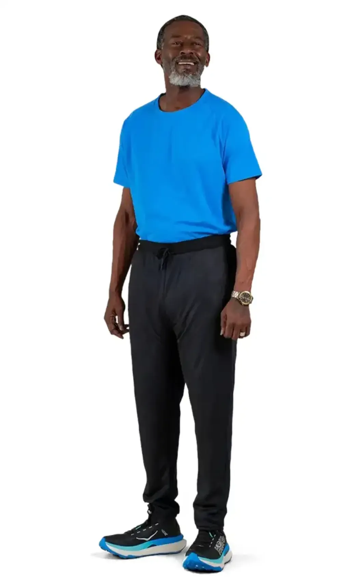
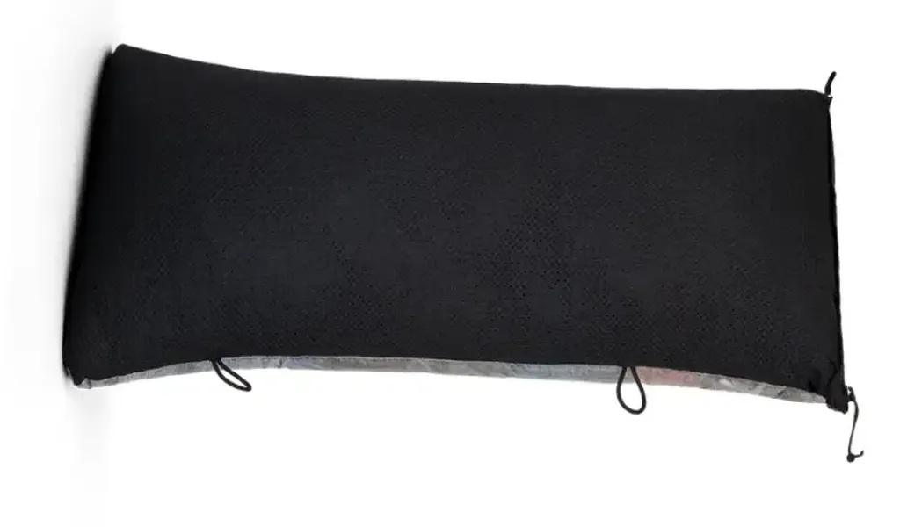
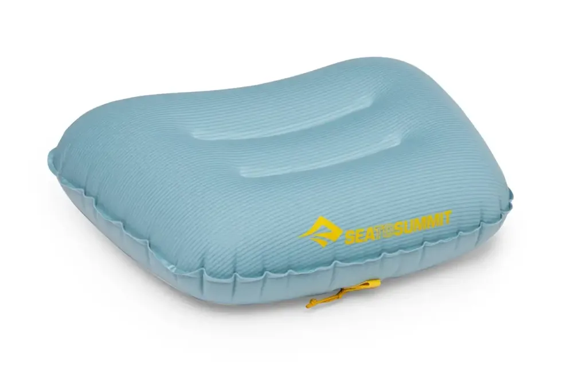

# Dormir mieux en bivouac sans s’alourdir

Juste un petit message pour vous raconter une réflexion qui m’a occupé une soirée. Point de départ : laver un duvet en plume, ce n’est pas la joie. J’ai beau utiliser des balles de tennis dans le sèche-linge, les plumes ne retrouvent jamais leur fluidité initiale et c’est de pire en pire au fil des lavages. Il me faut donc trouver un moyen de les minimiser.

Solution la plus intuitive : utiliser un sac à viande, c’est ce que je me suis dit tout de suite. [Sea to Summit en propose un](https://seatosummit.eu/fr-fr/products/silk-blend-sleeping-bag-liner) adapté à mon sac de couchage pour 140 g, Décathlon propose [le modèle MT500](https://www.decathlon.fr/p/drap-de-sac-de-trekking-en-soie-mt500/323651/c227m8578334) à 110 g, mais pas aussi fonctionnel.

Très vite je me suis dit que je devais ajouter en plus de cette protection un short, voire un pantalon, pour le camp, car pas question de garder le cuissard, ni de me balader à poil. J’ai longtemps utilisé un [collant de compression](https://us.2xu.com/products/refresh-recovery-compression-tights-ma4419b-mens-black-nero), censé favoriser la récupération, mais qui, en fin de compte, n’apporte aucun bénéfice, en plus d’être super difficile à enfiler – il pesait 177 g.

En été, j’emporte un short style running de 67 g, mais pour [le g727](https://727bikepacking.fr/g727/) où les matinées et les soirées seront fraîches, un pantalon serait plus adapté. J’ai fini par trouver une solution radicale : un pantalon en Polartec Alpha Direct. [Je suis tombé sur site français qui en produit à la demande et sur mesure](https://frenchlightoutdoor.com/produit/pantalon-en-alpha), mais pas le temps de le commander et le recevoir pour le g727. J’ai aussi trouvé le [FarPointe Alpha Direct Camp Pants](https://farlite.fi/en/tuote/farpointe-alpha-direct-camp-pants-2/), entre 90 et 110 g, malheureusement en rupture. Par manque de temps, j’ai donc choisi le plus lourd, 147 g, mais aussi plus épais, [Zpacks Octa Fleece Camp Pants](https://zpacks.com/products/zpacks-octa-fleece-camp-pants), une sorte de survêt ample. Par la même occasion, j’ai découvert [un site européen qui le proposait à un prix raisonnable](https://www.outdoorline.eu/products/zpacks-octa-camp-pants). Je le recevrais avant le départ.

L’idée est donc de dormir avec le pantalon. Au-dessus du sac de couchage en début de nuit, à l’intérieur plus tard, et de ne laver que le pantalon au retour. Le pantalon remplace le sac à viande et permet d’être plus confort lors du bivouac, surtout quand la fraîcheur tombe. Comme souvent en bikepacking, je privilégie les produits à usages multiples.

Dans cette optique, j’aurais pu commander le [Medium Pillow Dry Bag de Zpacks,](https://zpacks.com/products/medium-pillow) qui sert en même temps d’oreiller et de sac de rangement (41g). Mais je me suis rendu compte [qu’il était disponible en Europe](https://www.outdoorline.eu/products/zpacks-medium-dry-bag-pillow?_pos=6&_sid=ac07fcaa9&_ss=r), après avoir commandé [l’oreiller Sea to Summit adapté à mon sac de couchage](https://seatosummit.eu/fr-fr/products/aeros-pillow-ultra-light) (57 g).

De plus en plus, je privilégie le confort, quitte à faire de petits sacrifices du côté du poids.

#velo #bikepacking #y2026 #2026-09-16-21h00
