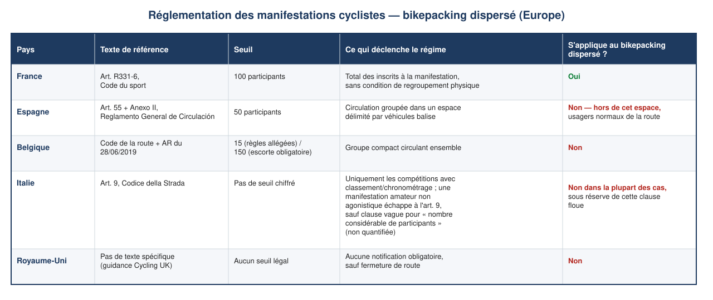
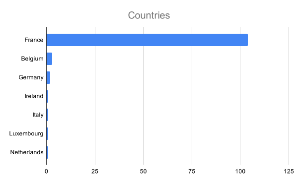
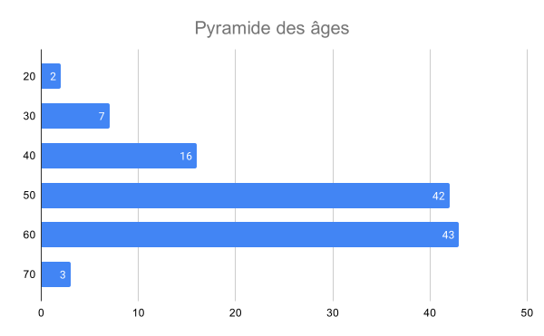
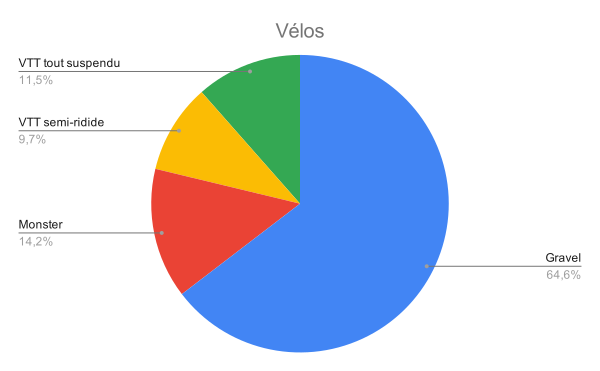
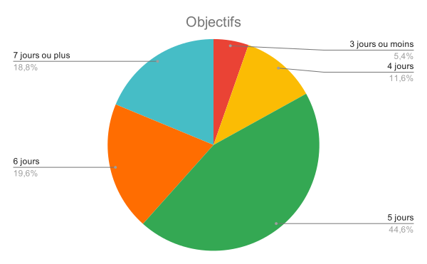

# g727 complet, liste d’attente ouverte

Depuis 2023, le [g727](https://727bikepacking.fr/g727-grand-depart/) a un beau succès. Cette année, beaucoup de gravellistes ne pourront malheureusement pas prendre le départ de la randonnée à cause du décret n° 2017-1279 du 9 août 2017, qui nous plafonne à 99 participants hors membres de l’organisation – nous serons douze de l’ECP en plus des 99. [J’ai ouvert une liste d’attente en cas de forfaits.](https://727bikepacking.fr/contact/)

À vrai dire, pas d’interdiction de dépasser 99, mais une procédure administrative ubuesque qui devient disproportionnée pour une randonnée en autonomie de 727 km. La France dans toute sa splendeur.

Encore une contrainte administrative pensée pour les pelotons, privé de sens pour une randonnée longue distance, qui plus est souvent hors asphalte, où les participants s’éparpillent vite après le départ. La France n’est pas prête à devenir La Mecque du bikepacking, alors que notre territoire s’y prête à merveille. Dommage.

Côté participants, avec moins de 10 % de féminines, on ne s’améliore pas d’année en année. On est très mauvais recruteurs – en fait de recrutement, on compte sur le seul bouche-à-oreille. Il nous faudrait une ambassadrice. On tente pourtant de réduire le dénivelé et de limiter les passages rugueux, mais ça passe encore mal. Je interrogerai les rares participantes pour trouver une réponse.

Cette année, le g727 s’internationalise, avec en plus des Belges et Luxembourgeois habitués, des Allemands, Irlandais, Italien et Hollandais. C’est top. Promis : je traduirai le site en anglais pour les prochaines éditions.

Toutes les tranches d’âge sont représentées, avec un pic du côté des sexagénaires que j’ai rejoint depuis trois ans.

Pas de compétition, alors chacun choisit le vélo qui lui convient et maximise le confort. J’ai roulé des g727 en semi-rigide et en tout-suspendu. Cette année, ce sera avec mon gravel – [dans une configuration proche de celle du Tourmagne](https://tcrouzet.com/2026/07/13/gravel-voyage/).

Randonnée, dit aussi chacun son rythme. Encore quelques fondus veulent coucler la trace en trois jours. Surtout, ne vous vantez pas à la fin. Vous roulerez la nuit et ça ne rendra pas hommage à la trace et à notre travail de reco. Maintenant, je comprends que votre temps soit compté. Moi, j’espère encore une année passer en cinq jours, mais je me dis de plus en plus souvent que je finirai moins sec en six. Pas toujours simple d’accepter de vieillir.

À très vite sur les chemins.

#velo #727bikepacking #y2026 #2026-09-11-19h00
