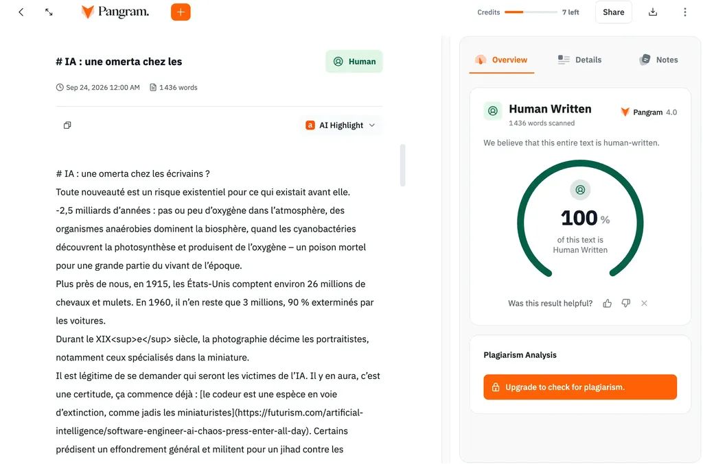

# IA : une omerta chez les écrivains ?

Toute nouveauté est un risque existentiel pour ce qui existait avant elle.

-2,5 milliards d’années : pas ou peu d’oxygène dans l’atmosphère, des organismes anaérobies dominent la biosphère, quand les cyanobactéries découvrent la photosynthèse et produisent de l’oxygène – un poison mortel pour une grande partie du vivant de l’époque.

Plus près de nous, en 1915, les États-Unis comptent environ 26 millions de chevaux et mulets. En 1960, il n’en reste que 3 millions, 90 % exterminés par les voitures.

Durant le XIXe siècle, la photographie décime les portraitistes, notamment ceux spécialisés dans la miniature.

Il est légitime de se demander qui seront les victimes de l’IA. Il y en aura, c’est une certitude, ça commence déjà : [le codeur est une espèce en voie d’extinction, comme jadis les miniaturistes](https://futurism.com/artificial-intelligence/software-engineer-ai-chaos-press-enter-all-day). Certains prédisent un effondrement général et militent pour un jihad contre les machines – Jihad Butlérien dans *Dune* de Frank Herbert. Je ne veux pas discuter de ces perspectives dramatiques, ni même de l’influence des datacenters sur le réchauffement climatique, mais du risque que l’IA fait peser sur les artistes, et en particulier les écrivains. Nous nous retrouvons divisés en trois grandes familles, où se rangent les éditeurs et les lecteurs.

* Je suis contre.
* Je revendique l’usage.
* Je l’utilise en catimini

### Je suis contre

Les organismes anaérobies étaient contre l’oxygène, ils ont quasi disparu, tout comme les chevaux contre les voitures ou les miniaturistes contre la photographie. Quand on résite au changement, on subit le changement et la peur du changement.

Ça ne signifie pas que tous les changements sont bénéfiques. L’arrivée des armes nucléaires ne m’a jamais paru comme une bonne chose, pas plus que le déploiement des centrales nucléaires. On peut s’opposer à un changement, tenter de l’empêcher, mais une fois qu’il nous tombe dessus, comme l’oxygène dans l’atmosphère, on n’a plus d’autre choix que de s’y adapter. L’IA est là, que nous le voulions ou pas, et ça risque de durer.

J’ai du mal avec le refus de principe – adaptation primaire – même s’il s’agit d’une réaction psychologique compréhensible : c’est défendre les acquis plutôt qu’explorer des territoires inconnus, potentiellement dangereux. Il y a toujours des opposants aux innovations, souvent ultramajoritaires, et le domaine de l’art n’échappe pas à ce phénomène, car l’art mêle artisanat et innovation. Souvent les artisans redoutent que leurs outils et leurs techniques se transforment : ils n’ont pas envie de se remettre en cause. C’est du travail, c’est fatigant, on n’en voit pas le bénéfice immédiat.

Une grande partie du monde de l’édition a fait ce choix sous des prétextes : écologiques, éthiques, déontologiques, souverainistes, juridiques… Chacun s’arrange comme il peut pour se justifier de faire le dos rond contre la tempête qui déferle et que rien n’arrêtera hormis une contre-révolution de type Jihad Butlérien.

### Je revendique l’usage

Quand j’ai écrit [*Le Code Houellebecq*](https://tcrouzet.com/books/le-code-houellebecq/) à l’aide des IA de 2023, je l’ai documenté, veillant à laisser dans le texte les traces de la prose IA de l’époque, plutôt que de les réécrire pour les masquer.

J’ai aussi dit qu’écrire ce texte m’avait pris plus de temps que si j’avais écrit le roman à l’ancienne. Mon but n’a jamais été d’augmenter ma productivité, mais d’altérer ma créativité, de l’orienter vers des directions nouvelles, comme le peintre qui, à cause de la photographie, se tourne vers l’impressionnisme ou l’abstraction.

Je n’ai pas tardé à être critiqué, voire à devenir un traître pour les adversaires de l’IA. C’est comme si on accusait les expérimentateurs d’effectuer un travail inutile, presque d’être des fumistes. « Ne faites pas ça, sinon on sera tous obligés. »

### Je l’utilise en catimini

On en arrive à la troisième catégorie, fruit de la confrontation entre les opposants aux IA, majoritaires, et les expérimentateurs. Il est devenu si politiquement et artistiquement incorrect d’utiliser l’IA que la plupart des auteurs préfèrent se taire. Là, je m’inquiète.

[Thélyson Orélien est victime d’une chasse aux sorcières parce qu’il aurait utilisé l’IA.](https://tcrouzet.com/2026/09/23/plagiat-IA/) Mais, bon sang, pourquoi ne jugez\-vous pas son texte sur pièce ? Je comprends, vous avez presque tous crié au chef-d’œuvre, et maintenant, vous vous sentez ridicules d’avoir peut-être acclamé le travail d’une IA. Mais si Orélien a utilisé une IA pour vous berner, c’est tout à son honneur. C’est un génie, le gars. Il est de son temps, il domine les outils de son temps. Il a réussi ce que je n’ai pas réussi en 2023. Vous devriez doublement le célébrer.

Est-ce à vous à juger ou aux lecteurs ? Ils aiment le livre, ils l’applaudissent, et je crois qu’ils se fichent de savoir si Orélien l’a écrit avec un Bic, Word ou Claude code.

On en arrive à une sorte d’inquisition où répondre à des questions sur nos méthodes de travail devient inconvenant. Orélien n’a plagié personne, n’a volé personne, n’a commis aucun crime. Qu’il ait écrit avec IA ou sans ne devrait intéresser que les spécialistes de la génétique littéraire, pas les lecteurs, qui prennent le texte en pleine gueule, l’aiment ou le détestent.

Depuis 2023, je tente d’être transparent. J’aurais gagné à me taire. Nous sommes dans une situation incompatible avec un débat apaisé. Avoir un jour utilisé les IA est devenu un crime aux yeux de certains. Aujourd’hui, je n’utilise plus les IA pour produire des textes, mais elles sont mes documentalistes, mes relectrices, mes analystes, mes dictionnaires, mes critiques. Je ne sais pas si c’est mieux qu’avant, ce n’est pas le problème, c’est différent à coup sûr, et j’aime explorer ces différences.

Un livre jugé excellent devient-il mauvais parce qu’une IA l’a écrit ? Que nous nous posions la question est inquiétant : elle révèle combien nos jugements dépendent du bruit environnant. Nous sommes sous influence. Et les IA, qui maraudent sur les réseaux sociaux, sont devenues des influenceuses en chef.

Pour ma part, je ne cherche pas à discriminer les créations humaines des artificielles, mais à cultiver mon indépendance de création et de pensée, plus que jamais mise en danger. Avec l’affaire Thélyson Orélien, combien d’auteurs continueront de se taire ? Beaucoup, j’imagine, et ça me fiche la trouille, dans un monde qui a tendance à se replier sur lui-même, à dénigrer l’autre, à craindre l’étranger.

La littérature n’est pas un espace dématérialisé, idéalisé, le domaine de purs esprits. Nous écrivons avec des outils qui nous influencent, nous inspirent souvent. Quand on embrasse cette perspective, l’IA devient moins effrayante, ou pas plus que la plume acier pour Flaubert, que la machine à écrire pour Mark Twain, que le traitement de texte pour Len Deighton.

*PS1 : [Pangram](https://www.pangram.com/) est un service privé, non un tribunal d’instance. Peut-on faire confiance à une entreprise privée quand elle commence à faire la loi ? Non. Pangram affirme sans fournir de preuve. J’ai souvent testé le service et j’avoue qu’il est bluffant. Ça ne constitue pas une preuve qu’il marche à tous les coups. Par ailleurs, Pangram a été entraîné sur un large corpus de textes humains et artificiels, dont nous ne savons rien. Ce corpus est nécessairement discutable. Ironie : on utilise une IA pour discréditer un texte humain, une IA qui donne des arguments aux adversaires de l’IA. C’est à mourir de rire. Une sorte d’aveu de notre impuissance à séparer l’humain et de l’artificiel.*

*PS2 : Claude va introduire des signatures statistiques dans ses textes pour les rendre identifiables à coup sûr, une mesure qui ne servira qu’à piéger les béotiens. Aujourd’hui, on peut faire tourner en local des modèles d’IA open source capables de réécrire des textes automatiquement, donc d’effacer les marqueurs statistiques qui auraient pu y être glissés. Nous n’aurons jamais de méthodes déterministes pour dire IA ou non, ou d’estimer la part d’IA dans une création humaine. Seule notre parole fera foi.*

#edition #ia #y2026 #2026-9-24-12h00
