# Goncourt 2026 : Thélyson Orélien passé au crible

[Tout le monde parle](https://legrandcontinent.eu/fr/dimanches/qui-ecrit-quand-personne-necrit/) de *C’était ça ou mourir*, premier roman de Thélyson Orélien, qui aurait des passages écrits par IA, et peut-être bien plus que des passages.

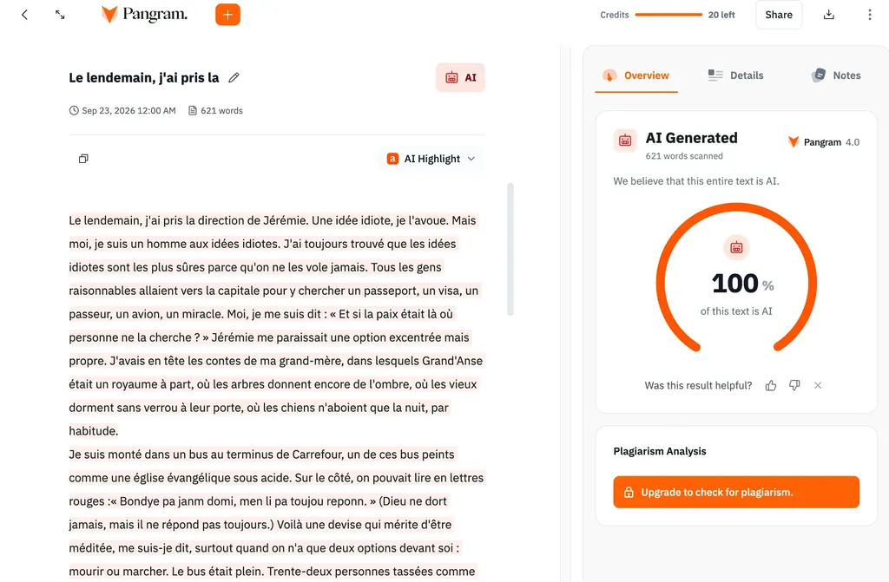

À mon tour, j’ai collé le début du chapitre 2 de Thélyson Orélien et d’autres passages dans Pangram, ça fait tilt. J’ai parfois vu [Pangram 4](https://www.pangram.com/) juger humain des textes écrits par IA, [je n’ai jamais observé l’inverse](https://tcrouzet.com/2026/08/06/are-you-human/). Par acquit de conscience, j’ai collé un passage de *La solitude des professeurs est infinie* de Yannick Haenel, et il paraît humain. Ouf !

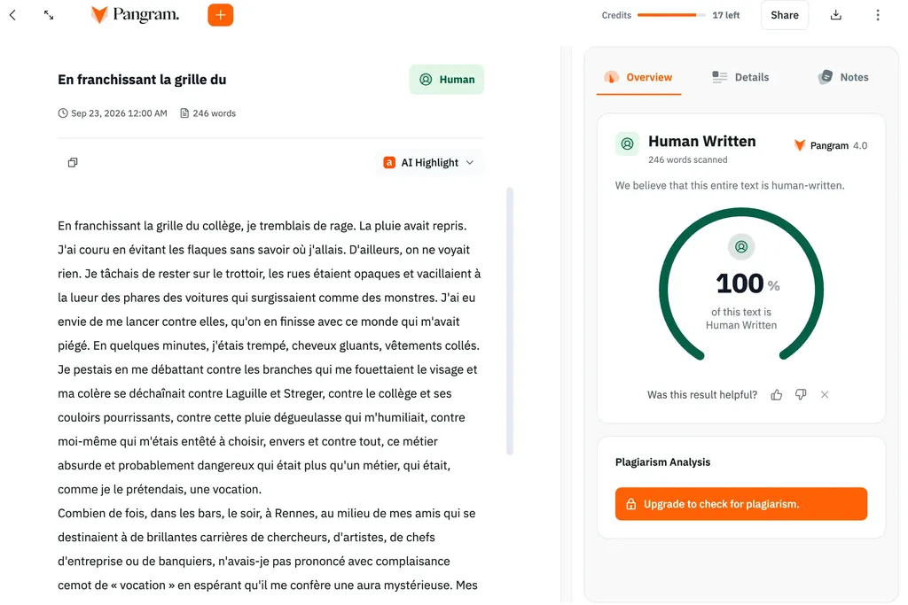

[D’après Pangram](https://arxiv.org/html/2607.27183v1), les taux d’erreurs deviennent presque négligeables : 0,0041 % de faux positifs (texte humain attribué à IA) et 0,3396 % de faux négatifs (texte IA attribué à humain). Il s’agit de résultats déclaratifs, non encore vérifiés par des études extérieures. Donc impossible d’affirmer l’usage des IA par Thélyson Orélien. On peut juste avoir des doutes. J’espère qu’il ne s’enferme pas dans un mensonge insoutenable dans quelques mois quand les technologies de détection auront progressé.

Comment y voir plus clair tout de suite ? Plutôt que de me focaliser sur Thélyson Orélien, j’ai passé au crible la plupart des romans de la [première liste du concours 2026](https://actualitte.com/article/133615/prix-litteraires/16-romans-dans-la-premiere-selection-du-prix-goncourt), dans laquelle j’ai glissé le second jet de *L’expérience humaine*, que je viens de soumettre à des amis éditeurs, notamment Pierre Fourniaud de [La Manufacture de livres](https://www.lamanufacturedelivres.com/).

**Mise en garde** : les statistiques ne permettent pas de dire si un texte a été rédigé par IA, pas plus que de conclure quant à sa qualité littéraire ; en revanche, elles classent les textes par affinités et révèlent des corrélations et des tendances.

J’ai initialement développé [mon outil d’analyse](https://github.com/tcrouzet/unshiter) pour trouver les marqueurs de la prose IA, sans résultat : il suffit d’altérer les prompts pour obtenir des résultats stylistiquement différents. En revanche, l’outil permet de comparer des œuvres et des auteurs.

### Le Goncourt 2026

Tous les textes sélectionnés sur la première liste emploient peu ou pas de subjonctifs, de passés simples, de points d’exclamation. Ils sont économes en adjectifs, adverbes, participes présents. Les noms concrets dominent les noms abstraits. Les comparaisons en « comme » et les points de suspension restent rares ainsi que les marques de langage parlé hors dialogue. La diversité du vocabulaire est comparable. Les émotions fortes et négatives – mépris, dégoût, surprise – sont rares. Impossible de différencier les textes sur ces plans. Il n’existe que des nuances – **ce qui, en creux, est une sorte de cahier des charges minimal pour être goncourable, voire publiable en 2026 en littérature française.**

Les textes se différencient quand on applique aux 35 mesures significatives du corpus [la méthode statistique PCA (analyse en composantes principales)](https://fr.wikipedia.org/wiki/Analyse_en_composantes_principales). Elle met en évidence quatre axes qui expliquent 84 % des variations stylistiques.

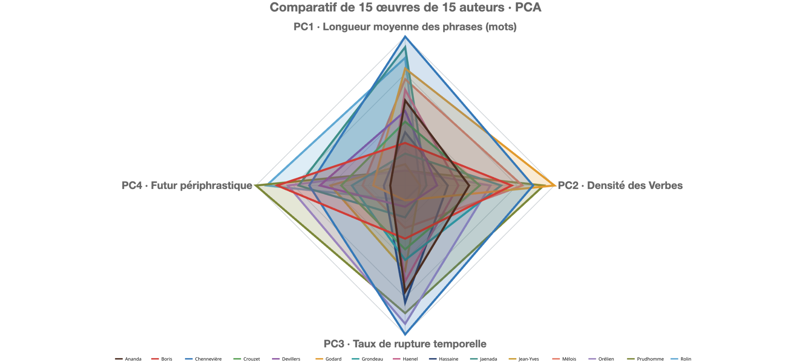

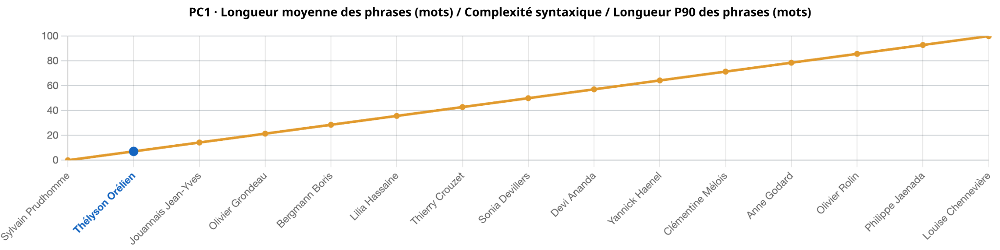

Le premier axe pèse 51 %. Il mesure la longueur et la complexité de la phrase : nombre de mots par phrase, profondeur syntaxique, densité de relatives, connecteurs logiques et temporels. Un seul roman se détache : _Faire la peau_ de Louise Chennevière. Ses phrases sont les plus longues et les plus irrégulières du corpus, chargées de relatives et de connecteurs. À l’opposé, _De l’autre côté du lac_ de Sylvain Prudhomme aligne les phrases les plus courtes et les plus régulières, Thélyson Orélien arrivant juste derrière.

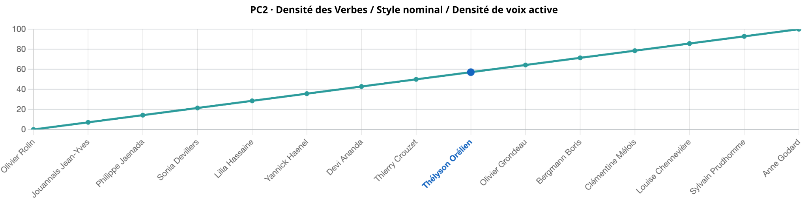

Le deuxième axe pèse 17,5 %. Il oppose le style verbal au style nominal, et la voix active à la voix passive. _Nous aussi_ d’Anne Godard s’y démarque par une voix active et un usage du présent gnomique très marqués. À l’inverse, _L’Inconnue du quai de Javel_ de Philippe Jaenada et _La guerre éternelle_ d’Olivier Rolin penchent vers le style nominal, plus proche du récit documentaire.

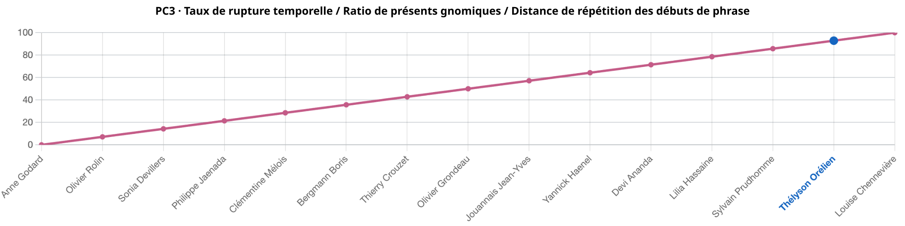

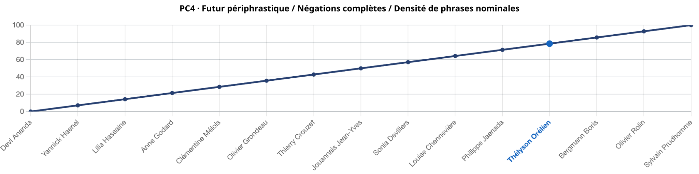

Le troisième axe, plus mineur (9 %), oppose stabilité et rupture temporelle dans le récit. Le quatrième (6,5 %) tient au futur périphrastique et à la négation.

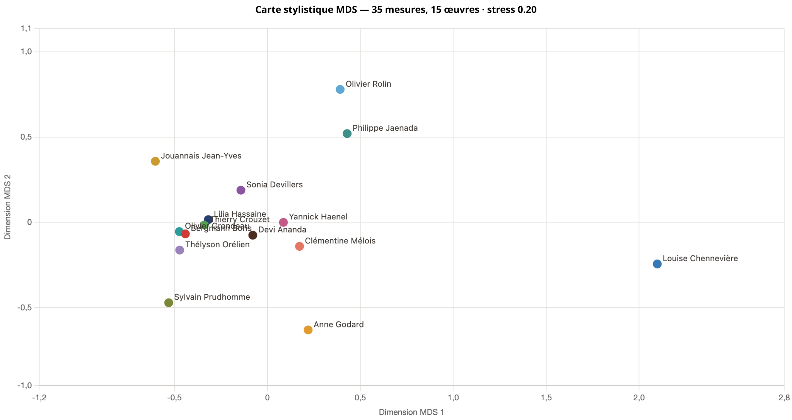

Une fois ces quatre axes posés, le corpus se répartit clairement : un noyau d’une dizaine de romans aux profils proches, et des textes à la prose singulière, comme ceux de Chennevière, Prudhomme, Godard ou Rolin.

### Le cas Thélyson Orélien

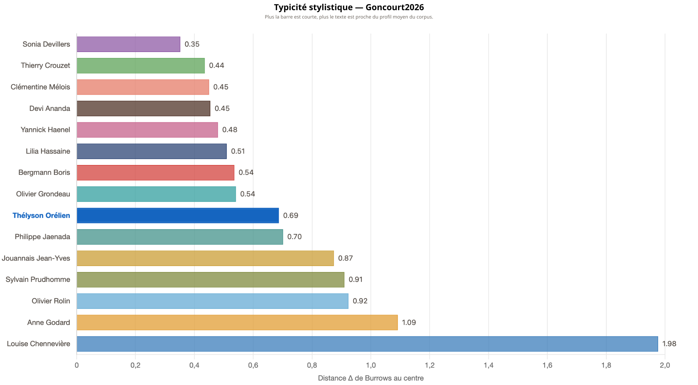

Thélyson Orélien se situe à distance modérée du centre de la cartographie stylistique, où Sonia Devillers apparaît comme la moins excentrique.

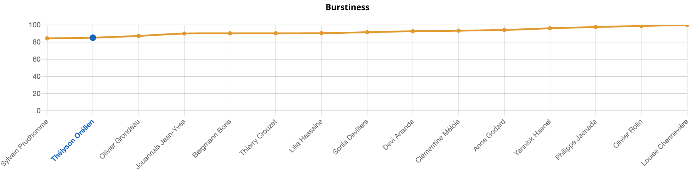

Le texte se caractérise par des phrases courtes et simples, avec une structure répétitive – les séquences de phrases de même longueur sont parmi les plus nombreuses du corpus, juste derrière Sylvain Prudhomme : burstiness faible.

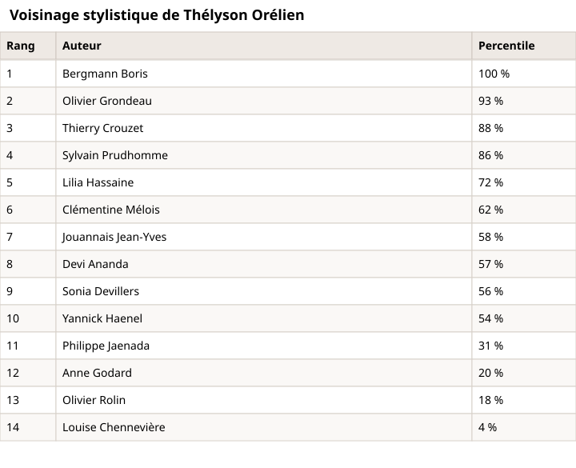

Un argument facile : une IA excelle à produire du texte moyen, sans aspérité. Si c’était le cas, tous les textes stylistiquement proches auraient pu être écrits par une IA. C’est absurde – je n’ai pas demandé à une IA d’écrire sur la mort de ma femme.

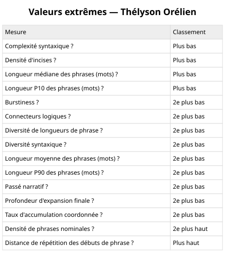

Le style d’Orélien présente d’autres particularités listées ci-dessous. Par exemple, s’il compose des phrases simples, il varie leurs débuts.

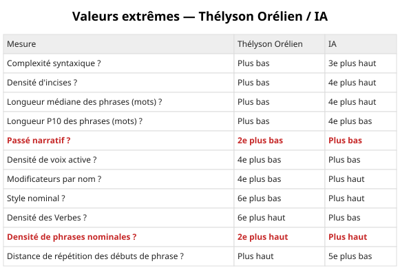

Que conclure ? Thélyson Orélien n’est pas atypique dans le corpus : certaines mesures le placent à une extrémité, d’autres au milieu, d’autres à l’extrémité opposée. Cette dispersion ne décrit ni un style humain ni un style IA – mais à coup sûr, des données que de bons prompts peuvent façonner.

Cette étude a simplement mis en évidence le cahier des charges « littérature contemporaine » implicite : nos différences stylistiques se jouent entre des approches minimalistes à la Sylvain Prudhomme ou maximalistes à la Louise Chennevière.

[Jouez avec les statistiques des livres sélectionnés pour le Goncourt 2026…](https://tcrouzet.github.io/unshiter/?corpus=Goncourt2026)

#edition #ia #textstat #y2026 #2026-9-23-18h00
