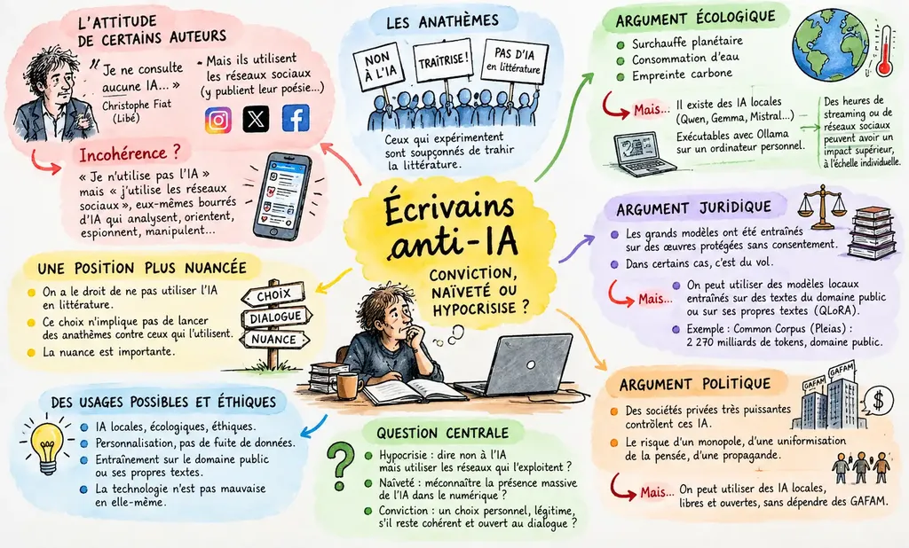

# Écrivains anti-IA : conviction, naïveté ou hypocrisie ?

Je voudrais essayer de comprendre les opposants à l’IA dans le champ de la littérature, ceux qui jurent ne jamais y toucher, et suspectent de traîtrise les expérimentateurs.

[Une chronique du poète Christophe Fiat publiée dans *Libé*](https://www.liberation.fr/idees-et-debats/tribunes/mon-coeur-est-i-phone-en-mode-avion-quand-claude-pompe-mon-cloud-par-le-poete-christophe-fiat-20260929_OBV2XPTUQRGF3JZNWZUUN2PV7Q) m’a interpellé. Fiat déclare : « Je ne consulte aucune IA ni pour avoir des infos qui faciliteraient ma vie quotidienne et encore moins pour m’aider dans ma création littéraire. » Mais quelques lignes plus loin, il reconnaît utiliser les réseaux sociaux, même y publier de la poésie – j’en trouve sur [Instagram](https://www.instagram.com/christophefiat/), ou plutôt Claude les trouve pour moi, d’autant que la série [*Tea Time*](https://www.decitre.fr/livres/tea-time-9782363832702.html) a été publiée en livre en 2020.

Une incohérence me saute aux yeux : « je n’utilise pas l’IA » mais « j’utilise les réseaux sociaux » alors que ces derniers sont bourrés d’IA qui analysent tout, mettent en avant ce qui nous maintient en ligne, nous espionnent, nous volent nos données, nous manipulent tant et plus. On ne peut tout simplement pas affirmer une chose et son contraire. Fiat utilise les IA pour faciliter sa vie littéraire, et peut-être la stimuler, même si c’est par devers lui.

Comme lui, les auteurs et éditeurs adversaires de l’IA qui se promeuvent sur les réseaux sociaux utilisent les IA à très haute dose, peut-être plus que moi qui expérimente avec elles tout en ayant renoncé aux réseaux sociaux centralisés, devenus des terrains de jeux pour les machines plus que les humains.

Il semble difficilement tenable de dire « Interdiction d’utiliser l’IA pour la création », mais « Autorisation de l’utiliser pour le marketing ». C’est pour le moins hypocrite, ou révèle une méconnaissance du haut degré de pénétration des IA dans les infrastructures numériques des réseaux sociaux centralisés et des GAFAM.

On a bien le droit de ne pas utiliser l’IA en littérature, mais ce choix n’implique pas de lancer des anathèmes contre ceux qui l’utilisent. La nuance me paraît importante. Je vais remonter aux arguments des lanceurs d’anathèmes, certains avertis, d’autres, peut-être les plus nombreux, qui, à la façon de Fiat, ne s’opposent à l’IA que quand ça les arrange.

### Balayer l’argument écologique

Les opposants aux IA en littérature avancent souvent la surchauffe planétaire, la consommation d’eau, l’empreinte carbone… Je ne remettrais pas en cause ces inquiétudes fondées, mais c’est oublier qu’il existe deux formes d’IA, celles qui tournent sur les data centers et celles qui tournent en local, comme Qwen, Gemma ou Mistral Small, exécutables par [Ollama](https://ollama.com/) sur les ordinateurs personnels, avec deux avantages : grande possibilité de personnalisation et aucun risque de fuite de données.

Ces modèles ont été entraînés dans des data centers, mais leur usage privé en local – l’inférence, c’est-à-dire la réponse aux prompts – ne consomme presque pas d’énergie, et pas d’eau. En parallèle, l’entraînement décentralisé se développe, pour éviter les points chauds que sont les data centers.

Si les IA de type ChatGPT ou Claude ont un impact écologique notoire, [des heures de streaming ou de réseaux sociaux peuvent avoir, à l’échelle individuelle, un impact supérieur](https://blog.andymasley.com/p/individual-ai-use-is-not-bad-for). On ne peut pas s’interdire toutes les IA pour des usages littéraires au nom des problèmes écologiques, à moins de renoncer quasiment à tout le numérique.

### Balayer l’argument juridique

C’est la même affaire qu’avec l’écologie. Les grands modèles centralisés ont été entraînés sur des œuvres protégées sans le consentement des auteurs : dans les cas où les données ont été acquises illégalement, c’est du vol.

Mais rien n’empêche de spécialiser des modèles locaux sur les textes d’auteurs du domaine public, ainsi que sur ses propres textes, par exemple grâce à la technique [QLoRA](https://arxiv.org/abs/2305.14314), sur un modèle de 8 milliards de paramètres – il suffit de quelques heures de calcul, l’électricité d’un radiateur durant une soirée. Pour l’entraînement, la startup française Pleias a publié [Common Corpus](https://huggingface.co/datasets/PleIAs/common_corpus), 2 270 milliards de tokens issus uniquement du domaine public et de données sous licence ouverte.

Dans le cas de ChatGPT ou Claude, l’argument juridique tient, pas dans l’absolu : il n’est donc pas une raison suffisante pour rejeter l’usage de l’IA en littérature. On peut envisager des IA locales, écologiques, éthiques. La technologie n’est pas mauvaise en elle-même.

### Balayer l’argument politique

On ne peut pas s’opposer aux IA en général parce que des sociétés privées, capitalistes, non éthiques les développeraient. Il existe aussi des modèles ouverts et libres produits par des universités, des organismes à but non lucratif ou de petites startups indépendantes.

Par exemple, [Lucie](https://huggingface.co/OpenLLM-France/Lucie-7B "https://huggingface.co/OpenLLM-France/Lucie-7B") a été entraîné en France sur le supercalculateur Jean Zay, avec des données d’entraînement documentées. [OLMo](https://allenai.org/) est un modèle développé par un organisme à but non lucratif, dont les données d’entraînement, le code et les poids sont publics. Reste que les modèles ouverts sont souvent entraînés avec des GPU Nvidia, du matériel d’origine capitaliste, mais c’est le cas de tous les composants numériques. Refuse l’IA pour cette raison, c’est s’interdire tout le numérique, imitant Thoreau parti vivre dans les bois – sa cabane à 2,5 km de Concord, où il dînait chez les Emerson et où sa mère faisait sa lessive.

### Les autres raisons

Si les lanceurs d’anathèmes invoquent principalement les trois premières raisons et leurs variantes, c’est souvent pour en enterrer d’autres plus profondes.

* **La flemme** Parce qu’elle est difficile à avouer.
* **Le manque de curiosité** Tout aussi suspect pour un auteur ou un éditeur.
* **Le ça n’apporte rien** Une conviction qui masque souvent la flemme ou l’inappétence – une conviction est toujours suspecte quand elle ne découle pas de véritables expérimentations.
* **L’indifférence** Comme si un auteur pouvait rester indifférent à l’une des révolutions de son époque – ça me dépasse, même s’il existe un public d’indifférents.
* **Les hédonistes littéraires** [Ils préféraient ne pas](https://fr.wikipedia.org/wiki/Bartleby), comme si on pouvait vivre sans le réchauffement climatique, sans le racisme, sans la pauvreté, sans la violence. On a beau préférer un monde sans IA, une littérature sans IA, ça ne change rien à ce qui nous arrive. On ne peut pas le nier. Moi, cette technologie m’active tantôt en bien, tantôt en mal. Elle ne me laisse jamais tranquille en tant qu’auteur.
* **La défense de l’humain** Comme si les IA n’étaient pas des créations humaines – quels écrivains sont contre les lunettes ?
* **La peur du remplacement** Et donc de ne plus avoir de boulot, comme si la peur pouvait empêcher une révolution technologique. Mieux vaut en maîtriser les enjeux pour sauver son job.
* **La peur de ne plus être soi** Peut-être cette peur de Fiat quand il voit Claude l’imiter avec conviction et à propos. Ne serait-ce pas signe qu’il est temps de changer de voix ?
* **La peur de la surproduction** Comme si la surproduction littéraire ne nous avait pas paupérisés avant l’arrivée de l’IA. Le « slop » littéraire envahit les rayonnages depuis longtemps.
* **La peur de ne pas être à la hauteur** Ça me fiche la trouille de voir des machines faire aussi bien que moi, mais ça me stimule aussi.
* **La peur de la boîte noire** N’utiliser que les outils maîtrisés, le stylo, la machine à écrire, déjà mettre en doute l’ordinateur.
* **Le désir de ne parler que de ses expériences** J’ai ce désir : [utiliser les IA n’implique pas de leur déléguer la part de notre travail qui est existentielle](https://tcrouzet.com/2026/10/01/ia-cuse/), mais beaucoup d’autres tâches annexes auparavant confiées à des correcteurs, par exemple. Utiliser l’IA ne rompt pas le pacte de confiance avec le lecteur, surtout quand on documente ses usages comme je le fais. Il serait même dangereux de déléguer l’écriture : [une étude du MIT Media Lab](https://www.media.mit.edu/publications/your-brain-on-chatgpt/) a mesuré une « dette cognitive » chez les rédacteurs assistés : 83 % seraient incapables de citer leurs propres textes quelques minutes après les avoir écrits et auraient le sentiment de ne pas en être les auteurs.
* **La peur de l’altérité** Une peur commune dans notre époque où populismes et extrémismes gagnent sans cesse du terrain. Les machines deviennent comme des étrangers.
* **La technophobie** Beaucoup d’écrivains n’ont jamais compris ce qu’était une feuille de styles. Quand je leur parle d’[Obsidian,](https://obsidian.md/) ils ouvrent de grands yeux. L’IA est au-delà de leur force.
* **Les « je suis le seul auteur »** Comme si nous n’écrivions pas après d’autres, comme si nous pouvions nous défaire de leurs influences. Nous les prolongeons, les étendons au mieux, quand le plus souvent nous ne faisons que les répéter. Utiliser l’IA ne nous rend pas moins auteur, mais un autre auteur, nous poussant peut-être où nul autre n’a eu la chance d’aller.
* **Le désir de souffrir** Écrire serait difficile et l’IA, en nous facilitant la vie, nous priverait de notre pénitence. C’est une connerie. L’IA ne rend ni plus ni moins facile, elle ne fait que déplacer le terrain de jeu.
* [**Les offpunk**](https://ploum.net/2026-08-03-offpunk_manifesto.html) Souvent informaticiens de formation, ils militent pour un numérique minimaliste, décentralisé, écologique. Je partage beaucoup de leurs positions, comme le refus des réseaux sociaux centralisés. Mais leur extrémisme les pousse à se détourner des ordinateurs récents, limitant leur capacité à utiliser les IA locales et les empêchant de mettre les doigts dans le cambouis de la révolution IA. Je ne crois pas à la possibilité du survivalisme, même si c’est une niche en librairie. Reste que c’est une position intéressante, la seule s’opposant à l’IA avec une maîtrise technologique, ce qui met l’IA en creux du discours. C’est important comme l’a été Thoreau en son temps.

### Ma propre hypocrisie

Je suis à cheval entre l’offpunk et l’hyperconnexion, utilisant l’IA à haute dose depuis quatre ans, et très souvent les modèles centralisés d’Anthropic et OpenAI. J’attends avec impatience les nouveaux [MacBook Pro M7](https://www.macrumors.com/2026/09/14/oled-macbook-pro-macos-27-1-testing/), optimisés pour les modèles locaux. Je dis que j’apprends à connaître nos nouveaux ennemis pour mieux les combattre, quand en vérité je m’électrise le cerveau avec la révolution IA. D’une certaine façon, je vis l’époque dans toutes ses contradictions et aberrations. Mais que peut faire d’autre un écrivain à part parler de ce qu’il embrasse ou de ce qu’il rejette ?

### Retour à la naïveté de Fiat

Un des amis de Fiat demande à Claude d’écrire un poème à la manière de Fiat, et Claude produit un texte convaincant, qui évoque une récente rupture amoureuse non rendue publique. Fiat en conclut que Claude l’espionne, ce qui m’amuse. Les poids d’un modèle ne contiennent pas les conversations des utilisateurs et il n’y a pas de circulation de données d’un compte à l’autre. Le Claude de l’ami ne sait rien d’autre de Fiat que ce qui est public ou qu’il a lui-même donné à Claude.

Fiat a été victime d’un [biais cognitif](https://fr.wikipedia.org/wiki/Effet_Barnum). Claude aurait pu lui expliquer : « La rupture amoureuse est le thème le plus générique de la poésie lyrique, surtout chez un poète comme Fiat dont l’œuvre tourne depuis toujours autour de figures féminines, de l’amour et de la perte. Demander à un modèle « écris un poème à la manière de Fiat » l’amène statistiquement à piocher dans le registre thématique le plus représenté dans son corpus d’entraînement pour Fiat – et « cœur brisé », « silence du téléphone », « côté vide du lit » sont des images tellement universelles qu’elles « tombent juste » par simple probabilité, pas par connaissance factuelle. C’est le même mécanisme qui fait qu’un horoscope ou une voyante semblent « lire » en vous : on surinterprète une formulation vague comme une révélation précise, parce qu’elle résonne avec notre vécu du moment. »

#edition #ia #y2026 #2026-10-2-14h00
