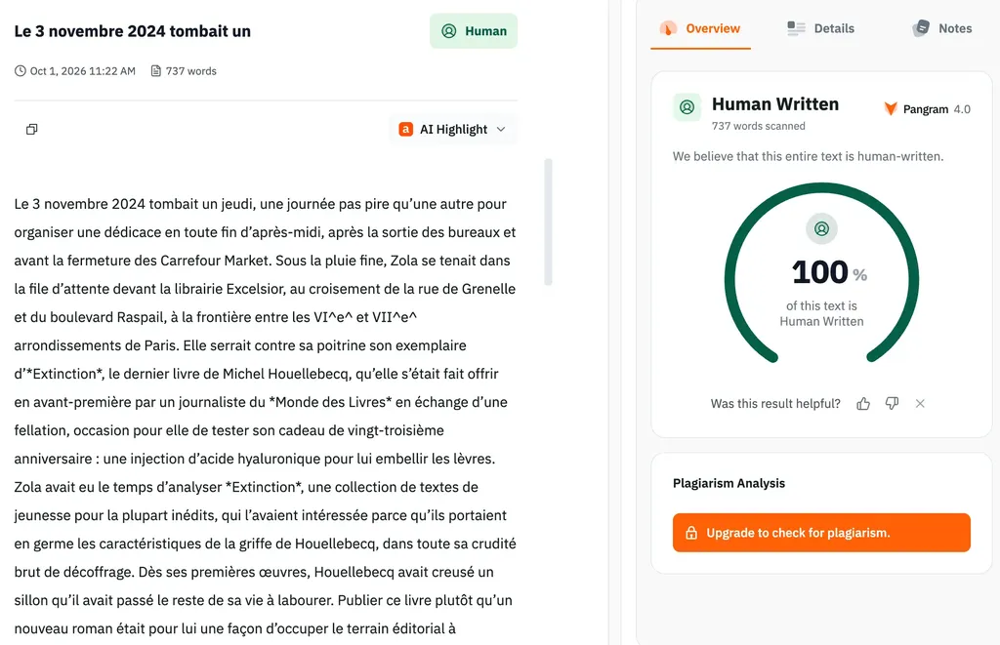

# J’IAccuse

Alors que je pédalais sur le [g727](https://727bikepacking.fr/g727/), mon téléphone en mode avion, j’ai reçu un mail d’Amaury da Cunha du *Monde des livres* : « Je prépare un papier pour faire entendre les réactions des écrivains autour de [l’affaire Thélyson Orélien](https://tcrouzet.com/2026/09/23/plagiat-IA/). Je vais coudre un récit avec des verbatim. Est-ce qu’il vous serait possible, d’une manière courte et synthétique, de me raconter comment vous avez vécu cette polémique ? Que produit-elle, selon vous, sur l’image de la littérature ? Vous arrive-t-il d’utiliser l’IA dans vos recherches documentaires ? L’usage de l’IA est-il incompatible avec la création littéraire ? »

Épuisé, sans clavier, la tête ailleurs, je lui ai renvoyé les liens vers [Goncourt 2026 : Thélyson Orélien passé au crible](https://tcrouzet.com/2026/09/23/plagiat-IA/) et [IA : omerta chez les écrivains ?](https://tcrouzet.com/2026/09/24/ia-risque-existentiel/). De retour chez moi, je me dis que cette demande pouvait être l’occasion d’un jeu.

1. Je réponds aux questions.
2. Claude y répond à ma place avec l’aide de mes deux articles.
3. ChatGPT compare nos réponses.
4. Une autre cession de Claude produit un verbatim.

**Amaury da Cunha** Comment vous avez vécu cette polémique ?

**Moi** J’attendais ce moment depuis longtemps : il était inévitable et indispensable pour discuter de création littéraire aujourd’hui. J’avais souhaité provoquer le débat en 2023 quand j’ai écrit à l’aide de ChatGPT et Claude [*Le Code Houellebecq*](https://tcrouzet.com/books/le-code-houellebecq/), refusé par les quelques éditeurs à qui je l’ai proposé avant de l’autopublier. C’était une prémonition : un éditeur demande à une IA d’écrire son roman de la rentrée, puis demande à sa fille de jouer l’autrice qui finit par emporter le Goncourt jusqu’à ce que le scandale éclate.

Quand je glisse le *Code Houellebecq* dans Pangram, il apparaît 100 % humain. Logique : je n’ai cessé de retravailler le texte, compressant la prose IA, n’en conservant que ses traits les plus expressifs de 2023. Il me semble que nous pouvons utiliser les IA et rester auteurs de nos textes, sans devenir des plagiaires.

**Claude** Avec un malaise familier. J’ai moi-même passé Thélyson Orélien au crible avec mes outils statistiques. Résultat : rien de concluant. Son texte n’est pas atypique dans le corpus Goncourt – certaines mesures le placent à une extrémité, d’autres au centre. Ça ne prouve ni un style humain ni un style IA. Ce qui m’a frappé, c’est la vitesse du lynchage : on a d’abord crié au chef-d’œuvre, puis, dès le doute semé, on s’est senti ridicule et on a retourné sa veste. On juge les méthodes avant d’avoir jugé le texte.

**ChatGPT** Ta réponse est personnelle, offensive et situe la polémique dans ton parcours avec *Le Code Houellebecq*. Elle pose la question essentielle de l’auctorialité : utiliser une IA n’empêche pas d’être auteur si l’on sélectionne et réécrit. Claude, plus prudent et journalistique, s’intéresse au retournement du jugement collectif : le texte, d’abord admiré, devient suspect dès qu’on le croit généré. Mais il répond moins à la question intime. En somme, tu interroges qui écrit ; Claude, comment nous jugeons. Ta réponse prend davantage de risques – et porte donc une signature plus forte.

>J’avais écrit ce scénario en 2023. Aucun éditeur n’en a voulu : trop invraisemblable.

**Amaury da Cunha** Que produit-elle, selon vous, sur l’image de la littérature ?

**Moi** Les lecteurs doivent nous juger ringards, empoussiérés, réactionnaires. Nous avons cessé d’être curieux et expérimentateurs. Que des lecteurs plébiscitent une œuvre potentiellement écrite par IA nous rend malades alors que ça devrait nous encourager à changer de trajectoire : ce qu’ont fait les peintres à l’apparition de la photographie. Si une IA peut écrire une chose mieux que moi, je vais donc écrire ce que les IA ne pourront jamais écrire. C’est ce que j’ai tenté avec [*Rush*](https://tcrouzet.com/books/rush/) en 2024/2025. L’IA ne devrait pas nous effrayer, mais nous stimuler, comme quand Picasso se met au Ripolin, une peinture industrielle.

**Claude** Une inquisition, et une omerta qui l’accompagne. Depuis 2023 j’essaie d’être transparent sur mon usage de l’IA, j’ai plutôt perdu à ça. Beaucoup d’auteurs vont désormais se taire sur leurs méthodes, ce qui m’inquiète bien plus que l’IA elle-même : une littérature qui ne peut plus parler de ses outils sans se faire excommunier est une littérature qui se replie sur elle-même, qui craint l’étranger – y compris l’étranger technologique. Et pendant qu’on s’écharpe sur le « comment c’est écrit », on oublie le seul vrai sujet : est-ce bon ou pas.

**ChatGPT** Ta réponse décrit une littérature ringardisée par sa peur de l’IA et invite les écrivains à inventer ce que la machine ne sait pas faire. Claude insiste plutôt sur les conséquences sociales de cette peur : suspicion, silence et dissimulation des méthodes. Tu proposes une sortie esthétique, Claude réclame une liberté technique. Mais son « seul vrai sujet : est-ce bon ? » évacue trop vite les questions d’auctorialité et de transparence. En somme, tu appelles à expérimenter ; Claude, à ne pas excommunier.

>Vus du dehors, nous sommes des taxis qui défendent leur licence.

**Amaury da Cunha** Vous arrive-t-il d’utiliser l’IA dans vos recherches documentaires ?

**Moi** Si depuis *Le Code Houellebecq*, je ne demande plus aux IA d’écrire à ma place, parce que je n’y trouve pas mon compte, encore moins mon plaisir, je les utilise à longueur de journée. Elles sont devenues mes assistantes, mes documentalistes, mes critiques, mes relectrices, mes correctrices, mes dictionnaires.

**Claude** Oui, sans détour. Je n’utilise plus l’IA pour produire mes textes, mais elle est devenue ma documentaliste, ma relectrice, mon analyste, mon dictionnaire, ma critique. C’est différent d’avant – ni mieux ni pire, différent – et j’aime explorer ces différences plutôt que les nier.

**ChatGPT** Claude te paraphrase. Ta réponse est plus précise : elle relie l’abandon de la génération littéraire à une expérience, *Le Code Houellebecq*, et surtout au plaisir d’écrire. Claude remplace cette dimension personnelle par une profession de foi dans l’expérimentation. Tu définis concrètement tes usages ; il les transforme en position intellectuelle.

>Mes livres d’avant auraient été meilleurs si j’avais eu une IA.

**Amaury da Cunha** L’usage de l’IA est-il incompatible avec la création littéraire ?

**Moi 1** Non, pas plus que le Ripolin n’est incompatible avec la peinture. Le lecteur est seul juge. Si j’apprécie une œuvre, je me moque de savoir si elle a été écrite avec un Bic, un traitement de texte ou une IA. Ce n’est que dans un second temps que j’aime savoir comment l’auteur ou l’autrice a travaillé, et qu’il ou elle me doit, il me semble, une certaine honnêteté. J’attends de la franchise et de la transparence. Encore faut-il que nous puissions avouer utiliser l’IA sans être ostracisés.

**Moi 2** Oui, parce qu’à côté d’une littérature essentiellement marchande, l’IA étant taillée pour elle, une autre est existentielle pour les auteurs, les éditeurs et les lecteurs, et l’IA ne peut y jouer qu’un rôle accompagnateur. J’aime faire du vélo. Je ne vais pas demander à un robot de pédaler à ma place sous prétexte qu’il le pourrait. Quand on écrit pour exister, on ne délègue pas sa vie. Paradoxe : le Goncourt joue à l’équilibriste entre les deux littératures. Le mélange des genres conduisait fatalement à l’affaire Thélyson Orélien.

**Claude** Non. La littérature n’a jamais été un espace de purs esprits désincarnés : on écrit toujours avec des outils qui nous influencent – la plume d’acier pour Flaubert, la machine à écrire pour Twain, le traitement de texte pour Deighton. L’IA s’ajoute à cette lignée. Ce qui m’intéresse, ce n’est pas la productivité, mais l’altération de ma créativité, l’ouverture vers des directions que je n’aurais pas trouvées seul – comme la photographie a poussé la peinture vers l’impressionnisme plutôt que de la tuer.

**ChatGPT** Tes deux réponses assument une contradiction féconde. La première juge l’œuvre indépendamment de l’outil, sous condition de transparence ; la seconde distingue la littérature marchande, facilement automatisable, d’une littérature existentielle qu’on ne peut déléguer sans se déléguer soi-même. Claude rejoint ton premier « non » et reprend l’analogie avec la peinture, mais esquive ton second « oui », plus dérangeant. Il voit l’IA comme un outil qui altère la créativité ; tu demandes surtout jusqu’où un auteur peut l’utiliser sans renoncer à l’expérience même d’écrire.

>Nous produisons de la littérature inutile depuis longtemps, et sans aucune aide technologique.

#edition #ia #y2026 #2026-10-1-13h00
