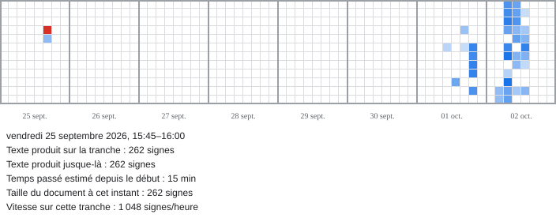
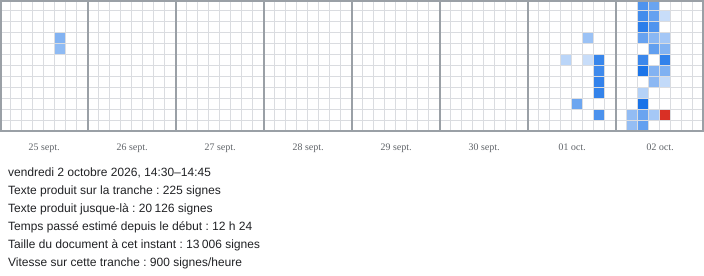
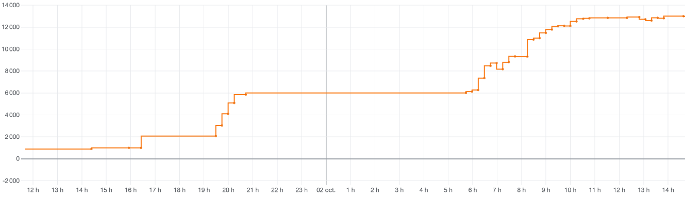
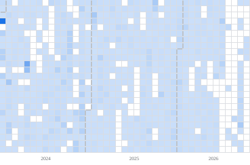
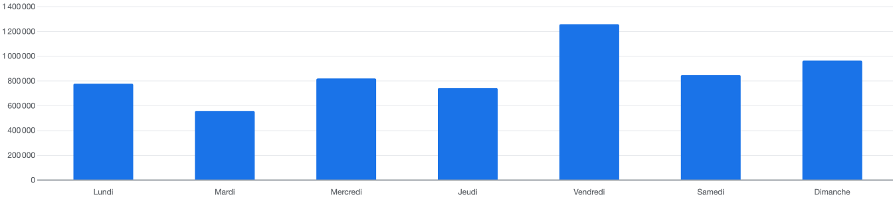

# Pour prouver qu’un texte est humain, montrer comment il s’écrit

[Dans *Le Grand Continent*](https://legrandcontinent.eu/fr/2026/10/02/qui-se-cache-vraiment-derriere-laffaire-thelyson-orelien), Pierre-Thomas Eckert, un des dénonciateurs de [Thélyson Orélien](https://tcrouzet.com/2026/09/23/plagiat-IA/), explique sa crainte de voir les textes universitaires et académiques snobés quand ils seront tous potentiellement « pollués » par l’IA. Il affirme que la « prolifération de contenus générés par IA est délétère pour notre société » et évoque « un soupçon généralisé sur la paternité humaine des textes publiés ».

J’entends ces peurs, mais ne les partage pas toutes. Quand je lis un texte, je me fiche du statut social de son auteur, un prix Nobel ou un blogueur inconnu, un surdiplômé ou un autodidacte. Je juge avec le même œil, espérant ne pas me laisser intoxiquer par les discours des autres.

[La peur de l’IA](https://tcrouzet.com/2026/10/02/hypocrisie-editoriale/), c’est souvent la peur d’être incapable de juger par soi-même. Voilà la grande trouille de ceux qui ont bouffé du Thélyson Orélien, alors que son texte était initialement bon pour eux. Ils ont peur que leur position soit remise en cause, peur pour leur job, peur de ne plus avoir de valeur ajoutée, peur, comme Pierre-Thomas Eckert, que nous devenions débiles à force d’utiliser les IA pour écrire à notre place, que plus personne n’ait confiance dans les contenus académiques – avec Trump c’est en route sans que l’IA en soit responsable –, que la prolifération de l’IA slop noie les travaux de qualité – ça aussi, c’est en route depuis longtemps avec le « publish or perish ».

Il serait important de légitimer la création, de la certifier humaine. Je ne suis pas sûr que ce soit une bonne idée. Si demain une IA découvre un traitement contre le cancer, faudra-t-il le jeter à la poubelle ? Ça n’a aucun sens. La légitimation devrait se jouer sur du solide, non sur le statut de l’auteur. Devrais-je me taire parce que je n’ai pas un doctorat ? Le livre de Thélyson Orélien est-il bon ou pas ? Qu’il l’ait écrit avec Claude ou ChatGPT n’y change rien, du moment que Thélyson Orélien l’assume, sans rompre le contrat de confiance avec le lecteur – là, ça coince quand l’auteur a du mal à défendre son œuvre. 

Mais si l’opinion, souvent ignorante, ne diabolisait pas les utilisateurs de l’IA, il serait plus simple pour eux d’établir ce contrat de confiance. Il est temps d’arrêter de diaboliser. J’ai une petite idée pour détendre le débat. Que demande Pierre-Thomas Eckert dans le fond, sinon une preuve de travail, une preuve d’investissement de l’auteur, une preuve d’engagement ? Il ne condamne pas l’IA en soi, il dit l’utiliser, mais s’inquiète, comme nous tous, de l’IA slop. Comme les détecteurs de prose artificielle, tel que [Pangram](https://www.pangram.com/) ou [Lucide](https://lucide.ai/) restent des boîtes noires, des IA pour nous juger, nous pourrions adopter une autre méthode.

### WritingLog

Depuis fin 2023, j’ai connecté mon [Obsidian](https://obsidian.md/), mon éditeur de texte, à un dépôt GitHub privé où j’enregistre automatiquement mon travail toutes les quinze minutes. Si nous prenions tous cette habitude, il deviendrait possible, en cas de suspicion, de communiquer notre historique Git, soit nos brouillons numériques, à des spécialistes de la génétique des textes. Ils pourraient disséquer notre processus créatif, mesurer le temps passé à écrire et à réviser. Avec [WritingLog](https://github.com/tcrouzet/WritingLog), j’ai bricolé un code d’analyse.

Quand je lui soumets [mon précédent article](https://tcrouzet.com/2026/10/02/hypocrisie-editoriale/), [il en révèle l’histoire, chaque carreau représentant un quart d’heure.](https://tcrouzet.github.io/WritingLog/?file=tcrouzet%2F2026%2F10%2Fhypocrisie-editoriale.md) J’ai commencé à jeter les premières idées le 25 septembre, avant cinq jours de voyage à vélo, puis j’ai repris à mon retour et terminé le 2.

On découvre que j’ai passé plus de douze heures sur l’article, produisant 20 000 signes pour n’en conserver au final 13 000. À chaque étape, il est possible de mesurer ma vitesse d’écriture. Si je collais des pages générées par IA, ça sauterait aux yeux.

Quand j’analyse la progression de la taille du texte, je découvre deux zones de travail assez intense : le 1er octobre en début de soirée, puis le 2 entre 6 h et 9 h. Après, ma productivité faiblit : j’ai terminé le premier jet et le soumets à la critique des IA. Je consolide un à un mes arguments, les source, les détaille, les explique mieux. Ce processus se prolonge jusqu’à 13 h, après quoi je n’effectue plus que des corrections ortho-typo.

On dit souvent que les IA augmentent la productivité. Pour moi, c’est le contraire. Elles ralentissent mon écriture, exigent plus de recherches, plus de travail. L’analyse de mon archive matérialise ce changement dans ma pratique.

<iframe width="560" height="315" src="https://www.youtube.com/embed/5Pqhep6ByZw?si=eC0eSQl8HFvRejg1" title="YouTube video player" frameborder="0" allow="accelerometer; autoplay; clipboard-write; encrypted-media; gyroscope; picture-in-picture; web-share" referrerpolicy="strict-origin-when-cross-origin" allowfullscreen></iframe>
Cette vidéo montre le texte se construire. Elle me paraît une belle preuve d’humanité, alors que j’ai abondamment utilisé les IA pour me documenter et me challenger. On me voit écrire, modifier, couper. Le texte ne vient pas d’un jet. Il se densifie peu à peu, selon un processus propre à l’écriture numérique, que Proust n’a fait qu’esquisser avec ses paperolles.

J’ai initialement créé mon app pour analyser a posteriori l’écriture de [*L’expérience humaine*](https://tcrouzet.github.io/experience-humaine/), avant de prendre conscience qu’elle pouvait m’aider à me justifier devant l’inquisition. C’est en soi flippant d’en arriver là.

Est-ce une bonne idée que tous les auteurs m’imitent et se loguent sur GitHub ou un autre service Git ? Déjà, c’est une excellente façon de sauvegarder son travail en temps réel, puis d’archiver les brouillons numériques. Ensuite, ces informations peuvent toujours servir si quelqu’un nous cherche des noises, tout en sachant qu’il est toujours possible de falsifier un dépôt Git, bien que certaines opérations comme le rebase laissent des traces difficiles à effacer entièrement.

Pour ma part, je ne vois pas ça comme un flicage, mais une tentative de documentation de ma vie créative. Nous avions les manuscrits des auteurs, nous avons désormais leur historique Git. Les IA sont compétentes pour les analyser, y déceler des anomalies, et surtout, ce qui m’intéresse davantage, y découvrir des particularités propres à chacun. Il devient possible d’entrer dans la granularité de l’écriture avec une pénétration inédite. Plus on rapproche les sauvegardes, plus on entre dans l’intimité de l’auteur.

WritingLog expose ma graphomanie quand je lui demande d’analyser la totalité de mon archive Git – les trous correspondent à mes voyages à vélo ou à des bugs dans l’archivage. Pas de jour de répit.

#edition #ia #y2026 #2026-10-4-13h00
