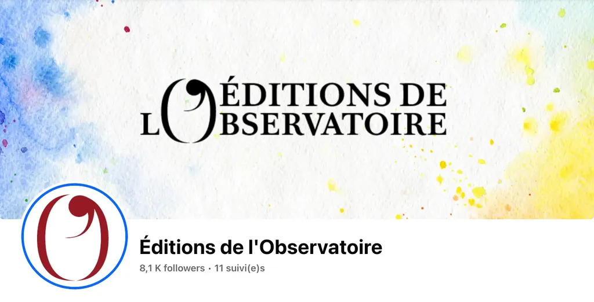

# La littérature bio est-elle une imposture ?

Je voudrais passer à l’après [Thélyson Orélien](https://tcrouzet.com/2026/09/23/plagiat-IA/), mais les déclarations stupéfiantes s’empilent, et atteignent malgré mes efforts pour me tenir à distance du débat sur les réseaux sociaux.

J’apprends avec retard que les éditions de l’Observatoire, à qui des amis auteurs m’ont conseillé de soumettre le manuscrit de [*L’expérience humaine*](https://tcrouzet.github.io/experience-humaine/), ont lancé un [label « Livre sanctuaire - 100% humain »](https://www.bfmtv.com/culture/livres-bd/les-editions-de-l-observatoire-lancent-un-label-100-humain-sans-ia_AD-202609250630.html). En exergue, on pourra lire :

>Vous entrez ici dans un livre sanctuaire, fruit d’une intelligence humaine. Ainsi, fidèle à la conception de la littérature qui nous anime, l’auteur s’est engagé auprès de son éditrice, de ses lecteurs et lectrices, à ne pas utiliser d’IA générative dans la rumination, la composition et l’écriture de son ouvrage.

Emma Saudin, directrice littéraire de la fiction à l’Observatoire : « Ils \[les auteurs] signent un accord contraignant dans lequel l’auteur s’engage à ne pas avoir recours à l’IA dans la conception du livre. » C’est une façon de contractualiser une activité privée, impossible à contrôler. Le « sanctuaire » prend une dimension religieuse : on exige une profession de pureté intérieure. C’est nauséabond. Ce pacte auteur-éditeur, qui vise à renforcer le pacte auteur-lecteur, est une stratégie aberrante, voire rétrograde, pour au moins deux grandes raisons.

### L’Observatoire utilise l’IA

Dans une [vidéo de 2025](https://www.youtube.com/watch?v=nFa_gMIQpU0), Muriel Beyer, fondatrice des Éditions de l’Observatoire, explique que l’IA est « un formidable assistant », intéressante contradiction qui floute la limite entre aurorisé et interdit, mais ce n’est pas la plus surprenante. Une rapide recherche, effectuée par Claude me révèle que les éditions de l’Observatoire possèdent au moins cinq comptes sociaux.

* [Facebook](https://facebook.com/EditionsObservatoire) propriété de Méta.
* [Instagram](https://www.instagram.com/editionsdelobservatoire/) propriété de Méta.
* [Twitter/X](https://x.com/EdLObservatoire) propriété d’Elon Musk proptétaire de Grok.
* [LinkedIn](https://www.linkedin.com/company/editions-de-l-observatoire?original_referer=) propriété de Microsoft.
* [YouTube](https://www.youtube.com/@editionsobservatoire8281) propriété de Google, dont les infrastructures intègrent l’IA à tous les étages.

Détenues par de grands acteurs de l’IA, ces plateformes intègrent massivement de l’IA : recommandation de contenus, modération automatique, analyse comportementale, espionnage, supervision, prédiction, manipulation psychologique… En publiant sur ces services, en plus de légitimer [leurs pratiques technofascistes](https://tcrouzet.com/books/livre-contre-attaque/), l’Observatoire utilise pour son marketing des infrastructures IA parmi les plus puissantes et les plus coûteuses en ressources planétaires.

Claude a repéré d’autres usages de l’IA par l’Observatoire.

* [Le formulaire d’abonnement à leur newsletter](https://albinmichel.ac-page.com/editions-de-lobservatoire) utilise Google reCAPTCHA, reposant sur des systèmes de machine learning, donc des IA, pour distinguer humains et bots.
* La newsletter est gérée par ActiveCampaign (lien albinmichel.ac-page.com), [un service truffé d’IA et d’outil de scoring prédictif](https://www.activecampaign.com/platform/artificial-intelligence). Sur leur page d’accueil, on peut lire : « AI-powered marketing software to accelerate growth. Artificial intelligence helps you drive better campaign performance, analyze behavior for more informed decision-making, and create frictionless customer experiences. »
* Enfin, l’Observatoire propose aux auteurs [le dépôt de manuscrits sur Librinova](https://manuscrits.librinova.com/editionsobservatoire), une plateforme intégrant des fonctions IA d’analyse automatisée des textes, notamment pour les certifier humains. Ce qui contredit potentiellement la déclaration d’Emma Saudin : « de ne pas alimenter la machine ».

Des usages indirects, certes, mais des usages tout de même. C’est un peu comme si un distributeur agroalimentaire exigeait le 100 % bio pour les producteurs et pulvérisait sur les produits des pesticides, antifongicides et divers autres conservateurs potentiellement cancérigènes.

L’Observatoire exige que ses auteurs reviennent à l’âge de la pierre quand lui-même s’autorise les technologies de pointe pour son activité marchande. Ça me fait frémir. Nous autres auteurs sommes les moins rémunérés de la chaîne du livre, comme les producteurs dans toutes les chaînes de distribution, mais en plus nous ne devrions travailler qu’avec nos mains. Bientôt, on nous interdira l’ordinateur, on nous interdira [Antidote](https://www.antidote.info/fr/), qui dispose de fonction IA pour nous assister dans la correction, on nous interdira de nous intéresser à notre époque et de la vivre, et donc on nous rendra incapables d’en parler. Je suis sûr que les plus grands perdants de cette dérive seront les lecteurs, à qui l’on proposera des mièvreries déconnectées de leurs préoccupations.

À mon avis presque tous les auteurs de l’Observatoire sont aussi fautifs dans leurs usages de l’IA que l’Observatoire lui-même. Je ne connais qu’un auteur que l’Observatoire pourrait signer, c’est [Ploum](https://ploum.net/), un des seuls à refuser l’IA avec une maniaquerie qui n’a d’égale que ses compétences techniques – et ça tombe bien, il a un manuscrit à vendre. 

### Seule compte l’expérience

L’Observatoire se défendra en disant que c’est différent d’utiliser l’IA pour le commerce – les fongicides – que pour écrire. Je confirme : nos usages d’auteur n’ont aucun rapport, les nôtres ne visent à manipuler personne, mais à travailler avec les outils de notre temps quand nous les jugeons utiles, et cela dans le but, non d’accroître notre productivité, mais d’aller au nœud de notre époque, là où ça coince, comme en ce moment avec notre affaire.

La grande majorité des lecteurs se moquent de comment nous travaillons du moment que nous leur délivrons des textes sincères, assumés, peaufinés avec passion, qui leur parlent d’eux. Si un auteur maladroit stylistiquement déborde d’imagination, pourquoi ne demanderait-il pas à une IA de mettre en forme sa pensée ? C’est un peu comme si on avait demandé à Jimi Hendrix de ne pas jouer de la guitare électrique, mais seulement de la guitare classique. Nous y aurions beaucoup perdu.

L’analogie avec la musique pourrait être développée loin. Des créateurs se sont imposés au-devant de la scène qui ne savaient pas lire la musique. De nouveaux instruments leur ont donné accès à la création. Moi-même, sans traitement de texte, sans la possibilité d’éditer en profondeur mes textes et de les corriger, je n’aurais jamais osé écrire. La technologie n’est pas toujours bénéfique – les fongicides –, mais nous autres artistes avons le droit de la détourner pour enrichir nos pratiques.

Si l’expérience de l’auteur traverse ses textes, les lecteurs le sentent. J’en suis persuadé. J’ai demandé à Claude d’analyser la politique numérique de l’Observatoire sans amoindrir mon analyse, au contraire, je l’ai assise sur des faits tangibles – OK, c’est de la documentation mais pas de l’écriture. La seule preuve d’humanité est l’expérience. Une affabulation superficielle écrite sans IA est à coup sûr moins frappante que le texte d’un dyslexique qui pilote une IA.

Je suis heureux que les lecteurs continuent d’acheter le bouquin Thélyson Orélien. Dans cette affaire, ils auront toujours le dernier mot. L’IA donne accès à la littérature à des auteurs qui en étaient tenus à distance, faute d’avoir fait le conservatoire. Pas facile : [nous allons devoir apprendre à juger les œuvres plutôt que nous fier à des pedigrees en quatrième de couverture](https://tcrouzet.com/2026/10/04/je-suis%20humain/).

*PS : Mon article n’étant pas 100 % bio puisque j’ai demandé l’aide des machines pour mes recherches, il n’a sans doute aucun intérêt pour les éditeurs de l’Observatoire. Par chance Pangram et Lucide me certifient humain et [WritingLog](https://tcrouzet.github.io/WritingLog/?file=tcrouzet%2F2026%2F10%2Flitterature-bio.md) montre que cette écriture m’a demandé un peu de sueur.* 

#edition #ia #y2026 #2026-10-7-14h00
