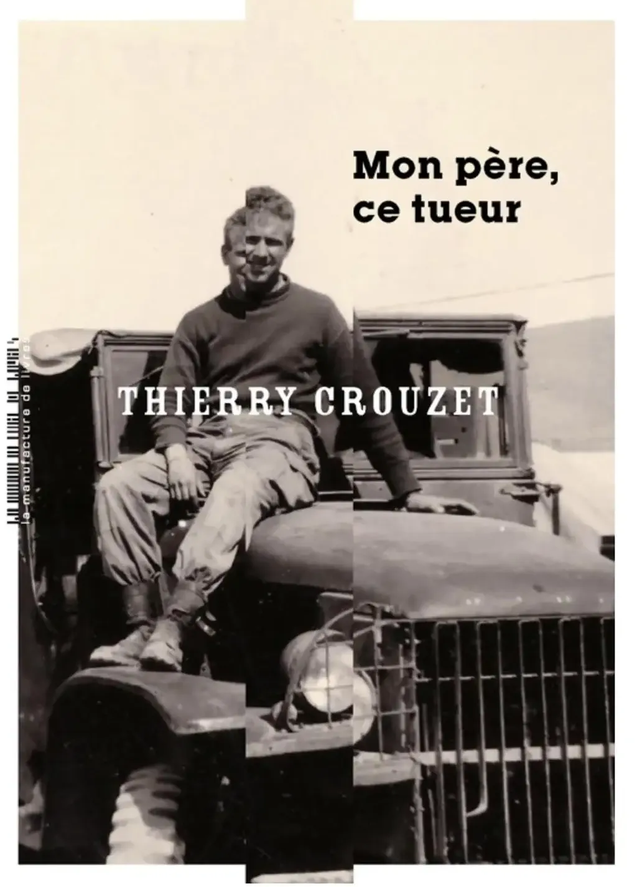
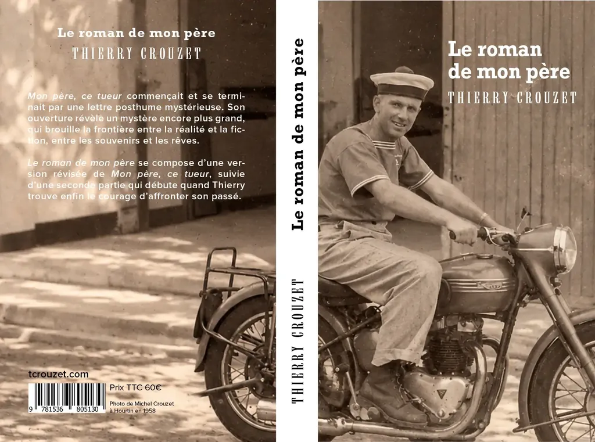
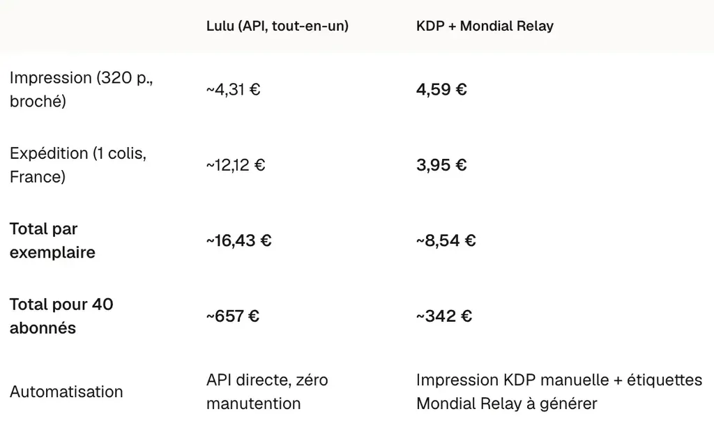
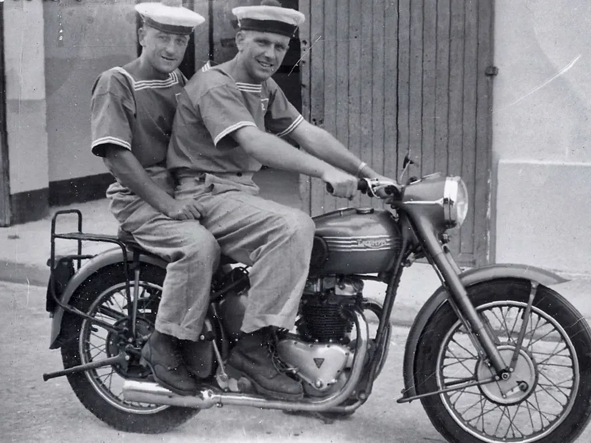
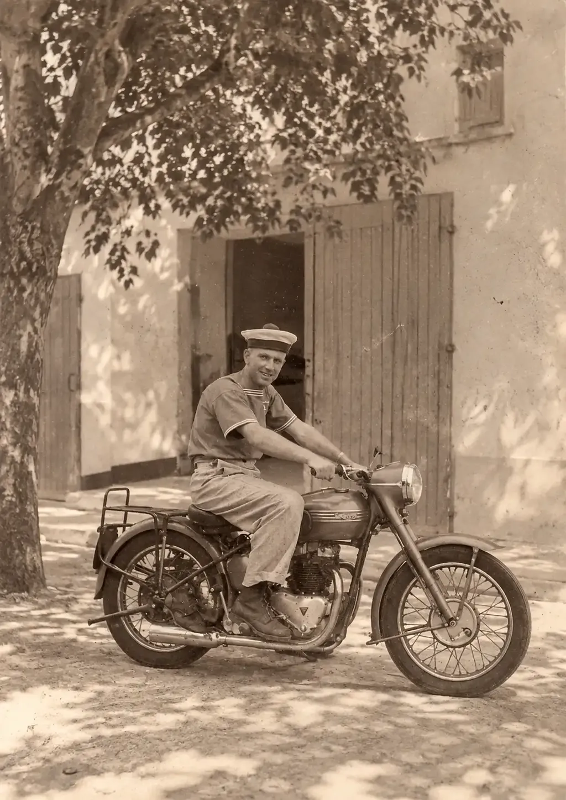
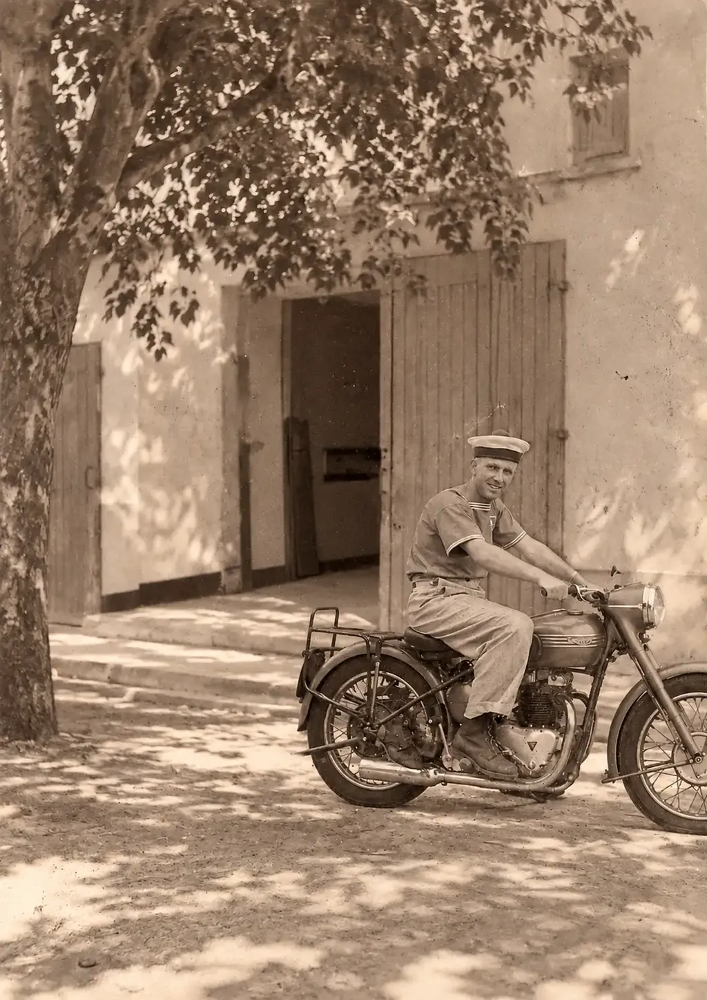

# La lettre posthume enfin révélée : un volume double pour mes abonnés

J’ai écrit [*Mon père, ce tueur*](https://tcrouzet.com/books/mon-pere-ce-tueur/) en 2017. Ce roman en grande partie autobiographique commençait par une lettre posthume, une lettre dont les mots ne pouvaient qu’être terribles et que j’étais incapable de lire, tant que je n’avais pas mieux compris la vie de mon père, notamment l’origine de sa violence, une lettre que je n’ai ouverte qu’après la publication du roman par [La Manufacture de livres](https://www.lamanufacturedelivres.com/livre/mon-pere-ce-tueur), en septembre 2019.

Depuis, mes lecteurs me demandent ce qu’il y avait dans cette lettre. Je restais évasif, de plus en plus persuadé que je devais écrire la suite de l’histoire, ce que j’ai fait en 2022. Comme *Mon père, ce tueur* ne s’était vendu qu’à mille exemplaires – déjà mieux que la médiane des ventes de roman en France –, Pierre, après de longs atermoiements, n’a pas souhaité publier la suite, ne sachant comment la défendre auprès des libraires.

[En novembre 2025](https://tcrouzet.com/2025/11/27/abonnements-payants/), je vous ai proposé de vous abonner un an à ma newsletter Substack en échange d’un inédit pour Noël 2026 : la suite de *Mon père, ce tueur*. Avec l’accord de Pierre et de La Manuf, je vous offrirai même un volume double, avec une version révisée de *Mon père, ce tueur*, suivie du *Roman de mon père*. Les révisions du roman original sont minimes, quelques retouches stylistiques et modifications à la fin pour que les deux textes s’enchaînent naturellement.

Vous avez jusqu’à fin octobre pour [vous abonner pour un an](https://tcrouzet.substack.com/subscribe) et recevoir ce volume inédit. Si vous avez souscrit un abonnement mensuel après novembre 2025, je vous enverrai le texte après douze mois.

### Quatrième de couverture

*Mon père, ce tueur* commençait et se terminait par une lettre posthume mystérieuse. Son ouverture révèle un mystère encore plus grand, qui brouille la frontière entre la réalité et la fiction, entre les souvenirs et les rêves.

*Le roman de mon père* se compose d’une version révisée de *Mon père, ce tueur*, suivie d’une seconde partie qui débute quand Thierry trouve enfin le courage d’affronter son passé.

320 pages, dont 175 pour la seconde partie

Papier : 80g

Format : 140x216

### Et la fabrication

[Je comptais imprimer via Lulu](https://tcrouzet.com/2026/08/10/modele-economique/), avant de renoncer, les coûts étant prohibitifs. J’utiliserai donc KDP comme pour mes autres textes autopubliés. Je me ferai envoyer une cinquantaine d’exemplaires à la maison et vous les enverrai via Mondial Relay – j’imprimerai automatiquement les étiquettes avec leur API. Ça me donnera plus de souplesse et j’aurai des exemplaires en stock.

La couverture est une esquisse. J’essaye de la faire ressembler à celle de La Manuf, sans qu’elle soit identique. Je suis parti d’une photo de mon père à Hourtin en 1958.

J’ai demandé à ChatGPT de couper le passage et d’élargir le champ, tout en utilisant un ton sépia. Drôle d’effet de voir l’image familière sous un nouveau jour.

Pour la quatrième de couverture, j’ai généré une seconde image où on la moto semble avancer. Encore plus étrange, d’autant que cette extension de la réalité passée renvoie au sujet même du *Roman de mon père*, où je creuse son don pour l’affabulation, qui peut-être *in fine* m’a poussé vers la littérature.

Le rendu est imparfait quand on scrute les détails, un peu comme la fiction, mais tout de même assez extraordinaire, et presque bouleversant pour moi. Une fois l’opération terminée et les exemplaires envoyés, j’écrirai un billet pour faire le point financier et partager les outils développés pour me faciliter la vie. Pour le moment, je replonge dans les textes et les retravaille.

#buzz #y2026 #2026-10-9-18h00
