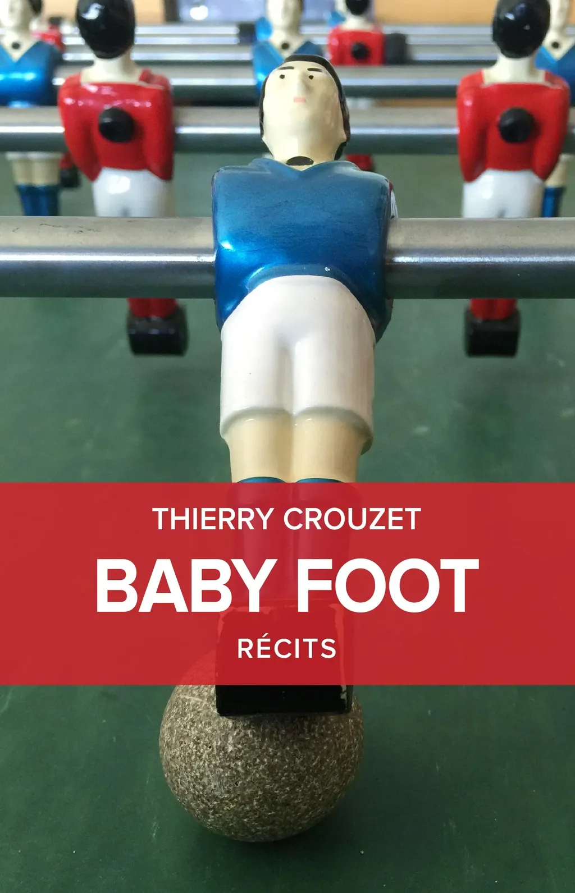
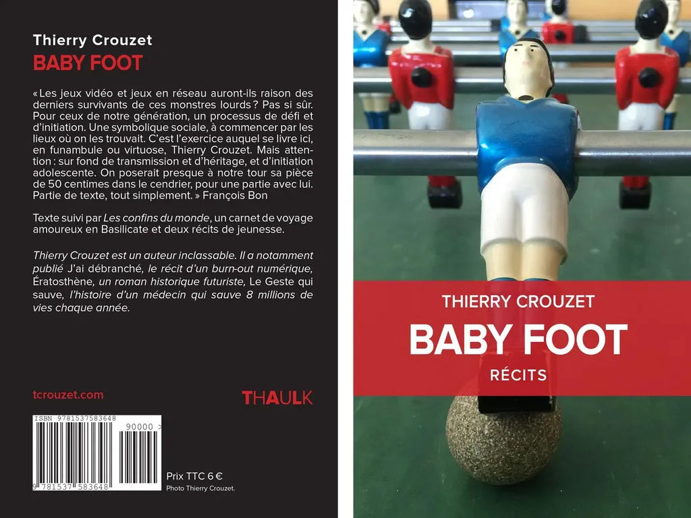

# Baby-foot

« Les jeux vidéo et jeux en réseau auront-ils raison des derniers survivants de ces monstres lourds ? Pas si sûr. Pour ceux de notre génération, un processus de défi et d\'initiation. Une symbolique sociale, à commencer par les lieux où on les trouvait. C\'est l\'exercice auquel se livre ici, en funambule ou virtuose, Thierry Crouzet. Mais attention : sur fond de transmission et d\'héritage, et d\'initiation adolescente. On poserait presque à notre tour sa pièce de 50 centimes dans le cendrier, pour une partie avec lui. Partie de texte, tout simplement. » François Bon

Suivi de trois autres récits :

* Les cofins du monde, 2014 (voir Colobraro et jouir)

* Chronique d'un licenciement, 1995

* Les Vans, 1994

### Les confins du monde

Un carnet de voyage à la découverte de la province de Matera : par un regard étranger, obstinément curieux des paysages oubliés, voulant se mesurer aux voyageurs qui l’ont précédé. Un itinéraire non conventionnel qui nous force à jeter un œil nouveau sur ce que nous pensons le mieux connaître.

**Une illumination** En décembre 2013, quand je suis rentré de ma semaine en Basilicate, les yeux pleins de lumière, j’ai dit à Isa et aux enfants : « Il faut que je vous amène là-bas en vacances. C’est un immense jardin entre montagne et mer. C’est une autre Italie, pure, limpide, sauvage… avec des villages et des villes sublimes, perchées au-dessus de vallées bleutées. La quintessence d’un Midi préservé comme par miracle. » J’étais sous le charme d’une espèce de « printemps indien », d’une explosion de couleurs à contre-saison et donc extraordinaire. Je n’ai désormais qu’une envie, revenir, goûter à toutes les nuances de la Basilicate, explorer les montagnes, marcher sur les sentiers dont je n’ai fait qu’apercevoir les traces au loin tout en croquant la chair sucrée des mandarines. Et je m’imagine sur les hauteurs de Colobraro, avec d’un côté la chaîne du Polino, de l’autre la mer aveuglante, léchée par les plages où un jour Pythagore aborda. J’ai presque mauvaise conscience. Je devrais me taire. Que tout cela reste un secret entre nous.

#book #y2012 #2012-2-28-9h52
