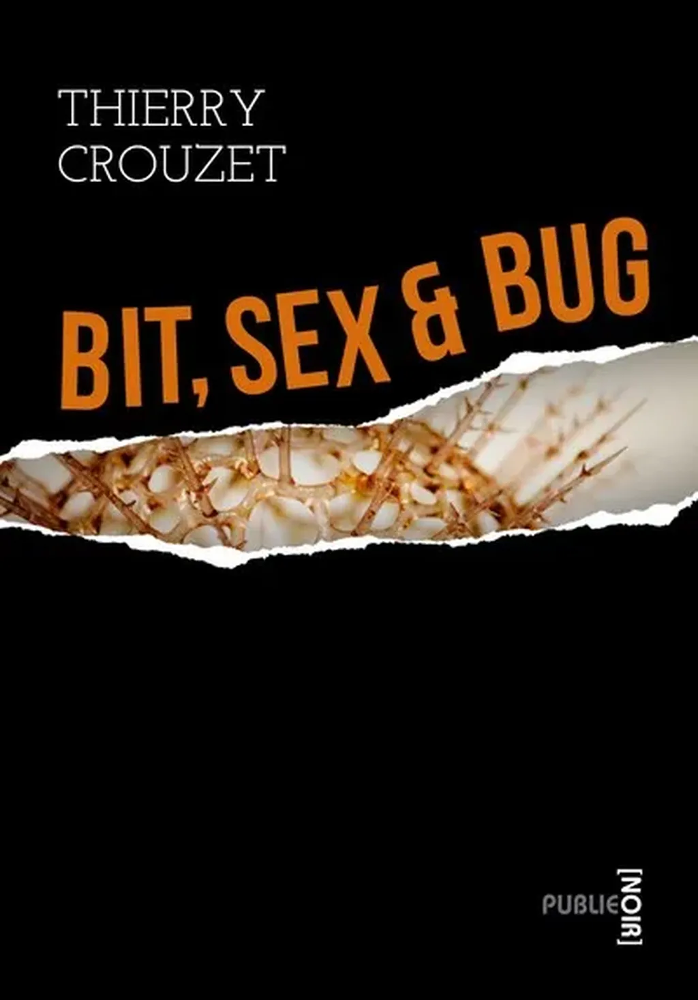

# Bit, Sex and Bug

« *Bit, Sex and Bug*, c’est une histoire à tourner la page avant même qu'elle finisse, c’est des aventures, des personnages – et surtout un projet. » François Bon

Avez-vous déjà eu peur du Sida ? Avez-vous songé que le virus HIV pouvait vous assassiner ? Pour Michel, il est trop tard. Julien entend le venger. Il poursuivra le tueur jusqu’au bout du monde.

#book #y2004 #2004-3-1-19h18
