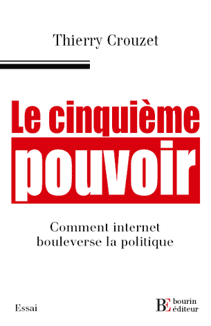

# Le cinquième pouvoir

Thierry Crouzet analyse l’émergence d’internet comme cinquième pouvoir.

Les Français auraient déserté la politique.

La démocratie serait en crise.

Les intellectuels n’auraient plus d’impact.

Le cinquième pouvoir va à l’encontre de ces idées reçues : grâce à Internet, il devient possible de faire de la politique autrement. Après la révolte citoyenne lors du référendum européen de 2005, nos personnalités politiques l’ont compris. Sans son site Désirs d’avenir, Ségolène Royal n’aurait jamais emporté les primaires socialistes en novembre 2006. Internet a déjà joué un rôle clé dans la campagne pour la présidentielle 2007. Et ce n’est qu’un début. Après les pouvoirs exécutif, législatif, judiciaire et médiatique, les citoyens fédérés grâce aux technologies de communication récentes forment un nouveau pouvoir : le cinquième pouvoir. Alors que les pessimistes se plaignent que rien ne change, ce sont les fondements de notre société eux-mêmes qui sont réinventés, à commencer par les règles qui régissent nos démocraties.

Pour la première fois, des hommes politiques ont accepté de donner leur avis sur le sujet. Le premier essai sur un phénomène nouveau et important.

#book #y2006 #2006-12-21-15h38
