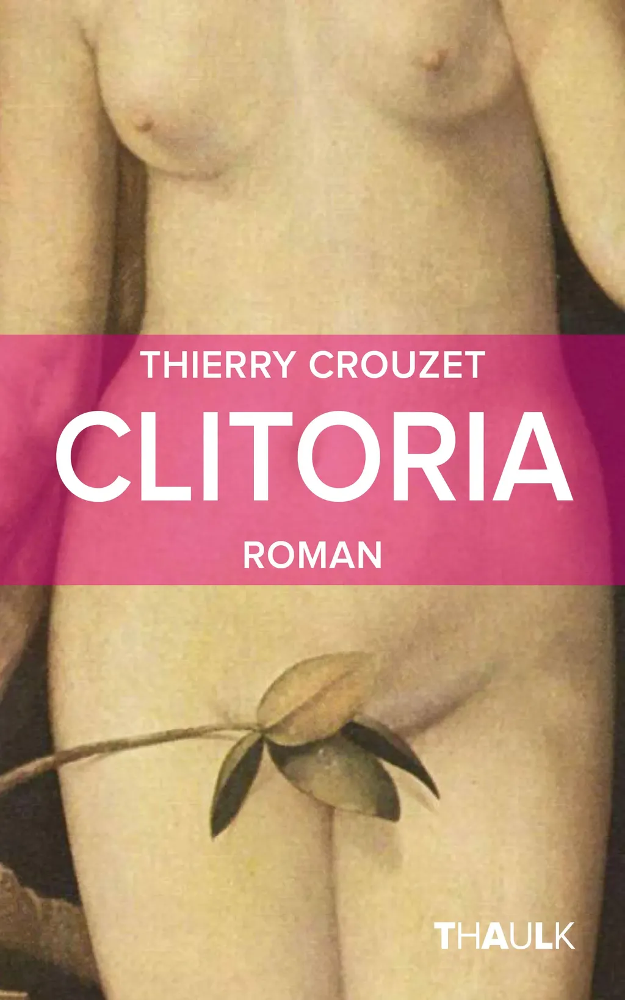
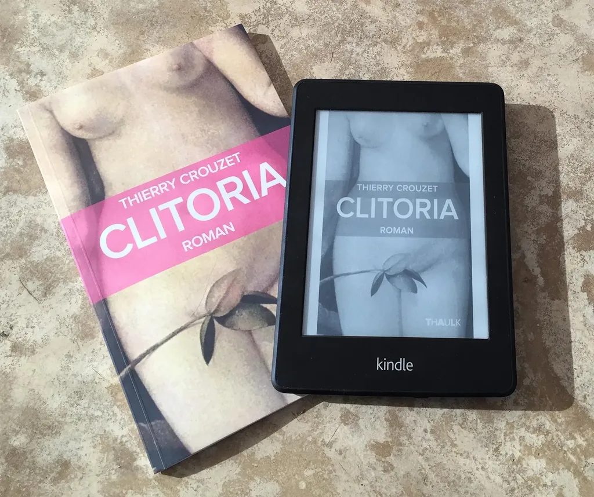
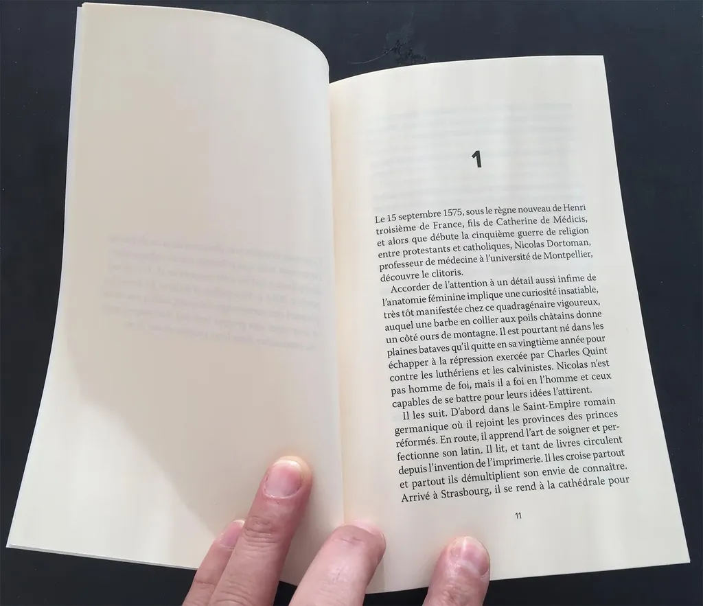
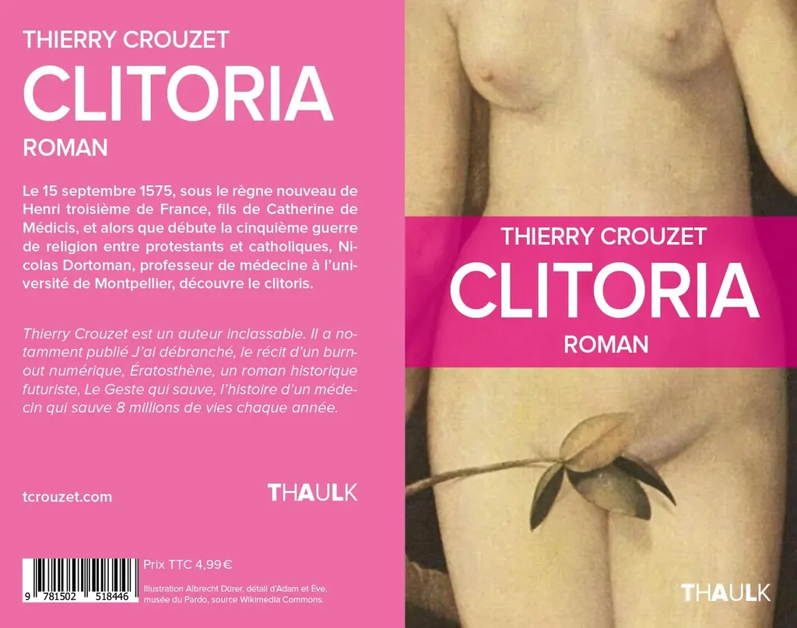

# Clitoria

Le 15 septembre 1575, sous le règne nouveau de Henri troisième de France, fils de Catherine de Médicis, et alors que débute la cinquième guerre de religion entre protestants et catholiques, Nicolas Dortoman, professeur de médecine à l’université de Montpellier, découvre le clitoris.

Une parodie des thermes de Balaruc transposées au XVIe.

#book #y2014 #2014-10-24-11h27
