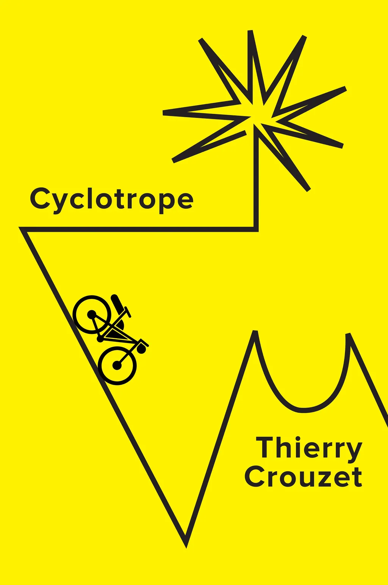

# Cyclotrope

Un tropisme est une force irrésistible et inconsciente qui incite à agir d’une certaine façon, à se mettre en mouvement dans un sens plutôt qu’un autre. Dans ce roman, Martin répond à un cyclotropisme : son vélo le pousse en avant comme une plante qui se dirigerait vers la lumière sous l’effet d’un phototropisme ou une bactérie vers une source de chaleur sous l’effet d’un thermotropisme. Il accepte cette impulsion mystérieuse et, un beau matin, devient un cyclotrope. Il passe à vélo devant son bureau et ne s’arrête pas.

#book #y2022 #2022-11-28-15h7
