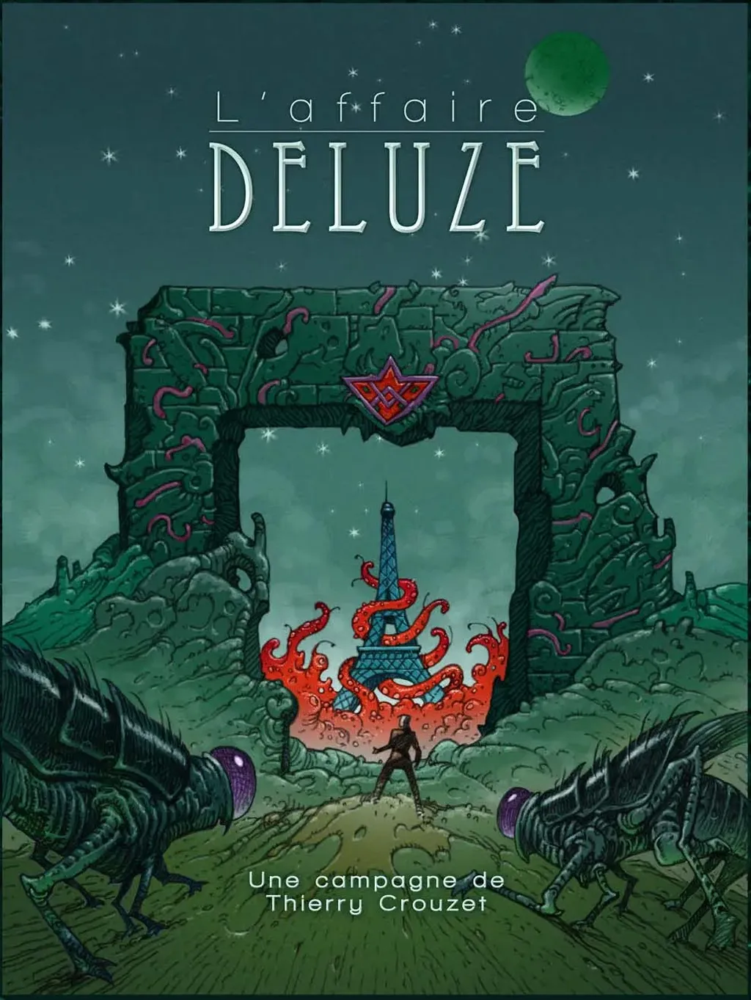
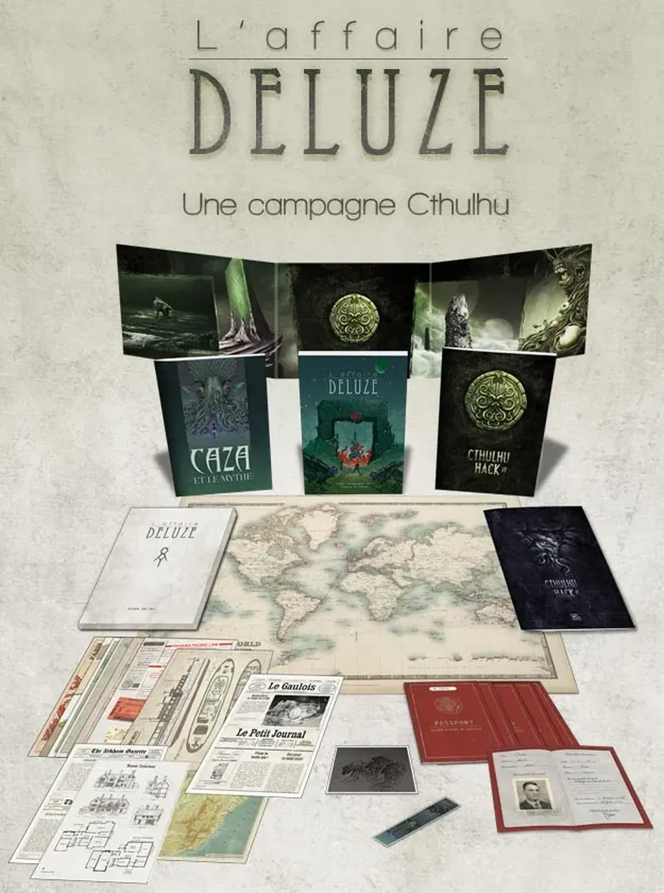
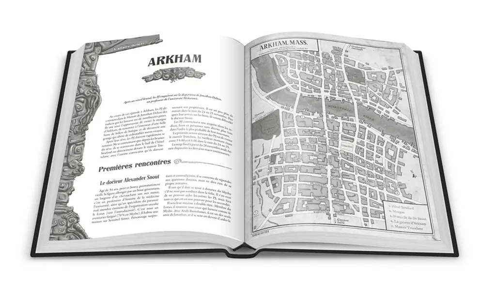
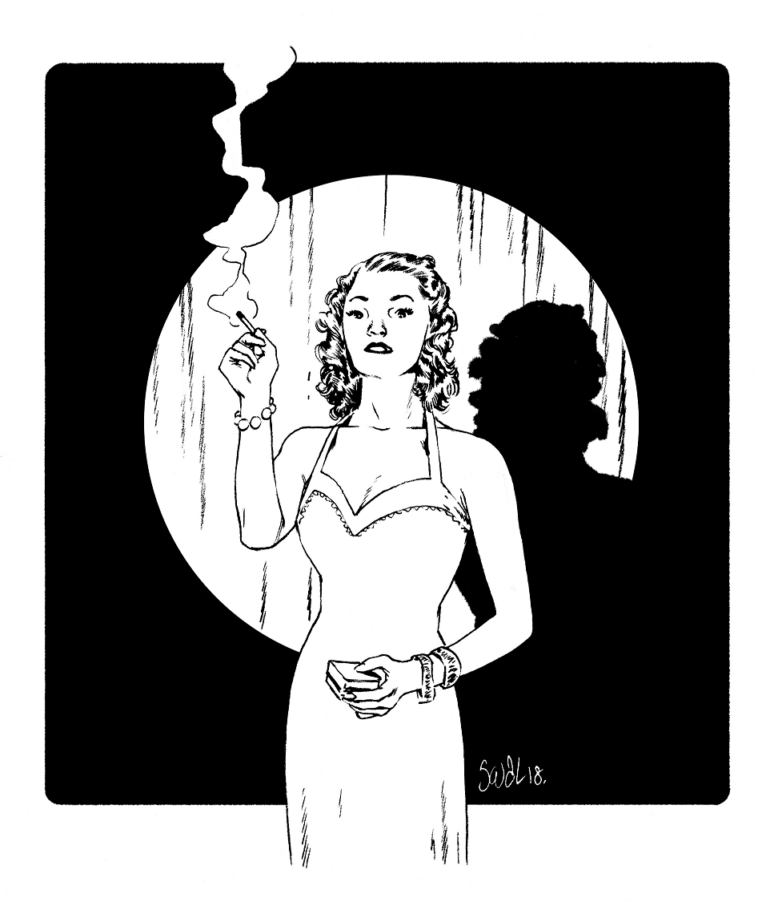
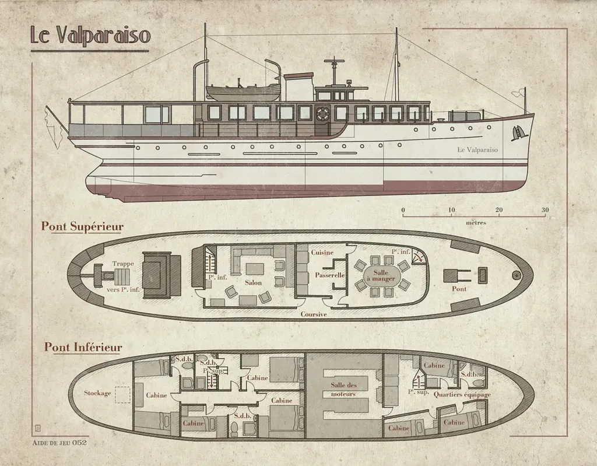
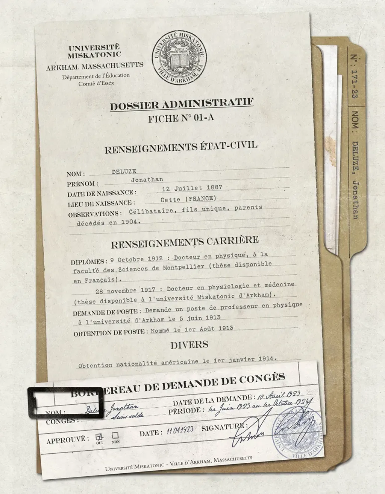

# L’Affaire Deluze

Il y a des journées scandaleuses dont la presse se gargarise. Le 24 novembre 1924, par exemple. Ce jour là, au Mexique, Charlie Chaplin épouse en seconde noce Lillita McMurray, âgée de seize ans, qu’il a mise enceinte. Comme vos contemporains, vous auriez pu retenir cette histoire mondaine si un autre évènement n’avait pas bouleversé votre vie en ce même jour : l’enlèvement dans des conditions inexplicables du professeur Jonathan Deluze.

Vous n’aviez jamais entendu parler de lui, pourtant vous avez éprouvé le désir irrépressible de le secourir, persuadé que l’avenir du monde était en jeu. Bien des années ont passé et vous vous demandez encore pourquoi. Pourquoi avoir risqué votre vie, votre santé mentale et toutes vos possessions pour partir à la rechercher d’un inconnu ? Pourquoi avez-vous fait plusieurs fois le tour du monde et même au-delà ? Pourquoi avez-vous été immédiatement persuadé que des forces ténébreuses étaient à l’œuvre ? Pourquoi vous êtes-vous laissé entraîner dans ces folies ? Parfois vous tentez de vous persuader que vous avez rêvé, malheureusement les élancements provoqués par une vieille blessure vous démontrent le contraire.

Et vous avez peur. Tout pourrait recommencer.

### Table ronde sur L’affaire Deluze

### L’Affaire Deluze enfin publiée !

*Entretien publié dans le numéro 41 de [Jeux de rôle Magazine](https://www.facebook.com/JDR.magazine)*.

En 1986, *L’Affaire Deluze* a sans doute été la première campagne de JdR proposée par un Français. À l’époque, Thierry Crouzet n’était pas encore journaliste ou écrivain. Il avait envie d’écrire. Et tout a commencé par une partie de jeu de rôle à Montpellier.

**Quel a été ton premier contact avec le JdR ?**

Thierry Crouzet : À 12 ans, en 1975, j’étais fan de SF, de technologie, de science, et c’est tout naturellement que je me suis mis à lire *Science & Vie*, dont je ne manquais jamais la rubrique jeux de réflexion. En janvier 1980, lorsque *Science & Vie* a donné naissance au magazine *Jeux & Stratégie*, je me suis immédiatement abonné. Je me souviens encore du numéro 4 avec un dragon en couverture. J’ai alors acheté la boîte de base de *Donjons & Dragons*, mais, comme dans mon village personne ne partageais ma passion, j’ai patienté un peu avant de commencer à jouer.

À cette époque, j’apprenais à programmer, et je me contentais des premiers jeux d’aventures sur ordi. Comme protogeeks, je lisais tous les bouquins de SF et de fantasy qui me tombaient entre les mains. Sans le savoir, j’étais en train de me créer un parfait background de joueur.

Une fois étudiant à Montpellier, j’ai pris l’habitude de fréquenter Le Cerf Blanc, une minuscule boutique de jeux. C’est là, un jeudi après-midi d’octobre 1983, que j’ai appris que le soir même Les Forces du Chaos organisaient leur première soirée d’initiation à *Donjons & Dragons*.

J’y étais. J’ai créé mon premier personnage, un guerrier que j’ai appelé Nos et que j’ai dû faire monter jusqu’au niveau quinze durant les années suivantes. Le maître du jeu était Bruno Faidutti, qui plus tard est devenu un prolixe créateur de jeux de plateaux. Le scénario était parfait pour des débutants : libérer une princesse. Tout s’était bien passé, nous avions récupérer un petit trésor et même sauvé la vie d’un prisonnier, immédiatement pris en main par un des fondateurs des Forces du Chaos, un certain Rocky, qui durant la nuit nous a dépouillés.

J’étais initié.

J’ai tout de suite eu envie d’écrire des scénarios.

Trois semaines plus tard, je masterisais mon premier Donjon.

**Qu’est-ce qu’a représenté pour toi l’Appel de Cthulhu à cette époque ?**

Thierry : En 1984, quand le jeu sort en français, j’ai déjà lu la plupart des textes de Lovecraft, notamment *L’Affaire Charles Dexter Ward*, titre qui m’inspirera celui de *L’Affaire Deluze*. J’achète la boîte de base, mais je suis toujours un peu fainéant quand il s’agit de lire les règles. J’attends donc que Jean-Hugues Villacampa se lance.

Deux mots sur Jean-Hugues. Un des membres fondateurs des Forces du Chaos, c’était notre MJ le plus extraordinaire. Il vivait pour le jeu, il ne faisait que jouer et depuis il n’a jamais cessé, devenant bientôt une figure de notre panthéon rollesque franchouillard.

Dans ses Donjons, Jean-Hugues s’était déjà approprié le bestiaire de Lovecraft et c’était à lui de nous faire découvrir *L’Appel de Cthulhu*. Tout a commencé en juin, en même temps que l’Euro 1984. Nous regardions les matches avant de commencer nos parties. Il faisait une chaleur suffocante. Les fenêtres du studio de Jean-Hugues s’ouvraient sur la nuit et Jean-Hugues utilisait les bruits extérieurs pour créer la tension entre nous. Quand un chat miaulait, nous ne savions plus si c’était dans le jeu ou dans la réalité, jeu et réalité avaient fusionné. Nous frissonnions malgré la canicule.

Ces soirées ont sans doute changé ma vie. Parce que Jean-Hugues était et reste un MJ extraordinaire, faisant du jeu de rôle un art, aussi parce que pour la première fois un jeu se saisissait de l’univers d’un écrivain et nous faisait entrer dans son œuvre, nous invitant à nous l’approprier et à l’étendre, nous invitant donc à devenir écrivains à notre tour. Moi, qui jusque là me voyais comme un futur ingénieur gagnant plein de tunes et voyageant partout dans le monde, j’ai soudain décidé que je serai écrivain.

**Comment est née l’Affaire Deluze ? Cela a représenté combien de temps de travail ?**

Thierry : En 1984, j’ai acheté toutes les campagnes américaines de *L’Appel de Cthulhu*, notamment *Les Masques de Nyarlathotep*, découvrant à cette occasion qu’il était possible de plonger mes joueurs dans une même aventure durant des dizaines de soirées.

Mais je n’ai pas été impressionné. Dans toutes ces histoires, le décorum était plus important que l’investigation et que l’action. D’autre part, leurs auteurs s’étaient contentés d’enchaîner des scénarios relativement indépendants les uns des autres, comme nous le faisions depuis longtemps à *Donjons & Dragons* en situant nos aventures dans un même monde et en faisant intervenir des NPJ récurrents.

Je me suis alors mis à rêver d’une structure narrative plus complexe, où tout ce qui surviendrait lors de la première heure de jeu ne pourrait pas être démêlé avant la dernière, c’est-à-dire trente ou quarante parties plus tard, donc presque un an plus tard à raison d’une partie par semaine.

Dès le début, *L’Affaire Deluze* ne devait pas être une campagne, mais un seul et unique gigantesque scénario. Je l’ai pensé comme un livre. J’ai commencé à l’écrire et à le jouer début 1985, et je l’ai bouclé fin 1987, épuisant cinq ou six équipes d’investigateurs. En gros, je n’ai pas fait grand-chose d’autre durant ces trois années, sinon obtenir un diplôme d’ingénieur, pondre quelques esquisses de jeu vidéo et pour ne pas perdre la main quelques Donjons.

**Cette campagne assume le recours à l’action dans son écriture. C’est ta volonté depuis le départ ? Ce sont les parties de l’époque qui ont orienté l’écriture ?**

Thierry : J’ai toujours aimé multiplier les évènements, les indices, les documents. Au cours d’une partie, dès que je pressentais un temps mort, j’inventais quelque chose de nouveau, parfois sans avoir la moindre idée de comment je le relierai à l’histoire générale. Ma stratégie de MJ : électriser les cerveaux de mes joueurs. Il me fallait sans cesse ouvrir de nouvelles pistes, quitte à faire exploser la complexité de l’histoire.

Ainsi *L’Affaire Deluze* a été au moins autant improvisée qu’écrite. Chaque fois que je l’ai jouée, je l’ai enrichie. Parfois j’avais plusieurs équipes engagées en même temps tout en n’étant pas au même stade de l’histoire. Ce n’était pas toujours simple à gérer. D’ailleurs, quand j’ai relu pour la première fois la campagne en 2015, je n’y comprenais plus rien. C’était comme si quelqu’un d’autre l’avait écrite, un autre très différent de moi, dont j’avais du mal à saisir la logique. Je me suis même dit que cet autre était bien plus intelligent que moi et qu’il possédait un cerveau plutôt étrange. J’ai été obligé de dessiner des cartes euristiques pour m’y retrouver.

**Plusieurs éditeurs ont eu l’opportunité de l’éditer, mais ce sera finalement chez les XII Singes plus de 30 ans après son écriture. Qu’as-tu pensé de cette collaboration ?**

Thierry : Sans les XII Singes, *L’Affaire Deluze* serait restée une chose imbitable pour tous ceux qui ne pensaient pas exactement comme celui qui l’avait écrite. Sans rien trahir du projet initial, nous avons remis de l’ordre et surtout comblé un nombre incalculable de sous-entendus. Sebastien Célerin n’arrêtait pas de me demander de décrire, d’expliquer, de compléter, de raconter d’avantage.

Parfois, je me suis énervé, lui disant que les joueurs d’aujourd’hui ne savaient plus jouer s’ils avaient besoin d’autant d’infos. On s’est fritté, puis j’ai écouté, j’ai réécrit encore et encore. Au final, je suis époustouflé par le résultat. La nouvelle campagne, si elle raconte la même histoire que la première, est devenue jouable par un autre que moi, et ce qui ne gâche rien, elle est devenue un véritable livre objet, un livre qui pourra être collectionné en plus d’être joué. Maxime Place a effectué un travail phénoménal sur les aides de jeu.

**Trouves-tu que le JdR a beaucoup changé ?**

Thierry : Dans les années 1980, on jouait avec des bouts de ficelle. Par exemple, je n’ai jamais fait de plan du Manoir Deluze. Je n’estimais même pas que ce soit nécessaire. Le décorum était à improviser. En découvrant que désormais les MJ donnent les plans aux joueurs, j’ai été surpris, puis peu à peu j’ai compris que cette technique augmentait le réalisme, offrait des possibilités narratives et facilitait l’immersion (impossible aussi à ne pas penser aux jeux vidéo). De toute évidence, on est passé à une autre époque du jeu de rôle. Je ne suis pas sûr de la comprendre, il faudrait que je joue davantage, avec des joueurs actifs. Je me contente de faire jouer mes fils de 10 et 12 ans à la 5 de D&D. En tout cas, une chose n’a pas changé, les scénarios officiels de D&D sont toujours médiocres.

**Caza s’était pour ainsi dire retiré. Il a repris les crayons pour cette ultime édition de l’Affaire Deluze. Cela représentait quelque chose pour toi ?**

Thierry : Je ne crois pas que Caza se retirera un jour. C’est une bête de travail. Qu’il accepte d’illustrer la couverture de la campagne, c’était un merveilleux cadeau. J’ai passé mon adolescence à lire des bouquins illustrés par lui. C’était un peu comme voir un rêve d’enfant se réaliser. Son dessin nous fait replonger dans l’ambiance graphique des années où j’ai écrit et joué la campagne. Ce rappel me paraît important. Aujourd’hui personne n’écrirait une telle histoire, surtout pas moi (je serais moins manichéen, plus politiquement révolté).

**Maxime Plasse a réalisé plus de 120 aides de jeu. Comment s’est déroulée votre collaboration ?**

Thierry : Au début, je me suis dit encore une corvée. Je vais devoir expliquer ce qui n’a pas besoin de l’être, et puis j’ai vu revenir les premières images et j’ai eu envie de faire rejouer la campagne. Je me voyais en MJ anticipant le plaisir de mes joueurs. Très vite, c’est moi qui ai donné du travail à Maxime, lui demandant d’ajouter des plans, des illustrations, des articles de presse. Maxime a transformé *L’Affaire Deluze*, il en a fait une œuvre graphique. J’imagine que, même sans la jouer, on peut prendre plaisir à la lire.

**Depuis le premier jet de *L’Affaire Deluze*, tu as eu l’occasion de publier dans bien d’autres domaines ?**

Thierry : J’ai longtemps gagné ma vie en publiant des livres d’informatique pendant que les éditeurs littéraires ne voulaient pas de mes autres textes. Ce n’est qu’en 2006 que j’ai réussi à publier un livre pour moi important, *Le peuple des connecteurs*, et j’y parle du jeu de rôle, montrant en quoi son histoire et concomitante de celle de la micro-informatique. La boucle était bouclée en quelque sorte. Depuis, j’ai publié des romans et des essais, ainsi qu’une montagne de posts sur mon blog. Pour moi, bloguer et jouer, c’est un peu la même chose. Qu’on soit blogueur ou MJ, on est en prise directe avec son auditoire. On fait de l’art interactif. Finalement, je n’ai jamais cessé de jouer.

### Ils en parlent

* [Revenue de chez les Profonds](http://lefix.di6dent.fr/archives/5234)

* [Le retour d'une enquête culte pour L’appel de Cthulhu](http://www.scifi-universe.com/actualites/16550/l-affaire-deluze-le-retour-d-une-enquete-culte-pour-l-appel-de-cthulhu)

* [Retrouvez le financement participatif qui s'est déroulé du 28/5/2018 au 16/6/2018, récoltant près de 44 000 €](https://www.gameontabletop.com/crowdfunding-118.html)
* [Tentacules (au sujet de la VO)](https://www.tentacules.net/index.php?id=1165)

#book #y2018 #2018-5-27-8h1
