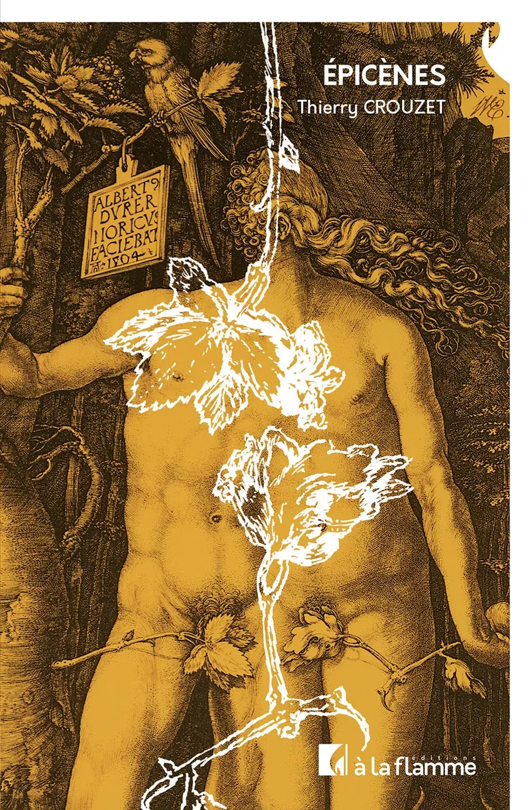

# Épicènes

Ils se retrouvaient un instant puis se fondaient l’un en l’autre, incapables de se dire qui était qui, que pensait l’un ou l’autre, où l’un s’arrêtait, où l’autre commençait. Ils contemplaient un être sans cesse changeant qui leur ressemblait à tous deux sans être ni l’un ni l’autre, ni fille ni garçon, ni femelle ni mâle, ni brun ni blond, ni en jupette ni en short. Ils se sentaient libres parce que plus rien ne les limitait ni ne les définissait. Le monde n’avait pas été construit pour eux, et ils pouvaient y vivre à leur guise. Ils étaient quatre, ils étaient deux, ils étaient un. Ils auraient pu être trois, peut-être cinq. Ils le sentaient, et leurs paroles se confondaient.

[Mes articles](/tag/epicenes/)

[Babelio](https://www.babelio.com/livres/Crouzet-picenes/1834081)

[Le contre hasard](https://lecontrehasard.com/?p=2053) : « Plus qu’une question de genre, c’est celle de la différence qui nous est ici narrée à travers ce roman singulier. Grâce à la fiction, Thierry Crouzet aborde des sujets contemporains éthiques et sociologiques, rendus métaphoriques afin de laisser les lecteurs s’approprier le livre et y voir leur propre réalité. L’auteur s’amuse à croiser les genres qu’ils soient d’identité ou littéraires et nous invite à questionner notre rapport à l’autre. »

Librairie [Le jardin secret](https://www.placedeslibraires.fr/magasins/cluny/Le-Jardin-Secret-6298/), à Cluny : « J'ai eu un vrai coup de cœur pour Epicènes, que j'ai lu d'une traite sans le lâcher. Un ouvrage qui aborde le sujet de la différence avec sensibilité, très jolie parabole autour de la question du genre. A mettre en avant en ce mois des fiertés, avec la monté en flèche inquiétante des réactionnaires et autres anti-woke assumés. Un livre pertinent et qui invite à la réflexion ! une réussite. »

[joalie.donc.je.suis](https://www.instagram.com/joalie.donc.je.suis/p/DKaF4Mlq4pM/)

[la_fee_lire](https://www.instagram.com/p/DKtZu99tILF/)

[bruitdeplume](https://www.instagram.com/p/DKyb_zoqOC1/?img_index=1)

[Olivier Lavoisy](https://mamot.fr/deck/@webol@mastodon.social/114704955784213515)

#book #y2025 #2025-5-14-19h00
