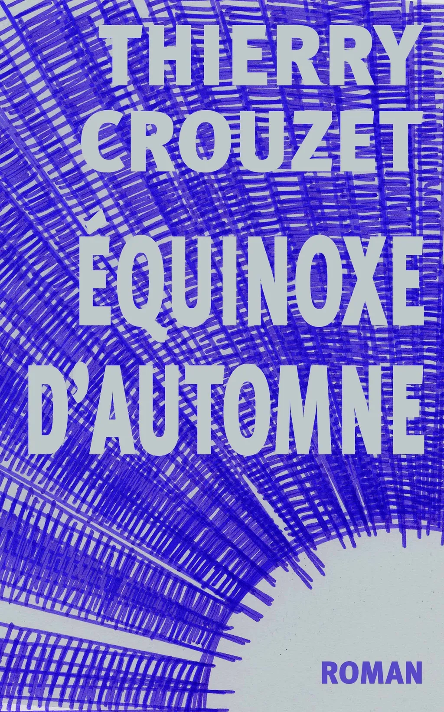
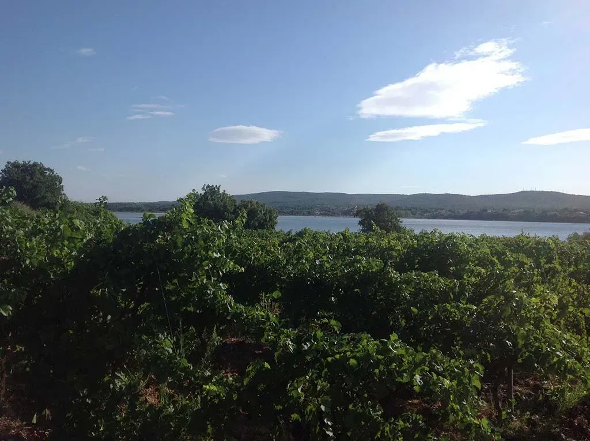

# Équinoxe d’automne

Pendant trois jours, en octobre 1974, Georges Perec s’installa place Saint-Sulpice et nota ce qu’il voyait. Durant des années, j’ai utilisé cette technique pour m’entraîner à écrire. J’ai fini par tenter d’épuiser une journée ordinaire, le 21 septembre 1991, de huit heures du matin à huit heures du soir.

#book #y1992 #1992-6-1-9h18
