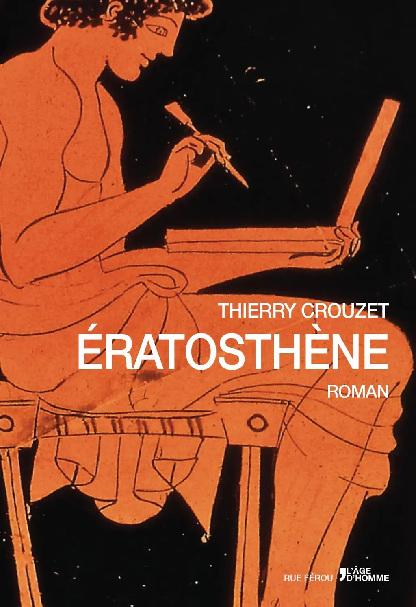

# Ératosthène / Bibliographie

On a très peu de choses sur Ératosthène. Une seule monographie, celle de Peter Marshall Fraser, issue d’une lecture de 1970 qui ne fait que trente-cinq pages. Après, tous les textes érudits traitent d’un aspect possible de son œuvre ou l’évoquent accessoirement. Nous avons également un roman très affabulatoire sur la mesure de la Terre par Denis Guedj (non, les Grecs n’étaient pas des expérimentateurs). J’ai tenté de prendre en considération tous les faits avérés que j’ai découverts. Certaines contradictions m’ont forcé à faire des choix. Je n’ai inventé que pour combler les vides, et peu souvent. L’essentiel de mon travail documentaire s’est effectué entre 2000 et 2002, à la British Library, avant d’être continué sur le Net. Voici quelques-uns des livres lus au cours de l’écriture.

* *A History of the Ptolemaic Empire*, Günter Hölbl, 2001.

* *Alexandrie, IIIe siècle avant JC*, Autrement, 1992.

* *Alexandrie des Ptolémées*, André Bernard, 1995.

* *Archimède*, Sherman Stein, 1999.

* *Archimède IV - Commentaire d’Eutocius et fragments*, Texte établi et traduit par Charles Mugler, Paris, Les Belles Lettres, 1972.

* *Athènes Hellénistique*, Christian Habicht, 1995.

* *Cyrène et la Libye hellénistique*, André Laronde, 1989.

* *D’Alexandre à Actium*, Peter Green, 1990.

* *Dionysos : archetypal image of indestructible life*, Carl Kerényi, 1996.

* *Ératosthène de Cyrène, le pionnier de la géographie*, Germaine Aujac, 2001.

* *Eratostene e l’apogeo della scienza greca*, Dragoni Giorgio, 1979.

* [*Eratosthenes of Cyrene (lecture on a master mind)*](http://www.worldcat.org/title/eratosthenes-of-cyrene-lecture-on-a-master-mind/oclc/841885285), Peter Marshall Fraser, 1971.

* *Ératosthène : un athlète du savoir*, actes réunis par Christophe Cusset et Hélène Frangoulis, 2008.

* *Et pourtant elle tourne !*, Jacques Gapaillard, 1993.

* [*Géographie*](http://remacle.org/bloodwolf/erudits/strabon/), Strabon.

* *Géographie des Grecs analysée : ou, les systèmes d’Ératosthène, de Strabon et de Ptolémée comparés entre eux et avec nos connaissances modernes*, Pascal François Joseph Gossellin, 1790.

* *History of Western Philosophy*, Bertrand Russell, 1946.

* *La Boucle de Bérénice*, un poème de Catulle, Laurent Calvié, 2002.

* *L’Univers, les Dieux, les Hommes*, Jean-Pierre Vernant, 1999.

* *La Mort Héroïque chez les Grecs*, Jean-Pierre Vernant, 2001.

* *La science grecque après Aristote*, Geoffrey E. R. Lloyd, 1973.

* *La véritable histoire de la bibliothèque d’Alexandrie*, Luciano Canfora, 1986.

* *La vie quotidienne à Alexandrie*, Pascale Ballet, 1999.

* *Le Banquet*, Platon, IVe avant JC.

* *Les Cheveux de Bérénice*, Denis Guedj, 2003

* *Les Mystères d’Éleusis*, Paul Foucart, 1914.

* *L’individu, la mort, l’amour*, Jean-Pierre Vernant, 1982.

* *Libye grecque, romaine et byzantine*, Jean-Marie Blas de Roblès, 1999.

* *Mesuring the Universe*, Kitty Ferguson, 1999.

* *Ptolemaic Alexandria*, Peter Marshall Fraser, 1972.

* *Qu’est-ce que la philosophie antique ?*, Pierre Hadot, 1995.

* *Sagesses barbares*, Arnaldo Momigliano, 1976.

* [*Souda On Line: Bizantine Lexicography*](http://www.stoa.org/sol/).

* *Star Myths of the Greeks and Romans*, Theony Condos, 1997.

* *The origin and value of the stadion unit used by Eratosthenes in the third century BC*, Edward Gulbekian, 1987.

* [*The roman head from Tecaxic-calixtlahuaca, mexico: a review of the evidence*](http://www.unm.edu/~rhristov/calixtlahuaca/Romanhead.htm), Romeo H. Hristov, Santiago Genovés T., 2000.

* *The World of Parmenides*, Karl Popper, 1998.

* *Timée*, Platon, IVe avant JC.

* *Vies, doctrines et sentences des philosophes illustres*, Diogène Laërce, entre 200 et 500.

#page #y2014 #2014-7-27-11h19
