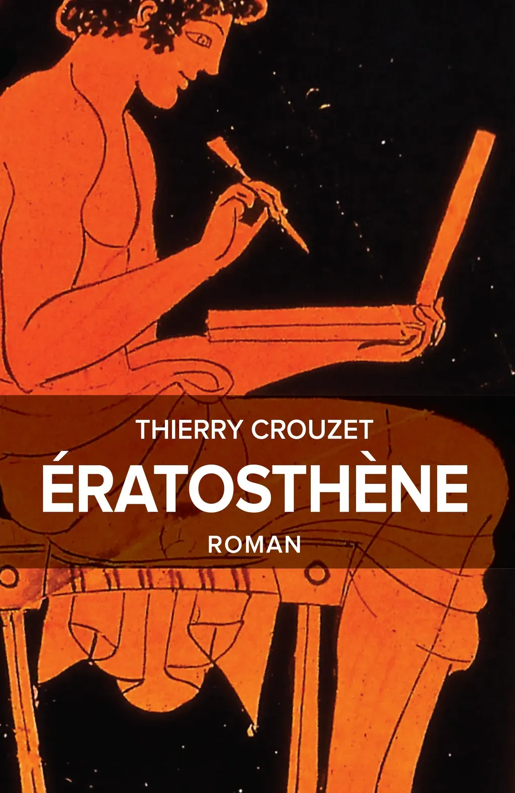
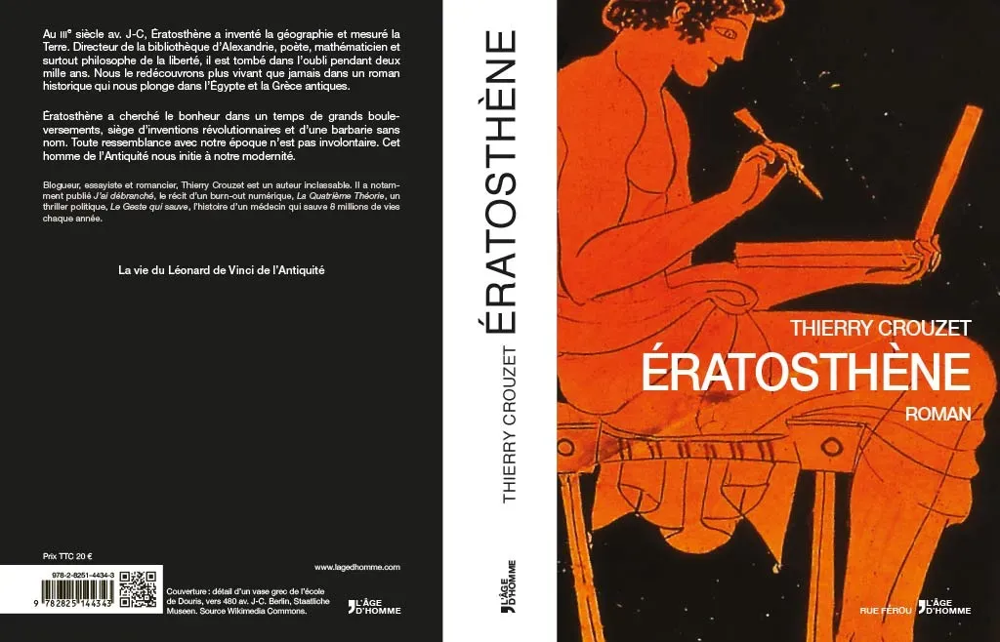
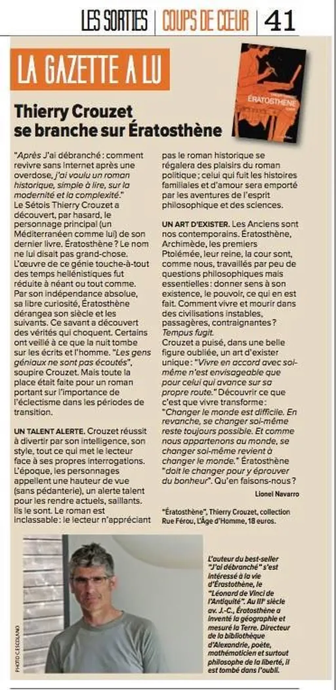

# Ératosthène

<iframe width="599" height="337" src="https://www.youtube.com/embed/ZpLiXIv4vaU?rel=0" frameborder="0" allowfullscreen></iframe>

Au IIIe siècle av. J-C, Ératosthène a inventé la géographie et mesuré la Terre. Directeur de la bibliothèque d’Alexandrie, poète, mathématicien et surtout philosophe de la liberté, il est tombé dans l’oubli pendant deux mille ans. Nous le redécouvrons plus vivant que jamais dans un roman historique qui nous plonge dans l’Égypte et la Grèce antiques.

Ératosthène a cherché le bonheur dans un temps de grands bouleversements, siège d’inventions révolutionnaires et d’une barbarie sans nom. Toute ressemblance avec notre époque n’est pas involontaire. Cet homme de l’Antiquité nous initie à notre modernité.

### Thématiques

* La vie du Léonard de Vinci de l’Antiquité.

* Une critique d’aujourd’hui à l’aune des échecs d’hier.

* Un guide de survie aux époques de transition, quand un temps s'achève et qu'un autre pourrait naître.

* Une lente initiation, à déguster saynète après saynète.

* Une plongée aux origines de la philosophie, des mathématiques et de la géographie.

* L’histoire véridique d’un [polymathe](http://fr.wiktionary.org/wiki/polymathe) dont on ne sait presque rien.

### Note d’intention

J’ai commencé à m’intéresser à Ératosthène parce qu’il a été oublié pendant dix-huit siècles. Cette injustice me terrorise encore, l’idée que des solutions à nos maux gisent dans de vieux livres ou dans des esprits trop en avance sur leur temps, bien vivantes mais ignorées.

En me lançant dans cette histoire, je ne m’attendais pas à ce qu’elle m’occupe pendant quatorze ans. La mesure de la Terre formulée par Ératosthène a été méprisée, tout comme son enseignement philosophique et sa revendication à n’être expert de rien.

C’est un roman historique sur aujourd’hui, portant en creux la transition que nous aurons, ou pas, le courage de traverser.

C'est un « roman de science-fiction dans le passé », tant Ératosthène m’est lointain et mon propos tourné vers l'avenir. Tous les personnages ont existé, tous les événements politiques aussi. Je n’ai pratiquement rien inventé.

Ératosthène m’a longtemps accompagné. En même temps que je traçais sa vie, j’ai tracé la mienne. À travers lui, j’ai raconté mon initiation à notre époque.

[Bibliographie…](eratosthene-bibliographie.md)

### Ils en parlent

1. 16/12/2019, blog, [Un roman qui ouvre des portes](https://post-tenebras-lire.net/eratosthene-de-thierry-crouzet/)
2. 10/8/2015, blog, [Mots et Images](http://aufildesimages.canalblog.com/archives/2015/08/10/32199361.html)
3. 25/1/2015, blog, [Deuzeffe](http://www.deuzeffe.org/index.php/2015/01/25/358-eratosthene-thierry-crouzet)
4. 23/1/2015, blog, [Tulisquoi](http://www.tulisquoi.net/eratosthene-thierry-crouzet)
5. 11/12/2014, blog, [Ératosthène de Thierry Crouzet](http://travels-notes.blogspot.ch/2014/12/eratosthene-de-thierry-crouzet.html)
6. 4/11/2014, Radio Clapas Montpellier, [Du chien sans l’faire exprès](https://soundcloud.com/maudyblues/du-chien-sans-lfaire-expres-emission-du-4-novembre).
7. 30/10/2014, La Gazette de Montpellier, Thierry Crouzet se branche sur Ératosthène, Lionel Navaro.

1. 9/10/2014, lectrice, [Ératosthène-Junior-Junior](../../2014/10/eratosthene-junior-junior.md), Line Fromental.
2. 23/9/2014, Prospective du Livre, [En compagnie d’Ératosthène](http://ple-consulting.blogspot.fr/2014/09/en-compagnie-deratosthene.html), Lorenzo Soccavo.
3. 16/9/2014, Léa Touch Book, [Lorsque nous finissons ce type de roman, nous ne sommes plus les mêmes](http://leatouchbook.blogspot.fr/2014/09/eratosthene-thierry-crouzet.html?showComment=1410892161527), Grybouille.
4. 8/9/2014, Page42, [Ératosthène, sur la piste d’un éclaireur](http://page42.org/eratosthene-sur-la-piste-dun-eclaireur/), Neil Jomunsi.
5. 6/9/2014, SensCritique, [Le livre de Crouzet dit ce que nous sommes là où le succès du livre d’une ex dame le prouve](http://www.senscritique.com/livre/Eratosthene/critique/38352903), Valery.
6. 4/9/2014, Le Tiers Livre, [Ératosthène, un roman du verrou mental](http://www.tierslivre.net/spip/spip.php?article4018), François Bon.
7. 1/9/2014, Blog, [Un Ératosthène enrichi en ebook](http://aldus2006.typepad.fr/mon_weblog/2014/09/thierry-crouzet-un-eratosth%C3%A8ne-enrichi-en-ebook.html), Aldus.
8. 31/8/2014, destimed.fr, [La Bibliothèque Méditerranéenne de Mireille](http://destimed.fr/La-Bibliotheque-Mediterraneenne-de).
9. 30/8/2014, Blog, [Un bel hommage à l’un des génies de l’humanité](http://philippe-castelneau.com/2014/08/30/eratosthene-de-thierry-crouzet-editions-lage-dhomme/), Philippe Castelneau.
10. 29/8/2014, Unwalker, [Un putain de coup de boule sur nous humains](http://www.unwalkers.com/eratosthene-thierry-crouzet/), Dominique Bouchard.
11. 27/8/2014, Feedbooks, [Les régressions sont toujours possibles. Mon roman est une sorte de mise en garde](http://fr.feedbooks.com/interview/410/), Bernard Strainchamps.
12. 14/8/2014, AcuaLitté, [Eratosthène : Du texte sur rouleau unique aux droits numériques](https://www.actualitte.com/societe/eratosthene-du-texte-sur-rouleau-unique-aux-droits-numeriques-51974.htm), Nicolas Gary.
13. 8/8/2014, Feedbook, [Ératosthène de Thierry Crouzet](http://blog.feedbooks.com/fr/2014/08/08/eratosthene-de-thierry-crouzet/), Bernard Strainchamps.

#book #y2007 #2014-8-28-8h50
