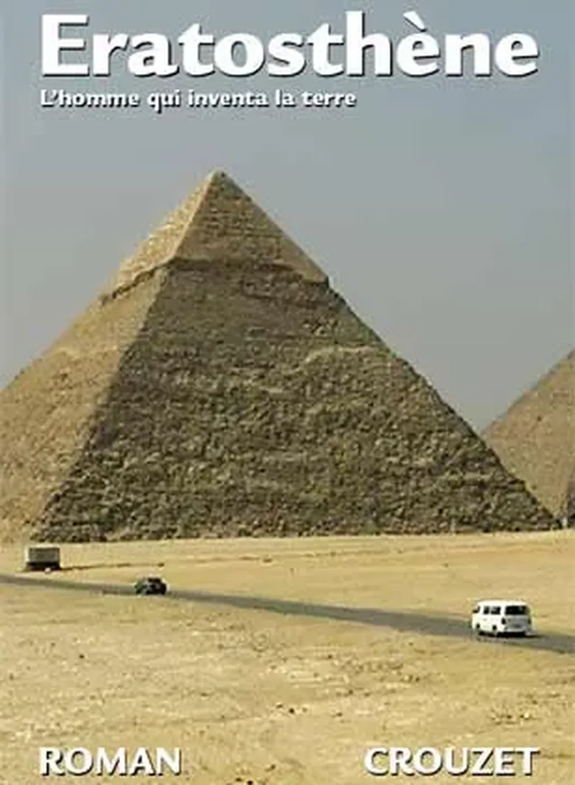

# Ératosthène 2007

**Descriptif**

Genre : roman historique, essai, je ne sais plus trop

Pagination : 360

Statut : V2 (texte non définitif)

**Commander les épreuves**[V2 sur lulu.com](http://www.lulu.com/browse/book_view.php?fCID=1163516) (13,01 euros port compris, je ne prends aucune marge)

Work in progress
----------------

Mardi 4/9/2007, je publie la V2 pour me commander un exemplaire… et laisser reposer le texte. J’attends de recevoir un exemplaire avant d’en parler.

Présentation
------------

Il est difficile de vivre les temps agités. À qui se fier ? Pour quel idéal se battre ? Comment trouver un équilibre personnel ? Comment, tout simplement, être heureux ? Lorsqu’une grande partie d’une population se pose des questions de ce genre,

l’histoire entre dans une phase de transition.

Comment la traverser ? Il n’existe aucune recette, sinon peut-être de nous retourner en arrière et de regarder comment, en des époques comparables, d’autres hommes s’en sortirent avec bonheur. En s’intéressant à eux, nous pouvons nous-mêmes trouver notre chemin à travers les temps de crise.

C’est ainsi que je suis parti à la rencontre d’Ératosthène de Cyrène et du troisième siècle avant Jésus-Christ en Alexandrie. J’ai peu à peu découvert beaucoup d’analogies entre cette époque et la mienne.

Ératosthène, surtout connu pour sa mesure de la circonférence terrestre, fut en fait l’égal d’un Léonard de Vinci. Directeur de la bibliothèque d’Alexandrie, il imagina les livres tels que nous les connaissons. Mais, par-dessus tout, il conçut une philosophie de la liberté qui pourrait inspirer les hommes du vingt-et-unième siècle.

Je n’ai pas écrit sa biographie mais j’ai réinventé sa vie sur un mode romanesque, intercalant le récit de mini-essais au sujet de notre époque et de la façon dont nous pouvons profiter de l’enseignement d’Ératosthène. Ce livre est avant tout un roman, mais aussi un essai, voire un documentaire. Il s’inscrit dans la continuité du [Peuple des connecteurs](../le-peuple/le-peuple-des-connecteurs.md) (Bourin, 2006) et du [Cinquième pouvoir](../cinquieme-pouvoir/le-cinquieme-pouvoir.md) (Bourin, 2007), montrant que les idées exprimées dans ces deux essais trouvent leur source loin dans l’antiquité grecque.

#page #y2007 #2007-6-20-9h30
