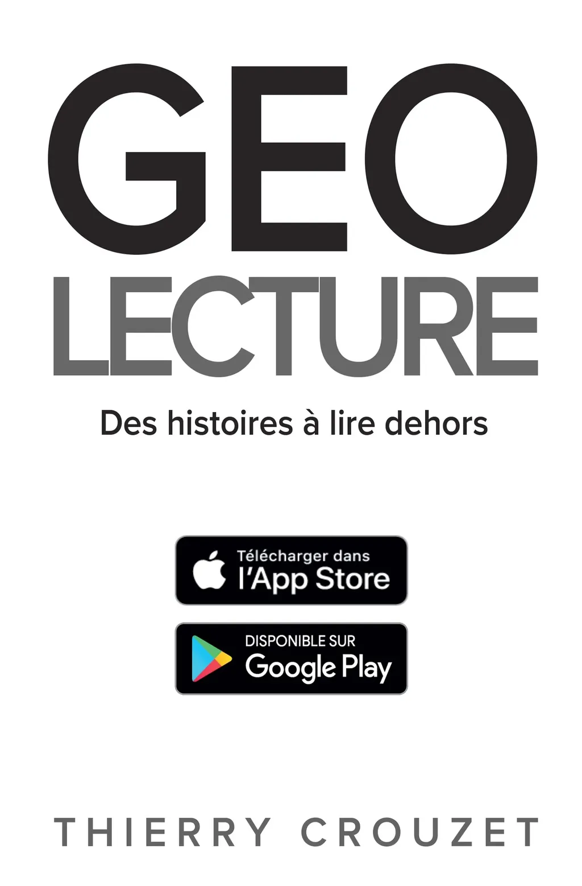
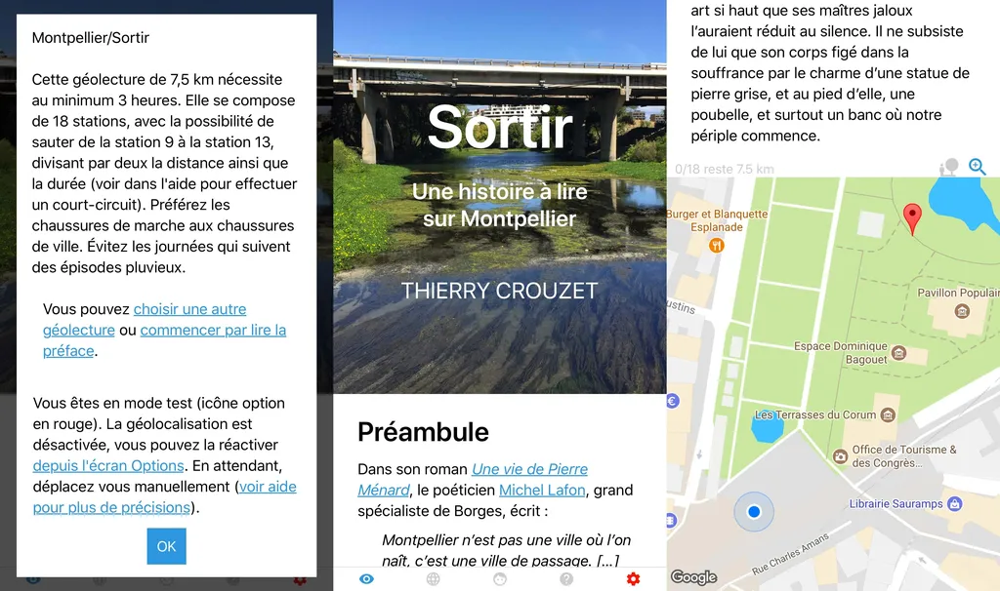
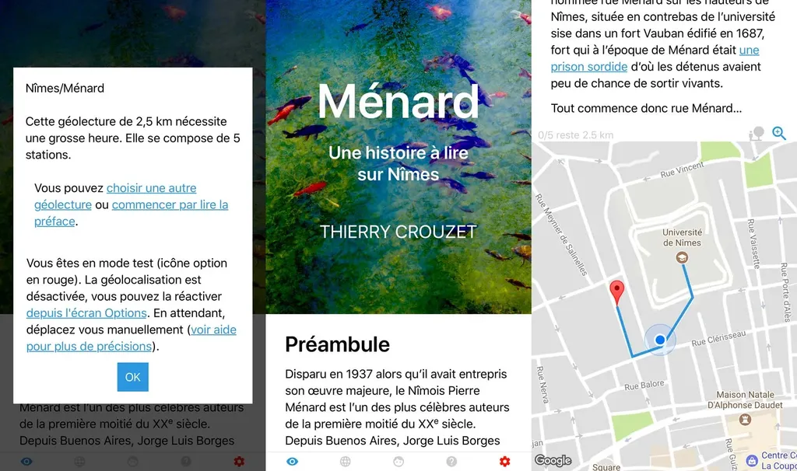
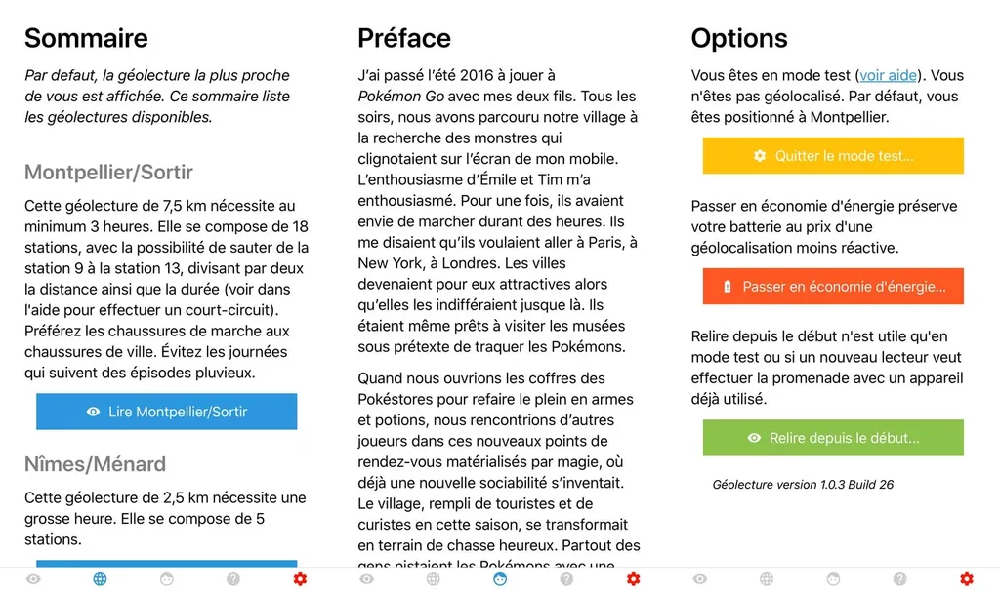

# Géolecture

Géolecture est une application de lecture augmentée. En parcourant les rues le Montpellier ou de Nîmes avec votre mobile, attrapez les chapitres d’un livre grâce à votre GPS. Si vous n’avez pas l’occasion d’aller sur place, simulez votre présence grâce au mode test.

Textes, photos et dessins de Thierry Crouzet.

<iframe width="560" height="315" src="https://www.youtube.com/embed/ioq7VWq1ZL0?rel=0&controls=0" frameborder="0" allowfullscreen></iframe>

[Articles sur le blog…](/tag/geolecture/)

#book #y2017 #2017-11-10-20h6
