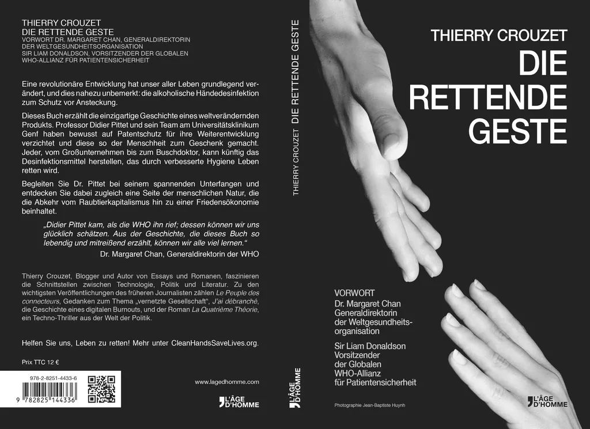

# Die Rettende Geste

Eine revolutionäre Entwicklung hat unser aller Leben grundlegend verändert, und dies nahezu unbemerkt: die alkoholische Händedesinfektion zum Schutz vor Ansteckung.

Dieses Buch erzählt die einzigartige Geschichte eines weltverändernden Produkts. Professor Didier Pittet und sein Team am Universitätsklinikum Genf haben bewusst auf Patentschutz für ihre Weiterentwicklung verzichtet und diese so der Menschheit zum Geschenk gemacht. Jeder, vom Großunternehmen bis zum Buschdoktor, kann künftig das Desinfektionsmittel herstellen, das durch verbesserte Hygiene Leben retten wird.

Begleiten Sie Dr. Pittet bei seinem spannenden Unterfangen und entdecken Sie dabei zugleich eine Seite der menschlichen Natur, die die Abkehr vom Raubtierkapitalismus hin zu einer Friedensökonomie beinhaltet.

„Didier Pittet kam, als die WHO ihn rief; dessen können wir uns glücklich schätzen. Aus der Geschichte, die dieses Buch so lebendig und mitreißend erzählt, können wir alle viel lernen.“ Dr. Margaret Chan, Generaldirektorin der WHO

Thierry Crouzet, Blogger und Autor von Essays und Romanen, faszinieren die Schnittstellen zwischen Technologie, Politik und Literatur. Zu den wichtigsten Veröffentlichungen des früheren Journalisten zählen Le Peuple des connecteurs, Gedanken zum Thema „vernetzte Gesellschaft“, J’ai débranché, die Geschichte eines digitalen Burnouts, und der Roman La Quatrième Théorie, ein Techno-Thriller aus der Welt der Politik.

<iframe width="560" height="315" src="https://www.youtube.com/embed/0at_jtzJCDM" frameborder="0" allowfullscreen></iframe>

#page #y2014 #2014-4-7-13h35
