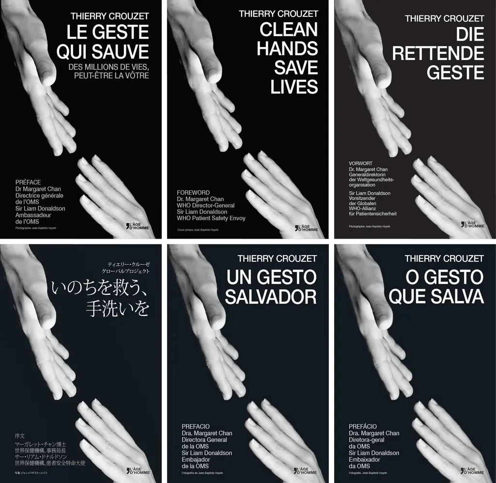

# Clean Hand Save Lives Press release

[En français](le-geste-qui-sauve/cp_fr)

1. A French book immediately published in seven languages is an extraordinary event. And rightly so, because it recounts…
2. The life of [Didier Pittet](http://en.wikipedia.org/wiki/Didier_Pittet), a doctor who every year saves 8 million lives, making him a possible Nobel Peace Prize candidate.
3. And who offered his discovery to humanity, a gesture entirely in accord with the tenets of the open source movement in the field of information technology.
4. In keeping with this achievement, the book is being published under a Creative Commons license by Éditions L’Âge d’Homme, on sale in bookstores from 2 May 2014, but also [accessible for free on Internet](le-geste-qui-sauve/downloads).
5. The author is assigning the entirety of his rights to the [Clean Hands Save Lives Fund](http://www.cleanhandssavelives.org/). Each time a copy of the book is purchased, more lives will be saved.

*[Download the book...](le-geste-qui-sauve/downloads)*

### Contacts/infos

Press Service Éditions L’âge d’homme : Suzanne Jamet - sujamet@aol.com 

Press Service Didier Pittet : severine.hutin@gmail.com - +41 79 342 48 69

[tcrouzet.com](http://blog.tcrouzet.com) - [@crouzet](https://twitter.com/crouzet) - [facebook:tcrouzet](https://www.facebook.com/tcrouzet)

[Photos and images](le-geste-qui-sauve/visuels)

### Behind the book

You may not know it, but an innovation has changed your life. By rubbing your hands with an alcohol-based gel, you protect yourself from illnesses. The astonishing story of this revolutionary product, made available free of any patent as a gift to humanity by Professor Didier Pittet and his team at Hôpitaux Universitaires de Genève (HUG), is at last told in the form of a book. Written in French by Thierry Crouzet and already translated into six other languages, it is being published by Éditions L’Âge d’Homme at the end of April to mark the occasion of the Salon du Livre de Genève and the WHO’s World Hand Hygiene Day on 5 May.

Being excellent is a good thing. Letting others know about it is even better. This is the challenge that was successfully met by Thierry Crouzet – a blogger, essay writer, and novelist. He is thereby pursuing his study of various individuals, often unfamiliar to the wider public, who are changing our world. For Thierry, “Professor Pittet is a visionary in many ways. He is saving eight millions lives every year, which is wonderful. And he has offered his nearly miraculous formulation as a gift to humanity, which is a gesture of peace in a world plagued by war.”

Hand hygiene using alcohol-based handrubs has today become a standard of quality in hospitals and other health care institutions, replacing the traditional procedure of washing hands with soap and water. But few people are aware that this revolution was born in Geneva, Switzerland in 1995, adopted by the World Health Organization in 2005, and is being implemented by 170 of the 194 member states of the United Nations.

The foreword is co-signed by Margaret Chan, WHO Director-General and by Sir Liam Donaldson, WHO’s Patient Safety envoy. The work is being initially published in seven languages: French, German, English, Spanish, Portuguese, Japanese, and Chinese.

The author has decided to cede his rights to the Clean Hands Save Lives Fund (CleanHandSaveLives.org), hosted by the Fondation Philanthropia. Each time a copy of the book is purchased, a bottle of alcohol-based handrub rinse or gel will be offered to a health care worker in a disadvantaged country and lives will be saved.

### Aditional information

* Nosocomial infections are diseases acquired during the health care process.

* Every day, throughout the world, at least half a million persons contract a nosocomial infection. 20-50,000 of them will die as a result.

* Nosocomial infections kill more than AIDS, malaria, and tuberculosis combined.

* In the West, they are the second biggest cause of mortality, tied with cerebrovascular accidents (CVA, or strokes).

* In the USA, they kill 200,000 persons each year. The equivalent of a 747 airliner crashing every day.

* 770,000 French men and women contract infections each year. 40,000 of these prove fatal.

* In Switzerland, the number of persons affected is estimated at 70,000 per year, leading to 2,000 deaths.

* In 1995, Didier Pittet and his team devised a strategy for preventing infections based on disinfecting hands using an alcohol-based solution. They demonstrated that this allowed the number of infections to be reduced by 50%. Their results were published in 2000 in the prestigious scientific magazine, The Lancet.

* In 2005, the World Health Organization (WHO) launched a worldwide campaign for patient safety. Within this framework, the formulas for alcohol-based handrubs were made public in 2006.

* At present, 170 of the 194 member states of the United Nations have joined the campaign, making the prevention of infections a national public health priority. These 170 states represent 80% of the world population.

* The number of lives saved each year through these efforts is estimated at 8 million.

### Didier Pittet

Born in Geneva, in 1957, Didier Pittet is a Swiss professor of medicine. Observing that the rate of nosocomial infections depended directly on hand hygiene, in 1995 he recommended providing the disinfectant solution now used by almost all hospitals throughout the world. By placing the formulas in the public domain, he enabled all of the world’s countries to produce it at very low cost, with resources available locally (leftover sugarcane husks, for example) Within WHO, he has been leading a worldwide campaign to make the use of alcohol-based handrubs a universal standard of health care. For his services, Didier Pittet was named a Commander of the British Empire by Queen Elizabeth II. Today is name is mentioned as a possible candidate for a Nobel Peace Prize.

en.wikipedia.org/wiki/Didier\_Pittet

### Thierry Crouzet

Born in 1963, Thierry Crouzet is a French blogger, essay writer, and novelist. A self-proclaimed Commonist, he advocates an economy of peace, based on gifts, as opposed to a predatory economy characterized by the use of patents. Didier Pittet’s crusade and his gesture to make alcohol-based handrubs universally available was a perfect illustration in his eyes of the potential for an economy of sharing. Clean Hands Save Lives tells the story of this crusade for safer health care. Thierry Crouzet has notably published *Le Peuple des connecteurs* [The Connected People], a reflection on our networked society; *J’ai débranché* [How I Unplugged], a tale of digital burnout; and *La Quatrième théorie* [The Fourth Theory], a political techno-thriller.

#page #y2014 #2014-4-4-15h53
